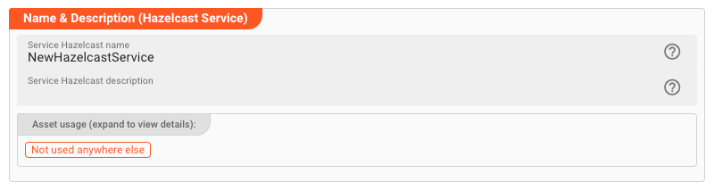

import WipDisclaimer from '/docs/snippets/common/_wip-disclaimer.md';
import Testcase from '/docs/snippets/assets/_asset-service-test.md';

# Hazelcast Service

## Purpose

Define a service to interface with a Hazelcast store.

")

## Prerequisites

None

## Configuration

### Name & Description



* **`Name`** : Name of the Asset. Spaces are not allowed in the name.

* **`Description`** : Enter a description.

The **`Asset Usage`** box shows how many times this Asset is used and which parts are referencing it.
Click to expand and then click to follow, if any.

### Required roles

")

In case you are deploying to a Cluster which is running (a) Reactive Engine Nodes which have (b) specific Roles
configured, then you **can** restrict use of this Asset to those Nodes with matching
roles.
If you want this restriction, then enter the names of the `Required Roles` here. Otherwise, leave empty to match all
Nodes (no restriction).

### Instance

In this section, you will define all necessary parameters to connect to the Hazelcast store.

* **`Instance Type`**: Select the type of Hazelcast instance you want to connect to. The following options are available:

    * **`Client`**: Connect to a Hazelcast cluster as a client. This is the most common use case.
    * **`Member`**: Connect to a Hazelcast cluster as a member. This is only necessary if you want to connect to a Hazelcast cluster as a member.

  :::warning Currently only Client Instance supported
  At the moment, only the `Client` option is supported. The `Member` option will be supported in a future release.
  :::

* **`Instance Name`**: Enter the name of the Hazelcast instance you want to connect to. This is the name of the Hazelcast cluster you want to connect to.

#### Group Configuration

This is where enter the client username and password to connect to the Hazelcast cluster.

* **`Group name`**: Enter the name of the Hazelcast group you want to connect to.

* **`Group password`**: Enter the password of the Hazelcast group you want to connect to. Check
  the [Hazelcast documentation](https://docs.hazelcast.org/docs/3.11.7/manual/html-single/index.html#cluster-groups-before-hazelcast-382) for more information on how to configure the group password.

")

#### Client Network Configuration

In this section, you define how to physically connect to the Hazelcast cluster.
You have the following options:

* **`Connection timeout [ms]`**: Enter the connection timeout in milliseconds. This is the time the client will wait for a connection to the Hazelcast cluster to be established.

* **`Connection attempt limits [attempts]`**: Enter the number of connection attempts the client will make to connect to the Hazelcast cluster.

* **`Connection attempt period [ms]`**: Enter the time in milliseconds the client will wait between connection attempts.

* **`Smart routing`**: Check this box to enable smart routing. Smart routing is a feature that allows the client to connect to a cluster member that is close to it. This is useful when the client and
  the cluster are in different data centers.

* **`Redo Operation`**: While sending the requests to related Hazelcast members, operations can fail due to various reasons. Read-only operations are retried by default. If you want to enable retry
  for the other operations, then check this box.

* **`IP Address`**: Enter one or more IP address(es) of Hazelcast cluster members you want to connect to.

")

### Collection

In this section, you define the Hazelcast collections which you want to work with.

")

* **`Collection Namespace`**: Enter the namespace of the collection you want to work with.

In the table, add the collections which you want to work with. Click `Add Collection` to add a new row to the table:

* **`Name`**: Internal name of the collection.

* **`Type`**: Hazelcast Collection Type. Only `Map` is supported at the moment.

* **`Key Type`**: This is the type of the Hazelcast access key. Only `java.lang.String` is supported at the moment.

* **`Hazelcast Name`**: This is the name of the collection in the Hazelcast cluster.

* **`Serialization Type`**: This defines how the data will be de-/serialized when read/written from/to Hazelcast.
  You have to select a format from the dropdown list, as well as the internal data type.
  The internal data type defines how the data will be represented in the workflow.

    * **Format**:

        * **`Portable`**: This means that data read from this Collection will be deserialized from Portable format, and serialized to Portable format when written.
          You must have defined the portable format in the `Portable Formats` section of the Asset below.

        * **`Json`**: Same as Portable but in Json format.

    * **Data Type**: Select the data type from/to the data written/read from this Collection should be mapped. You can pick either an System data type (e.g. `Systen.AnyMap`), or a data type which you
      have defined in the Service Types data dictionary below.

#### Automatically generated Functions

When defining a Collection, layline.io automatically creates four different functions for reading, writing and deleting data, as well as getting the size of the Collection.

| **Function** | **Signature**                                                                                                    | Returns                                                                             | **Description**                  | **Example**                                                                                                  |
|--------------|------------------------------------------------------------------------------------------------------------------|-------------------------------------------------------------------------------------|----------------------------------|--------------------------------------------------------------------------------------------------------------|
| Read         | `services.<Logical Service Name>.Read<Collection>(key)`                                                          | [Message](/docs/language-reference/javascript/API/classes/Message) or null if nothing found   | Read data from the Collection.   | `services.MyHazelcastService.ReadCustomer(customer_id)`                                                      |
| Write        | `services.<Logical Service Name>.Write<Collection>({Key: key, Value: {property1:value, property2: value, ...}})` | null                                                                                | Write data to the Collection.    | `services.MyHazelcastService.WriteCustomer({Key: customer_id, Value: {Name: 'John', Address: 'MyAddress'}})` |
| Delete       | `services.<Logical Service Name>.Delete<Collection>(key)`                                                        | [Message](/docs/language-reference/javascript/API/classes/Message) or null if nothing deleted | Delete data from the Collection. | `services.MyHazelcastService.DeleteCustomer(customer_id)`                                                    |
| Size         | `services.<Logical Service Name>.Size<Collection>(key)`                                                          | Number                                                                              | Get the size of the Collection.  | `services.MyHazelcastService.SizeCustomer()`                                                                 |

As you can tell, a Collection name is simply prepended by `Read`, `Write`, and `Size` for the respective functionality.

### Portable Types

Hazelcast supports the definition of your own serialization classes called `Portable Serialization`.
Please refer to Implementing Portable Serialization in the [Hazelcast documentation](https://docs.hazelcast.com/imdg/4.2/serialization/implementing-portable-serialization).

")

Once you have defined your own Portable Serialization classes in Hazelcast, you can define a reference to them here.
And once they are defined here, you can reference them in the Collection definition above.

* **`Portable Type Namespace`**: Enter the namespace of the Portable Type you want to work with.

Now define as many Portable Types as you have defined within Hazelcast and which you want to work with within layline.io.
For this click on the dropdown box and select `Add Portable Type`:

* **`Name`**: Internal name of the Portable Type.
* **`Factory ID`**: The Factory ID which you have defined for this Portable Type in Hazelcast.
* **`Class ID`**: The Class ID which you have defined for this Portable Type in Hazelcast.

**Field definitions:**
Following in the table, define the fields which are defined within the Portable Type:

* **`Name`**: Internal name of the field.
* **`Type`**: The type of the field. This is the type which you have defined for this field in Hazelcast.

Create additional Portable Types that you want to work with within layline.io.

### Service Types

In this section, you define the data types which you wan to map Hazelcast Collections to/from.

The Data Dictionary allows us to define complex data structures which can be mapped onto Hazelcast Collections and vice versa.
For this purpose, we need to define an internal custom data type which can receive the results of the statement, and/or
which we want to insert/update within the Collection.

As an example, let’s do this for the above Collection `Customer`. What do we need here?

1. The Collection contains a structure with three fields `ìd`, `name` and `address`.
   So we need three corresponding fields in our own data dictionary that we can map these results to.

Let's define the necessary custom data type using the data dictionary:

1. Declare a new type
2. Declare namespace (optional)
3. Declare Sequence `Customer`

##### 1. Declare a new type (1):

")

##### 2. Declare namespace

To better organize data types, we declare a namespace first (optional):

")

* **`Name`** (1): The name of the element.
  If you are configuring a namespace, and you reuse the name of a namespace, which you have created elsewhere in this
  Project, then the elements of the namespaces will be merged into the namespace by
  this same name.
  Otherwise the name must be unique and may not contain spaces.

* **`Type`** (2): Pick the type of the element. In our example we first define a namespace. When we define additional
  elements under that namespace we will pick any of the other data types to actually
  hold the data.

* **`Description`** (3): Anything which describes the element further.

##### 3. Declare Customer Sequence

Add a child to the namespace we just created:

")

* Click the small arrow next to the namespace name (1)
* Select `Add child` to add a child element to the namespace
* Fill in the details:

")

* **`Name`** (1): Name the element `History`

* **`Type`** (2): Select `Sequence` as the element type. In the next step we will create individual members of the
  sequence.

* **`Extendable Sequence`** (3): Leave this unchecked for the example. If checked, it allows you and layline.io to
  dynamically extend the list of sequence members while working with the data type
  which we are defining. If - for example - your incoming data format has additional fields which are not defined in the
  sequence, the sequence will be automatically extended by these fields.

Now we add a list of member fields which make up the sequence:

")

To later reference the `Name` field, we can use the path `MyNamespace.Customer.Name`, and so forth.

## Example: Using the Hazelcast Service

The Hazelcast Service can be used from within a JavaScript Asset.
In our example we have a simple Workflow which reads a file with customer-related data (1), then in the next step (2) reads the corresponding customer data from a Hazelcast source,
and simply outputs this data to the log.
There is no other purpose in this Workflow than to demonstrate how to use the Service.

")

In the middle of the Workflow we find a JavaScript Processor by the name of “_EnrichCustomer_”.
This Processor reads additional customer information from Hazelcast using the Hazelcast Service.

How is it configured?

### Link EnrichCustomer Processor to Hazelcast Service

To use the Hazelcast Service in the JavaScript Processor, we first have to **assign the Service within the JavaScript
Processor** like so:

")

* **`Physical Service`**: The Hazelcast Service which we have configured above.

* **`Logical Service Name`**: The name by which we want to use the Service within JavaScript. This could be the
  exact same name as the Service or a name which you can choose. Must not include whitespaces.

### Access the Service from within JavaScript

Now let’s finally use the service within JavaScript:

#### Reading from Hazelcast Source

Signature: `services.<Logical Service Name>.<Collection>Read(key)`

Example: `services.MyHazelcastService.ReadCustomer(customer_id)`

```javascript
let hazelcastData = null; // will receive a message type
let customer_id = 1234;
try {
    // Invoke service function.
    hazelcastData = services.MyHazelcastService.ReadCustomer(customer_id);
} catch (error) {
    // handle error
}

// Output the customer data to the processor log
if (hazelcastData && hazelcastData.data.length > 0) {
    processor.logInfo('Name: ' + hazelcastData.data[0].Name);
    processor.logInfo('Address: ' + hazelcastData.data[0].Address);
} else {
    processor.logInfo('No customer data found for customer ID ' + customer_id);
}
```

:::tip Note: Service functions return a Message
Note how the Service function returns a [Message](/docs/language-reference/javascript/API/classes/Message#message-2) as a result
type.

You can find the results in `message.data` as an array.
If we are only expecting one row as a result, we can test it with `hazelcastData.data.length > 0` and access the first row with `hazelcastData.data[0]`.
:::

#### Insert/Update to Hazelcast

Signature: `services.<Logical Service Name>.<Collection>Write({Key: key, Value: {property1:value, property2: value, ...}})`

Example: `services.MyHazelcastService.WriteCustomer({Key: customer_id, Value: {Name: name, Address: address}})`

```javascript
let customer_id = 1234;
try {
    services.MyHazelcastService.WriteCustomer(
        {
            Key: customer_id,
            Value: {
                Name: name,
                Address: address
            }
        }
    )
} catch (error) {
...
}
```

#### Delete from Hazelcast

Signature: `services.<Logical Service Name>.<Collection>Delete(key)`

Example: `services.MyHazelcastService.DeleteCustomer(customer_id)`

```javascript
let customer_id = 1234;
try {
    services.MyHazelcastService.DeleteCustomer(customer_id);
} catch (error) {
...
}
```

#### Get Collection Size

Signature: `services.<Logical Service Name>.<Collection>Size(key)`

Example: `services.MyHazelcastService.SizeCustomer(customer_id)`

```javascript
let size = 0;
try {
    size = services.MyHazelcastService.SizeCustomer();
} catch (error) {
...
}
```

## Service Testing

<Testcase></Testcase>

---

<WipDisclaimer></WipDisclaimer>
