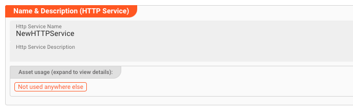
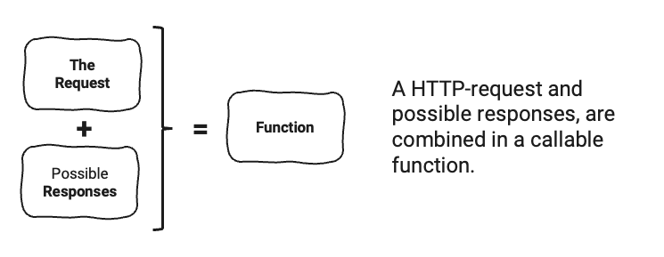
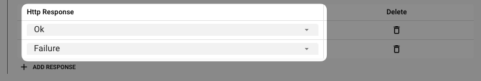

import WipDisclaimer from '/docs/snippets/common/_wip-disclaimer.md';
import RequiredRoles from '/docs/snippets/assets/_asset-required-roles.md';
import CredentialType from '/docs/snippets/assets/_credential-type.md';
import Testcase from '/docs/snippets/assets/_asset-service-test.md';


# HTTP Service

## Purpose

Define a service to interact with Http Rest APIs.

")

## Prerequisites

None

## Configuration

### Name & Description



* **`Name`** : Name of the Asset. Spaces are not allowed in the name.

* **`Description`** : Enter a description.

The **`Asset Usage`** box shows how many times this Asset is used and which parts are referencing it.
Click to expand and then click to follow, if any.

### Required roles

<RequiredRoles></RequiredRoles>

### Host / Credentials

#### Host

This is where you define the connection parameters for the Http Host that you want to connect to.

")

* **`Default Host`**: The default host to use when connecting to the Http service. This is the host that will be used
  when no other host is specified in the configuration.

#### Credentials

The credential type defines the authentication method/flow to be applied.

The Http Connection Asset supports the following credential flows:

1. None
2. User/Password
2. OAuth (Client Credentials)
3. OAuth (Device Flow)

##### None

No authentication is performed.

##### User/Password

")


* **`Credential Type`**:
  Select `User/Passsword` from the drop-down box.

* **`Username`** (_macro supported_):
  Your username.

* **`Password`** (_macro supported_):
  Your Http password.

* **`Do not substitute macro terms in password`**:
  Check this box, if your password contains wording which could be mistaken as a macro (`${...}`) but should not be replaced by layline.io.


##### OAuth (Client Credentials)

The Client Credentials Flow involves an application exchanging its application credentials, such as client ID and client secret, for an access token.
You can check the [Auth0 documentation](https://auth0.com/docs/get-started/authentication-and-authorization-flow/client-credentials-flow) for an example description.

")


* **`Authority`**:
  The authority URL as provided by the party to connect to. This is the endpoint which authorizes the connection and issues a respective token.

* **`Client ID`**:
  An ID issued by the authenticating authority.

* **`Scopes`**:
  These are the authentication scopes requested by the connection and which ust be granted by the authenticating authority.
  This is typically defined by the issuing authority in the context of the client id.
  I.e. if the other party has granted the access scopes which you define here, they authentication will be successful.
  Otherwise, the authentication may fail.

##### OAuth (Device Flow)

With input-constrained devices that connect to the internet, rather than authenticate the user directly, the device asks the user to go to a link on their computer or smartphone and authorize the
device.
This avoids a poor user experience for devices that do not have an easy way to enter text.
To do this, device apps use the Device Authorization Flow, in which they pass along their Client ID to initiate the authorization process and get a token.

You can check the [Auth0 documentation](https://auth0.com/docs/get-started/authentication-and-authorization-flow/device-authorization-flow) for an example description.

For settings please see [Client Credential Flow](#oauth-client-credentials).

### Functions

Like with most Services, you define **Functions** to work with the API.
These Functions can then be invoked within the Workflow.

A Function references a [Request](#requests) and a number of possible [Responses](#responses).
Both Requests and Responses are defined further down on the UI but are necessary to be configured so that they can be referenced here.

 "Functions (Service Http)")

To stay in the flow of the documentation, we will first describe how to define a Function and then how to define Requests and Responses.

* **`Namespace`**:
  The namespace is a logical grouping of Functions. It is used to organize the Functions and to avoid name clashes.
  For example, you could define a namespace `Customer` and then define Functions `Get`, `Create`, `Update`, and `Delete` within this namespace.
  This would result in the following Function names:
    * `Customer.Get`
    * `Customer.Create`
    * `Customer.Update`
    * `Customer.Delete`

#### Function Definition

To create a new Function click on the `+ Add Function` button.

")

A new Function will be added to the list of Functions, and you can now define the Function name and the Request and Response types.

")

* **`Function Name`**: The name of the Function. This is the name that you will use to reference the Function, e,g, within a Javascript Source.

* **`Description`**: A description of the Function.

* **`Request Type`**: The type of Request that this Function will use.
  This is one of the Requests that you will define further down in the UI.

Let's fill some data into the Function definition:

")

Note how the `Http Request` is a drop-down list from which we have selected a Request which we have already defined for the purpose of demonstration (1).

Let's add some Responses. Responses represent the possible responses that the Http service can return.
They are defined further down in the UI.

")

Click on the `+ Add Response` button to add a new Response.

")

Select a Response from the drop-down list. You can select from Responses which you have defined further down in the UI.



At this point we have fully defined a Function.
You can add additional Functions by repeating the steps above.

### Requests

Requests represent the possible requests that the Http service can issue to a ReST endpoint.
They are part of the Function definition and are referenced by the Function.
By defining them individually, it is possible that you can reuse them across multiple Functions.

")

* **`Namespace`**: The namespace is a logical grouping of Requests. It is used to organize the Requests and to avoid name clashes.
  It makes most sense to use the same namespace as the Function that will use the Request and add a suffix to it, e.g. `Customer.Requests`.

To create a new Request click on the `+ Add Request` button.

")

A new Request will be added to the list of Requests, and you can now define the Request name and the Request type.

* **`Request Name`**: The name of the Request. This is the name that you will use to reference the Request, e,g, within a Javascript Source.

* **`Description`**: A description of the Request.

* **`Path`**: The path of the Request. 
  This is the path fragment that will be added to the `Default Host` address which we have defined above.
    For example, if the `Default Host` is `https://myhost.com` and the `Path` is `/api/v1/customers` then the full URL will be `https://myhost.com/api/v1/customers`.

* **`Method`**: The HTTP method to use for the Request. This is one of the following:
    * `GET`
    * `POST`
    * `PUT`
    * `DELETE`

Subsequently, as part of the Request definition, you can define the Request parameters.

")

Click on the `+ Add Parameter` button to add a new Request parameter.
In the table below please enter the respective parameter details.
Add as many parameters as you need.

")

* **`Parameter Name`**: The name of the parameter. This is the name that you will use to reference the parameter.
* **`Parameter Type`**: The type of the parameter. This is one of the following:
    * `Path`: The parameter will be added to the path of the Request.
    * `Query`: The parameter will be added to the query string of the Request.
    * `Header`: The parameter will be added to the header of the Request.
    * `Body Simple Type`: The parameter will be added to the body of the Request as a simple type, e.g. a string or a number.
    * `Body Simple JSON`: The parameter will be added to the body of the Request as a JSON object.
* **`Data Type`**: The data type of the parameter.
* **`Optionsl`**: Whether the parameter is optional or not.
* **`Description`**: A description of the parameter.

Add as many parameters as required by the interface of the ReST endpoint.

### Responses

Responses represent the possible responses that the Http service can return.
These are usually positives that include a status code and a body which contains the actual data, or negatives which include a status code and an error message.

")

* **`Namespace`**: The namespace is a logical grouping of Responses.
  It is used to organize the Responses and to avoid name clashes.
  It makes most sense to use the same namespace as the Function that will use the Response and add a suffix to it, e.g. `Customer.Responses`.

To create a new Response click on the `+ Add Response` button.

")

A new Response will be added to the list of Responses, and you can now define the necessary parameters:

* **`Response Name`**: The name of the Response. This is the name that you will use to reference the Response, e,g, within a Javascript Source.
* **`Status Code Pattern`**: This is equivalent to the expected [HTML status code](https://developer.mozilla.org/en-US/docs/Web/HTTP/Status).
  You can use a wildcard `x` to match any status code. 
  For example to match all 2xx status codes you can use `2xx`.
  Or to match all errors you can use `4xx`.
* **`Content Type Pattern`**: This is equivalent to the expected [Content Type](https://developer.mozilla.org/en-US/docs/Web/HTTP/Headers/Content-Type).
  You can use a wildcard `*` to match any content type.
  For example to match all JSON content types you can use `application/json`.
  Or to match all XML content types you can use `application/xml`. 
  To match anything you can use `*/*`.
* **`Data Type`**: The data type of the Response. Pick `System.AnyMap` if you want to match a JSON structure.
* **`Description`**: A description of the Response.

")

## Example: Using the Http Service

The Http Service can be used from within a JavaScript Asset.
In our example we have a simple Workflow which reads a file with customer-related data (1), then in the next step (2) reads the corresponding full customer data from a Http source,
and simply outputs this data to the log.
There is no other purpose in this Workflow than to demonstrate how to use the Service.


")

In the middle of the Workflow we find a JavaScript Processor by the name of “_EnrichCustomer_”.
This Processor reads additional customer information from a ReST endpoint using the Http Service.

How is it configured?

### Link EnrichCustomer Processor to Http Service

To use the Http Service in the JavaScript Processor, we first have to **assign the Service within the JavaScript
Processor** like so:

")

* **`Physical Service`**: The Http Service which we have configured above.

* **`Logical Service Name`**: The name by which we want to use the Service within JavaScript. This could be the
  exact same name as the Service or a name which you can choose. Must not include whitespaces.

### Access the Service from within JavaScript

Now let’s finally use the service within JavaScript:

#### Reading from ReST endpoint


Example: `services.MyHttpService.GetCustomerById({id: customer_id})`

```javascript
let httpData = null; // will receive a message type
let customer_id = 1234;
try {
    // Invoke service function.
    httpData = services.MyHttpService.GetCustomerById({id: customer_id});
} catch (error) {
    // handle error
}

// Output the customer data to the processor log
if (httpData && httpData.data.length > 0) {
    processor.logInfo('Name: ' + httpData.data[0].Name);
    processor.logInfo('Address: ' + httpData.data[0].Address);
} else {
    processor.logInfo('No customer data found for customer ID ' + customer_id);
}
```

:::tip Note: Service functions return a Message
Note how the Service function returns a [Message](/docs/language-reference/javascript/API/classes/Message) as a result
type.

You can find the results in `message.data` as an array.
If we are only expecting one row as a result, we can test it with `httpData.data.length > 0` and access the first row with `httpData.data[0]`.
:::

<Testcase></Testcase>


---

:::tip Fields marked with "**macro supported**"
You can use $\{...\} macros to expand variables defined in [environment variables](/docs/assets/resources/asset-resource-environment).
:::

<WipDisclaimer></WipDisclaimer>
