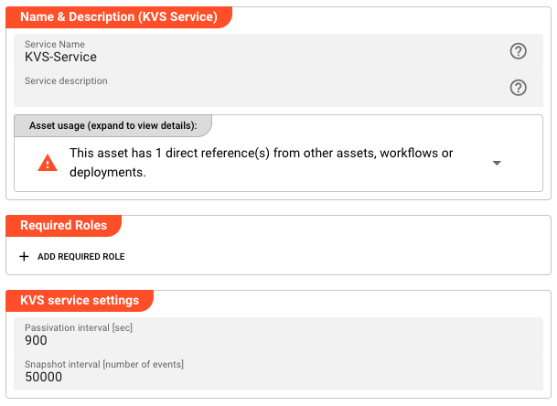

import WipDisclaimer from '../../snippets/common/_wip-disclaimer.md'
import Testcase from '../../snippets/assets/_asset-service-test.md';

# KVS Service

## Purpose

Define an in-process key-value store (KVS) service. The KVS service provides a lightweight, persistent key-value store that runs locally within the layline.io cluster. It is useful for caching, session state, or any scenario where fast local storage is needed.

Unlike distributed databases (such as Aerospike or Cassandra), the KVS service stores data locally on each Reactive Engine node. Data is automatically persisted to disk via snapshots and can be passivated (evicted from memory) after a configurable interval.

:::info
The KVS service is a local, in-process store — not a distributed database. Each Reactive Engine node maintains its own copy of the data. For distributed key-value storage, consider the [Aerospike Service](./asset-service-aerospike.md).
:::

## Configuration

### Name & Description

* **`Name`** : Name of the Asset. Spaces are not allowed in the name.

* **`Description`** : Enter a description.

The **`Asset Usage`** box shows how many times this Asset is used and which parts are referencing it.
Click to expand and then click to follow, if any.

### Required Roles

In case you are deploying to a Cluster which is running (a) Reactive Engine Nodes which have (b) specific Roles
configured, then you **can** restrict use of this Asset to those Nodes with matching roles.
If you want this restriction, then enter the names of the `Required Roles` here. Otherwise, leave empty to match all
Nodes (no restriction).

### KVS Service Settings

* **`Passivation interval [sec]`** : Time in seconds after which inactive entries are passivated (evicted from memory). Default: `900` (15 minutes). Set to `0` to disable passivation.

* **`Snapshot interval [number of events]`** : Number of events after which a snapshot of the KVS state is written to disk. Default: `50000`. Snapshots enable the KVS to recover state after a restart.



### Service Functions

The KVS service provides the following built-in functions:

| Function | Description | Parameters |
|----------|-------------|------------|
| `Write` | Write a value to the key-value store | `Set` — The name of the key-value set (analogous to a table)<br>`Key` — The key identifier<br>`Value` — The value to store<br>`Generation` — Optional generation counter for optimistic locking |
| `Read` | Read a value from the key-value store | `Set` — The name of the key-value set<br>`Key` — The key identifier |
| `Delete` | Delete a value from the key-value store | `Set` — The name of the key-value set<br>`Key` — The key identifier<br>`Generation` — Optional generation counter for conditional deletion |
| `DeleteSet` | Delete an entire set from the store | `Set` — The name of the key-value set to delete entirely |

**Response** — All functions (except `DeleteSet`) return a response object with the following fields:

| Field | Description |
|-------|-------------|
| `Value` | The stored value (returned by Read and Write) |
| `Generation` | The generation counter of the stored entry |

### Using the KVS Service from a JavaScript Processor

Example: Reading a value from the KVS store:

```javascript
/**
 * Read customer data from the KVS store
 * @param customerId Customer ID (the KVS key)
 * @return Customer data if found
 */
function readCustomerData(customerId) {
    let result = services.MyKvsService.Read({
        Set: "CustomerData",
        Key: customerId,
    });

    if (result && result.data) {
        return result.data.Value;
    }

    return null;
}
```

Example: Writing a value to the KVS store:

```javascript
/**
 * Write customer data to the KVS store
 * @param customerId Customer ID (the KVS key)
 * @param customerData Customer data to store
 */
function writeCustomerData(customerId, customerData) {
    services.MyKvsService.Write({
        Set: "CustomerData",
        Key: customerId,
        Value: customerData,
    });
}
```

For more information, see [JavaScript Processor](../processors-flow/asset-flow-javascript.md).

<Testcase></Testcase>

---

<WipDisclaimer></WipDisclaimer>
