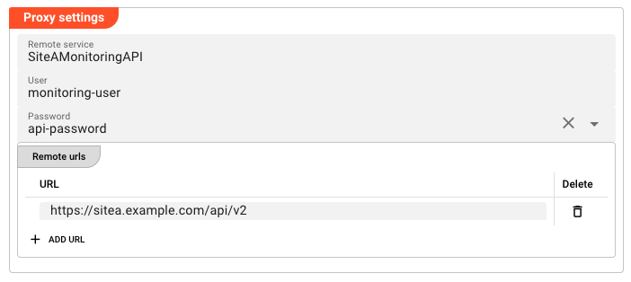

import Testcase from '../../snippets/assets/_asset-service-test.md';

# Proxy Service

## Purpose

The Proxy Service acts as a **forwarding proxy for service function calls** to another Reactive Engine cluster. It allows a Javascript Processor deployed on cluster A to call service functions that are running on a completely different cluster B — without changing a single line of JavaScript code.

This is useful when:

- A service you need to call is deployed on a different cluster (e.g. a shared central cluster, or a cluster in a different data centre)
- You want to switch which cluster handles a service call by changing only the Proxy Service configuration — not the JavaScript
- You need to access a service function from multiple environments (dev, staging, prod) where the URL and credentials differ, but the JavaScript stays identical

:::info
The Proxy Service does **not** define its own functions. When you invoke `services.MyProxy.FunctionName(...)` in a Javascript Processor, the Proxy Service intercepts the call and tunnels it to the configured remote cluster. The available functions are discovered dynamically from that remote cluster via the cluster's discovery mechanism. You must know the function names and their signatures — these are the same functions defined by the target service on the remote cluster.
:::

## How It Works

```
Local Cluster A                           Remote Cluster C
┌────────────────────────────────┐         ┌────────────────────────────────┐
│  JavaScript Processor          │         │  Target Service                 │
│                                │         │  e.g. "MyDBService"             │
│  services.MyProxy.GetCustomer()│────────▶│  function GetCustomer(...)      │
│       │                        │  Proxy  │                                │
│       └────────────────────┐   │  Service│                                │
│                            │   │         │                                │
│  Proxy Service Asset        │   │         │                                │
│  Remote service: MyDBService│───┘         │                                │
│  URL: https://cluster-c:9443 │             │                                │
└────────────────────────────────┘         └────────────────────────────────┘
```

When you map a Proxy Service in a Javascript Asset and invoke `services.MyProxy.GetCustomer(...)`, the call is forwarded to the remote cluster at the URL configured in the Proxy Service. The function name and parameters are passed through unchanged. There is **no difference in the JavaScript call syntax** between invoking a local service and a proxied one.

To proxy multiple different services, create a separate Proxy Service Asset for each one.

## Configuration




### Name & Description

* **`Service Name`** : Name of the Asset. This is the name you will use in JavaScript to reference this proxy (e.g. `services.MyProxy`). Spaces are not allowed in the name.

* **`Service Description`** : Enter a description.

The **`Asset Usage`** box shows how many times this Asset is used and which parts are referencing it.
Click to expand and then click to follow, if any.

### Required Roles

In case you are deploying to a Cluster which is running (a) Reactive Engine Nodes which have (b) specific Roles configured, then you **can** restrict use of this Asset to those Nodes with matching roles.
If you want this restriction, then enter the names of the `Required Roles` here. Otherwise, leave empty to match all Nodes (no restriction).

### Proxy Settings

* **`Remote service`** : The exact name of the target service on the remote cluster. The Proxy Service will forward calls to this service name on the target cluster. This name must **exactly match** the service name on the remote cluster — including case. If you need to proxy multiple distinct services, create a separate Proxy Service Asset for each one. Leave empty to use the value inherited from a parent project.

* **`User`** : Username to authenticate against the remote cluster. Leave empty to use the value inherited from a parent project.

* **`Password`** : Password to authenticate against the remote cluster. This field does **not** accept a plain-text password. It is a dropdown that lists all secrets defined in your project's [Secret](../resources/asset-resource-secret) assets. Select the named secret you want to use (e.g. `proxy-password`). The secret value is resolved at runtime — it is never stored in clear text in the project configuration. Leave empty to use the value inherited from a parent project.

  To create or manage secrets, see the [Secret Asset](../resources/asset-resource-secret) documentation.

* **`Remote urls`** : List of remote URLs to proxy to. Each URL is entered on a separate line. When multiple URLs are provided, requests are routed to one of them (behaviour depends on the target service configuration).

  To add a URL, click **Add URL** and enter the URL in the text field. To remove a URL, click the remove button next to it. URLs can also be reset to parent values if inherited from a parent project.

### Inheritance

All fields in the Proxy Settings tab support inheritance from a parent project. If this service is part of a Project that extends another Project, fields left empty here will adopt the values from the parent. This allows you to define a base Proxy Service in a parent project (with a remote service name, user, and URL pointing to a dev cluster) and override just the URL and credentials in a child project for production — without changing any JavaScript.

## Example — Cross-Cluster Service Invocation

### Setup

Imagine you have:
- **Cluster A** (your local cluster) where your Javascript Processor runs
- **Cluster C** where a service `MyDBService` is deployed with a function `GetCustomer`

On Cluster C, the `MyDBService` has this function:

| Function | Parameters |
|----------|------------|
| `GetCustomer` | `{ customerId: string }` |

### Step 1 — Create a Secret for Authentication

Create a [Secret Asset](../resources/asset-resource-secret) in your project (e.g. `ClusterC_Credentials`). Add a key-value pair:

| Key | Value |
|-----|-------|
| `proxy-password` | `S3cr3tP@ssw0rd!` |

Make sure the Secret is encrypted with the appropriate key for Cluster C.

### Step 2 — Create the Proxy Service

Create a new **Proxy Service** Asset named `MyProxy`. Configure:

* **Remote service**: `MyDBService` — must match the service name on Cluster C exactly
* **User**: `cluster-c-user`
* **Password**: Select `proxy-password` from the Secret dropdown
* **Remote urls**: `https://cluster-c.example.com:9443`

### Step 3 — Map the Proxy Service in a Javascript Asset

In your Javascript Processor asset, add a **Service Mapping**:

* **Service**: Select `MyProxy`
* **Logical Service Name**: `MyProxy` (or any name you will use in your script)

### Step 4 — Invoke from JavaScript

In your script, invoke the proxied function exactly as you would a local one:

```javascript
export function onMessage(m) {
    const result = services.MyProxy.GetCustomer({
        customerId: m.data.customerId
    });

    if (result && result.data && result.data.length > 0) {
        const customer = result.data[0];
        processor.logInfo('Customer: ' + customer.name);
        // Continue processing...
    }
}
```

**Note:** The call syntax is identical to calling a local service. The Proxy Service handles the cross-cluster tunnelling transparently.

### Step 5 — Switch Environments Without Changing JavaScript

To point the same Javascript Processor at a different cluster (e.g. a staging environment), create a new Proxy Service in your staging project — or use inheritance to override just the URL and credentials — without touching the JavaScript at all.

```
Dev Project:
  MyProxy → Remote service: MyDBService, URL: https://dev-cluster:9443

Staging Project (inherits MyProxy, overrides URL):
  MyProxy → Remote service: MyDBService, URL: https://staging-cluster:9443
```

## Service Testing

<Testcase></Testcase>

## See Also

- [Secret Asset](../resources/asset-resource-secret) — managing encrypted credentials
- [Project Inheritance](../../concept/03-project) — overriding proxy settings via child projects
- [Service Asset Introduction](./asset-service-introduction) — how services work in general
- [Javascript Processor](../processors-flow/asset-flow-javascript) — calling services from JavaScript
