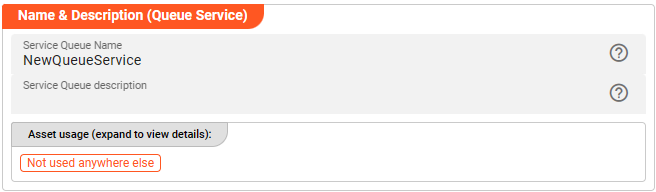
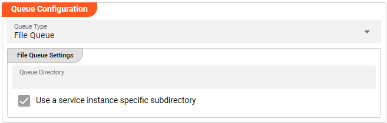
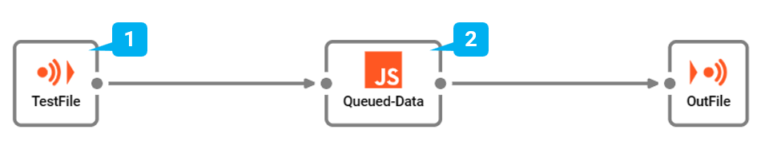

import WipDisclaimer from '/docs/snippets/common/_wip-disclaimer.md';
import NameAndDescription from '/docs/snippets/assets/_asset-name-and-description.md';
import RequiredRoles from '/docs/snippets/assets/_asset-required-roles.md';
import Testcase from '/docs/snippets/assets/_asset-service-test.md';

# Queue Service

## Purpose

Define a service for the usage of a file-based queue.

")

## Prerequisites

None

## Configuration

### Name & Description



<NameAndDescription></NameAndDescription>

### Required roles

<RequiredRoles></RequiredRoles>

### Queue Configuration



* **`Queue Type`**: Select the type of queue from the drop-down box. At this stage `File Queue` is the only available type. It is working by FIFO (First-In-First-Out) principle.
In theory, `Queue Type` can be other storages like RDBMS, Kafka, et al. as well. 
Please don't hesitate to contact us at support@layline.io in case you are in need of other `Queue Type`.

* **`Queue Directory`** (_macro supported_): the directory used to store the file-based queue data. 

* **`Use a service instance specific subdirectory`**: activating this checkbox, layline.io will create a unique named subdirectory per service instance (recommended)

## Example: Using the Queue Service

File-based queues need to be considered whenever the processing requires a majority or even all messages from an input to be checked and kept
before they can be sent resp. written to an output source. An approach to achieve this could be to keep the data in main memory, while this 
often creates an issue with available capacities. Hence, a temporary file-based storage helps to support these use cases. Typical scenarios for making use of file-based queues are:

* Assembly of multiple messages to form an output message, spanning one dedicated file
* Header messages populated with accumulated detail message information, for instance TAP-File creation

In our example we have a simple Workflow which reads a file with input data (1), then in the next step (2) intermediately writes that data
into a queue provided by the Queue Service and ensures to read that data after all messages have been processed. Finally, the data is 
sent and written to an output file.
There is no other purpose in this Workflow than to demonstrate how to use the Service.



In the middle of the Workflow we find a JavaScript Processor by the name of _"Queued-Data"_. This Processor writes and reads information to / from the configured Queue Service. 

What needs to be done to implement this?

### Link Queued-Data Processor to Queue Service

To use the Queue Service in the JavaScript Processor, we first have to **assign the Service within the JavaScript
Processor** like so:

")


* **`Physical Service`**: The Queue Service which has been configured.

* **`Logical Service Name`**: The name by which we want to use the Service within JavaScript. This could be the
  exact same name as the Service or a name which you can choose. Must not include whitespaces.

### Access the Service from within JavaScript

Before we start looking into dedicated JavaScript sample code using the Queue Service, 
it is important to understand that layline.io processing is based on "dynamic push/pull mode". More information can be found [here](/docs/lang-ref/javascript/API/classes/JavaScriptProcessor#onpullmessage).

Using a Queue Service in a JavaScript Processor means that this Processor becomes a "producer" of additional messages requiring the forcing of the pull-mode to be used. 
Hence, the [`onPullMessage`](/docs/lang-ref/javascript/API/classes/JavaScriptProcessor#onpullmessage) usage becomes a must-have.      

Let’s finally use the service within JavaScript:

#### Writing to and Reading from Queue endpoint

```javascript
const OUTPUT_PORT = processor.getOutputPort('Output-1');
let queue = null;
let trailerReceived = false;
let totalRecordsInFile = 0;

export function onStreamStart() {
    // Invoke Service
    // using a Queue-Service for writing data into it requires to "open it" via the method openConnection
    queue = services.QueueService.openConnection();
    trailerReceived = false;
    totalRecordsInFile = 0;
}

export function onStreamEnd() {
    if (queue) {
        // any used Queue-Service should be closed after usage 
        queue.closeConnection();
        queue = null;
    }
}

export function onMessage() {
    if (message.data.SMPL_IN.RECORD_TYPE == 'H') {
        // write message to Queue-Service
        queue.WriteMessage(message);
    } else if (message.data.SMPL_IN.RECORD_TYPE == 'D') {
        onDetail(message);
    } else if (message.data.SMPL_IN.RECORD_TYPE == 'T') {
        onTrailer(message)
    }
}

/**
 * Handle detail
 */
function onDetail (detail) {
    totalRecordsInFile++;
    // write message to Queue-Service
    queue.WriteMessage(detail);
}

/**
 * Handle the Trailer message
 * indicates that full file has been processed
 */
function onTrailer(trailer) {
    trailerReceived = true;
    // write message to Queue-Service
    queue.WriteMessage(trailer);
}

/**
 * Handle the request to pull a message
 */
export function onPullMessage() {
    if (trailerReceived && queue) {
        let message = null;
        do {
            // read message from Queue-Service
            message = queue.ReadMessage();
            if (message) {
                if (message.data.SMPL_IN.RECORD_TYPE == 'H') {
                    onProcessAndEmitHeader(message)
                } else if (message.data.SMPL_IN.RECORD_TYPE == 'D') {
                    onProcessAndEmitDetail(message)
                } else if (message.data.SMPL_IN.RECORD_TYPE == 'T') {
                    onProcessAndEmitTrailer(message);
                }
            }             
        } while (message);

        if (message == null) {
            // any used Queue-Service should be closed after usage 
            queue.closeConnection();
            queue = null;
        }
    }
}
```

## Service Testing

<Testcase></Testcase>

---

<WipDisclaimer></WipDisclaimer>

