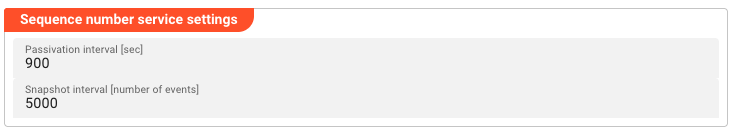

import WipDisclaimer from '../../snippets/common/_wip-disclaimer.md'
import Testcase from '../../snippets/assets/_asset-service-test.md';

# Sequence Number Service

## Purpose

Define a sequence number (counter) service. The Sequence Number service provides atomic, incrementing counters that are shared across the entire Reactive Engine cluster. It is useful for generating unique IDs, ticket numbers, order numbers, or any scenario where a globally consistent sequential counter is needed.

Counters are persisted to disk via snapshots and can be passivated (evicted from memory) after a configurable interval.

## Configuration

### Name & Description

* **`Name`** : Name of the Asset. Spaces are not allowed in the name.

* **`Description`** : Enter a description.

The **`Asset Usage`** box shows how many times this Asset is used and which parts are referencing it.
Click to expand and then click to follow, if any.

### Required Roles

In case you are deploying to a Cluster which is running (a) Reactive Engine Nodes which have (b) specific Roles
configured, then you **can** restrict use of this Asset to those Nodes with matching roles.
If you want this restriction, then enter the names of the `Required Roles` here. Otherwise, leave empty to match all
Nodes (no restriction).

### Sequence Number Service Settings

* **`Passivation interval [sec]`** : Time in seconds after which inactive sequence entries are passivated (evicted from memory). Default: `900` (15 minutes). Set to `0` to disable passivation.

* **`Snapshot interval [number of events]`** : Number of events after which a snapshot of all sequence values is written to disk. Default: `5000`. Snapshots enable the service to recover counter state after a restart.



### Service Functions

The Sequence Number service provides the following built-in functions:

| Function | Description | Parameters |
|----------|-------------|------------|
| `GetNextValue` | Atomically get and increment the next sequence value | `Name` — The sequence name (e.g., `"orders"` or `"tickets"`) |
| `GetLastValue` | Get the current value of a sequence without incrementing | `Name` — The sequence name |
| `SetNextValue` | Set the next value for a sequence | `Name` — The sequence name<br />`Value` — The value to set as the next sequence value |

**Results:**

| Function | Result Type | Description |
|----------|-------------|-------------|
| `GetNextValue` | `System.Long` | The next sequence value (already incremented) |
| `GetLastValue` | `System.Long` | The current sequence value |
| `SetNextValue` | — | No result (void) |

### Using the Sequence Number Service from a JavaScript Processor

Example: Getting the next order number:

```javascript
/**
 * Get the next order number
 * @return The next order number
 */
function getNextOrderNumber() {
    let nextValue = services.SequenceService.GetNextValue({
        Name: "orders"
    });

    return nextValue;
}
```

Example: Setting the next ticket number after a bulk import:

```javascript
/**
 * Reset the ticket sequence to a specific value
 * @param nextTicketNumber The value to set as the next ticket number
 */
function resetTicketSequence(nextTicketNumber) {
    services.SequenceService.SetNextValue({
        Name: "tickets",
        Value: nextTicketNumber
    });
}
```

For more information, see [JavaScript Processor](../processors-flow/asset-flow-javascript.md).

<Testcase></Testcase>

---

<WipDisclaimer></WipDisclaimer>
