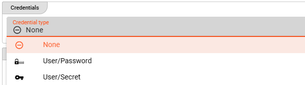

import WipDisclaimer from '/docs/snippets/common/_wip-disclaimer.md';
import RequiredRoles from '/docs/snippets/assets/_asset-required-roles.md';
import CredentialType from '/docs/snippets/assets/_credential-type.md';
import Testcase from '/docs/snippets/assets/_asset-service-test.md';

# SOAP Service

## Purpose

Define a service to interact with SOAP APIs.

")

## Prerequisites

None

## Configuration

### Name & Description


<NameAndDescription></NameAndDescription>

### Required roles

<RequiredRoles></RequiredRoles>

### SOAP Service Settings

Configure the parameters for your SOAP Service:


#### WSDL

WSDL (Web Service Description Language), an XML based definition language, is required to describe the functionality of the SOAP 
based web service which should be configured in this Service Asset.

* **`WSDL location`** : Provide a web address respectively source directory where to find the WSDL.
* **`Configuration file directory`** : Only required in case the WSDL location is based in a source directory.
* **`Override Service URL`** : Only required in case you want to configure a specific Service URL appearance to connect to this service.

_Web-based WSDL_


_Source directory WSDL_


#### Credentials

You have three options to authenticate against the SOAP service endpoint:

1. None
2. Username and Password
3. Username and Secret



##### None

No authentication is performed / required.

##### Username and Password


* **`Credential Type`**:
  Select `User/Passsword` from the drop-down box.

* **`Username`** (_macro supported_):
  Your username.

* **`Password`** (_macro supported_):
  Your SOAP Service password.

* **`Do not substitute macro terms in password`**:
  Check this box, if your password contains wording which could be mistaken as a macro (`${...}`) but should not be replaced by layline.io.

##### Username and Secret


* **`Credential Type`**:
  Select `User/Secret` from the drop-down box.

* **`Username`** (_macro supported_):
  Your username.

* **`Secret`**:
  Select a `Secret` from the drop-down list. If the list is empty, then you need to first [create a secret](/docs/assets/resources/asset-resource-secret) to be able to assign it here.

  Please [follow this link to "Advanced Concepts"](/docs/concept/advanced/secret-management) to learn about the concept and use of the Security Storage.

#### Operations

The following parameters will automatically be available in drop-down lists as soon as the above WSDL configuration has successfully been provided.
Choose the **`SOAP service name`** and the appropriate **`Binding`** required for the Service Asset from the drop-down lists.


:::tip
In case the drop-down list does not automatically offer the available services, then please save, close and reopen the project for re-initialization.
::: 

All available service operation functions available through the WSDL will automatically show up.


## Example: Using the SOAP Service

The SOAP Service can be used from within a JavaScript Asset.
In our example we have a simple Workflow which reads a file with input data (1), then in the next step (2) requests data from a SOAP service to enrich the incoming data,
and outputs the enriched messages to an output file.
There is no other purpose in this Workflow than to demonstrate how to use the Service.


In the middle of the Workflow we find a JavaScript Processor by the name of “_Enrich-SOAP-Data_”.
This Processor reads information from a configured SOAP Service.

How is it configured?

### Link Enrich-SOAP-Data Processor to SOAP Service

To use the SOAP Service in the JavaScript Processor, we first have to **assign the Service within the JavaScript
Processor** like so:

")

* **`Physical Service`**: The SOAP Service which has been configured.

* **`Logical Service Name`**: The name by which we want to use the Service within JavaScript. This could be the
  exact same name as the Service or a name which you can choose. Must not include whitespaces.

### Access the Service from within JavaScript

Now let’s finally use the service within JavaScript:

#### Reading from SOAP endpoint


Example: `services.SOAPService.CountryName(countryCode)`

```javascript
let soapResponse = null;  // will receive the SOAP data
let countryCode = null;

if (message.data.SMPL_IN.RECORD_TYPE == 'D') {
         
    countryCode = message.data.SMPL_IN.COUNTRY_ISO;
    try {
        // Invoke service function.
        soapResponse = services.SOAPService.CountryName(countryCode);
    } catch (error) {
        // handle error
    }

    // map response return value towards output

    if (soapResponse && soapResponse.data.length > 0) {
        message.data.SMPL_OUT = {        
            RECORD_TYPE  : message.data.SMPL_IN.RECORD_TYPE,
            FILE_NAME    : filename,
            DATE         : message.data.SMPL_IN.DATE,
            DESCRIPTION  : message.data.SMPL_IN.DESCRIPTION,
            CREATE_DATE  : DateTime.now(),
            COUNTRY_NAME : soapResponse. 
        }
    } else {
        message.data.SMPL_OUT = {        
            RECORD_TYPE  : message.data.SMPL_IN.RECORD_TYPE,
            FILE_NAME    : filename,
            DATE         : message.data.SMPL_IN.DATE,
            DESCRIPTION  : message.data.SMPL_IN.DESCRIPTION,
            CREATE_DATE  : DateTime.now(),
            COUNTRY_NAME : "UNKNOWN"
        }
    }
    stream.emit(message, OUTPUT_PORT);
}
```

## Service Testing

<Testcase></Testcase>

---

<WipDisclaimer></WipDisclaimer>

