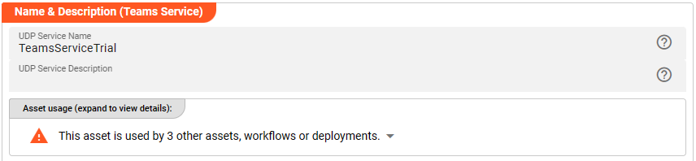
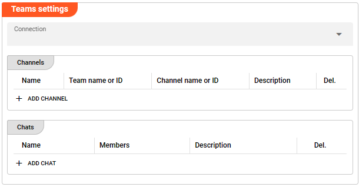
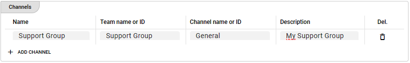
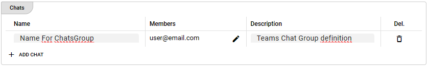
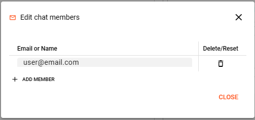

import WipDisclaimer from '/docs/snippets/common/_wip-disclaimer.md';
import NameAndDescription from '/docs/snippets/assets/_asset-name-and-description.md';
import RequiredRoles from '/docs/snippets/assets/_asset-required-roles.md';
import Testcase from '/docs/snippets/assets/_asset-service-test.md';

# Teams Service

## Purpose

Define a service to interface with Teams.

")

## Prerequisites

For this to work, you need a configured [MS Graph Connection](/docs/assets/connections/asset-connection-msgraph).

## Configuration

### Name & Description



<NameAndDescription></NameAndDescription>

### Required roles

<RequiredRoles></RequiredRoles>

### Teams Service Settings

Configure the parameters for your Teams Service: 



#### Connection


Use the drop-down list to select a [MS Graph Connection](/docs/assets/connections/asset-connection-msgraph) that should 
support this Teams Service. If it does not exist, you need to create it first.

The following two settings define the Teams target(s) which should receive messages and can be:
- available **Channels** and / or
- one or multiple member **Chats**. 

The logical _**Name**_ configured in these settings forms the reference 
to be used in the Workflow Processor which will finally be triggering the Teams Service. 
Define as many Teams targets as needed throughout your Workflow(s). 

#### Channels




* **`Name`** : the logical name used within the Teams Service function parameter _**Conversation**_. Spaces in the name are allowed.
* **`Team name or ID`** : ID or name of the Teams team owning the Channel. Spaces in the name are allowed. 
* **`Channel name or ID`** : ID or name of the Channel within a Teams team. Spaces in the name are allowed. 
With any new Teams group created in the App there will be a default Channel "General" which is automatically created. 
Referencing this default channel, please use "General" in the name, no matter which language setting is configured in your Teams application. 
* **`Description`** : Enter a description.

#### Chats




* **`Name`** : the logical name used within the Teams Service function parameter _**Conversation**_. Spaces in the name are allowed.
* **`Members`** : all Chat members that should be reached through this Chats Group configuration. 
Push the pencil button to open the dialogue for adding memebers.  



* **`Description`** : Enter a description.

### Example: Using the Teams Service

The Teams Service can be used from within a JavaScript Asset. In our example we have a simple Workflow which reads an
input file with some data (1), then in a next step (2) sends a simple message towards Teams, and
simply outputs the incoming data to an output file again. There is no other purpose in this Workflow than to demonstrate how to use the
Service.

")

In the middle of the Workflow we find a JavaScript Processor by the name of “_PushMessage_”. This Processor prepares
a message which will be send towards the Teams Channel or Chat group as configured in the Service Teams asset.

How is it configured?

#### Link PushMessage Processor to Teams Service

To use the Teams Service in the JavaScript Processor, we first have to **assign the Service within the JavaScript
Processor** like so:

")

* **`Physical Service`** (1): The Teams Service which we have configured above.

* **`Logical Service Name`** (2): The name by which we want to use the Service within JavaScript. This could be the
  exact same name as the Service or a name which you can choose. Must not include whitespaces.

#### Access the Service from within JavaScript

Now let’s finally use the service within JavaScript:

##### Preparing Message to be Send to Teams

```javascript
// We are defining a function "sendTeams" that will take teamsMessage parameters 
// as input parameters
function sendTeams(teamsMessage) {
    if (send_teams) {
        services.TeamsService.SendMessage({
            Conversation:   teamsMessage.conversation,            
            Content:        teamsMessage.content
        });  
    }
}

/**
 * Handle a message
 */
export function onMessage() {
    onDetail(message);
}

// the onDetail function will send a teamsMessage for 
// every message that arrives from the input file
function onDetail(message) {
    // populate the teamsMessage structure to hand over input parameters for "sendTeams" function
    let teamsMessage = {
        conversation:   "SomeName",
        content:        "Processing for Stream " + stream.getName() + " recordNo " + message.id      
    }
    // call function "sendTeams"
    sendTeams(teamsMessage);
    // output the incoming message
    stream.emit(message, OUTPUT_PORT);
}
```

## Service Testing

<Testcase></Testcase>

---

<WipDisclaimer></WipDisclaimer>

