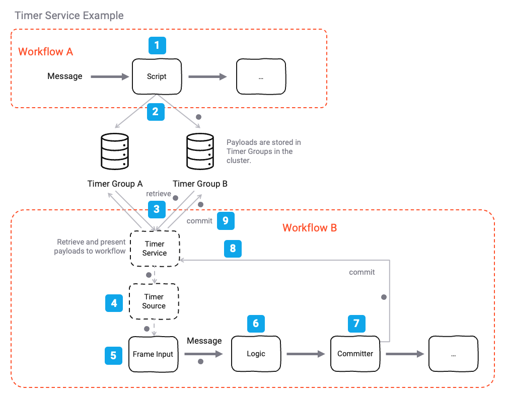
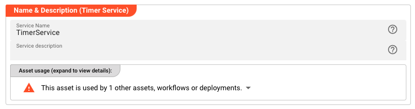
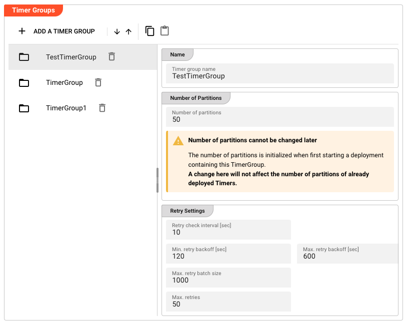
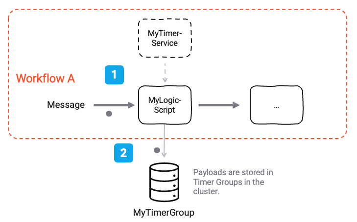
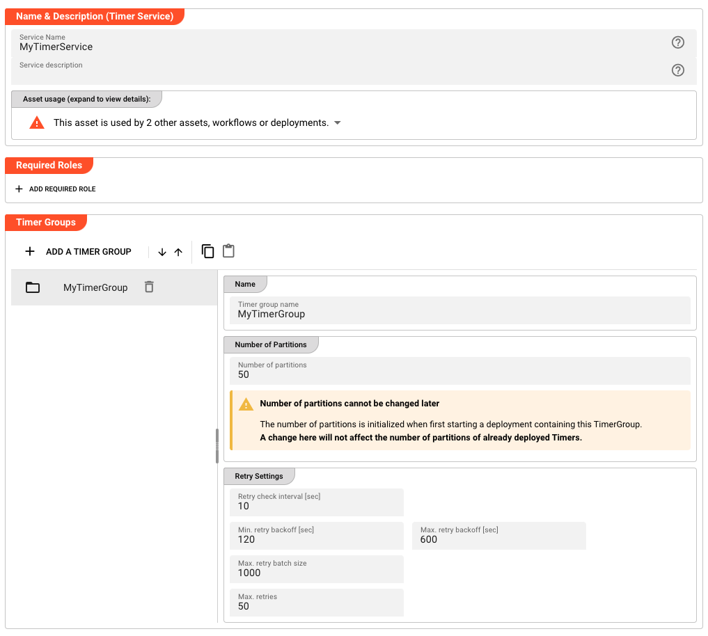
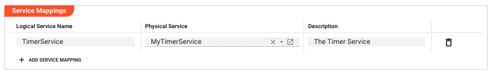
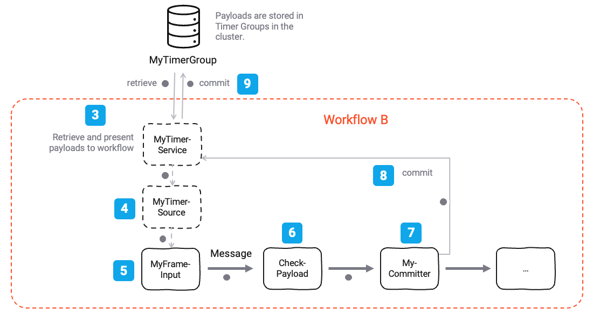
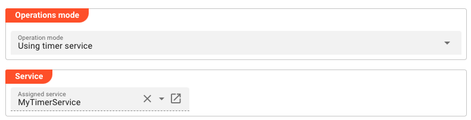
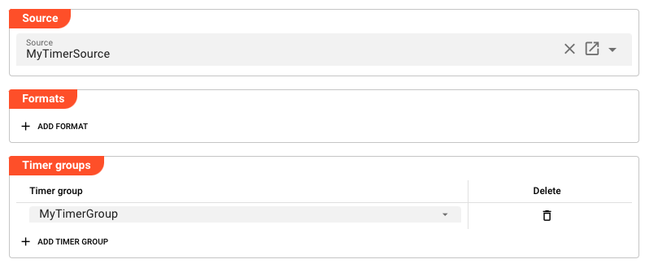

import WipDisclaimer from '../../snippets/common/_wip-disclaimer.md'
import NameAndDescription from '../../snippets/assets/_asset-name-and-description.md';
import RequiredRoles from '../../snippets/assets/_asset-required-roles.md';
import Testcase from '../../snippets/assets/_asset-service-test.md';

# Timer Service

## Purpose

In some instances of your workflow design, you may encounter situations where a condition to process a message is not met at the time of processing. Or maybe you want to hold the processing of a message for a predefined period of time before it is processed. In this case you would want to schedule the messsage (or rahter its payload) and expect the content to automatically be presented back to the at a later time.

The Timer Service is designed to fulfill this requirement.

As an example, your workflow is processing a message but
1. for some external reason the message cannot be processed because the external system is not available, or 
2. one or more other conditions are not met at the time of processing, or
3. you want to hold the processing of a message for a predefined period of time before it is processed.

Previously you would have to discard the message into an external recycle bin and manage the recycling of the message manually.

The Timer Service allows you to schedule the message's payload (or any other payload for that matter) for a certain start time or even periodically using the Timer Service and its methods. It will store the payload in a temporary location within the Reactive Cluster and will present it back at a later time to be processed. Any workflow which has an Input Processor which is subscribed to the Timer Service will receive the payload at the set time and can process it accordingly. 

Let's explain this with an example:


*Figure: Example Timer Service Workflow Setup*

- `Step 1`: We have a "Workflow A" which is processing a message. For some reason the message cannot or should not be processed at the time of processing and we need to hold on to the message's payload for a period of time before we can process it again.

- `Step 2`: We use the Timer Service's methods to schedule the message's payload within a specific Timer Group. This scheduling happens in the Timer Service's internal storage and is independent of the message's payload. The Reactive Cluster takes care of the storage and retrieval of the payloads.

- `Step 3, 4`: We have a "Workflow B" which is subscribed to the Timer Service. Whenever a timer on a payload within a Timer Group has expired, the Timer Service will present the payload back to the subscribed workflow (B in this case). The subscription is wired up bay way of defining `Timer Source` which subscribes to the Timer Service, and an `Input Processor` which in turn is subscribed to the `Timer Source`.

- `Step 5`: In our example the configured Frame Input Processor will receive the payload back from the Timer Service when due and can process it accordingly.

- `Step 6`: Somewhere along the line within the Workflow B the message's payload will undergo respective logic in which you can determine whether you have now successfully processed the message or not. The outcome of which could be that the message is committed or discarded.

- `Step 7`: If the message is passed on to a `Frame Committer` Processor, the Timer Service will remove the payload from its internal storage and the message is considered processed. Otherwise the message will be scheduled again for the configured period of time. Upon expiration of the timer the message will be re-presented back to the subscribed workflow.

- `Step 8 & 9`: If the message is committed, the Timer Service will remove the payload from its internal storage and the message is considered processed.

To summarize:

- The Timer Service is used to schedule the message's payload within a specific Timer Group.
- The message's payload is stored in the Timer Service's internal storage and is associated with a Timer Group.
- The Timer Service will present the payload back to a subscribed workflow when the timer has expired.
- The message is considered processed if it is passed on to a `Frame Committer` Processor.
- Otherwise the message will be scheduled again for the configured period of time. Upon expiration of the timer the message will be presented back to the subscribed workflow again.
- The Timer Service can be configured to schedule the message's payload to be presented back to the subscribed workflow periodically.

## Prerequisites

None

## Configuration

### Name & Description


*Figure: Timer Service Name & Description*

<NameAndDescription></NameAndDescription>

### Required roles

<RequiredRoles></RequiredRoles>

### Timer Groups

Timer Groups are used to group messages together which should be treated the same way in terms of their timer settings.
They also represent different storage areas within a Reactive Cluster deployment.


*Figure: Timer Group Configuration*

A Timer Group can have the following parameters:

- `Name`: The unique name of the Timer Group.

- `Number of partitions`: The number of storage partitions to use for the Timer Group. The partition are allocated within the Reacive Cluster upon activation of a deployment. 

:::warning
Please note, that the number of partitions cannot be changed later once a deployment including this Timer Group is activated. We plan to introduce ways on reorganizing the partitions in the future.
:::

- `Retry Settings`: The retry settings which are valid for the whole Timer Group.

    - `Retry check interval`: The interval in seconds in which the Timer Service will check for the message to be retried.

        :::warning
        Be aware, that if you try to schedule a payload within the Timer Service for e.g. 2 seconds, but the retry interval is set to 10 seconds, the message will not be retried until 10 seconds after the initial scheduling.
        :::

    - `Min retry backoff`: The minimum backoff time in seconds before a message is retried. In case messages could not be retrieved from the Timer Group due to an error, the Timer Service will initially wait for the configured minimum backoff time before trying to retrieve the message again.

    - `Max retry backoff`: The maximum backoff time in seconds before a message is retried. In case the Timer Service fails to retrieve messages repeatedly, it will exponentially increase the backoff time up to the configured maximum backoff time. If the minimum backoff time for example is 120 seconds, the maximum backoff time is 600 seconds, and the number or retries is 10, the Timer Service will wait 120 seconds, 240 seconds, 480 seconds, and from that point forward a maximum of 600 seconds for the remaining number or retries, before it fails.

    - `Max retry batch size`: The maximum number of messages which will be retrieved from the Timer Group at once. If there are more messages available and due to be retried, the Timer Service will retrieve a batch of messages and process them, but not more.

    - `Max retries`: The maximum number of retries for a message. If the message has reached this number of retries, it will be moved to the `Failed` state and the message will be discarded.


### Example: Using the Timer Service

#### Adding an entry to a Timer Group (Workflow A)

Let's revisit our example from the introduction. In it we have a Workflow A which is processing messages. How would we go about using the Timer Service to schedule a message's payload for a configurable period of time?


*Figure: Example Workflow to schedule messages using the Timer Service*

First of all we have configured a Timer Service asset by the name of `MyTimerService` with a Timer Group by the name of `MyTimerGroup` like so:


*Figure: Example Configuration for `MyTimerService`*

We also have a Javascript Processor which is processing messages. We will use this Processor to check and schedule the message's payload for a configurable period of time. In order for this to work, we need to subscribe to the `Timer Service` asset from within the Javscript Processor:


*Figure: Link Timer Service to JavaScript Asset*

Workflow A contains this JavasScript Processor (could be Python, too).

In our case we want to schedule the message's payload for a period of 60 seconds.

To do this, and because we have linked `MyTimerService` to the Javascript Processor, we can use the Timer Service's methods to schedule the message's payload within the `MyTimerGroup` Timer Group. This scheduling happens in the Timer Service's internal storage and is independent of the message's payload. The Reactive Cluster takes care of the storage and retrieval of the payloads.

```javascript
// We are defining a function "sendTeams" that will take teamsMessage parameters 
// as input parameters
export function onMessage() {
    if (message.data.MY_SOURCE.MY_RECORD_TYPE == 'HIGH_PRIORITY') {
        // Schedule the message's payload for 60 seconds within the `MyTimerGroup` Timer Group
        services.TimerService.ScheduleFixedRate({
            Group: 'MyTimerGroup',
            Period: 60,
            Name: message.data.MY_SOURCE.MY_RECORD_UUID,
            StartAt: new Date(Date.now() + 60000),
            Payload: message.data
        });
    }
}
```

:::warning Name must be unique
Please note that the `Name` parameter must be unique within the Timer Group. You cannot schedule multiple messages with the same name within the same Timer Group.
:::

#### Consuming an entry from a Timer Group (Workflow B)

Now that we have scheduled a message's payload for a period of 60 seconds, we can consume it in a different workflow when it is due.

For this purpose we will create a new Workflow (B).

*Figure: Example Workflow to consume messages using the Timer Service*

In this Workflow we have a "Frame Input Processor" `MyFrameInput` [5] which relies on the "Timer Source" `MyTimerSource` [4], which in turn is subscribed to the "Timer Service" `MyTimerService` [3].

**Configuration of `MyTimerSource` (partially shown):**

The Timer Source is set to operations mode `Using timer service` and references the Timer Service that this source should subscribe to.


*Figure: Example Configuration for `MyTimerSource`*

**Configuration of `MyFrameInput` (partially shown):**

The Frame Input Processor is configured to receive messages from the Timer Source.


*Figure: Example Configuration for `MyFrameInput`*

Note that not only the Timer Source is configured to use the Timer Service, but we also specifically select the Timer Groups which should be consumed by this Frame Input Processor.

**Execution of the Workflow:**

When the Workflow is running, the Timer Service in the background will periodically check the `MyTimerGroup` Timer Group for messages which are due to be retried. If such a message is found, it will be presented to the "Frame Input Processor" `MyFrameInput` [5]. From this point forward the message can be processed normally.

In the Script Processor `CheckPayload`[6] you can then look at the payload and do whatever you need to process the data. If a condition which the payload relies on is not met, you can simply discard the message and wait for the next cycle where it will be presented again. This happens until the message is committed via a Frame Committer Processor `MyCommitter` [7]. For the message to reach the Frame Committer Processor it needs to be passed on from the `CheckPayload` Script Processor.

```javascript
// We are defining a function "checkPayload" that will take payload parameters 
// as input parameters
export function onMessage() {
    if (message.data) {
        stream.logInfo("Payload received: " + message.data.Payload);
        // This is an example is received as a meesage from the Timer Service
        // message.data = {
        //     "Group":"TimerGroup",
        //     "Name":"TEST-05",
        //     "NumberOfTry":1,
        //     "FireTime":"2025-02-26T15:00:27.006+01:00",
        //     "ScheduledFireTime":"2025-02-26T15:00:27+01:00",
        //     "Payload":"MyPayload"
        // }
        //
        // Do something with the payload
        // ...

        // Emitting the message to the "Committer" Processor will commit the message.
        // Otherwise the message will be rescheduled again for the configured period of time (depends on the type of schedule).
        stream.emit(message, OUTPUT_PORT); // -> Send message to "Committer" Processor
    }
}
```

A message from the Timer Service will be received as a message with the following structure (example content):

```json
{
    "Group":"TimerGroup",
    "Name":"TEST-05",
    "NumberOfTry":1,
    "FireTime":"2025-02-26T15:00:27.006+01:00",
    "ScheduledFireTime":"2025-02-26T15:00:27+01:00",
    "Payload":"MyPayload"
}
```

## Summary

The Timer Service is a powerful tool that allows for the scheduling and execution of tasks at specific times or intervals. It is highly configurable, allowing for the selection of specific Timer Groups and the customization of retry behavior. The Timer Service is particularly useful in scenarios where tasks need to be executed at regular intervals or when a specific condition is met.


<Testcase></Testcase>

---

<WipDisclaimer></WipDisclaimer>

