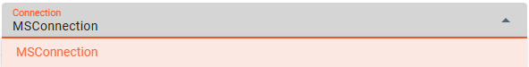

import WipDisclaimer from '../../snippets/common/_wip-disclaimer.md'
import NameAndDescription from '../../snippets/assets/_asset-name-and-description.md';
import RequiredRoles from '../../snippets/assets/_asset-required-roles.md';
import Directories from '../../snippets/assets/_asset-sink-directories.md';

# Sink OneDrive

## Purpose

Defines the specific sink parameters for a OneDrive connected endpoint.

### This Asset can be used by:

| Asset type        | Link                                                                |
|-------------------|---------------------------------------------------------------------|
| Output Processors | [Stream Output Processor](../processors-output/asset-output-stream) |

You need:

* [MS Graph Connection](../connections/asset-connection-msgraph)

## Configuration

### Name & Description

")

<NameAndDescription></NameAndDescription>

### Required roles

<RequiredRoles></RequiredRoles>

### OneDrive Settings

Configure the parameters for your OneDrive endpoint:

")

#### Connection

Use the drop-down list to select an [MS Graph Connection](../connections/asset-connection-msgraph) that should
support this OneDrive configuration. If it does not exist, you need to create it first.

:::info
Your [MS Graph Connection](../connections/asset-connection-msgraph) needs to have the following configured scope:

* Sites.ReadWrite.All
* Files.ReadWrite.All
  :::

#### Drive

The following settings define the basic location information to write OneDrive data to:

* **`Drive name or ID`** : ID or name of the OneDrive drive you want to connect to.

### Directories

<Directories></Directories>
---

<WipDisclaimer></WipDisclaimer>
