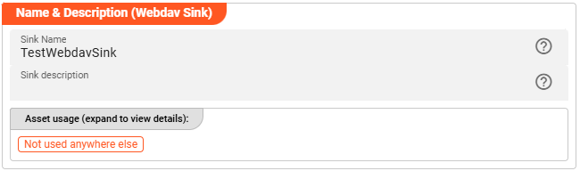

import WipDisclaimer from '../../snippets/common/_wip-disclaimer.md'
import NameAndDescription from '../../snippets/assets/_asset-name-and-description.md';
import RequiredRoles from '../../snippets/assets/_asset-required-roles.md';
import Directories from '../../snippets/assets/_asset-sink-directories.md';

# Sink WebDAV

## Purpose

Defines the specific sink parameters for a WebDAV connected endpoint. 

### This Asset can be used by:

| Asset type        | Link                                                                |
|-------------------|---------------------------------------------------------------------|
| Output Processors | [Stream Output Processor](../processors-output/asset-output-stream) |

### Prerequisite

You need:

* [WebDAV Connection](../connections/asset-connection-webdav "Name & Description (WebDAV Sink Asset)")

## Configuration

### Name & Description

<NameAndDescription></NameAndDescription>

### Required roles

<RequiredRoles></RequiredRoles>

### WebDAV Settings

")

Select the [WebDAV Connection](../connections/asset-connection-webdav) to use with this Asset.
If it does not exist, you need to create it first.

### Directories

<Directories></Directories>

---

<WipDisclaimer></WipDisclaimer>
