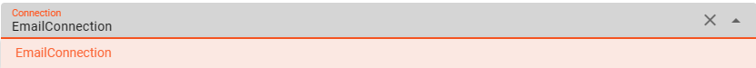
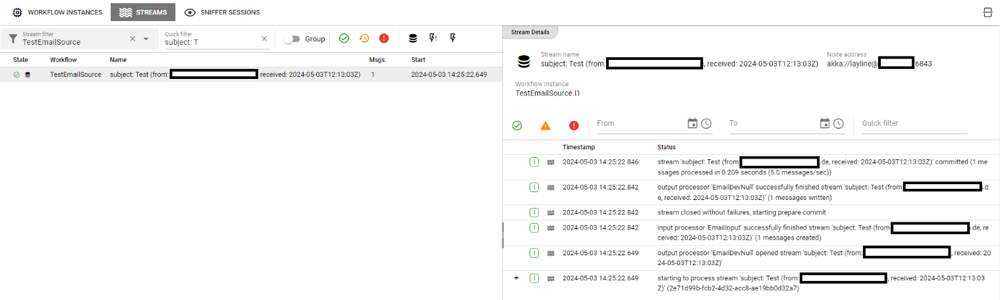
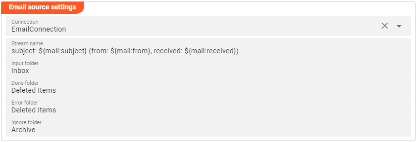
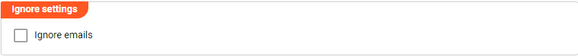
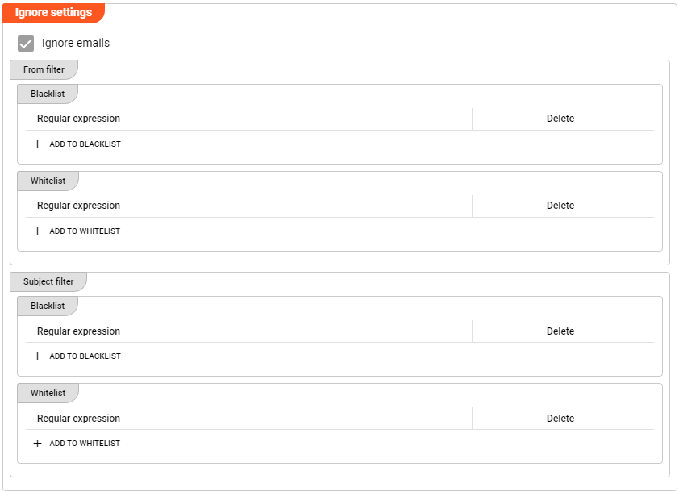
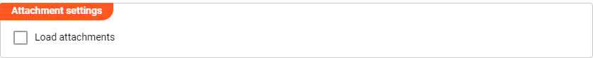
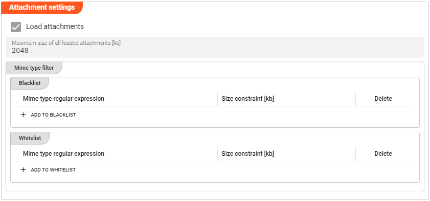

import WipDisclaimer from '../../snippets/common/_wip-disclaimer.md'
import NameAndDescription from '../../snippets/assets/_asset-name-and-description.md';
import RequiredRoles from '../../snippets/assets/_asset-required-roles.md';
import PollingAndProcessing from '../../snippets/assets/_asset-source-polling-and-processing.md';
import ThrottlingAndFailure from '../../snippets/assets/_asset-source-throttling-and-failure.md';

# Source Email

## Purpose

Defines the specific source parameters for an Email connected endpoint.

### This Asset can be used by:

| Asset type       | Link                                                            |
|------------------|-----------------------------------------------------------------|
| Input Processors | [Stream Input Message](../processors-input/asset-input-message) |

### Prerequisite

You need:

* [Email Connection](../connections/asset-connection-email)

## Configuration

### Name & Description

")

<NameAndDescription></NameAndDescription>

### Required roles

<RequiredRoles></RequiredRoles>

### Throttling & Failure Handling

<ThrottlingAndFailure></ThrottlingAndFailure>

### Polling & Processing

<PollingAndProcessing></PollingAndProcessing>

### Email Settings

Configure the parameters for your Email endpoint:

")

#### Connection

Use the drop-down list to select an [Email Connection](../connections/asset-connection-email) that should
support this Email configuration. If it does not exist, you need to create it first.

:::info
Your [Email Connection](../connections/asset-connection-email) needs to have the following configured scope:

* mail.readwrite
  :::

#### Stream name

By its nature, an Email Source does not appear with a classical stream name. At this point you define the
stream name for later identification during processing within a workflow:

* **`Stream name`** : name to apply for the email workflow stream processing

You need to ensure that the name is unique. As you can see from the example above, you can use [Macros](../../language-reference/macros) here.
In the above case we chose to include several constants like `subject: ` / `from: ` / `received: ` etc. In addition, we included
several classical email identification elements deducted from Macros to form the email stream name. Finally, the Audit trail for
data processed through the configured Email source will look similar to a classical email inbox folder:

#### Folders

* **`Input folder`** : The directory to read emails from.
  The configured input folder must be accessible to the Reactive Engine trying to access the Email source.
  You can use $\{...\} macros to expand variables defined in [environment variables](../resources/asset-resource-environment).

* **`Done folder`** : The directory to which emails are moved when fully processed. Leaving it empty, the emails will not be moved.
  The configured done folder must be accessible to the Reactive Engine trying to access the Email source.
  You can use $\{...\} macros to expand variables defined in [environment variables](../resources/asset-resource-environment).

* **`Error folder`** : The directory to which emails are moved in case of a problem with the email during processing. Leaving it empty, the emails will not be moved.
  The configured error folder must be accessible to the Reactive Engine trying to access the Email source.
  You can use $\{...\} macros to expand variables defined in [environment variables](../resources/asset-resource-environment).

* **`Ignore folder `** : The directory to which emails are moved in case they are configured to be ignored in the `Ignore emails` section (see next). Leaving it empty, the emails will not be moved.
  The configured ignore folder must be accessible to the Reactive Engine trying to access the Email source.
  You can use $\{...\} macros to expand variables defined in [environment variables](../resources/asset-resource-environment).

A final configuration could look like this:

### Ignore Emails

By default, all emails arriving in the configured _**Input folder**_ will be processed.
Though it is possible to define which emails are not relevant (_**Blacklist**_) resp. explicitly relevant (_**Whitelist**_) for processing by activating the _**Ignore Emails**_ checkbox.

* **`From filter`** : _**Blacklist**_ resp. _**Whitelist**_ definitions to apply towards email sender values
* **`Subject filter`** : _**Blacklist**_ resp. _**Whitelist**_ definitions to apply towards the email subject values

Regular expression values can be configured by pushing the respective `+ ADD TO BLACKLIST` resp. `+ ADD TO WHITELIST` button.
Logically layline.io will check any configured blacklist configuration first and evaluate any whitelist configuration afterwards.

In case any _**Blacklist**_ expression is matching an incoming email, the email will be ignored. Having configured an _**Ignore folder**_,
that specific email will be moved towards that folder. Otherwise, the email remains unprocessed in the _**Input folder**_.

Any incoming email matching the _**Whitelist**_ expression will lead to processing that email and moving it into the `Done folder` or the `Error folder` afterwards.
In case no specific folder is configured the email will remain in the _**Input folder**_.

- If you configure only _**Whitelist**_ expressions, this will implicitly mark all others to be ignored

- If you configure only _**Blacklist**_ expressions, this will implicitly define all others to be processed

- Configuring a combination of both (i.e. whitelist AND blacklist have at least one entry each!), it is important to understand the following:

> The order of expression evaluation will always be:
1. First Step:  Ignore emails matching blacklist
2. Second Step: Process emails matching whitelist
3. Third Step:  Ignore emails not falling in any category

### Attachments settings

By default, attachments to emails are not loaded.
Though it is possible to allow attachment loading by activating the _**Load attachments**_ checkbox and configure the details:

* **`Maximum size of all loaded attachments [kb]`** : limit the overall size of attachments per processed email to not overload your system capacity (value configured in kb)
* **`Mime type filter`** : filter conditions to further restrict the loading based on type of attachment and / or size:

    * **`Blacklist`** :
        * **`Mime type regular expression`** : similar as explained above, a regular expression for type of attachments that should be ignored (e.g. 'application/.*' to exclude all attachments of '
          application'-related mime types)
        * **`Size constraints [kb]`** : optional parameter that could be used to exclude only those type of attachments with a size greater than the configure size value; no configured value will
          ignore this parameter

    * **`Whitelist`** :
        * **`Mime type regular expression`** : similar as explained above, a regular expression for type of attachments that should be included for processing (e.g. 'application/.*' to include only
          attachments of 'application'-related mime types)
        * **`Size constraints [kb]`** : optional parameter that could be used to include only those type of attachments with a size less or equal than the configure size value; no configured value
          will ignore this parameter.
          Please note that the configured maximum size takes precedence in the overall setup!

- If you configure only _**Whitelist**_ expressions, this will implicitly mark all others to be ignored

- If you configure only _**Blacklist**_ expressions, this will implicitly define all others to be processed

- Configuring a combination of both (i.e. whitelist AND blacklist have at least one entry each!), it is important to understand the following:

> The order of expression evaluation will always be:
1. First Step:  Ignore emails matching blacklist
2. Second Step: Process emails matching whitelist
3. Third Step:  Ignore emails not falling in any category

---

<WipDisclaimer></WipDisclaimer>
