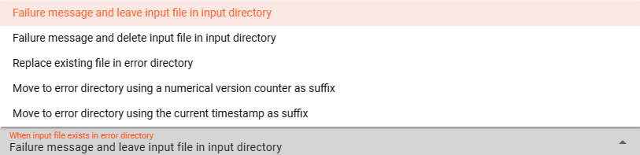

import WipDisclaimer from '/docs/snippets/common/_wip-disclaimer.md';
import NameAndDescription from '/docs/snippets/assets/_asset-name-and-description.md';
import RequiredRoles from '/docs/snippets/assets/_asset-required-roles.md';

# Source File System

## Purpose

Defines the specific source parameters for a File System connected endpoint. 

### This Asset can be used by:

| Asset type       | Link                                                                       |
|------------------|----------------------------------------------------------------------------|
| Input Processors | [Stream Input Processor](/docs/assets/processors-input/asset-input-stream) |

### Prerequisite

None

## Configuration

### Name & Description

")

<NameAndDescription></NameAndDescription>

### Required roles

<RequiredRoles></RequiredRoles>

### Polling & Processing

")

A File System is not a stream, but an object based storage source which does not signal the existence of new objects to observers.
We therefore need to define how often we want to look-up (poll) the source for new objects to process.

You can choose between `Fixed rate polling` and `Cron tab style` polling:

#### Fixed rate

Use `Fixed rate` if you want to poll in constant and frequent intervals.

* **`Polling interval [sec]`**: Enter the interval in seconds in which the configured source should be queried for new objects.

#### Cron tab

")

Use `Cron tab` if you want to poll at determined times. This follows the cron tab style convention which may be familiar to you.
In all other cases you can read more about crontab and the syntax [here](https://en.wikipedia.org/wiki/Cron).
You can simulate cron settings using [this smart website](https://crontab.guru/).

Examples:

* **[0/2 2 3 4 5](https://crontab.guru/#0/2_2_3_4_5)**: "_At every 2nd minute from 0 through 59 past hour 2 on day-of-month 3 and on Friday in April._"
* **[0 22 * * 1-5](https://crontab.guru/#0_22_*_*_1-5)**: "_At 22:00 on every day-of-week from Monday through Friday._"

#### Polling timeout

The `Polling timeout [sec]` defines the time in seconds to wait until a polling request fails.
Depending on the endpoint and its responsiveness you may want to change this number to something higher or lower.
You should set it high enough, so that you are confident that the endpoint responds under normal operation.

#### Ordering

When listing objects from the File System source for processing, you can define in what order they should be processed.
Pick one of the following self-explanatory settings:

* `Alphabetically, ascending`
* `Alphabetically, descending`
* `Last modified, ascending`
* `Last modified, descending`

### Directories

A File System source requires the definition of three different directories:

1. **Input Directory** : The directory to read new files from.
2. **Done Directory** : The directory to which read files are moved after reading.
3. **Error Directory** : Files which caused problems during processing are moved to the Error Directory for further analysis.

#### Input Directory

")

* **`Input Directory`** : The directory to read files from.
  The path of the directory must be accessible to the Reactive Engine trying to access the File System source.
  You can use ${...} macros to expand variables defined in [environment variables](/docs/assets/resources/asset-resource-environment).

* **`Filter regular expression`** : Regular expression to filter which files in the directory are pulled.

* **`File prefix regular expression`** : A regular expression filter which is applied to the beginning of a file name.
  E.g. `XYZ.` will lead to only those files read which filename starts with `XYZ` followed by anything.

* **`File suffix regular expression`** : A regular expression filter which is applied to the end of a file name.
  E.g. `.zip` will lead to only those files read which filename ends with `zip` preceded by anything.

* **`Include sub-directories`** : Scan sub-directories to the input directory also.

* **`Enable housekeeping`** : Allows to apply housekeeping rules for files within the input directory. You can configure your required options.

  

#### Done Directory

")

* **`Done Directory`** : The directory to which files are moved when fully processed.
  The path of the directory must be accessible to the Reactive Engine trying to access the File System source.
  You can use ${...} macros to expand variables defined in [environment variables](/docs/assets/resources/asset-resource-environment).

* **`Done prefix`** : Prefix to add to the filename of the processed file after move to the done directory.
  E.g. `done_` will add the `done_`-prefix to the beginning of the filename when moved to the done directory.

* **`Done suffix`** : Suffix to add to the filename of the processed file after move to the done directory.
    E.g. `_done` will add the `_done`-suffix to the end of the filename when moved to the done directory.

* **`"File already exists"-Handling`** : Define your required handling in case the file already exists in the done-directory.

    

* **`Enable housekeeping`** : Allows to apply housekeeping rules for files within the done directory. You can configure your required options.

  

#### Error Directory

")

* **`Error Directory`** : The directory to which files are moved in case of a problem with the file during processing.
  The path of the directory must be accessible to the Reactive Engine trying to access the File System source.
  You can use ${...} macros to expand variables defined in [environment variables](/docs/assets/resources/asset-resource-environment).

* **`Error prefix`** : Prefix to add to the filename of the processed file after move to the error directory.
  E.g. `error_` will add the `error_`-prefix to the beginning of the filename when moved to the error directory.

* **`Error suffix`** : Suffix to add to the filename of the processed file after move to the error directory.
  E.g. `_error` will add the `_error`-suffix to the end of the filename when moved to the error directory.

* **`"File already exists"-Handling`** : Define your required handling in case the file already exists in the error-directory.

  

* **`Enable housekeeping`** : Allows to apply housekeeping rules for files within the error directory. You can configure your required options.

  

## Related Topics

### Internal

* [Stream Input Processor](/docs/assets/processors-input/asset-input-stream)
* [File System Sink](/docs/assets/sinks/asset-sink-file)

### External

* [Cron on Wikipedia](https://en.wikipedia.org/wiki/Cron)
* [Cron editor online from crontab guru](https://crontab.guru/)

---

<WipDisclaimer></WipDisclaimer>
