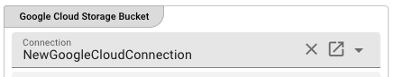
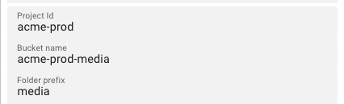

import WipDisclaimer from '../../snippets/common/_wip-disclaimer.md'
import NameAndDescription from '../../snippets/assets/_asset-name-and-description.md';
import RequiredRoles from '../../snippets/assets/_asset-required-roles.md';
import PollingAndProcessing from '../../snippets/assets/_asset-source-polling-and-processing.md';
import ThrottlingAndFailure from '../../snippets/assets/_asset-source-throttling-and-failure.md';

# Source Google Cloud Storage

## Purpose

Polls one or more Google Cloud Storage (GCS) buckets for objects and makes them available to downstream processors. Authentication is handled via a [Google Cloud Connection](../connections/asset-connection-google-cloud) using OAuth 2.0. Objects can be filtered by prefix, suffix, and regular expression patterns. Housekeeping rules can be configured to automatically delete processed objects after a configurable age threshold.

### This Asset can be used by:

| Asset type       | Link                                                               |
|------------------|--------------------------------------------------------------------|
| Input Processors | [Stream Input Processor](../processors-input/asset-input-stream)   |

### Prerequisites

You need:

- A [**Google Cloud Connection**](../connections/asset-connection-google-cloud) with a valid OAuth client configured
- A GCS bucket reachable from the Google Cloud project referenced by the connection

## Configuration

### Name & Description

")

<NameAndDescription></NameAndDescription>

### Required Roles

<RequiredRoles></RequiredRoles>

### Throttling & Failure Handling

<ThrottlingAndFailure></ThrottlingAndFailure>

### Polling & Processing

<PollingAndProcessing></PollingAndProcessing>

### Input Buckets

")

The **Input Buckets** section defines which GCS buckets to poll and how to filter the objects within them.

Click **"+ ADD A BUCKET"** to add a new bucket entry. Use the toolbar to reorder, copy, or paste bucket entries.

#### Bucket Entry Fields

**Connection** — Select the [Google Cloud Connection](../connections/asset-connection-google-cloud) to use for accessing this bucket. The dropdown shows only valid Google Cloud Connection assets.

**Project Id** — The Google Cloud project ID that owns the target bucket.

**Bucket name** — The name of the GCS bucket to poll.

**Folder prefix** — An optional object key prefix to narrow down the scope within the bucket (e.g., `media/`). Only objects whose keys start with this prefix are considered.

**Object regular expression** — A regular expression applied to the full object key to determine whether an object should be processed (e.g., `\S+\.csv` matches any key ending in `.csv`).

**Object prefix regular expression** — A regular expression filter applied to the beginning of the object key. Optional.

**Object suffix regular expression** — A regular expression filter applied to the end of the object key (e.g., `\.csv`). Optional.

**Include sub folders** — When enabled, objects under sub-prefixes within the bucket/folder prefix scope are also considered for processing. Default: disabled.

#### Housekeeping

")

**Enable housekeeping** — When enabled, objects that have been fully processed are automatically deleted after a configurable age threshold.

**Delete after** — Age threshold for housekeeping deletion. Objects older than this value are deleted.

**Unit** — Time unit for the Delete after threshold: `Minutes`, `Hours`, or `Days`.

**Execute housekeeping at** — A cron expression defining when housekeeping runs (e.g., `0 0 0 ? * * *` runs daily at midnight). Click the calendar icon to open the cron expression editor.

#### Enable / Disable Bucket

Each bucket entry can be individually enabled or disabled, or controlled via a string expression. Select **Enabled** or **Disabled** from the dropdown, or choose **"Set via string expression"** to use a dynamic expression.

## Behavior

The Source polls each configured bucket at the interval defined in **Polling & Processing**. Objects that match all applicable filters (prefix, suffix, regex) and are in the ENABLED state are queued for processing.

When an object is fully processed by the downstream workflow, the housekeeping rules determine whether it is deleted or retained. If housekeeping is disabled, objects remain in the bucket indefinitely.

The **Access Coordinator** tracks which objects have been processed to prevent duplicate processing on reprocessing runs. See **Reprocessing mode** in Polling & Processing for the available modes.

## See Also

- [**Google Cloud Connection**](../connections/asset-connection-google-cloud) — OAuth configuration for GCS access
- [**GCS Sink**](../sinks/asset-sink-gcs) — Write objects to Google Cloud Storage
- [**VFS Source**](../sources/asset-source-virtual-fs) — Read files from a Virtual File System mount

---
<WipDisclaimer></WipDisclaimer>
