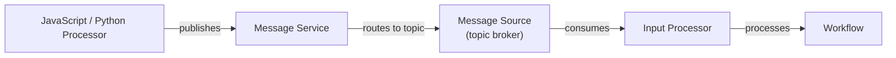
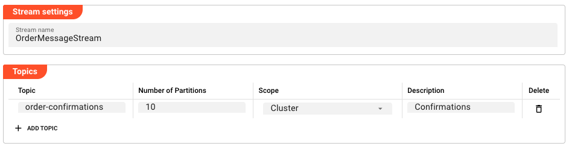

import WipDisclaimer from '../../snippets/common/_wip-disclaimer.md'
import ThrottlingAndFailure from '../../snippets/assets/_asset-source-throttling-and-failure.md'

# Source Message

## Purpose

Define a Message Source. A Message Source defines one or more topics that can be used to exchange messages between Workflows, Processors, and other Assets within a layline.io project. It acts as an internal message broker — topics are shared across the Reactive Engine cluster and can be consumed by multiple processors.

### Architecture

The Message Source is the **consumer side** of layline.io's internal messaging system. The corresponding **producer side** is the [Message Service](../services/asset-service-message.md), which is used to publish messages to topics defined in a Message Source.

Together, they form a publish/subscribe system:



Messages published via a Message Service are routed to the configured topic. Any Input Processor (such as [Stream Input](../processors-input/asset-input-stream) or [Frame Input](../processors-input/asset-input-frame)) that references this Message Source can subscribe to and consume those messages.

### Use Cases

A Message Source is useful in scenarios such as:

- **Workflow-to-Workflow communication**: One Workflow publishes messages to a topic via a Message Service; another Workflow subscribes to that topic via a Message Source and processes the messages further.
- **Fan-out processing**: A single topic can be consumed by multiple processors in parallel, each processing different partitions of the data.
- **Cross-cluster messaging**: Topics scoped to `Cluster` are available across all Reactive Engine nodes; topics scoped to `Node` are local to each node.
- **Decoupling**: Producers and consumers are decoupled — the producer does not need to know which processors consume its messages.

### This Asset can be used by:

| Asset type | Link |
|------------|------|
| Input Processors | [Stream Input](../processors-input/asset-input-stream) |
| | [Frame Input](../processors-input/asset-input-frame) |

### Related Asset

| Asset | Description |
|-------|-------------|
| [Message Service](../services/asset-service-message.md) | Publishes messages to topics defined in this Message Source |

## Configuration

### Name & Description

* **`Source Name`** : Name of the Asset. Spaces are not allowed in the name.

* **`Source Description`** : Enter a description.

The **`Asset Usage`** box shows how many times this Asset is used and which parts are referencing it.
Click to expand and then click to follow, if any.

### Required Roles

In case you are deploying to a Cluster which is running (a) Reactive Engine Nodes which have (b) specific Roles
configured, then you **can** restrict use of this Asset to those Nodes with matching roles.
If you want this restriction, then enter the names of the `Required Roles` here. Otherwise, leave empty to match all
Nodes (no restriction).

### Throttling & Failure Handling

<ThrottlingAndFailure></ThrottlingAndFailure>


### Stream Settings

* **`Stream name`** : The name of the internal stream used to publish messages from this source. All topics in this source belong to this stream.



### Topics

Topics define the individual message channels within the stream. Each topic can be independently scoped.

Click **Add Topic** to add a new topic entry.

| Column | Description |
|--------|-------------|
| **Topic** | The name of the topic |
| **Number of Partitions** | Number of partitions for this topic (affects parallelism) |
| **Scope** | `Node` — topic is local to each Engine node; `Cluster` — topic is shared across the entire cluster |
| **Description** | Optional description of the topic |

### How It Works

In a layline.io Workflow, a Message Source is assigned to an Input Processor (such as [Stream Input](../processors-input/asset-input-stream) or [Frame Input](../processors-input/asset-input-frame)). The Input Processor connects to the source and receives messages from the configured topics. The messages are then passed through the Workflow for processing.

Topics with `Cluster` scope are visible and accessible from any Reactive Engine node in the cluster. Topics with `Node` scope are only visible to the local node, which can be useful for node-local caching or coordination.

The number of partitions determines how many parallel instances of a processor can consume from the same topic — each partition can be processed by a different thread or node simultaneously.

### Example: Publishing to a Topic

To publish messages to a topic, use a [Message Service](../services/asset-service-message.md) from a JavaScript or Python processor. The Message Service references this Message Source and exposes functions that publish to its topics.

Example (JavaScript):

```javascript
/**
 * Publish an order confirmation message to the orders topic
 * @param orderData The order data to publish
 */
function publishOrderConfirmation(orderData) {
    services.OrderMessageService.PublishOrderConfirmation({
        Topic: "order-confirmations",
        PartitionKey: orderData.orderId,
        Request: orderData
    });
}
```

For a complete example, see [Message Service](../services/asset-service-message.md).

For information on using JavaScript Processors, see [JavaScript Processor](../processors-flow/asset-flow-javascript.md).

---

<WipDisclaimer></WipDisclaimer>
