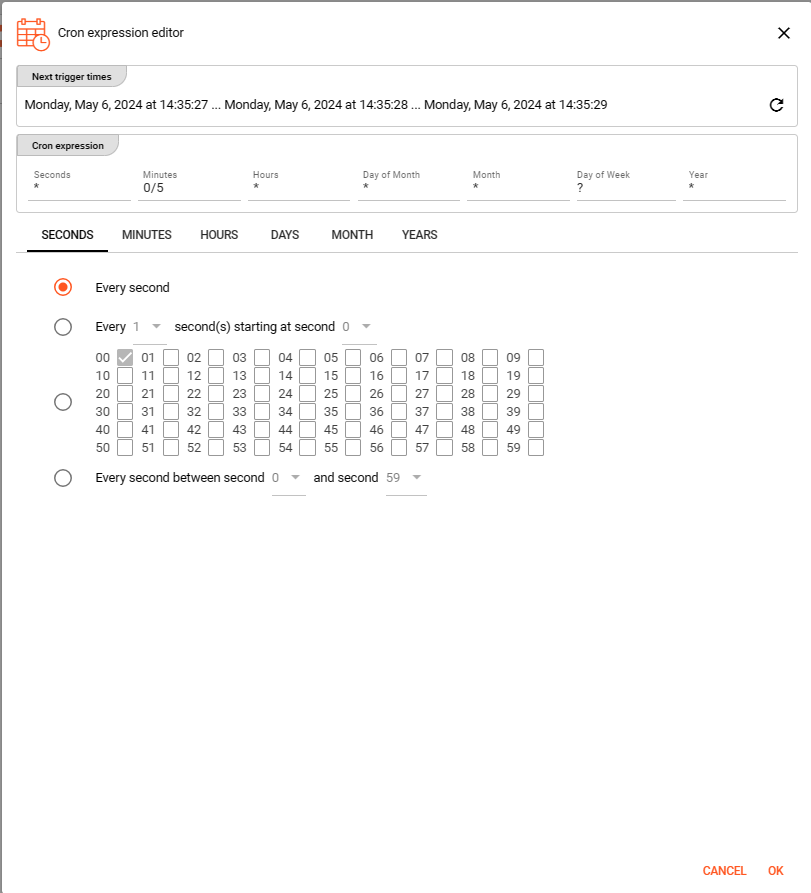

import WipDisclaimer from '/docs/snippets/common/_wip-disclaimer.md';
import NameAndDescription from '/docs/snippets/assets/_asset-name-and-description.md';
import RequiredRoles from '/docs/snippets/assets/_asset-required-roles.md';

# Source Service

## Purpose

A Service Source allows the integration of a configured [Service Assets](/docs/category/services) to be used as a data input source.

Classical Examples for this use case would be selecting data from a store:

* [JDBC](/docs/category/services/asset-service-jdbc)
* [Aerospike](/docs/category/services/asset-service-aerospike)
* [Cassandra](/docs/category/services/asset-service-cassandra) 

Depending on their setup other Service Assets like [Http](/docs/category/services/asset-service-http) or [SOAP](/docs/category/services/asset-service-soap) 
might also serve the input data aspect. 
Basically layline.io allows any Service Asset to be used as a Service Source. Though, you need to check whether an available service reflects a reasonable input source respectively other approaches might be more applicable (e.g.: Email Service vs. Email Source).     

### This Asset can be used by:

| Asset type       | Link                                                                         |
|------------------|------------------------------------------------------------------------------|
| Input Processors | [Service Input Processor](/docs/assets/processors-input/asset-input-service) |

### Prerequisite

You need:

**A Service Asset, of either**

* [Aerospike](/docs/category/services/asset-service-aerospike)
* [Cassandra](/docs/category/services/asset-service-cassandra)
* [Hazelcast](/docs/category/services/asset-service-hazelcast)
* [Http](/docs/category/services/asset-service-http)
* [JDBC](/docs/category/services/asset-service-jdbc)
* [SOAP](/docs/category/services/asset-service-soap)

(other Service Assets are available while at this stage the ones linked in here are making most sense at this stage)

## Configuration

### Name & Description

")

<NameAndDescription></NameAndDescription>

### Required roles

<RequiredRoles></RequiredRoles>

### Service

At this stage an available Service Asset that should be used for this Service Source configuration needs to be selected:

")

Activating the drop-down list will show all available Service Assets configured in the respective project.

Choose the Service Asset you want to use and press `OK`.

### Polling & Processing

")

Using Services as a source you need to define how often you want to trigger the lookup for new data to process. 
Performing this lookup is done by the [Data Functions](#data-functions) which in return receive their lookup input parameter(s) as defined in the [Polling mode](#polling-mode).

In regards to the polling, you can choose between `Fixed rate polling` and `Cron tab style` polling:

#### Fixed rate

Use `Fixed rate` if you want to poll in constant and frequent intervals.

* **`Polling interval [sec]`**: Enter the interval in seconds in which the configured source should be queried for new data.

#### Cron tab

Use `Cron tab` if you want to poll at determined times. The `Cron tab expression` follows the cron tab style convention which may be familiar to you.
In all other cases you can read more about crontab and the syntax [here](https://www.quartz-scheduler.org/documentation/quartz-2.3.0/tutorials/crontrigger.html).
You can simulate cron settings using [this smart website](https://www.freeformatter.com/cron-expression-generator-quartz.html).
Or you can use the **Cron expression editor** provided underneath the calendar symbol on the right hand side:

Configure your expression with the help of this editor. The _**Next trigger times**_ at the top helps to
visualize the configured expression. Press OK towards the end of this editor window to store the given values.

#### Polling timeout

The `Polling timeout [sec]` defines the time in seconds to wait until a polling request fails.
Depending on the endpoint and its responsiveness you may want to change this number to something higher or lower.
You should set it high enough, so that you are confident that the endpoint responds under normal operation.

#### Object Name

")

A unique `Object name` configuration is necessary and relates to layline.io's [Access Coordinator](/docs/concept/operations/cluster#access-coordinator) feature. 
The [Sources Coordinator](/docs/concept/operations/cluster##sources-coordinator-tab-2) will show the here defined object name in its list of sources processed. 
As you can see from the screenshot above, you can use [Macros](/docs/lang-ref/macros) here.

#### Ordering

When listing objects from the source for processing, you can define in what order they should be processed.
Pick one of the following self-explanatory settings:

* `Alphabetically, ascending`
* `Alphabetically, descending`
* `Last modified, ascending`
* `Last modified, descending`

#### Polling mode

There are two available options to configure the `Polling mode` used to gather the data required for executing the Data functions:  

")

* `Use a service function`: this option requires the Service Asset to provide an appropriate function to select data from its configured store:

    

* `Use a constant parameter`: in case the Service Asset does not provide any function to select Data function required data, 
it is possible to configure a constant parameter in here. Choosing this option a small little editor window will open up to key in the structure / data for your constant parameter:

### Stream & Transaction

")

* **`Stream name`** : name to apply for the Service Source workflow processing. You need to ensure that the name is unique. As you can see from the example above, you can use [Macros](/docs/lang-ref/macros) here.
* **`Process within a single transaction`** : not all Services configured as a Source are necessarily used in a transactional approach. Activate this checkbox in case you want to force a transactional approach.
* **`Use a separate connection for each operation`** : not all Services configured as a Source are necessarily related to a connection. Activate this checkbox in case you want to use a dedicated connection for this Service Source processing. 

### Functions

")

Respective Functions can be added by clicking the `+ ADD FUNCTION` button.

#### Data Functions

Choose available `Data Functions` to select the data for processing from the used Service store. 
The Service Asset should provide these functions and they will be listed in the drop-down list.
Depending on the use case it is possible to configure one or more functions.
After the triggering for selecting the data has been issued they will be executed in the configured order.

")

#### Commit Functions

`Commit Functions` can be used for executing further activity to inform about the commit. 
For instance updating a process related workflow storage indicating that a processing has successfully been committed.

#### Rollback Functions

`Rollback Functions` can be used for executing further activity to inform about the rollback.
For instance updating a process related workflow storage indicating that a rollback has happened.

---

<WipDisclaimer></WipDisclaimer>
