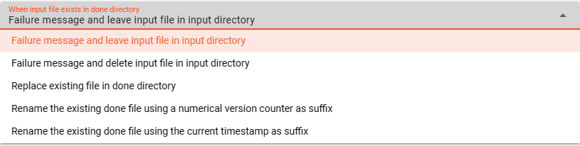
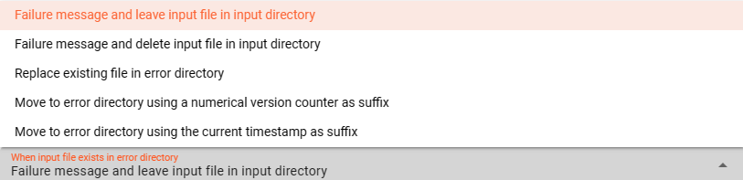

import WipDisclaimer from '/docs/snippets/common/_wip-disclaimer.md';
import NameAndDescription from '/docs/snippets/assets/_asset-name-and-description.md';
import RequiredRoles from '/docs/snippets/assets/_asset-required-roles.md';
import PollingAndProcessing from '/docs/snippets/assets/_asset-source-polling-and-processing.md';

# Source SMB

## Purpose

Defines the specific source parameters for a SMB connected endpoint.

### This Asset can be used by:

| Asset type       | Link                                                                       |
|------------------|----------------------------------------------------------------------------|
| Input Processors | [Stream Input Processor](/docs/assets/processors-input/asset-input-stream) |

### Prerequisite

You need:

* [SMB Connection](/docs/assets/connections/asset-connection-smb)

## Configuration

### Name & Description

")

<NameAndDescription></NameAndDescription>

### Required roles

<RequiredRoles></RequiredRoles>

### Polling & Processing

<PollingAndProcessing></PollingAndProcessing>

### SMB Settings

Configure the parameters for your SMB endpoint:

")

#### Connection

Use the drop-down list to select an [SMB Connection](/docs/assets/connections/asset-connection-smb) that should
support this SMB configuration. If it does not exist, you need to create it first.

#### Share

* **`Share`** : Configure your basic location information for your SMB endpoint. 
You can use ${...} macros to expand variables defined in [environment variables](/docs/assets/resources/asset-resource-environment).

### Directories

Underneath the configured base (Share) location the SMB source requires the definition of three different directories:

1. **Input Directory** : The directory to read files from.
2. **Done Directory** : The directory to which read files are moved after reading.
3. **Error Directory** : Files which caused problems during processing are moved to the Error Directory for further analysis.

#### Input Directory

")

* **`Input Directory`** : The directory to read files from.
  The path of the directory must be accessible to the Reactive Engine trying to access the SMB source.
  You can use ${...} macros to expand variables defined in [environment variables](/docs/assets/resources/asset-resource-environment).

* **`Filter regular expression`** : Regular expression to filter which files in the directory are pulled.

* **`File prefix regular expression`** : A regular expression filter which is applied to the beginning of a file name.
  E.g. `XYZ.` will lead to only those files read which filename starts with `XYZ` followed by anything.

* **`File suffix regular expression`** : A regular expression filter which is applied to the end of a file name.
  E.g. `.zip` will lead to only those files read which filename ends with `zip` preceded by anything.

* **`Include sub-directories`** : Scan sub-directories to the input directory also.

* **`Enable housekeeping`** : Allows to apply housekeeping rules for files within the input directory. You can configure your required options.

  

#### Done Directory

")

* **`Done Directory`** : The directory to which files are moved when fully processed.
  The path of the directory must be accessible to the Reactive Engine trying to access the SMB source.
  You can use ${...} macros to expand variables defined in [environment variables](/docs/assets/resources/asset-resource-environment).

* **`Done prefix`** : Prefix to add to the filename of the processed file after move to the done directory.
  E.g. `done_` will add the `done_`-prefix to the beginning of the filename when moved to the done directory.

* **`Done suffix`** : Suffix to add to the filename of the processed file after move to the done directory.
  E.g. `_done` will add the `_done`-suffix to the end of the filename when moved to the done directory.

* **`"File already exists"-Handling`** : Define your required handling in case the file already exists in the done-directory.

  

* **`Enable housekeeping`** : Allows to apply housekeeping rules for files within the done directory. You can configure your required options.

  

#### Error Directory

")

* **`Error Directory`** : The directory to which files are moved in case of a problem with the file during processing.
  The path of the directory must be accessible to the Reactive Engine trying to access the SMB source.
  You can use ${...} macros to expand variables defined in [environment variables](/docs/assets/resources/asset-resource-environment).

* **`Error prefix`** : Prefix to add to the filename of the processed file after move to the error directory.
  E.g. `error_` will add the `error_`-prefix to the beginning of the filename when moved to the error directory.

* **`Error suffix`** : Suffix to add to the filename of the processed file after move to the error directory.
  E.g. `_error` will add the `_error`-suffix to the end of the filename when moved to the error directory.

* **`"File already exists"-Handling`** : Define your required handling in case the file already exists in the error-directory.

  

* **`Enable housekeeping`** : Allows to apply housekeeping rules for files within the error directory. You can configure your required options.

  

---

<WipDisclaimer></WipDisclaimer>
