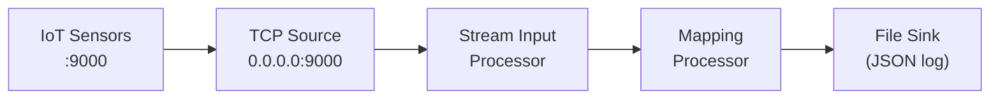

import WipDisclaimer from '../../snippets/common/_wip-disclaimer.md'
import NameAndDescription from '../../snippets/assets/_asset-name-and-description.md';
import RequiredRoles from '../../snippets/assets/_asset-required-roles.md';

# Source TCP

## Purpose

Defines the parameters for receiving data over a TCP connection.

TCP is a connection-oriented (stateful) protocol — unlike UDP, a TCP connection is established before data transfer begins, and both endpoints maintain state throughout the session. This makes TCP suitable for reliable, ordered data streams where message boundaries need to be preserved.

### This Asset can be used by:

| Asset type | Link |
|---|---|
| Input Processors | [Stream Input Processor](../processors-input/asset-input-stream) |
| Output Processors | [Stream Output Processor](../processors-output/asset-output-stream) |

### Prerequisite

None. The TCP Source defines its own connection parameters directly — no separate Connection asset is required.

## Configuration

### Name & Description

<NameAndDescription></NameAndDescription>

### Required Roles

<RequiredRoles></RequiredRoles>

### Host

* **`Bind host`** : The network interface address on which the TCP Source listens. Leave empty to bind to all interfaces.
* **`Bind port`** : The TCP port number on which to listen for incoming connections.

### Advanced Parameters

* **`Connection backlog`** : Number of pending connections the operating system holds in the queue while waiting for acceptance. Increase this value if many clients connect simultaneously.
* **`Receive buffer size [bytes]`** : Size of the socket's receive buffer in bytes. Set to `0` to use the operating system default. Set to a specific value to control memory usage for high-throughput scenarios.
* **`Idle timeout [sec]`** : Number of seconds after which an idle connection is automatically closed. If `0`, connections are held open indefinitely.

---

## Example: IoT Sensor Data over TCP

This example shows how to receive continuous temperature and humidity readings from IoT sensors connected over TCP.

### Incoming Data Format

Each sensor sends newline-delimited JSON records:

```json
{"sensor_id":"SENS-001","timestamp":"2026-03-27T08:00:00Z","temperature":22.4,"humidity":61.2}
{"sensor_id":"SENS-001","timestamp":"2026-03-27T08:00:05Z","temperature":22.5,"humidity":61.0}
{"sensor_id":"SENS-002","timestamp":"2026-03-27T08:00:00Z","temperature":18.7,"humidity":74.1}
```

Each line is a complete, independent JSON object. A newline character (`\n`) acts as the record boundary — no special framing is needed beyond that.

### TCP Source Configuration

| Setting | Value | Reason |
|---------|-------|--------|
| Bind host | `0.0.0.0` | Listen on all network interfaces so any sensor can reach the engine |
| Bind port | `9000` | Fixed port number — sensors are configured to connect here |
| Connection backlog | `50` | Allows up to 50 simultaneous sensor connections without rejecting clients |
| Receive buffer size | `65536` | 64 KB buffer handles bursty sensor data without losing frames |
| Idle timeout | `300` | Closes connections idle for more than 5 minutes, freeing engine resources |

### Workflow Wiring



1. **TCP Source** (`IoTSensorSource`) — binds to `0.0.0.0:9000` and accepts incoming sensor connections
2. **Stream Input Processor** — reads the raw byte stream and forwards it to the next processor
3. **Mapping Processor** — parses each newline-delimited JSON record, applies a schema, and maps fields to the output format
4. **File Sink** — writes the processed records to a log file

### Key Design Notes

* **No polling interval** — TCP streams are push-based. The sensor pushes data as it is available; the engine reads continuously without asking.
* **Message boundaries** — TCP itself is a stream protocol with no concept of record boundaries. Use a Format with a delimiter (e.g., newline) or a fixed-length framing to split the byte stream into logical records.
* **Connection handling** — if a sensor disconnects and reconnects, layline.io handles the reconnection automatically. Set the **Idle timeout** to clean up sensors that stop sending without closing the connection properly.
* **Multiple sensors** — multiple sensors can connect to the same port simultaneously. Each independent TCP connection carries its own stream of records.


<WipDisclaimer></WipDisclaimer>
