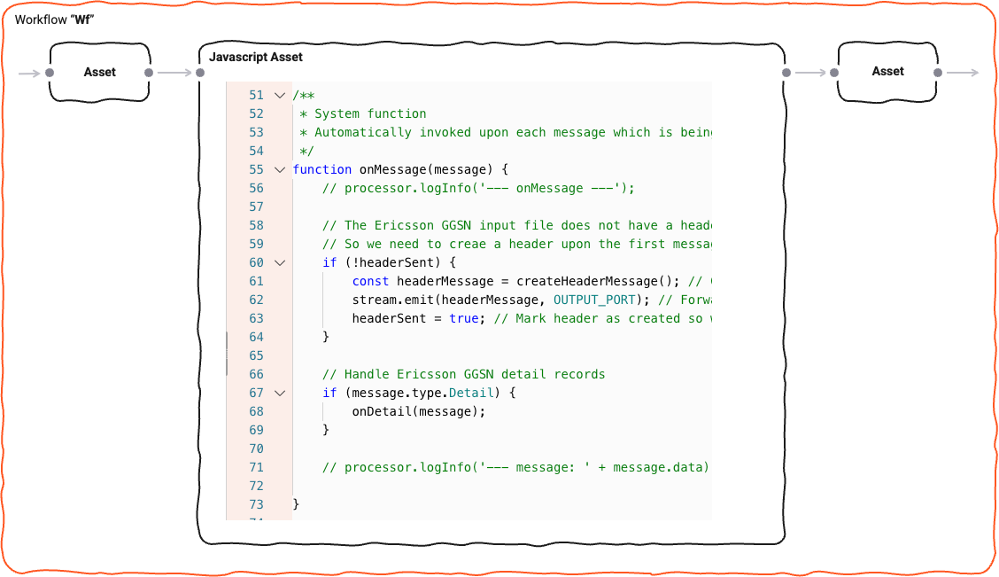
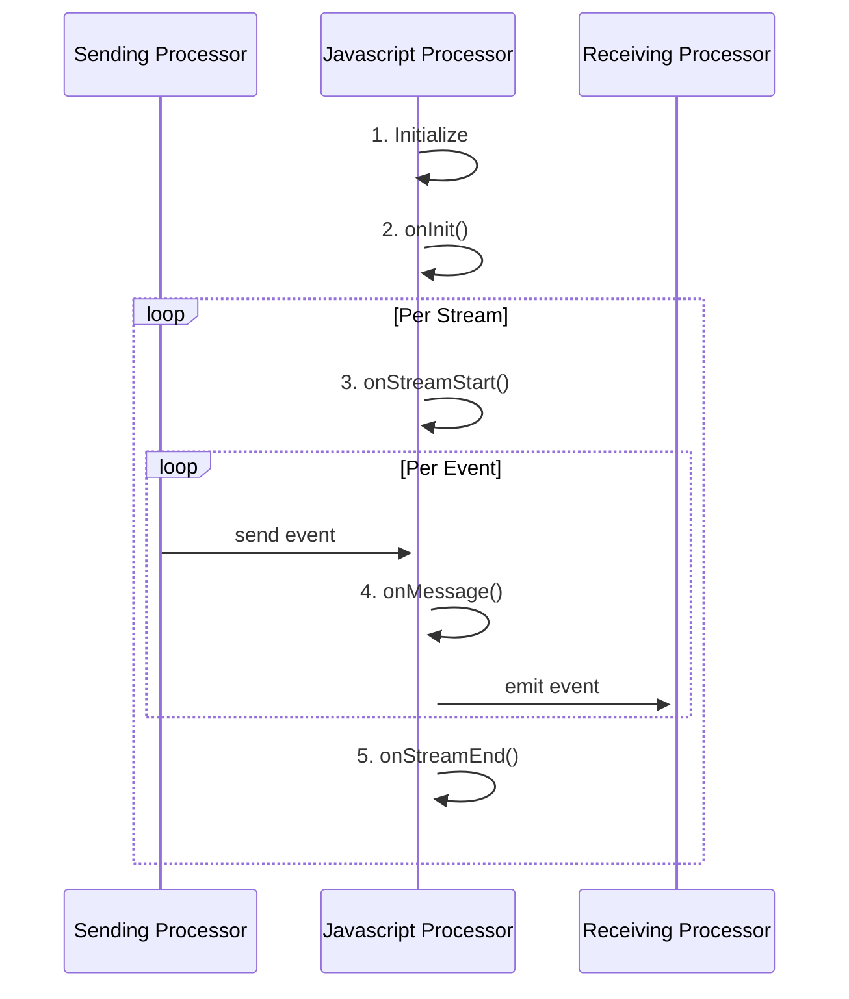
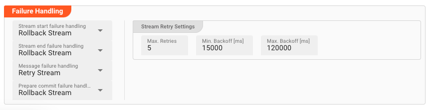

## Introduction

In order to allow for complex message processing and applying custom business logic to message handling, layline.io
provides the [Javascript Asset](/assets/processors-flow/asset-flow-javascript).
This asset enables you to apply theoretically any kind of scriptable logic when handling messages.

Popular examples are:

* Data analysis
* Enrichment
* Statistics gathering
* Complex mapping
* Filtering

and potentially anything you can imagine when handling data.

Using the Javascript Asset is not mandatory of course.
Many challenges you may be facing can be accomplished using the out-of-the-box Assets whcih layline.io provides without
resorting to Javascript.
But in many instances, an intermittent scripting processor inserted into a Workflow can go a long way in enabling you to
execute logic which would be otherwise hard to implement using pure UI elements.

On this page we will explain how to use Javascript with the Javascript Asset.

## Scope of Javascript language

layline.io embeds the popular Nashorn engine in order to facilitate Javascript scripting.

The Nashorn engine is an implementation of
the [ECMAScript Edition 5.1 Language Specification](https://262.ecma-international.org/5.1/).
It also implements many new features introduced in ECMAScript 6 including template strings; let, const, and block scope;
iterators and for..of loops; Map, Set, WeakMap, and WeakSet data types; symbols; and binary and octal literals.

The Nashorn engine is included in the Java SE Development Kit (JDK).
If you want to get familiar with this Javascript engine outside of layline.io, you can use
the [jjs](https://docs.oracle.com/javase/10/tools/jjs.htm#JSWOR-GUID-0F3625BB-9E0E-46C3-8FF1-CEFDD91EDF85)
or [jrunscript](https://docs.oracle.com/javase/10/tools/jrunscript.htm#JSWOR750) tool to start getting familiar with
Javascript.

## How it works - Lifecycle Hooks

Scripts within layline.io can only be executed using the **Javascript Asset**. In fact, that's its sole purpose.
You can use none, one or as many of these Assets within your Project and within the Project's configured Workflows.

Since layline.io is a reactive system, a Javascript Asset receiving a message automatically starts processing this
message with the underlying script you provided.
One of the key methods here is [onMessage](/lang-ref/javascript/api/classes/JavaScriptProcessor#onmessage):



Just like `onMessage` is a _hook_, the Javascript Asset provides a number of additional hooks which are automatically
invoked as part of a Javascript Asset's lifecycle.
A complete list of these hooks can be found in
the [JavaScript Processor Reference](/lang-ref/javascript/api/classes/JavaScriptProcessor).

The following sequence graph shows a typical lifecycle of a Javascript Processor:



**Let's explain:**

When a Workflow is instantiated as part of a Deployment (running on a Reactive Cluster), an instantiated Javascript
Processor runs through a number of stages:

**1. Initialize**

Anything defined on the global level (non-functions) get evaluated. This can be things like variable initialization,
getting an output port etc.
Use this to initialize global variables and constants for example:

```js
// Example
const OUTPUT_PORT = processor.getOutputPort('MyOutput');
let myVar = null;
let connection = null;
// etc ...
```

**2. onInit()**

layline.io then automatically invokes the `onInit()` method.
This is a more contained area to perform initializations:

```js
// Example
function onInit() {
    connection = services.MyDBService.openConnection();
    // etc ...
}
```

**3. onStreamStart()**

When a Workflow starts processing a Stream, a Workflow-wide Stream-start event is issued.
You can hook on to this event using the [onInit()](/lang-ref/javascript/api/classes/JavaScriptProcessor#oninit) Method.

**4. onMessage()**

Every time Javascript Processor is fed with an event by an upstream Processor,
the [onMessage()](/lang-ref/javascript/api/classes/JavaScriptProcessor#onmessage) hook is invoked.
It is therefore central to message processing:

```js
// Get the output port
const OUTPUT_PORT = processor.getOutputPort('MyOutput');

function onMessage(message) {
    if (message.type.Header) {
        // do nothing
    } else if (message.type.Trailer) {
        // do something with the trailer
    } else if (message.type.Detail) {
        // invoke a self-defined function which handles the message.
        handleDetail(message);
    }

    stream.emit(OUTPUT_PORT, message);
}

function handleDetail(detail) {
    // do something with the message
}
```

**5. onStreamEnd()**

Finally, when a Stream comes to an end,
the ([onStreamEnd()](/lang-ref/javascript/api/classes/JavaScriptProcessor#onstreamend)) hooks is automatically called.
Write your code here for finalizing actions regarding the processing of a stream:

```js
function onStreamEnd() {
    // Report in case some customer data could not be found during stream processing
    if (numCustomerDataNotFound > 0) {
        stream.logInfo(numCustomerDataNotFound + ' customers could not be found in the database.')
    }
}
```

## Referencing and Reusing Scripts

### Introduction

Sometimes, you need the same functionality across multiple Scripts.
In versions prior to v1.0 of layline.io all functionality required in a script had to be in that one script.
So if you required the same functionality across multiple different scripts, you had to replicate it in each script.
Starting with v1.0 a script can now load external scripts. This way you can write a function once, store it in its own
file and reuse it in many other scripts.

### Creating a reusable script

")

Here we have created a file `util.js` (1) which contains one function which we want to reuse on other scripts (2).
You can write your script as you like. All you need to know is that:

1. it needs to be valid Javascript, and
2. if the script gets loaded by another script, it will get loaded fully. You cannot select parts of the script as you
   would be able to using javascript modules (not supported).
   So whatever you write in a script which is then loaded into another script, ends up in that other script fully.

### Loading a script in another

This is how you can load it in another script:

```js
load('src/main/javascript/util.js'); // absolute path always starts at "src"
// or
load('../util.js'); // Relative path to this script
// or
load('util.js'); // in case the script to be loaded is in the same directory as this script

// ...

const offset = getUtcTimeOffset(dateA, dateB);
```

:::tip Location of the load-command matters
The location of the `load` command matters in some way. You have to imagine that the load-command will be replaced with
the content of the script wherever you placed you load-command. So the outcome of this has to be valid Javascript, if that makes sense.
:::

### Invalid load path

layline.io will check for the existence of loaded scripts upon deployment.
If the script cannot be found, layline.io will show an error, and you have to correct the problem.

")

## Error handling

#### Unforced errors

Javascript is an interpreted language (not compiled). You can therefore encounter unforced errors at runtime.
Most of them show up when trying to start a Workflow containing a Javascript Processor.
In this case the Workflow will not start and the cause of error is displayed:

")

#### Forced errors

Forced errors occur when you deliberately throw an error at runtime:

```js
try {
    const insertResult = connection.MyInsert(
        {
            DeviceID: message.data.IOT.DEVICE_ID,
            Measurement: message.data.IOT.MEASUREMENT,
            Timestamp: message.data.IOT.TIMESTAMP
        }
    )
} catch (error) {
    closeConnection();
    throw error;
} finally {
    connection = null;
}

// OR
// throw "My individual error message: " + myMessage;  


```

Throwing an error which you do not catch yourself with a `try ... catch` clause, will be bubbled up.
For this purpose a Javascript Asset provides a number configuration options (which you will also find in other Asset
configurations):



It is here that you can define what layline.io should do in case of an uncaught error during each stage of Stream
processing:

* Stream Start
* Stream End
* Message --> during `onMessage` processing
* Prepare commit

In case you defined `Retry Stream` or `Retry Event/Message` you have to define additional parameters:

* `Max. retries`: Maximum number of times the action should be retried.
* `Min.Backoff [ms]`: Minimum time between retries
* `Max.Backoff [ms]`: Maximum time between retries
* `When final retry failed`: Action to take after retries did not lead to successful processing.

In case minimum and maximum timeouts differ, layline.io will gradually increase timeout times between each retry up to
the maximum retry time.
This can help resolve problems which are incurred by timing problems, e.g. during infrastructure network problems or in
case dependent connected systems have intermittent issues catching up.

## Summary

Using these principles, the usage of the Javascript Asset is straightforward.

You may wonder how big a Javscript should get, or how small.
Quick answer: It's really up to you.
It makes sense to split scripts into logical chunks and then potentially chain a number of scripts together in a
Workflow.

## Outlook

layline.io is constantly being improved.
Some of the features we will be providing in the near term:

* Support for an **additional** fully typed language like Groovy.
* Reusability: Support for script modules so that you can reuse regularly used logic across scripts (import);
