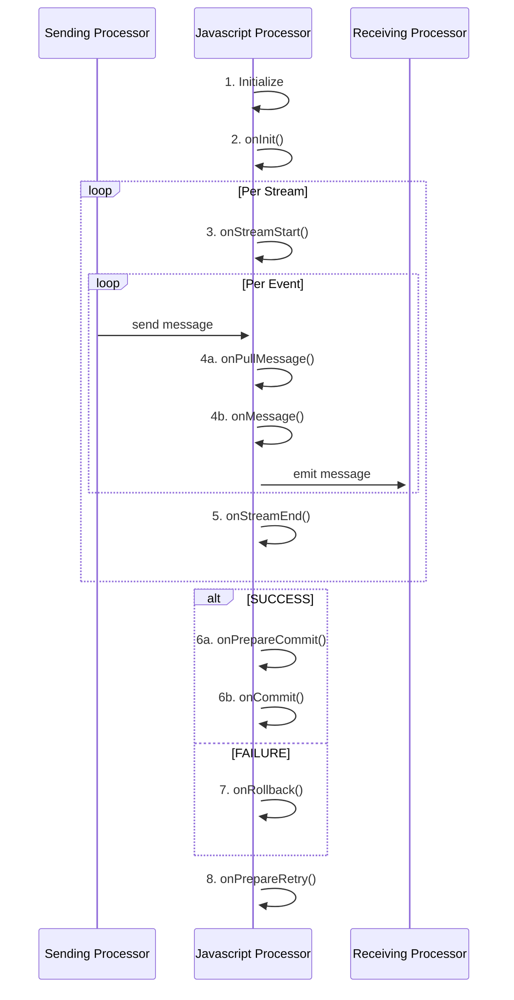

import FailureHandling from '../../snippets/assets/_failure-handling-flow.mdx';

## Introduction

In order to allow for complex message processing and applying custom business logic to message handling, layline.io
provides the [Javascript Asset](../../assets/processors-flow/asset-flow-javascript).
This asset enables you to apply theoretically any kind of scriptable logic when handling messages.

Popular examples are:

* Data analysis
* Enrichment
* Statistics gathering
* Complex mapping
* Filtering

and potentially anything you can imagine when handling data.

Using the Javascript Asset is not mandatory of course.
Many challenges you may be facing can be accomplished using the out-of-the-box Assets which layline.io provides without
resorting to Javascript.
But in many instances, an intermittent scripting processor inserted into a Workflow can go a long way in enabling you to
execute logic which would be otherwise hard to implement using pure UI elements.

On this page we will explain how to use Javascript with the Javascript Asset.

## Scope of Javascript language

layline.io embeds GraalVM using the Context API in order to facilitate Javascript scripting.

The GraalVM engine is an implementation of the ECMAScript Language Specification.
For further details and background visit this [page](https://github.com/oracle/graaljs/blob/master/docs/user/JavaScriptCompatibility.md).

_Limitations_: Using the Context API there might be limitations in using Javascript which can be found [here](https://www.graalvm.org/latest/reference-manual/js/Modules/).


If you want to get familiar with Javascript outside of layline.io, there are websites for Javascript tutorials available, like for instance
[W3Schools.com](https://www.w3schools.com/js/default.asp), to start getting familiar with Javascript.

## How it works - Lifecycle Hooks

Scripts within layline.io can only be executed using the **Javascript Asset**. In fact, that's its sole purpose.
You can use none, one or as many of these Assets within your Project and within the Project's configured Workflows.

Since layline.io is a reactive system, a Javascript Asset receiving a message automatically starts processing this
message with the underlying script you provided.
One of the key methods here is [onMessage](./API/classes/JavaScriptProcessor#onmessage):

")

Just like `onMessage` is a _hook_, the Javascript Asset provides a number of additional hooks which are automatically
invoked as part of a Javascript Asset's lifecycle.
A complete list of these hooks can be found in
the [JavaScript Processor Reference](./API/classes/JavaScriptProcessor).

The following sequence graph shows a typical lifecycle of a Javascript Processor:



**Let's explain:**

When a Workflow is instantiated as part of a Deployment (running on a Reactive Cluster), an instantiated Javascript
Processor runs through a number of stages:

**1. Initialize**

Anything defined on the global level (non-functions) get evaluated. This can be things like variable initialization,
getting an output port etc.
Use this to initialize global variables and constants for example:

```js
// Example
const OUTPUT_PORT = processor.getOutputPort('MyOutput');
let myVar = null;
let connection = null;
// etc ...
```

**2. onInit()**

layline.io then automatically invokes the [onInit()](./API/classes/JavaScriptProcessor#oninit) method.
This is a more contained area to perform initializations:

```js
// Example
export function onInit() {
    connection = services.MyDBService.openConnection();
    // etc ...
}
```

**3. onStreamStart()**

When a Workflow starts processing a Stream, a Workflow-wide Stream-start event is issued.
You can hook on to this event using the [onStreamStart()](./API/classes/JavaScriptProcessor#onstreamstart) Method.

```js
let filename;

export function onStreamStart() {
    filename = stream.getName();
    // etc ...
}
```

**4a. onPullMessage()**

In line with the reactive architecture of layline.io, if the framework is ready and needs to pull the next message from a source, it will invoke the `onPullMessage()` hook. At this point in time there is no message available for processing in the JavaScript Processor **yet**. It is merely a signal that the framework is ready to process the next message.

At this stage you can for example do preparations for the next message.

```js
export function onPullMessage() {
    // prepare for the next message
    if (!headerWasGenerated) {
        const headerMessage = dataDictionary.createMessage(dataDictionary.type.Header);
        headerMessage.data.PRODUCT = {
            RECORD_TYPE: "H",
            FILENAME: stream.getName()
        };
        // stream.logInfo(`headerMessage.data: ${JSON.stringify(headerMessage)}`);
        stream.emit(headerMessage, OUTPUT_PORT);
        headerWasGenerated = true;
    }
    // ...
}
```

In most of your processing logic you will not need to use the `onPullMessage()` hook, but rather use the `onMessage()` method.

**4b. onMessage()**

Every time Javascript Processor is fed with an event by an upstream Processor,
the [onMessage()](./API/classes/JavaScriptProcessor#onmessage) hook is invoked.
It is therefore central to message processing:

```js
// Get the output port
const OUTPUT_PORT = processor.getOutputPort('MyOutput');

export function onMessage() {
    if (message.typeName === 'Header') {
        // do nothing
    } else if (message.typeName === 'Trailer') {
        // do something with the trailer
    } else if (message.typeName === 'Detail') {
        // invoke a self-defined function which handles the message.
        handleDetail(message);
    }

    stream.emit(message, OUTPUT_PORT);
}

function handleDetail(detail) {
    // do something with the message
}
```

**5. onStreamEnd()**

Finally, when a Stream comes to an end,
the [onStreamEnd()](./API/classes/JavaScriptProcessor#onstreamend) hook is automatically called.
Write your code here for finalizing actions regarding the processing of a stream:

```js
export function onStreamEnd() {
    // Report in case some customer data could not be found during stream processing
    if (numCustomerDataNotFound > 0) {
        stream.logInfo(numCustomerDataNotFound + ' customers could not be found in the database.')
    }
}
```

**6a. onPrepareCommit()**

layline.io is transactional by default. This means that a Workflow will only commit if all the Assets in the Workflow have successfully completed.
The `onPrepareCommit()` hook is the first hook that is called when a stream is about to being committed.
This allows you to make final checks and preparations for the final commit, including sending out messages to the output port.

```js
export function onPrepareCommit() {
    // make final checks and preparations
    // ...
}
```

**6b. onCommit()**

The `onCommit()` hook is called when a stream is successfully committed.
This allows you to make final actions after the commit has been successful, including sending out messages to the output port.

```js
export function onCommit() {
    if (connection) {
        connection.commitTransaction();
        connection.closeConnection();
        connection = null;
    }
}
```

**7. onRollback()**

The `onRollback()` hook is called when a stream is requested to be rolled back.
This allows you to make final actions to perform a rollback, including potentially sending out messages to the output port.

```js
export function onRollback() {
    if (connection) {
        connection.rollbackTransaction();
        connection.closeConnection();
        connection = null;
    }
}
```

**8. onPrepareRetry()**

This hook is invoked when a stream is requested to be retried. 
This can happen in two ways:
1. An Asset has been configured to retry a stream on failure. An example would be a Input Asset which has a respective Failure Handling configured.
2. Within a Javascript or Python Processor a `stream.requestRetry()` method has been called.

In this case the `onPrepareRetry()` hook is invoked to allow you to make final checks and preparations for the retry.

```js
export function onPrepareRetry() {
    // make final checks and preparations
}
```

## Referencing and Reusing Scripts

### Introduction

Sometimes, you need the same functionality across multiple Scripts. This can be achieved by creating generic scripts containing 
general functions that can be (re)used in many other scripts.

### Creating a reusable script

")

Here we have created a file `util.js` (1) which contains one function which we want to reuse on other scripts (2).
You can write your script as you like. All you need to know is that it needs to be valid Javascript.

### Import functions from one script into another

There are different approaches on how to import reusable functions from generic scripts into other scripts: 

```js
// import one dedicated function from "utils.js"
import {getUtcTimeOffset} from '../utils.js';

// or: import multiple entities from external script
import {getUtcTimeOffset, myFunction2, myFunction3} from '../utils.js';

// or: import function with new name
import {getUtcTimeOffset as getUtc} from '../utils.js';

// or: import all available functions via alias name to reference them by alias
import * as utils from '../utils.js';

import {getUtcTimeOffset} from './utils.js'; // in case the script to be loaded is in the same directory as this script

import {getUtcTimeOffset} from '/src/main/javascript/utils.js'; // absolute path configuration

// ...

const offset = getUtcTimeOffset(dateA, dateB);

const secondOffset = getUtc(dateA, dateB);

const thirdOffset = utils.getUtcTimeOffset(dateA, dateB);
``` 


### Invalid import script path

layline.io will check for the existence of referenced scripts upon deployment.
If the script cannot be found, layline.io will show an error, and you have to correct the problem.

")


## Error handling

#### Unforced errors

Javascript is an interpreted language (not compiled). You can therefore encounter unforced errors at runtime.
Most of them show up when trying to start a Workflow containing a Javascript Processor.
In this case the Workflow will not start and the cause of error is displayed:

")

#### Forced errors

Forced errors occur when you deliberately throw an error at runtime:

```js
try {
    const insertResult = connection.MyInsert(
        {
            DeviceID: message.data.IOT.DEVICE_ID,
            Measurement: message.data.IOT.MEASUREMENT,
            Timestamp: message.data.IOT.TIMESTAMP
        }
    )
} catch (error) {
    closeConnection();
    throw error;
} finally {
    connection = null;
}

// OR
// throw "My individual error message: " + myMessage;  


```

Throwing an error which you do not catch yourself with a `try ... catch` clause, will be bubbled up.
For this purpose a Javascript Asset provides a number configuration options (which you will also find in other Asset
configurations):


<FailureHandling></FailureHandling>

## Summary

Using these principles, the usage of the Javascript Asset is straightforward.

You may wonder how big a Javscript should get, or how small.
Quick answer: It's really up to you.
It makes sense to split scripts into logical chunks and then potentially chain a number of scripts together in a
Workflow.
