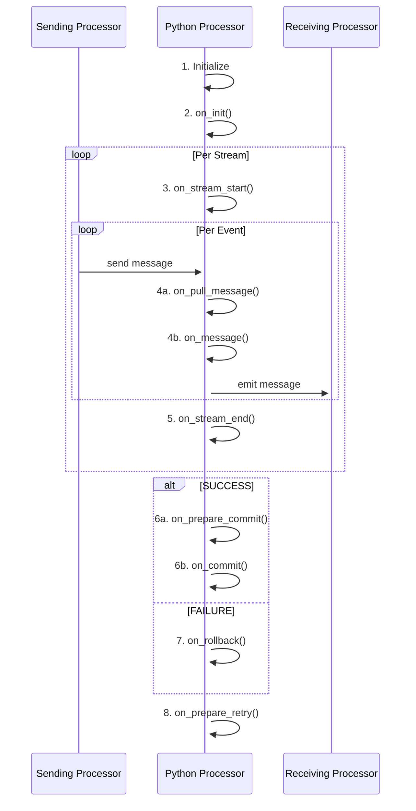

import FailureHandling from '../../snippets/assets/_failure-handling-flow.mdx';

## Introduction

In order to allow for complex message processing and applying custom business logic to message handling, layline.io
provides the [Python Asset](../../assets/processors-flow/asset-flow-python).
This asset enables you to apply theoretically any kind of scriptable logic when handling messages.

Popular examples are:

* Data analysis
* Enrichment
* Statistics gathering
* Complex mapping
* Filtering

and potentially anything you can imagine when handling data.

Using the Python Asset is not mandatory of course.
Many challenges you may be facing can be accomplished using the out-of-the-box Assets which layline.io provides without
resorting to Python.
But in many instances, an intermittent scripting processor inserted into a Workflow can go a long way in enabling you to
execute logic which would be otherwise hard to implement using pure UI elements.

On this page we will explain how to use Python with the Python Asset.

## Scope of Python language

layline.io embeds a Python runtime to facilitate Python scripting.

_Limitations_: There might be limitations in using Python which are specific to the layline.io environment. Please refer to the layline.io Python documentation for details.

If you want to get familiar with Python outside of layline.io, there are websites for Python tutorials available, like for instance
[Python.org](https://www.python.org/about/gettingstarted/), to start getting familiar with Python.

## How it works - Lifecycle Hooks

Scripts within layline.io can only be executed using the **Python Asset**. In fact, that's its sole purpose.
You can use none, one or as many of these Assets within your Project and within the Project's configured Workflows.

Since layline.io is a reactive system, a Python Asset receiving a message automatically starts processing this
message with the underlying script you provided.
One of the key methods here is [onMessage](./API/classes/PythonProcessor#onmessage):

")

Just like `onMessage` is a _hook_, the Python Asset provides a number of additional hooks which are automatically
invoked as part of a Python Asset's lifecycle.
A complete list of these hooks can be found in
the [Python Processor Reference](./API/classes/PythonProcessor).

The following sequence graph shows a typical lifecycle of a Python Processor:



**Let's explain:**

When a Workflow is instantiated as part of a Deployment (running on a Reactive Cluster), an instantiated Python
Processor runs through a number of **_lifecycle_** stages:

**1. Initialize**

On startup of the workflow instance, the Python Processor will be initialized.
This is the first stage of the lifecycle and only happens once per workflow instance.

Anything defined on the global level (non-functions) get evaluated. This can be things like variable initialization,
getting an output port and assign it to a constant etc.
Use this to initialize global variables and constants for example:

```python
# Example
OUTPUT_PORT = processor.getOutputPort('MyOutput')
my_var = None
connection = None
# etc ...
```

**2. on_init()**

layline.io then automatically invokes the `on_init()` method. Again, this is only called once per workflow instance on startup.
`on_init()` provides a more contained area to perform initializations:

```python
# Example
def on_init():
    global connection
    connection = services.MyDBService.openConnection()
    # etc ...
```

**3. on_stream_start()**

When a Workflow starts processing a Stream, a Workflow-wide Stream-start event is issued.
You can hook on to this event using the `on_stream_start()` Method.

```python
filename = None

def on_stream_start():
    global filename
    filename = stream.getName()
    # etc ...
```

**4a. on_pull_message()**

In line with the reactive architecture of layline.io, if the framework is ready and needs to pull the next message from a source, it will invoke the `on_pull_message()` hook. At this point in time there is no message available for processing in the Python Processor **yet**. It is merely a signal that the framework is ready to process the next message.

At this stage you can for example do preparations for the next message.

```python
def on_pull_message():
    global headerWasGenerated
    global OUTPUT_PORT

    # prepare for the next message
    if not headerWasGenerated:
        headerMessage = dataDictionary.createMessage(dataDictionary.type.Header)
        headerMessage.data.PRODUCT = {
            "RECORD_TYPE" : "H",
            "FILENAME"    : stream.getName()
        }
        # stream.logInfo(f"headerMessage.data: {headerMessage.toJson()}")
        stream.emit(headerMessage, OUTPUT_PORT)
        headerWasGenerated = True
    # ...
```

In most of your processing logic you will not need to use the `on_pull_message()` hook, but rather use the `on_message()` method.


**4b. on_message()**

Every time Python Processor is fed with a message by an upstream Processor, the `on_message()` hook is invoked.
It is therefore central to message processing and should be used to process the message:

```python
# Get the output port
OUTPUT_PORT = processor.getOutputPort('MyOutput')

def onMessage():
    if message.typeName === 'Header':
        # do nothing
    elif message.typeName === 'Trailer':
        # do something with the trailer
    elif message.typeName = 'Detail':
        # invoke a self-defined function which handles the message.
        handle_detail(message)

    stream.emit(message, OUTPUT_PORT)

def handle_detail(detail):
    # do something with the message
```

As you can see the current message is accessible via the global and reserved `message` variable which is an instance of the [`Message` class](./API/classes/Message).


**5. on_stream_end()**

Finally, when a Stream comes to an end (e.g. the end of an input file or database query), the `on_stream_end()` hook is automatically called.
Write your code here for finalizing actions regarding the processing of a stream:

```python
def on_stream_end():
    # Report in case some customer data could not be found during stream processing
    if num_customer_data_not_found > 0:
        stream.logInfo(f'{num_customer_data_not_found} customers could not be found in the database.')
```


**6a. on_prepare_commit()**

layline.io is transactional by default. This means that a Workflow will only commit if all the Assets in the Workflow have successfully completed.
The `on_prepare_commit()` hook is the first hook that is called when a stream is about to being committed.
This allows you to make final checks and preparations for the final commit, including sending out messages to the output port.


```python
def on_prepare_commit():
    # make final checks and preparations
    # ...
```


**6b. on_commit()**

The `on_commit()` hook is called when a stream is successfully committed.
This allows you to make final actions after the commit has been successful, including sending out messages to the output port.

```python
def on_commit():
    # make final actions after the commit
def on_rollback():
    global connection
    
    if connection:
        connection.commitTransaction();
        connection.closeConnection();
        connection = None
```

**7. on_rollback()**

The `on_rollback()` hook is called when a stream is requested to be rolled back.
This allows you to make final actions to perform a rollback, including potentially sending out messages to the output port.

```python
def on_rollback():
    global connection

    if connection:
        connection.rollbackTransaction();
        connection.closeConnection();
        connection = None
```


**8. on_prepare_retry()**

This hook is invoked when a stream is requested to be retried. 
This can happen in two ways:
1. An Asset has been configured to retry a stream on failure. An example would be a Input Asset which has a respective Failure Handling configured.
2. Within a Javascript or Python Processor a `stream.requestRetry()` method has been called.

In both cases the `on_prepare_retry()` hook is invoked to allow you to make final checks and preparations for the retry.

```python
def on_prepare_retry():
    # make final checks and preparations
```


## Referencing and Reusing Scripts

:::warning
python modules are not supported yet, but will be in an upcoming release.
Please contact support for more information.
:::


### Introduction

Sometimes, you need the same functionality across multiple Scripts. This can be achieved by creating generic scripts containing
general functions that can be (re)used in many other scripts.

### Creating a reusable script

")

Here we have created a file `util.py` (1) which contains one function which we want to reuse on other scripts (2).
You can write your script as you like. All you need to know is that it needs to be valid Python.

## Error handling

#### Unforced errors

Python is an interpreted language. You can therefore encounter unforced errors at runtime.
Most of them show up when trying to start a Workflow containing a Python Processor.
In this case the Workflow will not start and the cause of error is displayed:

")

#### Forced errors

Forced errors occur when you deliberately raise an error at runtime:

```python
try:
    insert_result = connection.MyInsert(
        {
            "DeviceID": message.data.IOT.DEVICE_ID,
            "Measurement": message.data.IOT.MEASUREMENT,
            "Timestamp": message.data.IOT.TIMESTAMP
        }
    )
except Exception as error:
    close_connection()
    raise error
finally:
    connection = None

# OR
# raise ValueError("My individual error message: " + my_message)
```

Raising an error which you do not catch yourself with a `try ... except` clause, will be bubbled up.
For this purpose a Python Asset provides a number configuration options (which you will also find in other Asset
configurations):


<FailureHandling></FailureHandling>

## Summary

Using these principles, the usage of the Python Asset is straightforward.

You may wonder how big a Python script should get, or how small.
Quick answer: It's really up to you.
It makes sense to split scripts into logical chunks and then potentially chain a number of scripts together in a
Workflow.
