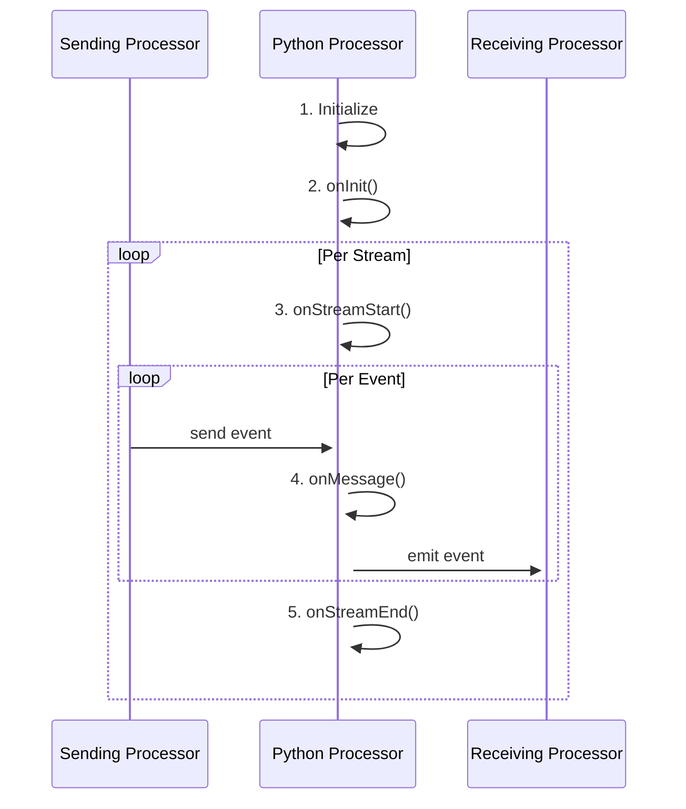
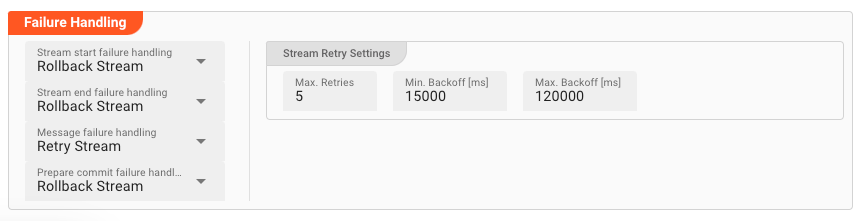

import FailureHandling from '../../snippets/assets/_failure-handling-flow.mdx';

## Introduction

In order to allow for complex message processing and applying custom business logic to message handling, layline.io
provides the [Python Asset](../../assets/processors-flow/asset-flow-python).
This asset enables you to apply theoretically any kind of scriptable logic when handling messages.

Popular examples are:

* Data analysis
* Enrichment
* Statistics gathering
* Complex mapping
* Filtering

and potentially anything you can imagine when handling data.

Using the Python Asset is not mandatory of course.
Many challenges you may be facing can be accomplished using the out-of-the-box Assets which layline.io provides without
resorting to Python.
But in many instances, an intermittent scripting processor inserted into a Workflow can go a long way in enabling you to
execute logic which would be otherwise hard to implement using pure UI elements.

On this page we will explain how to use Python with the Python Asset.

## Scope of Python language

layline.io embeds a Python runtime to facilitate Python scripting.

_Limitations_: There might be limitations in using Python which are specific to the layline.io environment. Please refer to the layline.io Python documentation for details.

If you want to get familiar with Python outside of layline.io, there are websites for Python tutorials available, like for instance
[Python.org](https://www.python.org/about/gettingstarted/), to start getting familiar with Python.

## How it works - Lifecycle Hooks

Scripts within layline.io can only be executed using the **Python Asset**. In fact, that's its sole purpose.
You can use none, one or as many of these Assets within your Project and within the Project's configured Workflows.

Since layline.io is a reactive system, a Python Asset receiving a message automatically starts processing this
message with the underlying script you provided.
One of the key methods here is [onMessage](./API/classes/PythonProcessor#onmessage):

")

Just like `onMessage` is a _hook_, the Python Asset provides a number of additional hooks which are automatically
invoked as part of a Python Asset's lifecycle.
A complete list of these hooks can be found in
the [Python Processor Reference](./API/classes/PythonProcessor).

The following sequence graph shows a typical lifecycle of a Python Processor:



**Let's explain:**

When a Workflow is instantiated as part of a Deployment (running on a Reactive Cluster), an instantiated Python
Processor runs through a number of stages:

**1. Initialize**

Anything defined on the global level (non-functions) get evaluated. This can be things like variable initialization,
getting an output port etc.
Use this to initialize global variables and constants for example:

```python
# Example
OUTPUT_PORT = processor.getOutputPort('MyOutput')
my_var = None
connection = None
# etc ...
```

**2. onInit()**

layline.io then automatically invokes the `onInit()` method.
This is a more contained area to perform initializations:

```python
# Example
def onInit():
    global connection
    connection = services.MyDBService.openConnection()
    # etc ...
```

**3. onStreamStart()**

When a Workflow starts processing a Stream, a Workflow-wide Stream-start event is issued.
You can hook on to this event using the `onStreamStart()` Method.

```python
filename = None

def onStreamStart():
    global filename
    filename = stream.getName()
    # etc ...
```

**4. onMessage()**

Every time Python Processor is fed with an event by an upstream Processor,
the `onMessage()` hook is invoked.
It is therefore central to message processing:

```python
# Get the output port
OUTPUT_PORT = processor.getOutputPort('MyOutput')

def onMessage():
    if message.typeName === 'Header':
        # do nothing
        pass
    elif message.typeName === 'Trailer':
        # do something with the trailer
        pass
    elif message.typeName = 'Detail':
        # invoke a self-defined function which handles the message.
        handle_detail(message)

    stream.emit(message, OUTPUT_PORT)

def handle_detail(detail):
    # do something with the message
    pass
```

**5. onStreamEnd()**

Finally, when a Stream comes to an end,
the `onStreamEnd()` hook is automatically called.
Write your code here for finalizing actions regarding the processing of a stream:

```python
def onStreamEnd():
    # Report in case some customer data could not be found during stream processing
    if num_customer_data_not_found > 0:
        stream.logInfo(f'{num_customer_data_not_found} customers could not be found in the database.')
```

## Referencing and Reusing Scripts

### Introduction

Sometimes, you need the same functionality across multiple Scripts. This can be achieved by creating generic scripts containing
general functions that can be (re)used in many other scripts.

### Creating a reusable script

")

Here we have created a file `util.py` (1) which contains one function which we want to reuse on other scripts (2).
You can write your script as you like. All you need to know is that it needs to be valid Python.

### Import functions from one script into another

There are different approaches on how to import reusable functions from generic scripts into other scripts:

```python
# import one dedicated function from "utils.py"
from utils import get_utc_time_offset

# or: import multiple entities from external script
from utils import get_utc_time_offset, my_function2, my_function3

# or: import function with new name
from utils import get_utc_time_offset as get_utc

# or: import all available functions via alias name to reference them by alias
import utils

from utils import get_utc_time_offset  # in case the script to be loaded is in the same directory as this script

from src.main.python.utils import get_utc_time_offset  # absolute path configuration

# ...

offset = get_utc_time_offset(date_a, date_b)

second_offset = get_utc(date_a, date_b)

third_offset = utils.get_utc_time_offset(date_a, date_b)
``` 

### Invalid import script path

layline.io will check for the existence of referenced scripts upon deployment.
If the script cannot be found, layline.io will show an error, and you have to correct the problem.

")

## Error handling

#### Unforced errors

Python is an interpreted language. You can therefore encounter unforced errors at runtime.
Most of them show up when trying to start a Workflow containing a Python Processor.
In this case the Workflow will not start and the cause of error is displayed:

")

#### Forced errors

Forced errors occur when you deliberately raise an error at runtime:

```python
try:
    insert_result = connection.MyInsert(
        {
            "DeviceID": message.data.IOT.DEVICE_ID,
            "Measurement": message.data.IOT.MEASUREMENT,
            "Timestamp": message.data.IOT.TIMESTAMP
        }
    )
except Exception as error:
    close_connection()
    raise error
finally:
    connection = None

# OR
# raise ValueError("My individual error message: " + my_message)
```

Raising an error which you do not catch yourself with a `try ... except` clause, will be bubbled up.
For this purpose a Python Asset provides a number configuration options (which you will also find in other Asset
configurations):



<FailureHandling></FailureHandling>

## Summary

Using these principles, the usage of the Python Asset is straightforward.

You may wonder how big a Python script should get, or how small.
Quick answer: It's really up to you.
It makes sense to split scripts into logical chunks and then potentially chain a number of scripts together in a
Workflow.
