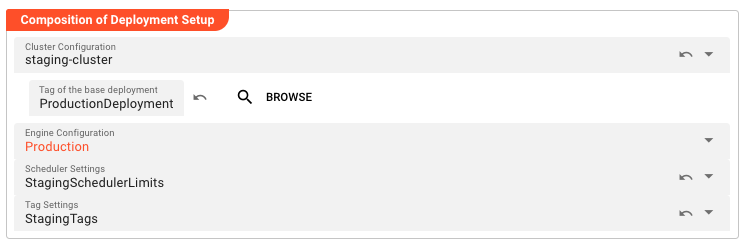
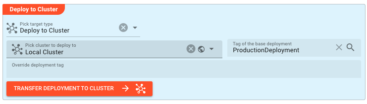
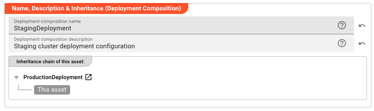
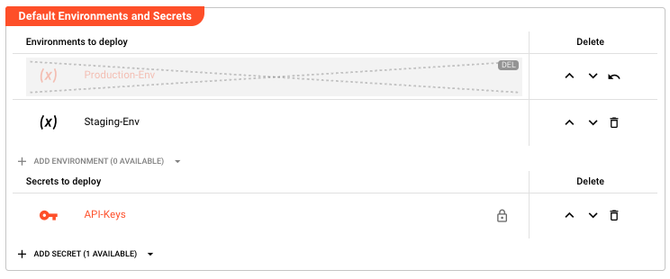

import NameAndDescription from '../../snippets/assets/_asset-name-and-description.md';

# Deployment Composition

> A Deployment Composition groups Cluster, Engine Configuration, Scheduler Settings, and Tag Settings into a single deployable unit.

## Purpose

Think of a Deployment Composition as the "deployment blueprint" for your layline.io project. In complex data processing environments, you typically need to manage multiple configurations: where to deploy (cluster), what to deploy (workflows and resources), how much resource to allocate (scheduler limits), and how to organize deployments (tags). Rather than managing these as separate concerns every time you deploy, the Deployment Composition brings them together into one cohesive, versionable, and reusable package.

A Deployment Composition lets you define a complete deployment scenario once — specifying the target cluster, engine configuration, scheduling policies, and environment variables — and then reuse it reliably across development, staging, and production environments.

Inheritance is the other key concept. Deployment Compositions can extend other compositions, allowing you to create a hierarchy of deployment configurations. For example, you might have a `ProductionDeployment` that defines your production cluster, engine configuration, and resource limits. Your `StagingDeployment` can inherit from it, automatically getting all those base settings while only overriding what's different (like the target cluster and perhaps more relaxed scheduling limits). This eliminates duplication and ensures consistency — when you update the base production configuration, all inherited deployments automatically reflect those changes.

You can deploy a Deployment Composition directly to a running cluster for immediate execution, or export it to a file for offline deployment, auditing, or distribution to air-gapped environments.

## Prerequisites

Before creating a Deployment Composition, you need:

- A [**Cluster**](./asset-deployment-cluster.md) asset (if deploying to a cluster)
- An [**Engine Configuration**](./asset-deployment-engine.md) asset
- (Optional) A [**Scheduler Settings**](./asset-deployment-scheduler.md) asset for advanced scheduling control
- (Optional) A [**Tag Settings**](./asset-deployment-tag.md) asset for deployment tagging

## Configuration

### Deploy to Cluster

This section is where you define the delivery mechanism for your deployment. The key decision here is whether you're deploying directly to a running cluster (immediate execution) or exporting to a file (for later use, auditing, or transfer to another environment).

**Pick target type** — This determines how the deployment will be delivered:

| Option | When to Use |
|--------|-------------|
| Deploy to Cluster | Choose this when you have a running layline.io cluster and want to deploy immediately. The deployment is transferred directly to the cluster and stored in the Deployment Store for further activation. |
| Write to File | Choose this when you need to export the deployment for manual distribution, version control, deployment to air-gapped environments, or auditing purposes. |

When *Deploy to Cluster* is selected, you specify:

**Pick cluster to deploy to** — Select from available clusters. Clusters can be defined globally (shared across projects) or locally (project-specific). The cluster defines the connection endpoint where your deployment will run.

**Tag of the base deployment** — This is the inheritance hook. By specifying a base deployment tag here, you indicate that this deployment should inherit all settings from that parent deployment. This is how you build deployment hierarchies — the parent defines the common configuration, and this deployment only specifies what differs.

**Override deployment tag** — Normally, deployments are identified by the deployment tag in the Engine Configuration. Use this field if you need to assign a custom tag for identification, filtering, or organizational purposes overriding the Engine Configuration tag.

### Name & Description

<NameAndDescription></NameAndDescription>

### Composition of Deployment Setup

This section is the heart of the Deployment Composition — it's where you assemble the building blocks that define how your workflows will run. Think of it as specifying the "runtime environment" for your data processing.

**Cluster Configuration** — This connects your deployment to a specific cluster asset. The cluster defines the physical or virtual infrastructure where your workflows will execute — the Reactive Engines that will process your data. By making this inheritable, you can have multiple deployment compositions targeting different clusters (staging vs. production) while sharing other configuration.

When a cluster is selected, the **Tag of the base deployment** field appears, allowing you to reference a parent deployment within that same cluster context. This creates the inheritance chain.

**Engine Configuration** — This is arguably the most important component. The Engine Configuration defines which workflows are part of this deployment and how they're configured at runtime. It answers questions like: Which workflows should be active? What are their processing parameters? What resources do they need? Multiple Deployment Compositions can reference the same Engine Configuration, or they can each have their own.

**Scheduler Settings** — These settings control the resource allocation and scheduling policies for your deployment. They define limits on CPU, memory, and thread usage, as well as node assignment policies. Different environments often need different scheduling constraints — production might have strict limits to ensure stability, while development might have more relaxed settings.

**Tag Settings** — Tags are metadata labels applied to deployed workflows for organization, filtering, and management. The Tag Settings asset defines which tags should be applied to workflows deployed through this composition.

### Default Environments and Secrets

Environment Assets and Secret Assets provide the configuration data and credentials that your workflows need at runtime. This section defines which of these assets are bundled into the deployment.

The philosophy here is **separation of concerns**: your workflows define *how* to process data, while environments and secrets define *what* resources to use (database connections, API endpoints, credentials). By separating these, you can deploy the same workflow logic to different environments (dev, staging, prod) simply by changing which Environment and Secret Assets are included.

#### Environments to deploy

Environment Assets contain configuration values as key-value pairs. These values are injected into your workflows at runtime. Typical uses include database connection strings, API base URLs, feature flags, and tuning parameters.

Multiple Environment Assets can be selected, and their variables are merged. If the same key exists in multiple environments, the value from the later (lower) asset in the list takes precedence. This allows for layering — for example, a base environment with common settings, overlaid with an environment-specific one that overrides certain values.

- Click **Add Environment** to select from available Environment Assets
- Each asset shows its name and description for identification
- Inherited environments appear marked as such and can be reset to parent values
- Reorder environments using the up/down buttons — order matters for variable precedence

For details on creating and managing Environment Assets, see [Environment Asset](../workflow-assets/resources/asset-resource-environment.md).

#### Secrets to deploy

Secret Assets contain sensitive data like passwords, API keys, tokens, and certificates. They are encrypted at rest and decrypted only at runtime using the target cluster's keys. This ensures credentials are never exposed in plain text during config, transit or storage.

Secrets work similarly to environments — you can select multiple, reorder them, and inherit them from parent deployments. The encryption ensures that even if someone gains access to the deployment file or the project, they cannot extract the actual secret values, unless the private key is stored in the project (which is not recommended for production secrets). 

- Click **Add Secret** to select from available Secret Assets
- Each asset shows its name, description, and encryption status
- Inherited secrets appear marked and can be reset to parent values
- Reorder secrets using the up/down buttons

For details on creating and managing Secret Assets, see [Secret Asset](../workflow-assets/resources/asset-resource-secret.md).

## Behavior

### Inheritance

Inheritance in Deployment Compositions works on a field-by-field basis. When you specify a parent deployment via the **Tag of the base deployment** field, the system looks at each configurable field:

1. If the field is explicitly set in the child deployment, that value is used
2. If the field is not set (or is reset to "inherit"), the parent's value is used
3. This applies to all inheritable fields: Cluster Configuration, Engine Configuration, Scheduler Settings, Tag Settings, and the lists of Environments and Secrets

This creates a powerful pattern for managing deployment variants. You define your "golden" production deployment with all the correct settings, then create staging, QA, and development deployments that inherit from it, only overriding the specific fields that need to differ (like the target cluster).

The UI visually indicates inherited fields, showing both the inherited value and the option to override it. This makes it clear what's being inherited versus what's explicitly configured.

### Deployment Execution

When you initiate a deployment:

1. The system resolves all inheritance — final values are computed by merging parent and child settings
2. All referenced assets (Engine Configuration, Environments, Secrets, etc.) are collected and packaged
3. If deploying to a cluster, the package is transferred to the target cluster's deployment endpoint
4. The cluster validates the deployment, decrypts secrets using its keys, and adds the deployment to its Deployment Store.
5. If exporting to a file, the package is serialized to the specified file path

The deployment is atomic — either all components deploy successfully, or the operation fails with no partial changes applied.

## Example

**Basic deployment to a production cluster:**

| Field | Value |
|-------|-------|
| Name | `ProductionDeployment` |
| Target Type | Deploy to Cluster |
| Cluster | `prod-cluster-01` |
| Engine Configuration | `ProductionEngine` |
| Scheduler Settings | `ProdSchedulerLimits` |
| Environments | `Production-Env` |
| Secrets | `API-Keys` |

**Inherited deployment for staging:**

| Field | Value |
|-------|-------|
| Name | `StagingDeployment` |
| Target Type | Deploy to Cluster |
| Cluster | `staging-cluster` |
| Tag of the base deployment | `ProductionDeployment` |
| Engine Configuration | *(inherited from ProductionDeployment)* |
| Scheduler Settings | `StagingSchedulerLimits` |
| Environments | `Staging-Env` (inherited `Production-Env` is overridden/reordered) |
| Secrets | *(inherited from ProductionDeployment)* |

In this example, `StagingDeployment` inherits the Engine Configuration and Secrets from `ProductionDeployment` but uses a different cluster, different scheduler settings (perhaps more relaxed limits for testing), and a different environment configuration. If the production Engine Configuration is updated, staging automatically gets those changes on its next deployment.

## See Also

- [**Cluster**](./asset-deployment-cluster.md) — Defines connection to a layline.io cluster
- [**Engine Configuration**](./asset-deployment-engine.md) — Defines workflows and runtime configuration
- [**Scheduler Settings**](./asset-deployment-scheduler.md) — Defines resource limits and scheduling policies
- [**Tag Settings**](./asset-deployment-tag.md) — Defines deployment tagging rules
