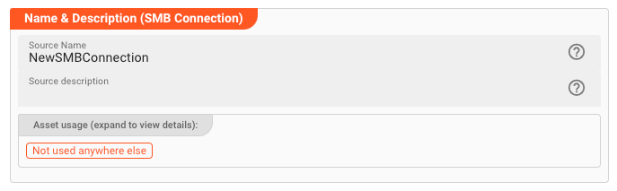
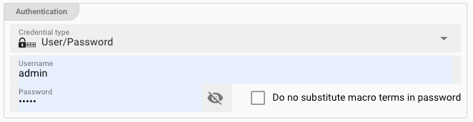
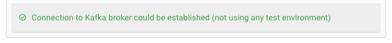
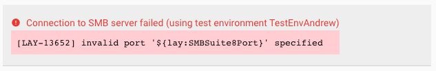

import NameAndDescription from '../../../snippets/assets/_asset-name-and-description.md';
import RequiredRoles from '../../../snippets/assets/_asset-required-roles.md';

# SMB Connection

Use the **SMB Connection** asset to connect to Windows file shares (SMB/CIFS) from your workflows.
Once configured, this connection can be used by an [SMB Source](../sources/asset-source-smb.md) to read files or an [SMB Sink](../sinks/asset-sink-smb.md) to write them.

## Prerequisites

- Network reachability from the layline.io Configuration Server to the SMB host
- Valid credentials (username/password or username/secret) for the share

---

## Step 1: Name and Describe the Asset

<NameAndDescription></NameAndDescription>

<RequiredRoles></RequiredRoles>

---

## Step 2: Configure SMB Settings

Enter the connection details for your SMB server.

| Field | Description |
|-------|-------------|
| **Host** | SMB share computer name, hostname, or IP address. |
| **Port** | IP port. Common values are `139` (NetBIOS) or `445` (Direct SMB over TCP). |
| **Domain** | Optional Windows domain name. |
| **Max. parallel SMB commands** | Number of concurrent SMB operations allowed. Increase this when the same connection is shared across multiple sources or sinks to improve throughput. |

### Authentication

Choose one of two authentication methods.

#### Username and Password

| Field | Description |
|-------|-------------|
| **Credential Type** | Select `User/Password`. |
| **Username** (_macro supported_) | Your SMB username. |
| **Password** (_macro supported_) | Your SMB password. |
| **Do not substitute macro terms in password** | Check if your password literally contains `${...}` and you do **not** want it treated as a macro. |

#### Username and Secret

| Field | Description |
|-------|-------------|
| **Credential Type** | Select `User/Secret`. |
| **Username** (_macro supported_) | Your SMB username. |
| **Secret** | Choose a secret from the drop-down. If the list is empty, [create a secret](../resources/asset-resource-secret.md) first. |

:::tip About Secrets
For details on how secrets are stored and managed, see [Secret Management](../../../concept/advanced/secret-management.md).
:::

---

## Connection Test

As you enter settings, layline.io continuously attempts to connect to the SMB server.
The result appears at the bottom of the settings panel:

| Status | Appearance |
|--------|------------|
| **Success** |  |
| **Failure** |  |

Hover over a red error message to see the full details — this usually points directly to the problem (wrong host, invalid port, authentication failure, etc.).

:::info How the test works
- The test is **not** run from your web browser. The Configuration Server performs the test from the server side.
- If you see a connection error, verify that the Configuration Server can reach the SMB host (firewall rules, DNS, routing).
- A successful test here **does not guarantee** that the Reactive Engine can connect at runtime. The engine running your workflow must also have network access to the SMB host.
:::
