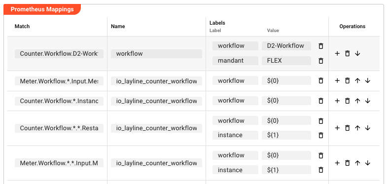

import NameAndDescription from '../../../snippets/assets/_asset-name-and-description.md';
import RequiredRoles from '../../../snippets/assets/_asset-required-roles.md';

# Extension Prometheus

## Purpose

Exports layline.io processing metrics to Prometheus. The Prometheus Extension maps internal metric names (defined by your workflow configuration) to the names under which Prometheus will expose them.

Metrics are named using dot notation — all layline.io metric names start with `Counter.` (e.g., `Counter.Source.MySource.Files`). Prometheus converts these dots to underscores in the exported metric name. For example:

```
Counter.Source.MySource.Files  →  io_layline_counter_source_mysource_files
```

The Prometheus Extension is assigned to a [Project](/docs/concept/projects-workflows/project) or an [Engine Configuration](../../deployment-assets/asset-deployment-engine.md) to enable metric export.

:::tip See Also
For a full list of available default metrics and how to configure Prometheus + Grafana, see [Gathering Statistics through Metrics](../../../concept/advanced/prometheus-extension.md).
:::

## This Asset can be used by:

| Asset type | Link |
|---|---|
| Projects | [Project](/docs/concept/projects-workflows/project) |
| Deployment | [Engine Configuration](../../deployment-assets/asset-deployment-engine.md) |

## Configuration

### Name & Description

<NameAndDescription></NameAndDescription>

### Required Roles

<RequiredRoles></RequiredRoles>

### Prometheus Mappings

A table of mapping rules. Each row defines how one internal metric is named and labelled when exported to Prometheus.

| Column | Description |
|--------|-------------|
| **Match** | A regex pattern that matches the internal metric name to export (e.g., `Counter.Source.*.Files`) |
| **Name** | The name under which Prometheus will expose this metric (e.g., `io_layline_counter_source_files`) |
| **Labels** | One or more key–value label pairs that add dimensions to the exported metric, making it filterable in Prometheus queries |
| **Operations** | Action buttons per row: add a label, delete the mapping, reorder with up/down arrows |



**How Match works:** The regex is evaluated against the full internal metric name. Use `*` as a wildcard to match any segment. The first matching row wins — ordering matters when multiple patterns could match the same metric.

**How Labels work:** Labels are key–value pairs (Label Name → Label Value). The Label Name is a static string. The Label Value can be:

* A **static string** — the same label value is applied to every matching metric (e.g., `FLEX` in the screenshot above)
* A **wildcard placeholder** — `${N}` references the wildcard segment at position `N` in the Match pattern, where `${0}` is the first `*`, `${1}` is the second `*`, and so on. The placeholder is resolved at export time using the actual metric name that matched.

**Example of placeholder resolution:**

Given a Match of `Counter.Workflow.(*).(*).*` with labels `workflow=${0}` and `instance=${1}`:

* For metric `Counter.Workflow.OrderProcessing.Inst1.Files` the exported label values would be: `workflow=OrderProcessing`, `instance=Inst1`
* For metric `Counter.Workflow.Billing.Inst2.Files` the exported label values would be: `workflow=Billing`, `instance=Inst2`

The `${0}` placeholder captures the first wildcard segment (between the start and the first `*`), and `${1}` captures the second.

Press **Add Mapping** to add a new row. Press **+** in the Operations column of a row to add label pairs to that mapping.

## Example

Export the file count metric for a source named `OrderFileSource`, adding a label so the metric can be filtered by source name in Prometheus.

**Match (regex):**
```
Counter.Workflow.(*).(*).Input.Messages
```

**Name:**
```
io_layline_counter_workflow_input_messages
```

**Labels:**
| Label Name | Label Value | Meaning |
|------------|-------------|---------|
| `workflow` | `${0}` | First wildcard segment → workflow name |
| `instance` | `${1}` | Second wildcard segment → instance name |

**Placeholder resolution:** For the metric `Counter.Workflow.OrderProcessing.Inst1.Input.Messages`, the placeholders resolve to `workflow=OrderProcessing` and `instance=Inst1`. The exported Prometheus metric becomes:

```
io_layline_counter_workflow_input_messages{workflow="OrderProcessing",instance="Inst1"}
```

In contrast, a **static label value** (e.g., `mandant=FLEX`) applies the same value to every metric that matches — useful for tagging all exports from this Prometheus Extension with an environment or owner identifier.

**What this enables in Prometheus:**

* Query all workflow input messages: `io_layline_counter_workflow_input_messages`
* Filter by workflow name: `io_layline_counter_workflow_input_messages{workflow="OrderProcessing"}`
* Plot over time in Grafana

**Export URL:** Metrics are available at `http://<engine-host>:5842/engine/prometheus` once the Extension is assigned to a Project or Engine Configuration.
