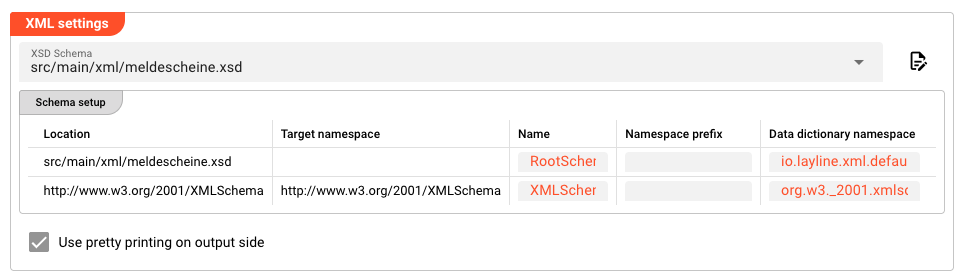
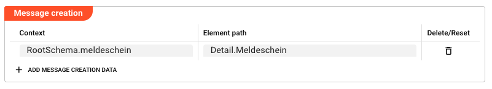
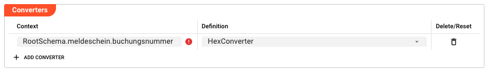

import WipDisclaimer from '../../../snippets/common/_wip-disclaimer.md'

# XML Format

## Purpose

Define an XML data format based on an XSD schema. The XSD schema is parsed to extract type information, and each schema type is mapped to a corresponding entry in the layline.io Data Dictionary.

Formats defined this way may be used to both read and write XML data. The format can be attached to:

- [Stream Input](../processors-input/asset-input-stream) / [Stream Output](../processors-output/asset-output-stream)
- [Frame Input](../processors-input/asset-input-frame) / [Frame Output](../processors-output/asset-output-frame)

The editor enables you to:

1. **Select** an XSD schema file from the project (see [XSD Schema](#xsd-schema) below).
2. **Override** namespace and naming settings per schema element (see [Schema setup](#schema-setup) below).
3. **Configure** how XML elements map to layline.io messages (see [Message Creation](#message-creation) below).
4. **Apply** pre-defined converters to transform data during parsing/serialization (see [Converters](#converters) below).
5. **Test** the format with sample XML data in edit mode.

## Configuration

### Name & Description

* **`Name`** : Name of the Asset. Spaces are not allowed in the name.

* **`Description`** : Enter a description.

The **`Asset Usage`** box shows how many times this Asset is used and which parts are referencing it.
Click to expand and then click to follow, if any.

### XSD Schema

* **`XSD Schema`** : Select the XSD schema file from the project.

XSD schema files are managed as regular source files in the project. To add an XSD schema to your project:

1. Go to the **Sources** tab of your project.
2. Add a new **Script** source file with the `.xsd` extension.
3. Paste or upload your XSD schema content into the file.
4. The schema will then appear in the **`XSD Schema`** dropdown in this editor.

Once selected, the schema is parsed to extract type information and populate the [Schema setup](#schema-setup) table.

### Schema setup

The Schema setup table lists all schema types discovered in the XSD. For each schema location, you can override how it is mapped into layline.io.

| Column | Description |
|--------|-------------|
| **Location** | Schema location identifier (read-only). Determined by the XSD file path. |
| **Target Namespace** | The target namespace of this schema (read-only). Set by the XSD. |
| **Name** | Override the display name used for this schema in layline.io. Leave empty to use the default from the schema. |
| **Namespace Prefix** | Override the XML namespace prefix used when serializing. Leave empty to use the default. |
| **Data Dictionary Namespace** | Override the Data Dictionary namespace for types from this schema. Leave empty to use the default. |

The table is populated automatically from the selected XSD. Only rows where you have explicitly added an override are persisted — empty rows are informational only.

Click **Add Schema Override** to add an override entry for a specific schema location.

### Use pretty printing on output side

* **`Use pretty printing on output side`** : When enabled, XML output is formatted with indentation and line breaks for readability. When disabled, XML is output as a single line. This applies only on the output side.

### Message Creation

Message Creation defines how XML elements from the schema map to layline.io message structures. Each entry connects a schema context to an internal message path.

| Column | Description |
|--------|-------------|
| **Context** | The XML element or type name from the XSD schema (e.g., `RootSchema.meldeschein`). |
| **Element path** | The path in the layline.io message structure where this element's data will be accessible (e.g., `Detail.Meldeschein`). |

Click **Add Message Creation Data** to add a new mapping entry.

### Converters

Converters transform data during XML parsing and serialization. They are applied to specific XML elements or types defined in the schema.

:::tip
Converters are **pre-defined conversion types** (not custom scripts). For example:
- `HexConverter` — converts hexadecimal string representation to binary and vice versa
- `BCDConverter` — converts Binary-Coded Decimal representation to binary and vice versa
:::

| Column | Description |
|--------|-------------|
| **Context** | The XML element or type name from the XSD schema to which this converter applies (e.g., `RootSchema.meldeschein.buchungsnummer`). |
| **Definition** | The converter type. Select from the list of available pre-defined converters. |

Click **Add Converter** to add a new converter entry.

For more on using formats in processors, see [Stream Input](../processors-input/asset-input-stream) and [Frame Input](../processors-input/asset-input-frame).

---

<WipDisclaimer></WipDisclaimer>
