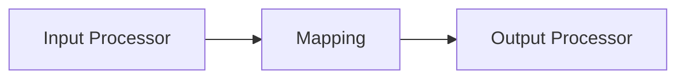
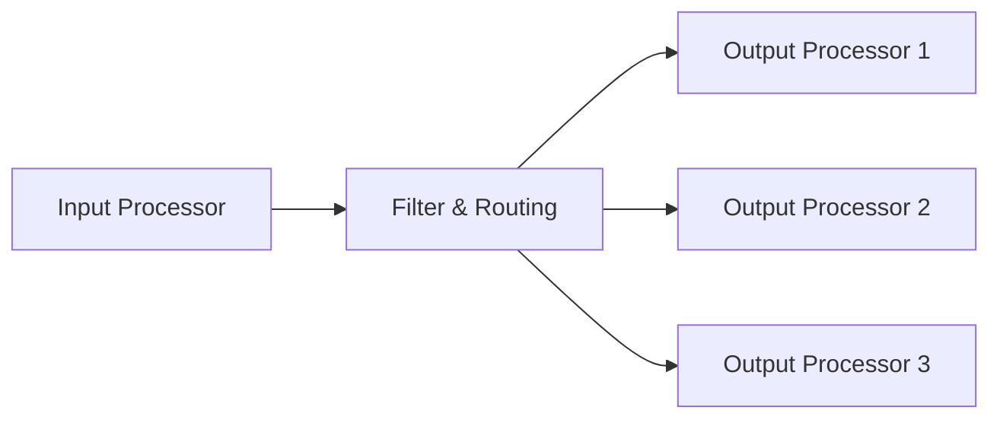
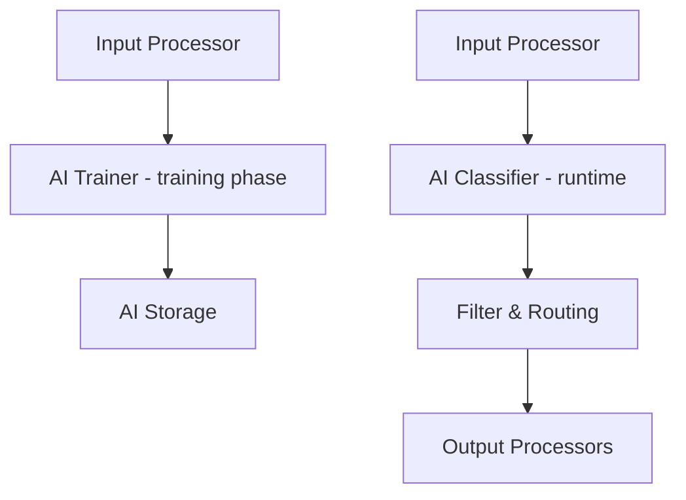
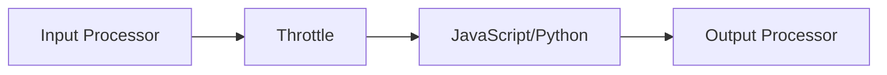

# Flow Processors

> Flow Processors are the transformation and routing layer of your Workflow. They sit between Input and Output Processors, applying business logic, data transformations, AI/ML operations, and flow control to messages as they move through the pipeline.

## Overview

In layline.io, **Flow Processors** are where the core processing happens. While [Input Processors](../processors-input/) bring data into the system and [Output Processors](../processors-output/) send data out, Flow processors handle everything in between:

- **Transforming** message content from one format to another
- **Routing** messages to different paths based on their content
- **Enriching** data with additional context or calculations
- **Filtering** out unwanted messages
- **Applying AI/ML models** for classification and prediction
- **Controlling flow** with throttling, batching, and boundary detection

Flow Processors can be chained together in any order to create sophisticated processing pipelines that match your business requirements.

## Available Flow Processors

### AI & Machine Learning

Processors for training and applying machine learning models to your message streams.

| Processor | Description |
|-----------|-------------|
| [AI Classifier](./asset-flow-ai-classifier) | Classify messages using trained AI models. Applies supervised learning models to predict categories, detect patterns, or make decisions based on message attributes. |
| [AI Trainer](./asset-flow-ai-trainer) | Train AI models from your message data. Collects training datasets from live message streams and trains classification models using the Weka library. |

### Data Transformation

Processors for modifying, mapping, and enriching message content.

| Processor | Description |
|-----------|-------------|
| [Mapping](./asset-flow-mapping) | Map fields from one format to another using visual mapping rules. Transform data structures without writing code using the built-in mapping UI with Intellisense support. |
| [JavaScript](./asset-flow-javascript) | Add custom logic with JavaScript. Write scripts to transform, filter, enrich, or route messages using the full power of JavaScript and the layline.io API. |
| [Python](./asset-flow-python) | Add custom logic with Python. Write Python scripts to process messages, integrate with external systems, or perform complex data manipulations. |

### Routing & Flow Control

Processors for directing message flow and managing stream behavior.

| Processor | Description |
|-----------|-------------|
| [Filter & Routing](./asset-flow-filterrouting) | Filter unwanted messages and route based on content. Define simple routing rules in the UI to control which messages continue and where they go. |
| [Stream Boundary](./asset-flow-streamboundary) | Split continuous streams into discrete chunks. Define conditions to group consecutive messages into bounded streams for batch processing or file output. |
| [Throttle](./asset-flow-throttle) | Control processing speed and rate limiting. Slow down message processing to prevent overloading downstream systems or external APIs. |

### Message Queue Integration

Processors for managing message queue semantics and delivery guarantees.

| Processor | Description |
|-----------|-------------|
| [Input Frame Committer](./asset-flow-input-frame-committer) | Finalize message processing for queue-based sources. Commits or acknowledges messages from SQS, Kafka, and other queue sources after successful processing. |

## How to Choose a Flow Processor

| If you need to... | Use this Processor |
|-------------------|-------------------|
| Transform data formats visually | [Mapping](./asset-flow-mapping) |
| Write custom transformation logic | [JavaScript](./asset-flow-javascript) or [Python](./asset-flow-python) |
| Route messages based on conditions | [Filter & Routing](./asset-flow-filterrouting) |
| Classify messages with AI | [AI Classifier](./asset-flow-ai-classifier) |
| Train a custom AI model | [AI Trainer](./asset-flow-ai-trainer) |
| Split streams into batches | [Stream Boundary](./asset-flow-streamboundary) |
| Rate-limit message flow | [Throttle](./asset-flow-throttle) |
| Commit processed queue messages | [Input Frame Committer](./asset-flow-input-frame-committer) |

## Common Flow Patterns

### Simple Transformation Pipeline

### Conditional Routing

### AI-Powered Classification

### Rate-Limited Custom Processing

## See Also

- [**Input Processors**](../processors-input/) — Bring data into your Workflows from external sources
- [**Output Processors**](../processors-output/) — Send processed data to Sinks
- [**Sources**](../sources/) — Connection endpoints for reading data
- [**Sinks**](../sinks/) — Connection endpoints for writing data
- [**Workflows**](../workflows/) — Orchestrate Processors into complete processing pipelines
