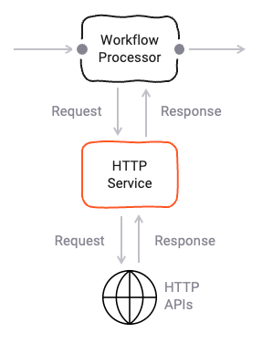
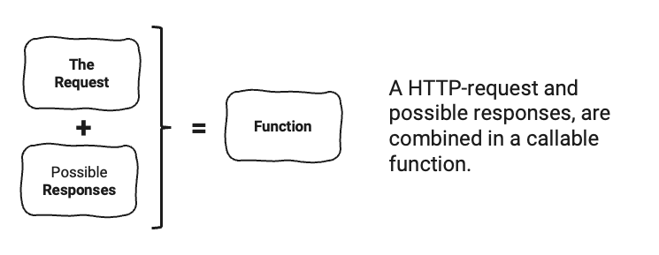
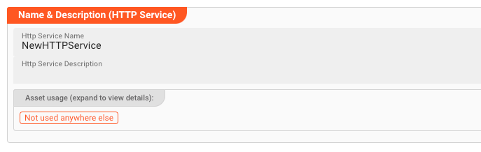
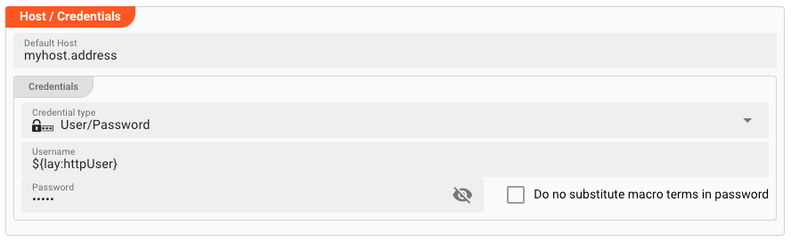
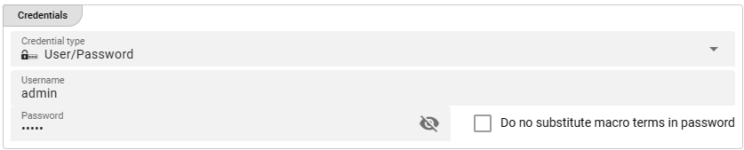
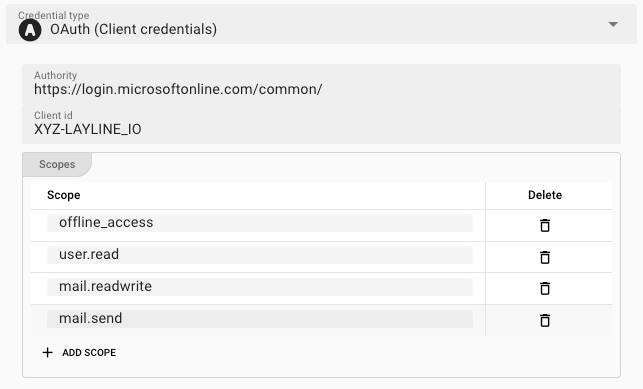
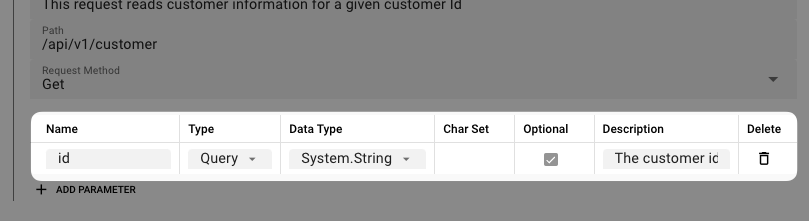
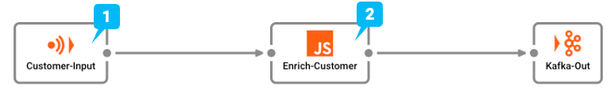

import WipDisclaimer from '../../../snippets/common/_wip-disclaimer.md'
import RequiredRoles from '../../../snippets/assets/_asset-required-roles.md';
import CredentialType from '../../../snippets/assets/_credential-type.md';
import Testcase from '../../../snippets/assets/_asset-service-test.md';
import Tabs from '@theme/Tabs';
import TabItem from '@theme/TabItem';
import DataDictionaryCard from '../../../snippets/assets/data-dictionary-card.md';

# HTTP Service

Use the **HTTP Service** asset to call REST APIs from within your workflows.
It lets you define reusable API operations—complete with authentication, request parameters, and response handling—that you can invoke from a JavaScript or Python processor.



**Typical use cases:**

- Fetching reference data from an external API to enrich records
- Posting processed events to a third-party system
- Triggering webhooks or callbacks

---

## What You'll Configure

An HTTP Service is built from three pieces:

1. **Requests** — define the URL, HTTP method, and parameters for each API call
2. **Responses** — describe what the API returns (success and error cases)
3. **Functions** — bundle a Request with its possible Responses into a callable operation you use in code



---

## Step 1: Name and Describe the Asset



| Field | Description |
|-------|-------------|
| **Name** | Asset identifier. No spaces allowed. |
| **Description** | Optional summary of what this service connects to. |
| **Asset Usage** | Shows where this asset is referenced in your project. Click to expand and jump to those locations. |

<RequiredRoles></RequiredRoles>

---

## Step 2: Configure the Host and Authentication

### Host

Enter the base URL of the API you want to call. Every request you define later will be appended to this host.



| Field | Description |
|-------|-------------|
| **Default Host** | Base URL, e.g. `https://api.example.com`. Used when no other host is specified. |

### Credentials

Choose how the service authenticates with the API:

| Type | When to Use |
|------|-------------|
| **None** | The API requires no authentication. |
| **User/Password** | Basic HTTP authentication. |
| **OAuth (Client Credentials)** | Machine-to-machine OAuth 2.0 flows. |
| **OAuth (Device Flow)** | OAuth for input-constrained devices. |

#### User/Password



| Field | Description |
|-------|-------------|
| **Credential Type** | Select `User/Password`. |
| **Username** | Your API username. Macros supported. |
| **Password** | Your API password. Macros supported. |
| **Do not substitute macro terms in password** | Check if your literal password contains `${...}` that should **not** be interpreted as a macro. |

#### OAuth (Client Credentials)

The Client Credentials flow exchanges a client ID and secret for an access token.
See [Auth0's documentation](https://auth0.com/docs/get-started/authentication-and-authorization-flow/client-credentials-flow) for a detailed explanation.



| Field | Description |
|-------|-------------|
| **Authority** | The OAuth token endpoint provided by the API vendor. |
| **Client ID** | ID issued by the authenticating authority. |
| **Scopes** | Space-separated list of permissions to request. Must be granted by the authority or authentication will fail. |

#### OAuth (Device Flow)

For devices that cannot easily capture user input, this flow asks the user to authorize the device via a separate browser or phone.
See [Auth0's documentation](https://auth0.com/docs/get-started/authentication-and-authorization-flow/device-authorization-flow).

The settings are the same as [OAuth (Client Credentials)](#oauth-client-credentials) above.

---

## Step 3: Define Requests

A **Request** describes a single API call: the path, HTTP method, and any parameters.

Requests live inside a **Namespace**, which groups related requests together and prevents naming conflicts.


Click **+ Add Request** to create one.


| Field | Description |
|-------|-------------|
| **Request Name** | Identifier used to reference this request later. |
| **Description** | Optional summary. |
| **Path** | URL fragment appended to the **Default Host**.<br/>Example: host `https://myhost.com` + path `/api/v1/customers` → `https://myhost.com/api/v1/customers` |
| **Method** | `GET`, `POST`, `PUT`, or `DELETE`. |

### Request Parameters

After creating a request, add the parameters it requires.



Click **+ Add Parameter** and fill in the table:

| Column | Description |
|--------|-------------|
| **Name** | Parameter identifier. Special characters `[`, `]`, and `.` are supported (e.g. `users[0][name]` or `filter.user.role`). |
| **Type** | Where the parameter is sent:<br/>• `Path` — substituted into the URL path<br/>• `Query` — appended as a query string<br/>• `Header` — added as an HTTP header<br/>• `Body Simple Type` — plain value in the body<br/>• `Body Simple JSON` — JSON object in the body |
| **Data Type** | System type of the value (e.g. `System.String`). |
| **Optional** | Whether the parameter can be omitted. |
| **Description** | Human-readable explanation. |

:::tip Special Characters in Parameter Names
You can use brackets and dots directly in parameter names without any extra configuration. This is useful for Ruby on Rails-style APIs (`users[0][name]`) or nested filters (`query.date.range`).
:::

<Tabs>
  <TabItem value="javascript" label="JavaScript">

```javascript
// Bracket notation for arrays
const params = {
  "users[0][name]": "John Doe",
  "users[1][name]": "Jane Doe"
};

// Dot notation for nested fields
const filters = {
  "filter.user.role": "admin"
};

services.MyHttpService.CreateUsers(params);
```

  </TabItem>
  <TabItem value="python" label="Python">

```python
params = {
    "users[0][name]": "John Doe",
    "filter.user.role": "admin"
}
services.MyHttpService.CreateUsers(params)
```

  </TabItem>
</Tabs>

---

## Step 4: Define Responses

A **Response** maps an HTTP status code and content type to a data type in your workflow.
You typically need at least one success response (e.g. `200`) and may want error responses (e.g. `4xx`).

Responses also live in a **Namespace**.


Click **+ Add Response** to create one.


| Field | Description |
|-------|-------------|
| **Response Name** | Identifier for this response. |
| **Status Code Pattern** | Match HTTP status codes. Use `x` as a wildcard.<br/>Examples: `2xx` (any success), `404` (not found), `4xx` (any client error). |
| **Content Type Pattern** | Match the `Content-Type` header. Use `*` as a wildcard.<br/>Examples: `application/json`, `application/xml`, `*/*` (match anything). |
| **Data Type** | Type to deserialize the body into. Use `System.AnyMap` for JSON objects. |
| **Description** | Human-readable explanation. |


<DataDictionaryCard />

---

## Step 5: Bundle into Functions

A **Function** is what you actually call from your workflow code. It ties together:

- One **Request** (what to send)
- One or more **Responses** (what might come back)

Functions are grouped in a **Namespace**. A common pattern is to use the domain as the namespace and the operation as the function name, e.g. `Customer.Get` or `Customer.Create`.


Click **+ Add Function**.


Fill in the details:

| Field | Description |
|-------|-------------|
| **Function Name** | Name you will call in code (e.g. `GetCustomerById`). |
| **Description** | Optional summary. |
| **Request Type** | The request to send (defined in Step 3). |
| **Response Types** | One or more possible responses (defined in Step 4). |


Select the request from the dropdown:


Then add responses by clicking **+ Add Response** and choosing from your defined responses:


You can add as many functions as your integration requires.

---

## Example: Call a REST API from JavaScript

Here is a complete example. The workflow reads a file with customer IDs (1), enriches each record by calling a REST API (2), and outputs the result.



### 1. Link the Service to Your Processor

Open the JavaScript processor (in this case *EnrichCustomer*) and assign the HTTP Service:


| Field | Description |
|-------|-------------|
| **Physical Service** | The HTTP Service asset you configured above. |
| **Logical Service Name** | The name you will use to call it in code. No spaces allowed. |

### 2. Call the Service in Code

<Tabs>
  <TabItem value="javascript" label="JavaScript">

```javascript
let httpData = null;
const customer_id = 1234;

try {
    httpData = services.MyHttpService.GetCustomerById({ id: customer_id });
} catch (error) {
    processor.logError("API call failed: " + error);
}

if (httpData && httpData.data.length > 0) {
    processor.logInfo("Name: " + httpData.data[0].Name);
    processor.logInfo("Address: " + httpData.data[0].Address);
} else {
    processor.logInfo("No customer data found for ID " + customer_id);
}
```

  </TabItem>
  <TabItem value="python" label="Python">

```python
http_data = None
customer_id = 1234

try:
    http_data = services.MyHttpService.GetCustomerById({ 'id': customer_id })
except Exception as error:
    processor.log_error("API call failed: " + str(error))

if http_data and http_data.data.length > 0:
    processor.log_info("Name: " + http_data.data[0].Name)
    processor.log_info("Address: " + http_data.data[0].Address)
else:
    processor.log_info("No customer data found for ID " + str(customer_id))
```

  </TabItem>
</Tabs>

<Testcase></Testcase>

---

<WipDisclaimer></WipDisclaimer>
