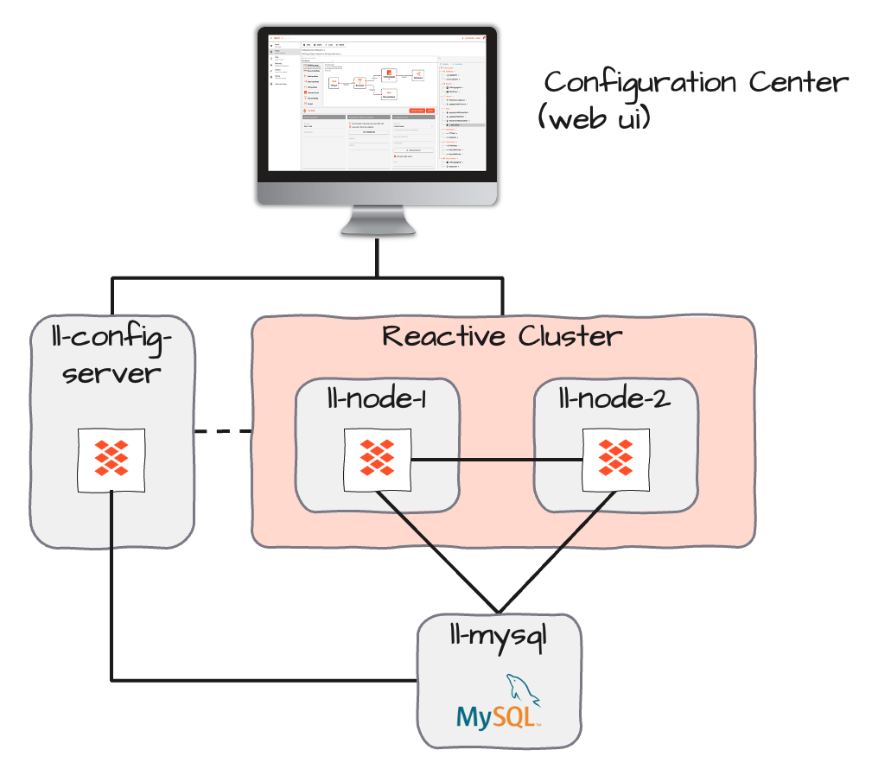
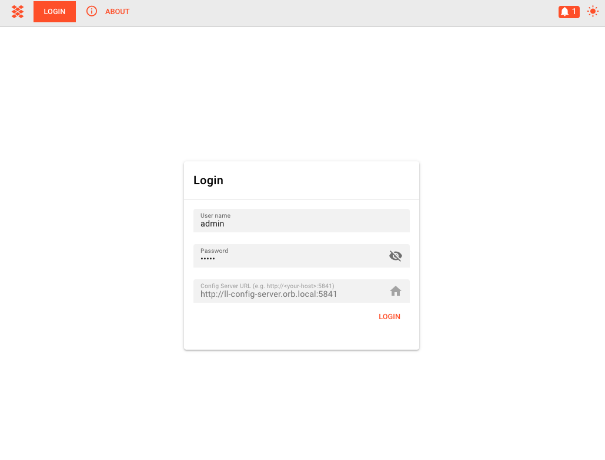
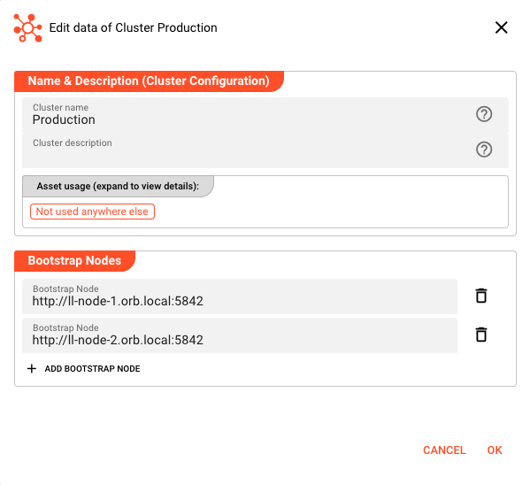
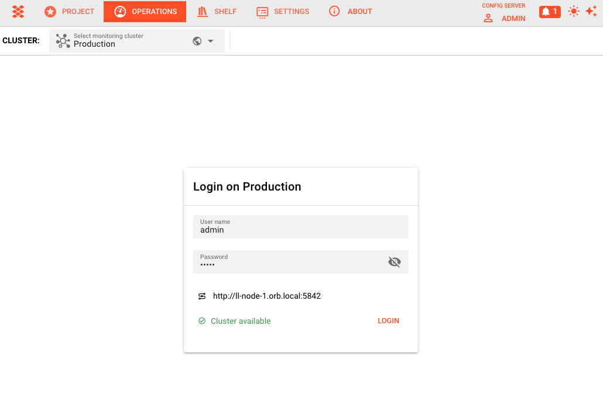
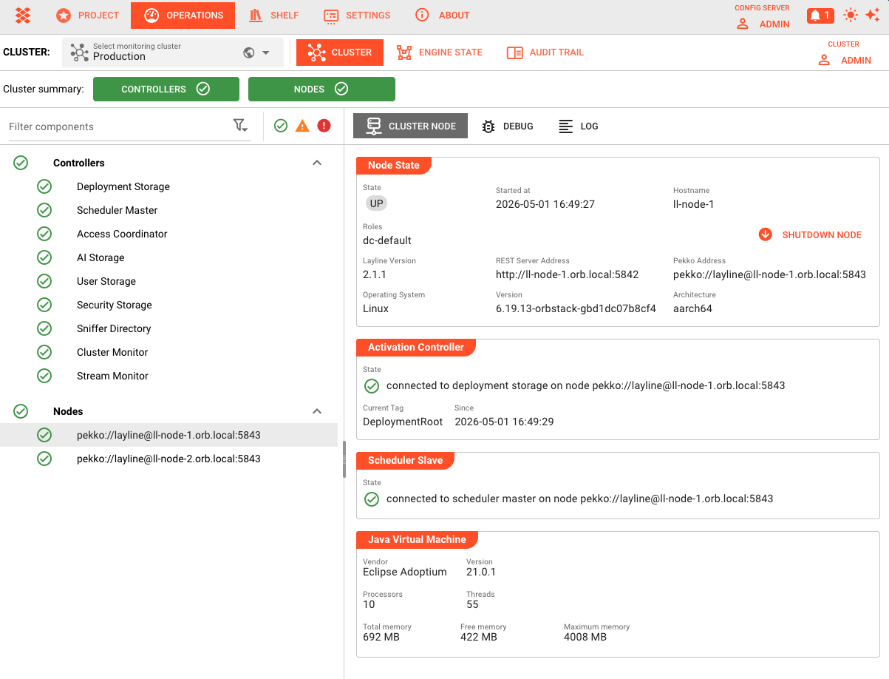

# Multi-Node Cluster Setup

> Deploy layline.io as a distributed system with separate machines for the database, configuration server, and reactive engine nodes.

## Overview

By default, layline.io runs all components on a single machine with an embedded H2 database. While this works well for development and testing, production deployments require a multi-node architecture that provides:

- **High availability** — Multiple reactive engine nodes share the workload
- **Scalability** — Add nodes as processing demands increase
- **Data persistence** — MySQL replaces H2 for reliable cluster state storage
- **Separation of concerns** — Configuration, processing, and storage run on dedicated resources

This tutorial walks through setting up a complete multi-machine environment based on a minimal but production-representative architecture: one MySQL server, one configuration server, and two reactive engine nodes forming a cluster.

:::tip Scaling Pattern
The two-node cluster demonstrated here scales to any number of nodes. Whether you need three nodes or thirty, the configuration pattern remains identical.
:::

---

## Architecture

The deployment consists of four Linux virtual machines, each with a specific role:



| Machine | Role | Key Ports | Purpose |
|---------|------|-----------|---------|
| `ll-mysql.orb.local` | Database | 3306 | Stores cluster state, journal, and snapshots |
| `ll-config-server.orb.local` | Configuration Server | 5841 | Web UI, REST API, project management |
| `ll-node-1.orb.local` | Reactive Engine | 5842 (REST), 5843 (Cluster) | Processing node 1 |
| `ll-node-2.orb.local` | Reactive Engine | 5842 (REST), 5843 (Cluster) | Processing node 2 |

**Network Flow:**
- Configuration Server connects to MySQL for persistence
- Web browsers connect to Configuration Server (port 5841)
- Reactive nodes connect to MySQL for journal/snapshot storage
- Reactive nodes discover each other via cluster port (5843)
- Configuration Server communicates with reactive cluster nodes

:::caution Network Requirements
All machines must have bidirectional network access on the ports listed above. Firewalls must allow these connections before starting services.
:::

---

## Prerequisites

Before starting, ensure you have:

| Requirement | Details |
|-------------|---------|
| **4 Linux VMs** | Any distribution supporting Java 17+ (Ubuntu, RHEL, Debian, etc.) |
| **Network connectivity** | All VMs can reach each other on required ports |
| **layline.io distribution** | Downloaded for Linux (AMD64 or ARM as appropriate) |
| **Root/sudo access** | For installing MySQL and layline.io services |
| **Hostnames configured** | Each VM has a resolvable hostname (DNS or `/etc/hosts`) |

:::tip New to layline.io?
This guide covers production multi-node deployment. For single-machine development setup, see:
- [Install Locally](../quickstart/install-local) — Full local installation for development
- [Install with Docker](../quickstart/install-docker) — Quick evaluation via Docker
:::

### Hostname Configuration

Each machine must be addressable by its canonical hostname. Add entries to `/etc/hosts` on all machines if DNS is not available:

```
192.168.1.10  ll-mysql.orb.local
192.168.1.11  ll-config-server.orb.local
192.168.1.12  ll-node-1.orb.local
192.168.1.13  ll-node-2.orb.local
```

---

## Step 1: MySQL Database Setup

The reactive cluster requires a multi-user database for state persistence. H2 and SQLite are single-user databases and cannot support clustered operation.

### 1.1 Install MySQL

Install MySQL on the dedicated database machine:

```bash title="Ubuntu/Debian"
sudo apt update
sudo apt install mysql-server
sudo systemctl enable mysql
sudo systemctl start mysql
```

```bash title="RHEL/CentOS/Rocky"
sudo dnf install mysql-server
sudo systemctl enable mysqld
sudo systemctl start mysqld
```

### 1.2 Create Database and User

Connect to MySQL as root and create the layline database:

```bash
sudo mysql -u root
```

```sql
-- Create database
CREATE DATABASE layline CHARACTER SET utf8mb4 COLLATE utf8mb4_unicode_ci;

-- Create user (adjust password as needed)
CREATE USER 'layline'@'%' IDENTIFIED BY 'your_secure_password';
GRANT ALL PRIVILEGES ON layline.* TO 'layline'@'%';
FLUSH PRIVILEGES;
```

:::warning Remote Access
The `'%'` wildcard allows connections from any host. For production, restrict this to specific IP ranges:
```sql
CREATE USER 'layline'@'192.168.1.%' IDENTIFIED BY 'your_secure_password';
```
:::

### 1.3 Create Required Tables

layline.io provides SQL scripts to create the required tables. These are located in the `scripts/` directory of your layline.io installation:

```bash
# On the config server machine (after layline.io is installed)
cd /opt/layline/scripts/sql/mysql
ls -la
```

You should see one SQL file:
- `persistence-schema.sql` — Contains DDL statements for three tables

Apply these scripts to your database:

```bash
mysql -u root -p -h ll-mysql.orb.local layline < persistence-schema.sql
```

### 1.4 Verify Tables

Connect to MySQL and confirm the tables exist:

```bash
mysql -u root -p -h ll-mysql.orb.local layline
```

```sql
SHOW TABLES;
```

<!-- SCREENSHOT: MySQL terminal showing "SHOW TABLES" output with the three layline tables -->

You should see:
```
+--------------------+
| Tables_in_layline  |
+--------------------+
| journal            |
| snapshot           |
| read_journal       |
+--------------------+
```

### 1.5 Configure MySQL Network Access

Ensure MySQL listens on all interfaces (or specific IPs) and accepts remote connections:

Edit `/etc/mysql/mysql.conf.d/mysqld.cnf` (Ubuntu/Debian) or `/etc/my.cnf` (RHEL):

```ini
[mysqld]
bind-address = 0.0.0.0
# Or for specific interface:
# bind-address = 192.168.1.10
```

Restart MySQL:

```bash
sudo systemctl restart mysql
```

Verify connectivity from the other machines:

```bash
# From config server or reactive nodes
mysql -u root -p -h ll-mysql.orb.local -e "SELECT 1"
```

---

## Step 2: Configuration Server Setup

The configuration server provides the web UI and manages project definitions. It requires MySQL for persistence.

### 2.1 Install layline.io

On the configuration server machine:

```bash
# Download (adjust version as needed)
curl -O https://download.layline.io/releases/layline-linux-amd64-2.5.4.sh

# Run installer
chmod +x layline-linux-amd64-2.5.4.sh
sudo ./layline-linux-amd64-2.5.4.sh
```

Follow the installation prompts. The default installation location is `/opt/layline/`.

### 2.2 Configure application.conf

Edit the configuration server settings:

```bash
sudo vi /opt/layline/config/config-server/application.conf
```

Replace the contents with the following configuration, adjusting values for your environment:

```hocon title="Configuration Server application.conf"
layline {
   config-server {
    rest-server {
      canonical {
        hostname = "ll-config-server.orb.local"
      }
      bind {
         port = 5841
         hostname = 0.0.0.0
      }
    }

    # logging {
    #   short-logger-names = true
    #   show-status-codes = false
    # }
  }
}

pekko {

  persistence {
    journal {
      plugin = "jdbc-journal"
    }
    snapshot-store {
      plugin = "jdbc-snapshot-store"
    }
  }

}

pekko-persistence-jdbc {
  shared-databases {
    h2file {
      profile = "slick.jdbc.H2Profile$"
      db {
        url = "jdbc:h2:file:/root/.layline/config-server/database/h2/journal;DATABASE_TO_UPPER=false;INIT=runscript from '/mnt/machines/ll-config-server/opt/layline/scripts/sql/h2/persistence-schema.sql';"
        user = "root"
        password = "root"
        driver = "org.h2.Driver"
        numThreads = 5
        maxConnections = 5
        minConnections = 1
      }
    }
    mysql {
      profile = "slick.jdbc.MySQLProfile$"
      db {
        host = "ll-mysql.orb.local"
        port = "3306"
        url = "jdbc:mysql://ll-mysql.orb.local:3306/layline?cachePrepStmts=true&cacheCallableStmts=true&cacheServerConfiguration=true&useLocalSessionState=true&elideSetAutoCommits=true&alwaysSendSetIsolatio
n=false&enableQueryTimeouts=false&connectionAttributes=none&verifyServerCertificate=false&useSSL=false&allowPublicKeyRetrieval=true&useUnicode=true&useLegacyDatetimeCode=false&serverTimezone=UTC&rewriteBatc
hedStatements=true"
        user = "root"
        password = ""
        driver = "com.mysql.cj.jdbc.Driver"
        numThreads = 5
        maxConnections = 5
        minConnections = 1
      }
    }
  }
}
```

<!-- SCREENSHOT: Configuration file showing the layline.config-server and pekko.persistence.jdbc sections -->

:::caution Security Note
The example uses `useSSL=false` for clarity. In production, configure MySQL with SSL certificates and enable `useSSL=true` with appropriate truststore settings.
:::

### 2.3 Start the Configuration Server

```bash
sudo /opt/layline/bin/config-server
```

Expected output:

```
[LAY-00050] ###################################################################
[LAY-00050] #  Layline Config Server 2.5.4                                    #
[LAY-00050] ###################################################################
...
[INFO] Layline Configuration Server up and running
```

<!-- SCREENSHOT: Terminal showing configuration server startup logs with "up and running" message -->

The server is ready when you see the "up and running" message. Keep this terminal open or configure the service to run under systemd (see [Production Notes](#production-notes)).

### 2.4 Verify Web Access

Open a browser and navigate to:

```
http://ll-config-server.orb.local:5841
```

You should see the login page. Default credentials are `admin` / `admin`.

<!-- SCREENSHOT: Configuration Center login page -->

---

## Step 3: Reactive Engine Node Configuration

Each reactive engine node requires identical configuration except for the canonical hostname.

### 3.1 Install layline.io on Both Nodes

On **both** `ll-node-1` and `ll-node-2`:

```bash
# Download and install (same as config server)
curl -O https://download.layline.io/releases/layline-linux-amd64-2.5.4.sh
chmod +x layline-linux-amd64-2.5.4.sh
sudo ./layline-linux-amd64-2.5.4.sh
```

### 3.2 Configure Node 1

On `ll-node-1.orb.local`, edit the reactive engine configuration:

```bash
sudo vi ~/.layline/reactive-engine/config/application.conf
```

```hocon title="Node 1 application.conf"
layline {
  reactive-engine {
    rest-server {
      canonical {
        hostname = "ll-node-1.orb.local"
      }
      bind {
         port = 5842
         hostname = 0.0.0.0
      }
    }

    # logging {
    #   short-logger-names = true
    #   show-status-codes = false
    # }
  }
}

pekko {

  actor {
    provider = cluster
  }

#  discovery {
#    method = akka-dns
#  }

  management {
    http {
      bind-port = 8558
    }
  }

  remote {
    log-remote-lifecycle-events = off
    artery {
      enabled = on
      transport = tcp
      canonical.hostname="ll-node-1.orb.local"
      canonical.port = 5843
      bind.hostname = "0.0.0.0"
      bind.port = 5843
    }
  }

  cluster {
    min-nr-of-members = 2 # Minimum expected number of cluster members
    seed-nodes = [
      "pekko://layline@ll-node-1.orb.local:5843" # 1st node
      "pekko://layline@ll-node-2.orb.local:5843" # 2nd node
    ]

    split-brain-resolver {
      active-strategy = keep-majority
    }
  }

  persistence {
    journal {
      plugin = "jdbc-journal"
    }
    snapshot-store {
      plugin = "jdbc-snapshot-store"
    }
  }

}

pekko-persistence-jdbc {
  shared-databases {
    h2file {
      profile = "slick.jdbc.H2Profile$"
      db {
        url = "jdbc:h2:file:/root/.layline/reactive-engine/database/h2/journal;DATABASE_TO_UPPER=false;INIT=runscript from '/mnt/machines/ll-node-1/opt/layline/scripts/sql/h2/persistence-schema.sql';"
        user = "root"
        password = "root"
        driver = "org.h2.Driver"
        numThreads = 5
        maxConnections = 5
        minConnections = 1
      }
    }
    mysql {
      profile = "slick.jdbc.MySQLProfile$"
      db {
        host = "ll-mysql.orb.local"
        port = "3306"
        url = "jdbc:mysql://ll-mysql.orb.local:3306/layline?cachePrepStmts=true&cacheCallableStmts=true&cacheServerConfiguration=true&useLocalSessionState=true&elideSetAutoCommits=true&alwaysSendSetIsolatio
n=false&enableQueryTimeouts=false&connectionAttributes=none&verifyServerCertificate=false&useSSL=false&allowPublicKeyRetrieval=true&useUnicode=true&useLegacyDatetimeCode=false&serverTimezone=UTC&rewriteBatc
hedStatements=true"
        user = "root"
        password = ""
        driver = "com.mysql.cj.jdbc.Driver"
        numThreads = 5
        maxConnections = 5
        minConnections = 1
      }
    }
  }
}

jdbc-journal {
  use-shared-db = "mysql"
}

jdbc-read-journal {
  use-shared-db = "mysql"
}

jdbc-snapshot-store {
  use-shared-db = "mysql"
}
```

<!-- SCREENSHOT: Node 1 configuration file showing layline.reactive-engine and pekko.cluster sections -->

### 3.3 Configure Node 2

On `ll-node-2.orb.local`, create an identical configuration **except** change the canonical hostname:

```hocon title="Node 2 application.conf (only changes shown)"
layline {
  reactive-engine {
    rest-server {
      canonical {
        hostname = "ll-node-2.orb.local"
      }
      bind {
         port = 5842
         hostname = 0.0.0.0
      }
    }

    # logging {
    #   short-logger-names = true
    #   show-status-codes = false
    # }
  }
}

pekko {

  actor {
    provider = cluster
  }

#  discovery {
#    method = akka-dns
#  }

  management {
    http {
      bind-port = 8558
    }
  }

  remote {
    log-remote-lifecycle-events = off
    artery {
      enabled = on
      transport = tcp
      canonical.hostname="ll-node-2.orb.local"
      canonical.port = 5843
      bind.hostname = "0.0.0.0"
      bind.port = 5843
    }
  }

  cluster {
    min-nr-of-members = 2 # Minimum expected number of cluster members
    seed-nodes = [
      "pekko://layline@ll-node-1.orb.local:5843" # 1st node
      "pekko://layline@ll-node-2.orb.local:5843" # 2nd node
    ]

    split-brain-resolver {
      active-strategy = keep-majority
    }
  }

  persistence {
    journal {
      plugin = "jdbc-journal"
    }
    snapshot-store {
      plugin = "jdbc-snapshot-store"
    }
  }

}

pekko-persistence-jdbc {
  shared-databases {
    h2file {
      profile = "slick.jdbc.H2Profile$"
      db {
        url = "jdbc:h2:file:/root/.layline/reactive-engine/database/h2/journal;DATABASE_TO_UPPER=false;INIT=runscript from '/mnt/machines/ll-node-2/opt/layline/scripts/sql/h2/persistence-schema.sql';"
        user = "root"
        password = "root"
        driver = "org.h2.Driver"
        numThreads = 5
        maxConnections = 5
        minConnections = 1
      }
    }
    mysql {
      profile = "slick.jdbc.MySQLProfile$"
      db {
        host = "ll-mysql.orb.local"
        port = "3306"
        url = "jdbc:mysql://ll-mysql.orb.local:3306/layline?cachePrepStmts=true&cacheCallableStmts=true&cacheServerConfiguration=true&useLocalSessionState=true&elideSetAutoCommits=true&alwaysSendSetIsolatio
n=false&enableQueryTimeouts=false&connectionAttributes=none&verifyServerCertificate=false&useSSL=false&allowPublicKeyRetrieval=true&useUnicode=true&useLegacyDatetimeCode=false&serverTimezone=UTC&rewriteBatc
hedStatements=true"
        user = "root"
        password = ""
        driver = "com.mysql.cj.jdbc.Driver"
        numThreads = 5
        maxConnections = 5
        minConnections = 1
      }
    }
  }
}

jdbc-journal {
  use-shared-db = "mysql"
}

jdbc-read-journal {
  use-shared-db = "mysql"
}

jdbc-snapshot-store {
  use-shared-db = "mysql"
}
```

:::important Seed Nodes Must Match
Both nodes must have identical `seed-nodes` lists. The order matters — nodes try to join seed nodes in sequence until successful.
:::

### 3.4 Start the Reactive Engines

**On Node 1:**

```bash
reactive-engine
```

You'll see log messages indicating the node is waiting for the cluster to form:

```
[INFO] trying to connect to the cluster
```

<!-- SCREENSHOT: Node 1 terminal showing "Waiting for minimum members" message -->

**On Node 2:**

```bash
reactive-engine
```

Once Node 2 starts, both nodes should discover each other and form the cluster:
Both nodes should now show:
```
26-04-30 15:56:23.561 INFO  Layline - [LAY-11000] trying to connect to the cluster
26-04-30 15:56:24.374 INFO  Layline - [LAY-11001] cluster successfully joined, member status is up
```

---

## Step 4: Web UI Configuration

With the services running, configure the cluster in the Configuration Center.

### 4.1 Access Configuration Center

Open the browser and navigate to:

```
http://ll-config-server.orb.local:5841
```

Login with `admin` / `admin`.



### 4.2 Create Cluster Settings

1. Go to **Settings → Cluster Storage → Clusters**
2. Click the **+** button to add a new cluster

3. Enter the cluster details:

| Field | Value | Description |
|-------|-------|-------------|
| **Name** | `Production` | Display name for this cluster |
| **Bootstrap Nodes** | `ll-node-1.orb.local:5842` | First reactive engine address |
| | `ll-node-2.orb.local:5842` | Second reactive engine address |



4. Click **Save**

### 4.3 Connect to the Cluster

1. Navigate to **Operations** in the left menu
2. Select your cluster from the dropdown at the top
3. Click **Login** when prompted
4. Enter credentials: `admin` / `admin`



### 4.4 Verify Node Status

After logging in, the **Cluster** page displays both nodes:

| Column | Description |
|--------|-------------|
| **Name** | Node hostname |
| **State** | Should show **Up** in green |
| **Version** | layline.io version running on the node |
| **Uptime** | How long the node has been running |

Click on a node to view detailed information:
- JVM memory usage
- Architecture and OS details
- Thread and connection counts



---

## Verification

Confirm the setup is working correctly:

### 5.1 Check Cluster Formation

On either reactive node, check the cluster status via logs:

```bash
grep "cluster successfully joined" ~/.layline/reactive-engine/log/reactive-engine.log
```

Expected output:
```
24-12-20 14:01:08.427 INFO  Layline - [LAY-11001] cluster successfully joined, member status is up
```

### 5.2 Test Database Connectivity

Verify both nodes are writing to MySQL:

```sql
-- In MySQL, check for recent journal entries
SELECT COUNT(*) FROM layline.event_journal WHERE persistence_id LIKE '% reactive-engine%';
```

The count should increase as operations occur.

### 5.3 Web UI Connectivity

In the Configuration Center:
1. Operations → Cluster should show 2 nodes
2. Both nodes should have green "Up" status
3. Node details should display correct IP addresses and versions

---

## Scaling: Adding More Nodes

To add a third node (or more), follow this pattern:

### 6.1 Provision New Machine

- Install layline.io
- Configure hostname (e.g., `ll-node-3.orb.local`)
- Ensure network connectivity to MySQL and existing nodes

### 6.2 Update Configuration

On **all nodes**, update the `seed-nodes` list:

```hocon
pekko {
  cluster {
    seed-nodes = [
      "pekko://layline@ll-node-1.orb.local:5843",
      "pekko://layline@ll-node-2.orb.local:5843",
      "pekko://layline@ll-node-3.orb.local:5843"  # Added
    ]
  }
}
```

:::important Rolling Restart Required
After changing seed-nodes, restart reactive engines one at a time to avoid cluster disruption.
:::

### 6.3 Update Web UI

In Configuration Center:
1. Settings → Cluster Storage → Clusters
2. Edit your cluster
3. Add `ll-node-3.orb.local:5842` to Bootstrap Nodes
4. Save

The new node will appear in Operations → Cluster once it joins.

---

## Production Notes

### Systemd Service Configuration

For production, run layline.io as systemd services instead of interactive processes.

**Configuration Server (`/etc/systemd/system/layline-config-server.service`):**

```ini
[Unit]
Description=Layline Configuration Server
After=network.target mysql.service

[Service]
Type=simple
User=layline
Group=layline
ExecStart=/root/.layline/bin/config-server
Restart=always
RestartSec=10

[Install]
WantedBy=multi-user.target
```

**Reactive Engine (`/etc/systemd/system/layline-reactive-engine.service`):**

```ini
[Unit]
Description=Layline Reactive Engine
After=network.target mysql.service

[Service]
Type=simple
User=layline
Group=layline
ExecStart=/root/layline/bin/reactive-engine
Restart=always
RestartSec=10

[Install]
WantedBy=multi-user.target
```

Enable and start:

```bash
sudo systemctl daemon-reload
sudo systemctl enable layline-config-server
sudo systemctl enable layline-reactive-engine
sudo systemctl start layline-config-server
sudo systemctl start layline-reactive-engine
```

### Firewall Configuration

Open required ports on each machine:

| Machine | Incoming Ports | Source |
|---------|---------------|--------|
| MySQL | 3306 | Config Server, Reactive Nodes |
| Config Server | 5841 | Web browsers, Reactive Nodes |
| Reactive Nodes | 5842 | Config Server, External clients |
| Reactive Nodes | 5843 | Other Reactive Nodes |

**Example ufw rules (Ubuntu):**

```bash
# On MySQL server
sudo ufw allow from 192.168.1.0/24 to any port 3306

# On Config Server
sudo ufw allow 5841/tcp

# On Reactive Nodes
sudo ufw allow 5842/tcp
sudo ufw allow from 192.168.1.0/24 to any port 5843
```

### SSL/TLS for MySQL

For production, enable SSL for MySQL connections:

1. Generate or obtain SSL certificates for MySQL
2. Configure MySQL with certificate paths in `my.cnf`:
   ```ini
   [mysqld]
   ssl-ca=/etc/mysql/ssl/ca.pem
   ssl-cert=/etc/mysql/ssl/server-cert.pem
   ssl-key=/etc/mysql/ssl/server-key.pem
   require_secure_transport=ON
   ```
3. Update `application.conf` on all nodes:
   ```hocon
   url = "jdbc:mysql://ll-mysql.orb.local:3306/layline?useSSL=true&serverTimezone=UTC"
   ```

### Backup Strategy

**MySQL Backups:**

```bash
# Daily backup script
mysqldump -u root -p root > layline-backup-$(date +%Y%m%d).sql
```

**Configuration Backups:**

Projects are stored in MySQL, so database backups include all configuration. For additional safety, export projects periodically via the Configuration Center or REST API.

### Monitoring

Enable Prometheus metrics export for cluster monitoring:

```hocon
# In reactive-engine application.conf
layline {
  reactive-engine {
    metrics {
      enabled = true
      port = 9095
    }
  }
}
```

See [Gathering Statistics through Metrics](../../assets/workflow-assets/extensions/asset-prometheus) for details.

---

## Troubleshooting

### Nodes Cannot Form Cluster

**Symptom:** Nodes start but never form a cluster, logs show "Waiting for minimum members"

**Check:**
1. Network connectivity between nodes on port 5843:
   ```bash
   telnet ll-node-1.orb.local 5843
   ```
2. Hostname resolution works from both nodes:
   ```bash
   ping ll-node-1.orb.local
   ping ll-node-2.orb.local
   ```
3. Seed node addresses match the canonical hostnames in configuration
4. Firewalls allow traffic on cluster port (5843)

### Cannot Connect to MySQL

**Symptom:** Services fail to start with JDBC connection errors

**Check:**
1. MySQL is running and accessible:
   ```bash
   mysql -u root -p -h ll-mysql.orb.local -e "SELECT 1"
   ```
2. Database and tables exist (run script in `/opt/layline/scripts/mysql/`)
3. MySQL user has correct permissions and host wildcard
4. `bind-address` in MySQL config allows remote connections

### Configuration Center Cannot Reach Cluster

**Symptom:** Operations page shows cluster as unreachable

**Check:**
1. Cluster settings in Settings → Cluster Storage have correct bootstrap node addresses
2. Reactive engines are running and cluster is formed
3. Network path exists from config server to reactive nodes on port 5842
4. Check reactive engine logs for authentication or connection errors

### Split Brain Scenarios

If network partitions occur, the split-brain resolver (`keep-majority` strategy) will keep the side with the majority of nodes. Monitor for:
- Nodes showing as **Unreachable** in the UI
- Logs indicating "SplitBrainResolver" actions

Recovery typically requires restarting isolated nodes after network connectivity is restored.

---

## Summary

You now have a working multi-node layline.io deployment with:

- ✅ MySQL database for cluster persistence
- ✅ Configuration Server for web-based management
- ✅ Two reactive engine nodes forming a cluster
- ✅ Web UI configured for monitoring and operations

This architecture scales horizontally by adding more reactive nodes and provides the foundation for production deployments.

---

## Screenshot Checklist

The following screenshots have been integrated into this documentation:

- ✅ **Architecture diagram** — 4-machine setup with network connections
- ✅ **Configuration Center login** — Initial login page with Config Server URL
- ✅ **Operations login** — Cluster login prompt with "Production" selector
- ✅ **Edit Cluster dialog** — Settings form with cluster name and bootstrap nodes
- ✅ **Cluster monitoring** — Operations page showing nodes with Up status

The following screenshots are still pending (terminal/command-line outputs):

- [ ] **MySQL tables** — `SHOW TABLES` output with journal, snapshot, read_journal
- [ ] **Config server config** — `application.conf` showing layline.config-server section
- [ ] **Config server startup** — Terminal showing "Configuration Server up and running"
- [ ] **Node 1 config** — `application.conf` showing layline.reactive-engine and pekko.cluster sections
- [ ] **Node waiting** — Terminal showing "Waiting for minimum members (2)"
- [ ] **Cluster formation** — Terminal showing successful formation with both nodes

## See Also

- [**Security Storage**](./secret-management.md) — Managing certificates and keys for secure cluster communication
- [**User and Role Management**](./advanced-user-storage.md) — Configuring access control across the cluster
- [**Gathering Statistics through Metrics**](./prometheus-extension.md) — Monitoring cluster health and performance
- [**Quickstart: Install Locally**](../../quickstart/install-local) — Single-machine installation for development
