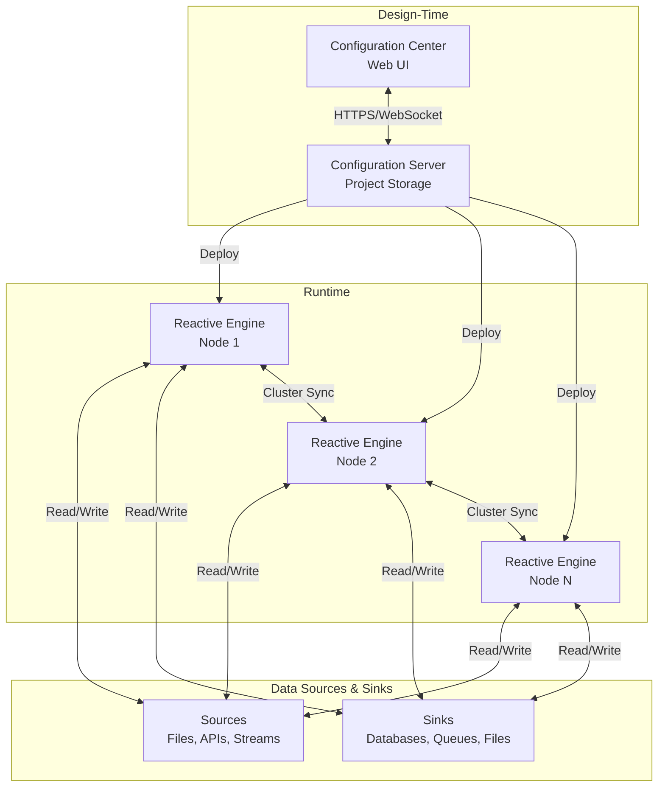
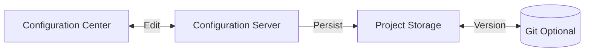
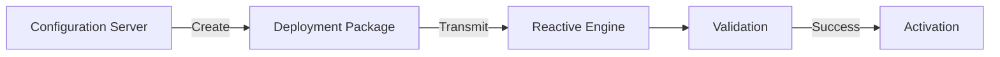
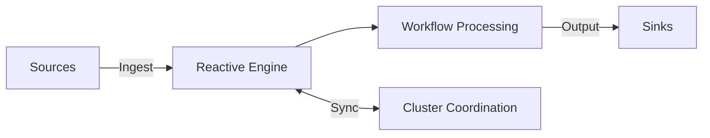
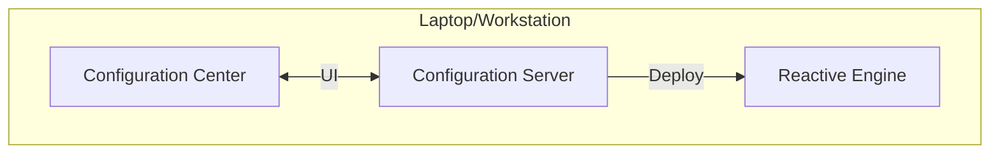
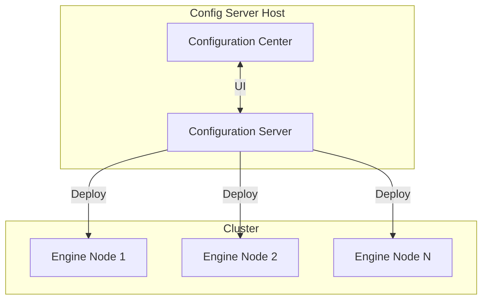
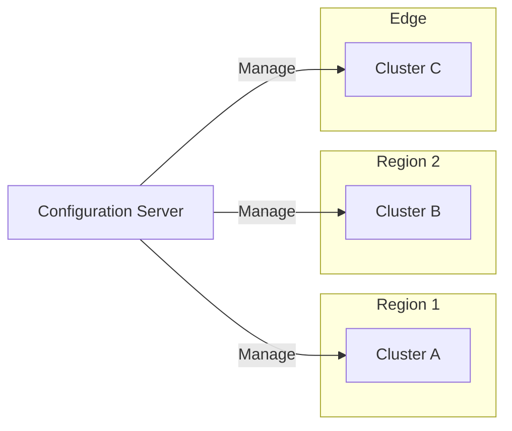

# Architecture Overview

> How layline.io's distributed components fit together to form a complete data processing platform.

## Introduction

layline.io is designed as a **distributed system** with clear separation between configuration, execution, and monitoring concerns. This architecture enables everything from single-node development setups to geographically distributed production clusters.

At its core, the system follows a **hub-and-spoke model**: a central Configuration Server manages design-time state, while one or more Reactive Engines handle runtime execution. This separation allows teams to develop, version, and test configurations independently from production runtime environments.

## System Components

### Configuration Server

The **Configuration Server** is the system's brain during design-time. It:

- **Stores Projects** — All workflows, assets, and configurations live here
- **Serves the Configuration Center** — The web UI is served by this component
- **Manages Deployment State** — Tracks what has been deployed where
- **Handles Versioning** — Projects are versioned and can be branched

<!-- SCREENSHOT: Configuration Server login screen showing the web interface entry point -->

The Configuration Server is a single process that maintains a filesystem-based store of Projects. It does not process data — its job is to be the authoritative source of "what should be running."

### Configuration Center

The **Configuration Center** is the web-based UI served by the Configuration Server. It provides:

- **Project Editor** — Visual workflow designer and asset configuration
- **Deployment Interface** — Push configurations to Reactive Engines
- **Operations Dashboard** — Monitor running clusters and workflows

<!-- SCREENSHOT: Configuration Center main view showing Project with workflow editor open -->

The Configuration Center is a single-page application (SPA) that communicates with the Configuration Server via HTTP and WebSocket for real-time updates.

### Reactive Engine

The **Reactive Engine** is where data actually flows. It:

- **Executes Workflows** — Runs the data pipelines designed in the Configuration Center
- **Manages Connections** — Maintains connections to sources and sinks
- **Processes Streams** — Handles backpressure, buffering, and flow control
- **Participates in Clusters** — Coordinates with other engines for distributed execution

<!-- SCREENSHOT: Operations view showing Reactive Engine cluster status with running workflows -->

Each Reactive Engine is an independent process that can run standalone or as part of a cluster. When clustered, engines automatically discover peers and coordinate workload distribution.

### Reactive Cluster

A **Reactive Cluster** is a logical grouping of Reactive Engines that:

- **Shares Workload** — Workflows are distributed across available engines
- **Provides Resilience** — If one engine fails, others pick up its work
- **Enables Scaling** — Add or remove engines dynamically

<!-- SCREENSHOT: Cluster topology view showing multiple nodes with workload distribution -->

Clusters are defined in the Configuration Center. An engine joins a cluster by being configured with the cluster's coordinates. Once joined, the engine participates in cluster-wide coordination protocols.

## Component Interactions

### Design-Time Flow

When you design workflows in the Configuration Center, changes are persisted to the Configuration Server's project store. Projects can optionally be backed by Git for version control and collaboration.

### Deployment Flow

Deploying a Project creates a **Deployment Package** containing:
- Selected Workflows and their dependencies
- Asset configurations
- Environment-specific parameters
- Secrets (encrypted)

The package is transmitted to one or more Reactive Engines, validated, and then activated.

### Runtime Flow

During runtime, data flows through the Reactive Engine(s). In a cluster, engines coordinate to:
- Balance workload across nodes
- Handle node failures gracefully
- Maintain consistent state where required

## Data Flow: From Design to Production

Understanding how a configuration becomes a running workflow:

| Stage | Location | State |
|-------|----------|-------|
| **Design** | Configuration Server | Editable, versioned |
| **Build** | Configuration Server | Compiled, validated |
| **Deploy** | In transit | Packaged, encrypted |
| **Activate** | Reactive Engine | Running, monitored |

1. **Design** — You create and edit Projects in the Configuration Center
2. **Build** — The Configuration Server compiles workflows and validates dependencies
3. **Deploy** — A Deployment Package is created and transmitted to target engines
4. **Activate** — Engines unpack, validate, and start executing the workflows

## Deployment Topologies

layline.io supports multiple deployment patterns:

### Single-Node Development

All components run on a single machine. Ideal for development and testing.

### Dedicated Config Server

Configuration Server runs on dedicated infrastructure; engines run on separate cluster nodes. Common for production environments.

### Distributed Cluster

Multiple clusters in different geographic regions, all managed from a central Configuration Server. Enables edge computing and disaster recovery scenarios.

## Security Model

### Authentication

- **Configuration Server** — Username/password or LDAP integration
- **Reactive Engines** — Token-based authentication for deployment; user auth for operations
- **Cluster Communication** — Mutual TLS between engines

### Authorization

- **Role-Based Access Control (RBAC)** — Users have roles (Admin, Operator, Developer)
- **Project Permissions** — Fine-grained access to specific Projects
- **Cluster Permissions** — Control who can deploy to which clusters

### Data Protection

- **Secrets** — Encrypted at rest in Configuration Server; decrypted only at target engines
- **Deployment Packages** — Transmitted over TLS
- **Audit Logs** — All actions logged for compliance

## Scalability Characteristics

| Component | Scaling Model | Bottleneck |
|-----------|---------------|------------|
| Configuration Server | Vertical + Horizontal (read replicas) | Project storage I/O |
| Configuration Center | Stateless (any number of UI instances) | Backend (Config Server) |
| Reactive Engine | Horizontal (add nodes to cluster) | Network bandwidth, CPU |
| Cluster Coordination | Automatic (gossip protocol) | Cluster size |

## See Also

- [**What is layline.io?**](./introduction) — Product philosophy and motivation
- [**Workflow Configurations**](./projects-workflows) — Design-time concepts and building workflows
- [**Operations**](../operations) — Runtime monitoring and cluster management
- [**Quickstart**](../quickstart) — Hands-on guide to your first deployment
- [**Multi-Node Cluster Setup**](./advanced/multi-node-cluster-setup) — Detailed cluster configuration guide
