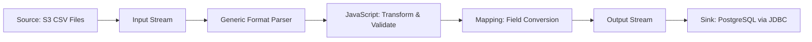
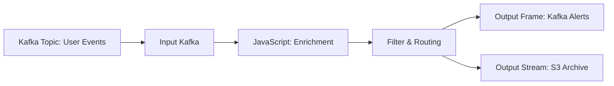
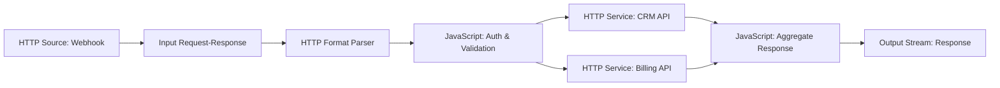
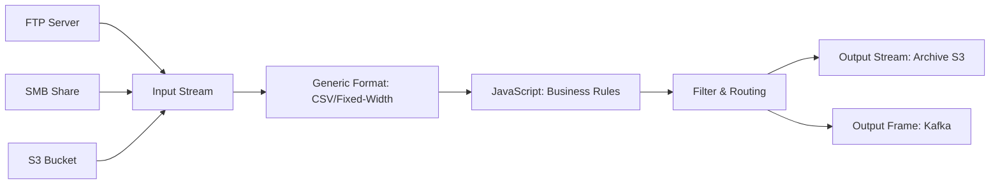
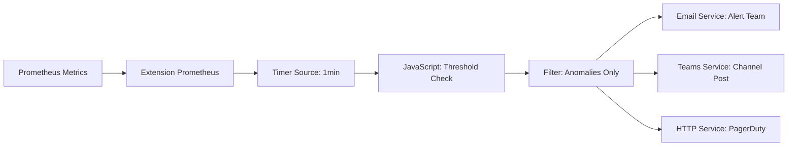
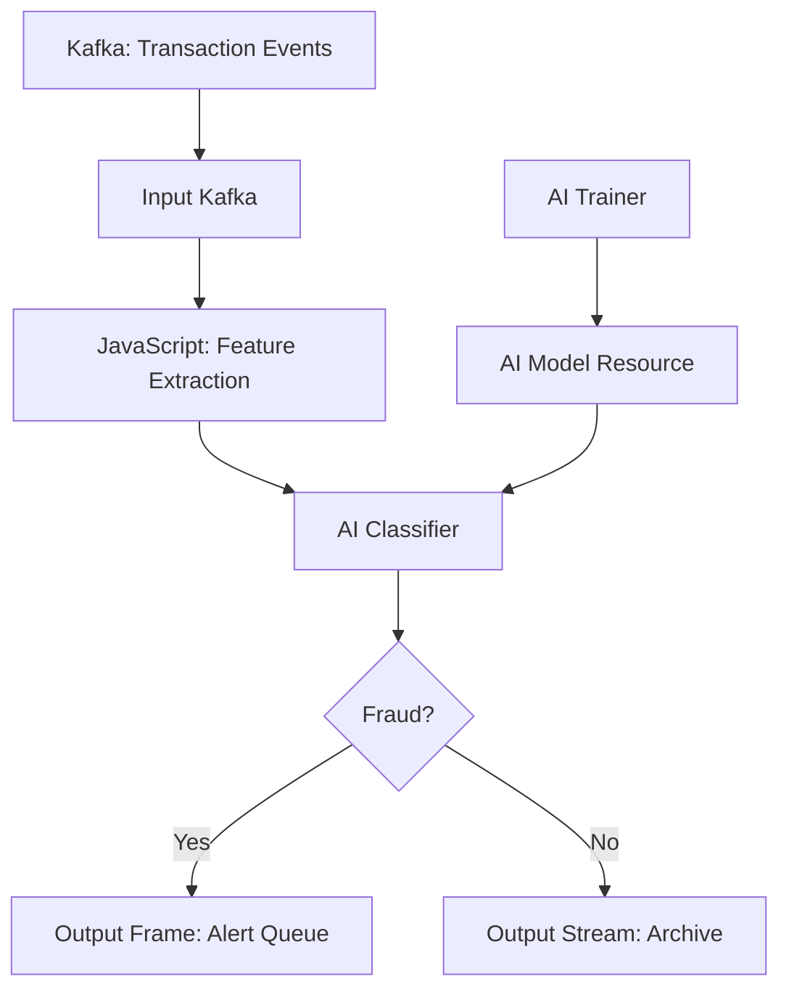

# Common Use Cases

> How do organizations use layline.io in production? These real-world scenarios show the platform's versatility across industries and use cases.

---

## 1. ETL & Data Integration

**Challenge:** Move and transform data between systems with different formats, protocols, and update frequencies.

**layline.io Solution:**

**Key Assets:**
- [Source S3](../assets/workflow-assets/sources/asset-source-s3.md) — Poll S3 buckets for new files
- [Generic Format](../assets/workflow-assets/formats/asset-format-generic.md) — Parse CSV with custom grammar
- [JavaScript Processor](../assets/workflow-assets/processors-flow/asset-flow-javascript.md) — Custom validation and enrichment
- [JDBC Service](../assets/workflow-assets/services/asset-service-jdbc.md) — Write to PostgreSQL, MySQL, Oracle

**Results:** A European telecom reduced ETL pipeline development time from 3 weeks to 2 days.

---

## 2. Real-Time Event Processing

**Challenge:** Process high-volume event streams with sub-second latency for fraud detection, IoT analytics, or recommendation engines.

**layline.io Solution:**

**Key Assets:**
- [Source Kafka](../assets/workflow-assets/sources/asset-source-kafka.md) — Consume from Kafka topics with consumer groups
- [Input Kafka](../assets/workflow-assets/processors-input/asset-input-kafka.md) — Stream ingestion with offset management
- [Filter & Routing](../assets/workflow-assets/processors-flow/asset-flow-filterrouting.mdx) — Route events based on content
- [Sink Kafka](../assets/workflow-assets/sinks/asset-sink-kafka.md) — Publish alerts to downstream topics

**Results:** Process millions of events per second with horizontal scaling across cluster nodes.

---

## 3. API Integration Hub

**Challenge:** Integrate multiple internal and external APIs with different authentication, formats, and rate limits.

**layline.io Solution:**

**Key Assets:**
- [Source HTTP](../assets/workflow-assets/sources/asset-source-http.md) — Receive webhook callbacks
- [HTTP Service](../assets/workflow-assets/services/asset-service-http.md) — Call REST APIs with authentication
- [Throttle](../assets/workflow-assets/processors-flow/asset-flow-throttle.md) — Rate-limit API calls
- [Input Request-Response](../assets/workflow-assets/processors-input/asset-input-request-response.md) — Synchronous API facade

---

## 4. File-Based Data Pipelines

**Challenge:** Process files from multiple sources (FTP, SMB, S3, local) with different formats and delivery schedules.

**layline.io Solution:**

**Key Assets:**
- [Source FTP](../assets/workflow-assets/sources/asset-source-ftp.md) — Poll FTP/SFTP servers
- [Source SMB](../assets/workflow-assets/sources/asset-source-smb.md) — Read from Windows shares
- [Source S3](../assets/workflow-assets/sources/asset-source-s3.md) — Poll cloud storage
- [Generic Format](../assets/workflow-assets/formats/asset-format-generic.md) — Parse CSV, fixed-width, delimited text

---

## 5. System Monitoring & Alerting

**Challenge:** Monitor infrastructure and application metrics, detect anomalies, and trigger alerts across multiple channels.

**layline.io Solution:**

**Key Assets:**
- [Extension Prometheus](../assets/workflow-assets/extensions/asset-prometheus.md) — Export metrics to Prometheus
- [Timer Source](../assets/workflow-assets/sources/asset-source-timer.md) — Scheduled metric collection
- [Email Service](../assets/workflow-assets/services/asset-service-email.md) — Send alert emails
- [Teams Service](../assets/workflow-assets/services/asset-service-teams.md) — Post to Microsoft Teams

---

## 6. Legacy System Modernization

**Challenge:** Replace aging integration platforms (IBM MQ, TIBCO, custom ETL) with a modern, cloud-native solution.

**Case Study: freenet (Europe's Largest MVNO)**

> "layline.io replaced our legacy system with a scalable, cloud-native solution, slashing resources by 75%."
> — freenet Engineering Team

**Migration Path:**

1. **Phase 1:** Deploy layline.io alongside legacy system (shadow mode)
2. **Phase 2:** Migrate file-based integrations (FTP, SMB) first — lowest risk
3. **Phase 3:** Migrate message queue integrations (Kafka, SQS)
4. **Phase 4:** Migrate database integrations (JDBC, stored procedures)
5. **Phase 5:** Decommission legacy platform

**Key Benefits:**
- **Reduced infrastructure:** 75% fewer servers required
- **Faster development:** New integrations in days, not weeks
- **Better observability:** Real-time monitoring vs. batch log analysis
- **Cloud-native:** Docker/Kubernetes deployment, horizontal scaling

---

## 7. AI/ML-Powered Data Processing

**Challenge:** Apply machine learning models to streaming data for classification, anomaly detection, or prediction.

**layline.io Solution:**

**Key Assets:**
- [AI Classifier](../assets/workflow-assets/processors-flow/asset-flow-ai-classifier.md) — Apply trained models to message streams
- [AI Trainer](../assets/workflow-assets/processors-flow/asset-flow-ai-trainer.md) — Train models from live data using Weka
- [AI Model Resource](../assets/workflow-assets/resources/asset-resource-ai-model.md) — Manage model specifications
- [AI Service](../assets/workflow-assets/services/asset-service-ai.md) — Call external AI APIs (OpenAI, Azure ML)

---

## Choosing Your Use Case

| If your primary need is... | Start With |
|---------------------------|------------|
| Moving data between systems | [ETL & Data Integration](#1-etl--data-integration) |
| Processing high-volume streams | [Real-Time Event Processing](#2-real-time-event-processing) |
| Connecting APIs and webhooks | [API Integration Hub](#3-api-integration-hub) |
| Processing files from multiple sources | [File-Based Data Pipelines](#4-file-based-data-pipelines) |
| Infrastructure monitoring | [System Monitoring & Alerting](#5-system-monitoring--alerting) |
| Replacing legacy integration | [Legacy System Modernization](#6-legacy-system-modernization) |
| Applying ML to data streams | [AIML-Powered Data Processing](#7-aiml-powered-data-processing) |

---

## See Also

- [Quickstart](../quickstart/index.md) — Build your first pipeline in 30 minutes
- [Assets Overview](../assets/index.md) — All available asset types
- [Architecture Overview](./architecture-overview.md) — How layline.io works under the hood
- [Comparison](./comparison.md) — layline.io vs Apache Flink, Kafka Streams, and others
