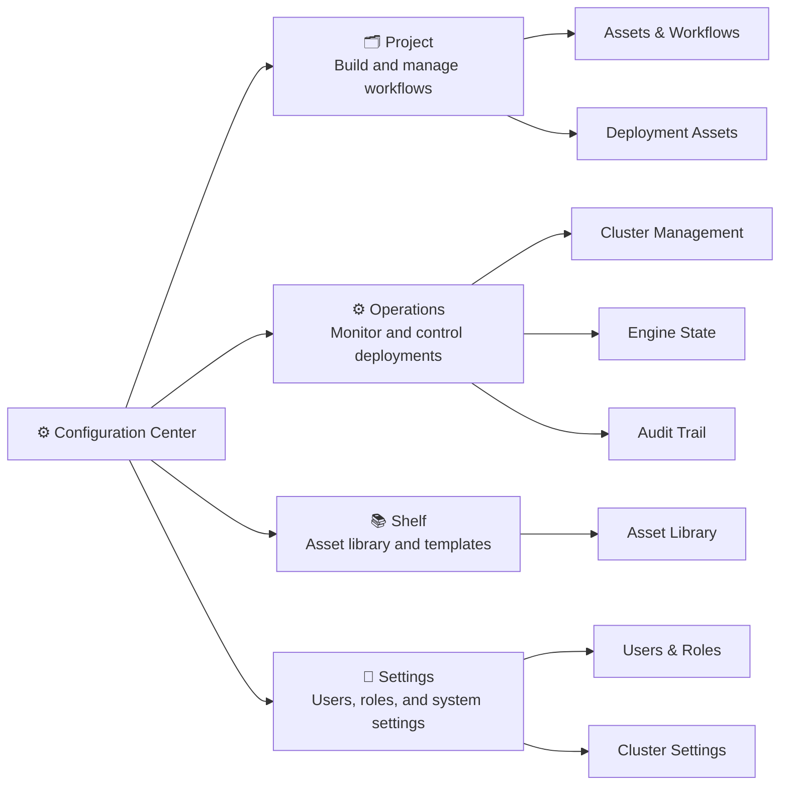

# layline.io Documentation

> Everything you need to build, deploy, and operate data pipelines with layline.io.

layline.io is a low-code platform for real-time and batch event data processing. This documentation mirrors the four main sections of the **Configuration Center** — the web interface you use to work with layline.io day to day.

---

## How This Documentation Is Organized

The app has four top-level tabs. Each one maps to a section of this documentation:

---

## 🗂️ Project — Working with Projects

The **Project** tab is where you build. A Project contains all the Assets and Workflows that define how your data pipelines work — what data comes in, how it's processed, and where results go.

**What you'll find here:**

- [**Assets Overview**](./assets/index.md) — All asset types: Sources, Sinks, Processors, Formats, Services, Connections, and more
- [**Workflow Assets**](./assets/workflow-assets/index.md) — The building blocks of a Workflow: input, flow, and output processors
- [**Deployment Assets**](./assets/deployment-assets/index.md) — Engine deployments, schedulers, tags, and cluster configuration

**Key concepts:**
- A **Workflow** has exactly one Input Processor as its driver, plus any number of Flow Processors and Output Processors
- **Assets** are reusable components — a Format, a Source, a Service — shared across Workflows within a Project
- A **Deployment** packages Workflows with their Environment and Secret Assets and ships them to a Reactive Engine

→ [**Go to Assets documentation**](./assets/index.md)

---

## ⚙️ Operations — Cluster Operations and Monitoring

The **Operations** tab is your mission control. Once workflows are deployed and running, this is where you monitor them, investigate issues, and manage the live system.

**What you'll find here:**

- [**Operations Overview**](./operations/index.md) — Introduction to the Operations section
- [**Cluster Management**](./operations/cluster/index.md) — Nodes, alarms, scheduler, stream monitor, and storage systems
- [**Engine State**](./operations/engine-state/index.md) — Live view of what's running: workflows, services, connections, sources, sinks
- [**Audit Trail**](./operations/audit-trail/index.md) — History of workflow executions and stream events

**Key concepts:**
- **Cluster** = infrastructure (nodes, network, storage)
- **Engine** = the layline.io runtime process running on a cluster node
- **Live State** in Operations reflects what's actually running now — not what's configured

→ [**Go to Operations documentation**](./operations/index.md)

---

## 📚 Shelf — Asset Library and Organization

The **Shelf** tab is your reusable asset library. Assets published to the Shelf can be shared across Projects, enabling teams to standardize on common configurations.

**What you'll find here:**

- Asset categories and folders
- Shared elements available across projects
- How to publish assets to the Shelf and import them into a project

:::info Coming Soon
Shelf documentation is in progress. See [LAY-69](https://linear.app/laylineio/issue/LAY-69) for status.
:::

→ [**Go to Shelf documentation**](./shelf/index.md)

---

## 🔧 Settings — Users, Roles, and System Settings

The **Settings** tab is for administrators. This is where you manage who can access the system, what they can do, and how the overall system is configured.

**What you'll find here:**

- User management and role assignment
- Cluster configuration
- Application-level settings

:::info Coming Soon
Users & Roles documentation is in progress. See [LAY-70](https://linear.app/laylineio/issue/LAY-70) for status.
:::

→ [**Go to Settings documentation**](./settings/index.md)

---

## Quick Links

### New to layline.io?

| Goal | Start Here |
|------|-----------|
| Install and run your first pipeline | [Quickstart Overview](./quickstart/quickstart-overview.md) |
| Install locally | [Local Installation](./quickstart/install-local.md) |
| Install with Docker | [Docker Deployment](./quickstart/install-docker.md) |
| Understand the core concepts | [Core Concepts](./quickstart/core-concepts.md) |

### Building Workflows

| Goal | Start Here |
|------|-----------|
| Understand all asset types | [Assets Overview](./assets/index.md) |
| Learn about Workflow Assets | [Workflow Assets](./assets/workflow-assets/index.md) |
| Configure a deployment | [Deployment Assets](./assets/deployment-assets/index.md) |
| Choose a data source | [Sources](./assets/workflow-assets/sources/index.md) |
| Define a data format | [Formats](./assets/workflow-assets/formats/index.md) |
| Connect to external systems | [Connections](./assets/workflow-assets/connections/index.md) |

### Operating the System

| Goal | Start Here |
|------|-----------|
| Log in to a cluster | [Cluster Login](./operations/cluster/cluster-login.md) |
| Monitor a live workflow | [Engine State](./operations/engine-state/index.md) |
| Investigate an alarm | [Alarm Center](./operations/cluster/alarm-center/index.md) |
| Review execution history | [Audit Trail](./operations/audit-trail/index.md) |

### Reference

| Goal | Start Here |
|------|-----------|
| JavaScript API reference | [JavaScript Language Reference](./language-reference/javascript/index.md) |
| Python API reference | [Python Language Reference](./language-reference/python/index.md) |
| Core concepts and architecture | [Concepts](./concept/index.md) |
| Release notes | [Release Notes](./release-notes/index.md) |

---

## See Also

- [**Corporate website**](https://layline.io) — Product overview, pricing, and case studies
- [**Quickstart**](./quickstart/index.md) — Install and run your first pipeline
- [**Core Concepts**](./quickstart/core-concepts.md) — Mental models that make everything else click
