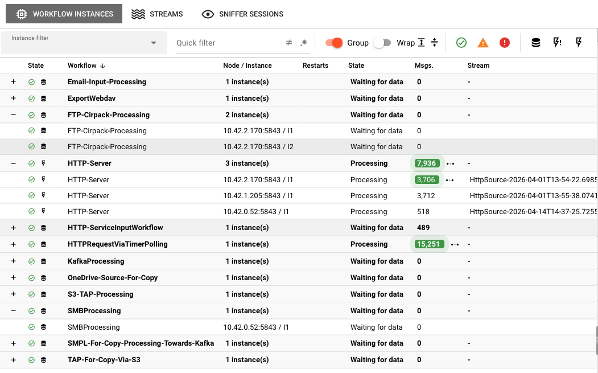
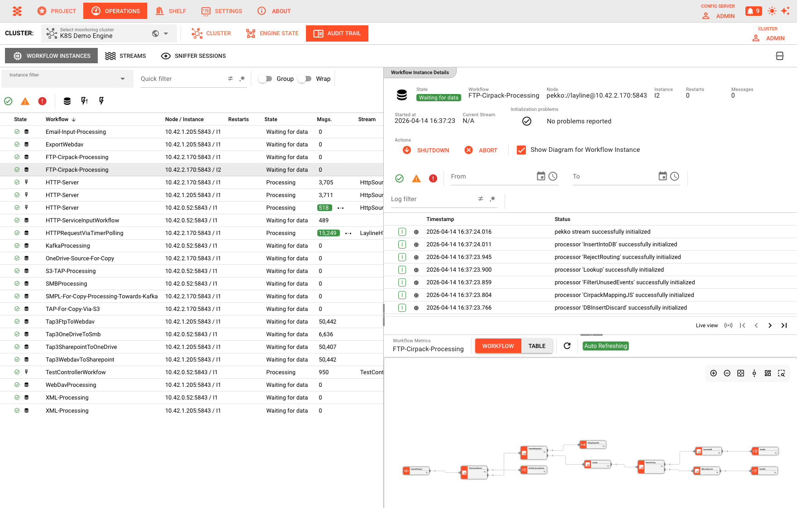
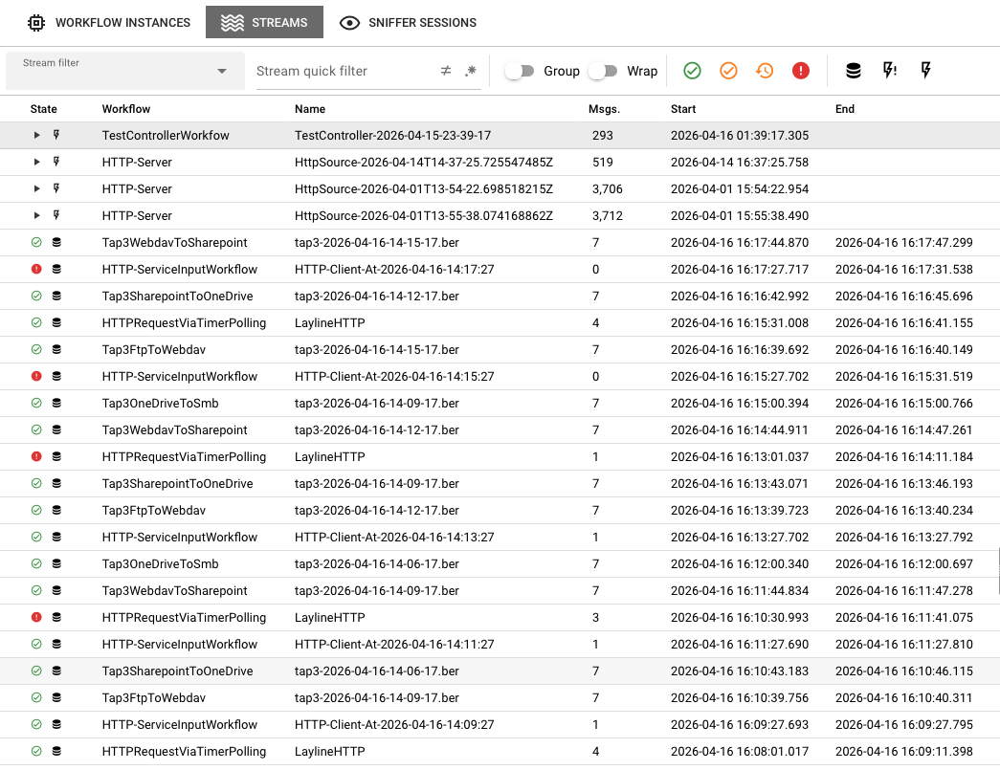
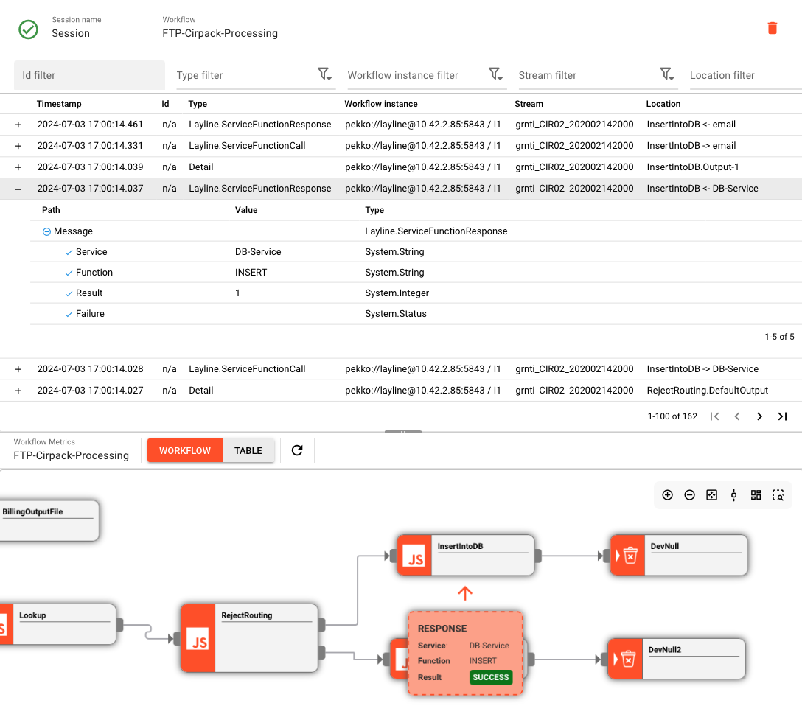
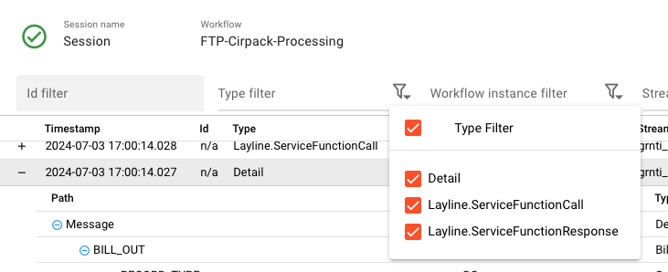
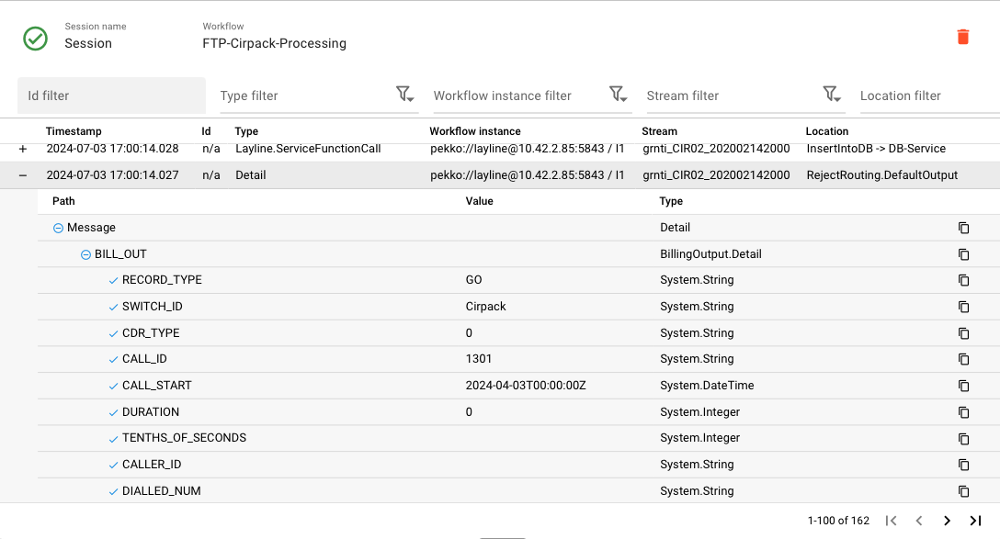

# Audit Trail

> The Audit Trail provides a comprehensive view of workflow executions, data streams, and message capture sessions for monitoring and debugging your layline.io deployments.

## Purpose

The Audit Trail is your operational window into what's happening inside your running workflows. While the [Engine State](../engine-state/) shows you the current configuration and status of assets, the Audit Trail shows you the actual execution history and live data flows. It's where you go to answer questions like:

- Which workflows are currently running and what state are they in?
- How many messages have flowed through a particular stream?
- What did a specific message look like as it passed through the system?
- Why did a workflow instance fail or restart?

The Audit Trail is organized into three distinct views, each serving a different operational need:

- **Workflow Instances** — See every execution of your workflows, their current state, and performance metrics
- **Streams** — Monitor data flows through your pipelines with lifecycle and throughput information
- **Sniffer Sessions** — Capture and inspect actual messages flowing through the system for deep debugging

## Prerequisites

Before using the Audit Trail, you need:

- A connected [cluster](../cluster/cluster-login) with running workflows
- Workflows deployed and actively processing data (for meaningful data to appear)
- Appropriate permissions to view operational data

## Navigation

The Audit Trail interface is organized around three main tabs and a split-view layout.

### View Tabs

At the top of the Audit Trail panel, three tabs let you switch between different operational views:

| Tab | Purpose |
|-----|---------|
| **Workflow Instances** | Browse and inspect workflow executions |
| **Streams** | Monitor data streams and their lifecycle |
| **Sniffer Sessions** | Create and manage message capture sessions |

### Split View Layout

Each tab uses a split-pane layout with two areas:

- **Master pane (left or top)** — Lists all items with filtering and grouping controls
- **Detail pane (right or bottom)** — Shows detailed information for the selected item

**Split Orientation Toggle** — Use the toolbar button to switch between:
- **Horizontal split** — Master on top, detail below
- **Vertical split** — Master on left, detail on right (default)

Your split position preference is saved per session.

## Workflow Instances Tab

The Workflow Instances tab shows every execution instance of your deployed workflows. This is the primary view for understanding what your system is doing right now and what it has done recently.

### Workflow Instance List

The master pane displays workflow instances in a table with the following columns:

| Column | Description |
|--------|-------------|
| **State** | Visual indicator showing the instance severity state and workflow type icon |
| **Workflow** | Name of the workflow this instance belongs to |
| **Node / Instance** | Cluster node address and instance identifier |
| **Restarts** | Number of times this instance has been restarted |
| **State** | Current state description text |
| **Msgs.** | Total number of messages processed by this instance |
| **Stream** | Name of the current stream associated with this instance |

### Toolbar Controls

The toolbar above the workflow instance table provides:

**Instance filter** — Select a predefined or custom filter from the dropdown to narrow the list.

**Quick filter** — Free-text filter with two toggle buttons:
- **Negate** — Invert the filter result
- **Regex** — Treat the filter text as a regular expression

**Group** — Toggle grouping by workflow. When enabled, instances are grouped under expandable workflow headers showing aggregate statistics (number of instances, restarts, state description, and total messages). Use the **Expand** and **Collapse** buttons to open or close all groups.

**State severity buttons** — Toggle visibility of instances by severity state:
- **OK** (green)
- **Warning** (yellow)
- **Error** (red)
- **Fatal** (dark red)

Rows with changing values are highlighted with a pulse animation. Message deltas show a tooltip with the change rate per second.

### Instance Details

Click any workflow instance to open the detail pane, which shows:

**Header fields**
- **State** — Current state as a color-coded badge
- **Workflow** — Workflow name
- **Node** — Cluster node running the instance
- **Instance** — Instance identifier
- **Restarts** — Restart count. When the instance is in `RESTART_BACKOFF` state, also shows the countdown to the next restart attempt
- **Messages** — Total messages processed
- **Started at** — Start timestamp
- **Current Stream** — Associated stream name (or "N/A")
- **Initialization problems** — Any failures encountered during startup

**Actions**
- **Shutdown** — Gracefully stop the current stream and terminate the workflow instance afterwards
- **Abort** — Abort the current stream and terminate the workflow instance afterwards
- **Terminate** — Terminate the current stream and the workflow instance afterwards
- **Show Diagram for Workflow Instance** — Toggle a workflow diagram viewer in the lower detail pane

The lower portion of the detail pane is split horizontally:
- **Top** — Live log output from the workflow instance
- **Bottom** — Workflow diagram viewer (when enabled)

## Streams Tab

The Streams tab monitors the lifecycle of data streams moving through your workflows.

### Stream List

The master pane displays active and historical streams:

| Column | Description |
|--------|-------------|
| **State** | Stream state icon and type icon |
| **Workflow** | The workflow this stream belongs to |
| **Name** | Stream name |
| **Msgs.** | Total messages in this stream |
| **Start** | When the stream opened |
| **End** | When the stream closed (blank if still open) |

### Toolbar Controls

**Stream filter** — Select a predefined or custom filter from the dropdown.

**Stream quick filter** — Free-text filter with negate and regex toggles.

**Log filter** — Appears when viewing archive pages (page > 1). Filters log output with negate and regex toggles.

**Group** — Toggle grouping by workflow, with expand/collapse controls.

**Live View / Pagination** — Streams start in Live View (page 1). Use the pagination controls to browse historical archive pages. Navigation buttons include first page, previous page, next page, and last page.

**History size** — Select how many archived streams to load per page (configurable via dropdown).

A progress indicator shows whether the view is in Live View or searching archives.

### Live View vs. Archive View

The Streams tab offers two distinct viewing modes for inspecting stream data:

**Live View**
When Live View is active, the table continuously updates with the most recent streams as they are created and closed in real time. This is the default mode when you first open the Streams tab. Use Live View when you want to monitor active data flows and react to changes as they happen.

**Archive View (Non-Live View)**
When you navigate away from page 1 using the pagination controls, the view switches to archive mode and displays a static snapshot of historical streams. In this mode, the table does not auto-update, allowing you to inspect a fixed set of past streams without the display shifting underneath you. Use archive view when investigating a specific time window or comparing stream behavior across historical pages.

### History Size

The **History size** setting controls how many stream log entries are retained and displayed per page. Once the configured limit is reached, older entries are discarded from the view as new streams arrive (in Live View), or the display is truncated to the most recent *N* entries (in archive view). Adjusting the history size lets you balance between visibility breadth and interface responsiveness:

- A **smaller history size** keeps the view focused and reduces memory usage
- A **larger history size** provides more context but may take longer to refresh

### Stream Lifecycle

Streams move through well-defined states:

| State | Description |
|-------|-------------|
| **OPEN** | Stream is actively receiving and/or emitting messages |
| **PAUSED** | Stream processing has been temporarily paused |
| **ABORT_REQUESTED** | An abort has been requested but not yet completed |
| **SHUTDOWN_REQUESTED** | A shutdown has been requested but not yet completed |

A closed stream has an `End` timestamp set.

### Stream Details

Click a stream to view its details in the detail pane:

**Header fields**
- **Stream name** — Name of the selected stream
- **Node address** — Cluster node running the stream
- **Workflow instance** — Identifier of the associated workflow instance

**Actions**
- **Pause** — Pause the stream processing (available when state is `OPEN`)
- **Resume** — Resume the stream processing (available when state is `PAUSED`)
- **Shutdown** — Shutdown the current stream and terminate the workflow instance afterwards
- **Abort** — Abort the current stream and terminate the workflow instance afterwards
- **Terminate** — Terminate the aborting stream

The lower portion of the detail pane shows the live log output from the stream.

## Sniffer Sessions Tab

Sniffer Sessions are diagnostic tools that capture actual messages flowing through your workflows for inspection.

### Sniffer Session List

The master pane shows all active and historical sniffer sessions:

| Column | Description |
|--------|-------------|
| **State** | Session state icon (play for active, checkmark for closed) |
| **Workflow** | Target workflow for this session |
| **Name** | User-defined or auto-generated session name |
| **Messages** | Number of messages captured |
| **Start** | When the session began |
| **End** | When the session closed (blank if active) |

### Toolbar Controls

**Create Session** — Open the dialog to create a new sniffer session.

**Sniff filter** — Select a predefined or custom filter from the dropdown.

**Quick filter** — Free-text filter with negate and regex toggles.

**Close / Delete** — Close the selected active session, or delete the selected closed session.

### Creating a Sniffer Session

1. Click **Create Session** to open the session creation dialog
2. In the **Workflow selection** tree on the left, select a workflow or a specific workflow instance
3. Configure the **Session parameter** on the right:
   - **Workflow / workflow instance** — Read-only confirmation of the selected target
   - **Name of the session** — Defaults to "Session"
   - **Maximum number of messages in session** — Auto-close after this many messages
   - **Maximum duration of session [sec]** — Auto-close after this many seconds
4. Choose a **Trigger mode**:
   - **Sniff all messages** — Capture every message on the target
   - **Sniff messages of first new stream** — Start capturing when the first new stream appears
   - **Sniff messages of first reporting instance** — Start capturing when the first instance reports
   - **Sniff messages of first reporting stream** — Start capturing when the first stream reports
5. Click **OK** to start the session

### Session Details

Select a session to view its details. The detail pane shows:

**Header fields**
- **Session name** — Name of the sniffer session
- **Workflow** — Target workflow name

**Actions**
- **Close** — End an active session and preserve captured data
- **Delete** — Remove a closed session and free storage

The remainder of the detail pane is the **Sniffer Message View**.

### Sniffer Message View

The Sniffer Message View is split horizontally:
- **Top** — Message table with filtering controls
- **Bottom** — Workflow diagram viewer (optional, toggle via checkbox)

#### Message Table Filters

The toolbar above the message table provides:

- **Id filter** — Filter by message ID
- **Type filter** — Quick text filter plus a dropdown menu to include/exclude specific message types
- **Workflow instance filter** — Quick text filter plus a dropdown menu to include/exclude specific workflow instances
- **Stream filter** — Quick text filter plus a dropdown menu to include/exclude specific streams
- **Location filter** — Quick text filter plus a dropdown menu to include/exclude specific locations
- **Message filter** — Quick text filter on message content
- **Show Workflow** — Toggle the workflow diagram viewer in the bottom pane

#### Message Table

The message table displays captured messages with the following columns:

| Column | Description |
|--------|-------------|
| **Timestamp** | When the message was captured |
| **Id** | Message identifier (or "n/a") |
| **Type** | Message type |
| **Workflow instance** | Node address and instance ordinal number |
| **Stream** | Stream name |
| **Location** | Processing location within the workflow |

Click the **expand** button on any row to reveal the full message content in a tree view. Click the row itself to select the message and highlight its location in the workflow diagram viewer (when enabled).

#### Pagination

The message table supports pagination with the following controls:
- **Live View** — Jump to the latest messages (for open sessions)
- **First page**, **Previous page**, **Next page**, **Last page**

A page description shows the current message range.

## Common Workflows

### Investigating a Failed Workflow

1. Go to the **Workflow Instances** tab
2. Use the state severity buttons to filter by error/fatal states, or look for red indicators
3. Click the failed instance to view details
4. Check the **State** badge and **Initialization problems** for failure information
5. Review the live log in the detail pane for stack traces and error messages
6. Switch to the **Streams** tab and browse streams for the same workflow
7. Create a **Sniffer Session** on the workflow to capture sample messages and compare them against expected formats

### Monitoring High-Volume Data Flows

1. Go to the **Streams** tab
2. Enable **Group** to see aggregate volumes per workflow
3. Sort by the **Msgs.** column to identify highest-throughput streams
4. Look for streams stuck in `ABORT_REQUESTED` or `SHUTDOWN_REQUESTED` state (indicates potential termination issues)
5. Use **Sniffer Sessions** with message count limits to sample traffic

### Debugging Message Processing Issues

1. Identify the workflow with issues in **Workflow Instances**
2. Note the **Current Stream** in the instance details
3. Go to **Sniffer Sessions** and create a new session targeting the workflow
4. Configure a **Maximum number of messages** limit and an appropriate **Trigger mode**
5. Once messages are captured, use the message table filters to narrow to messages of interest
6. Expand rows to inspect full message content in the tree view
7. Enable **Show Workflow** to correlate messages with their processing location in the diagram

## See Also

- [**Engine State**](../engine-state/) — View current runtime state of workflows, services, and connections
- [**Alarm Center**](../cluster/alarm-center) — Real-time alerts for operational issues
- [**Stream Monitor**](../cluster/stream-monitor) — Controller-level stream observation and management
- [**Cluster Node Detail**](../cluster/cluster-node-detail) — Deep-dive into node logs and metrics
- [**Workflow Assets**](../../.index_images/workflow-assets/) — Designing the workflows you monitor in Audit Trail
