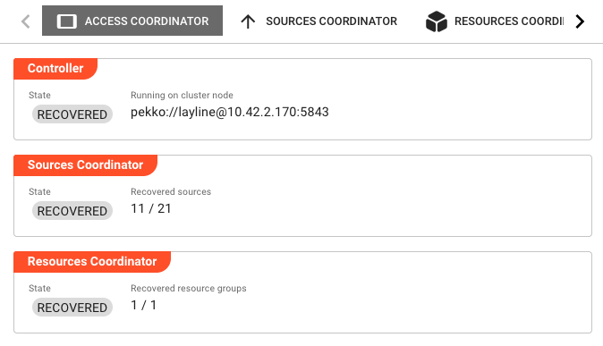
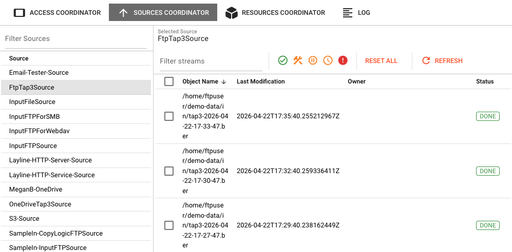
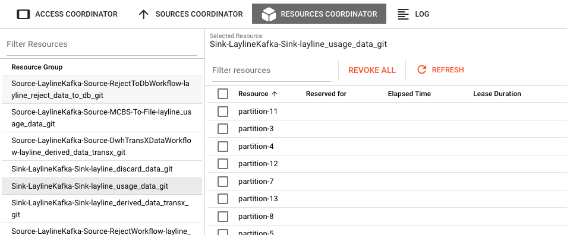
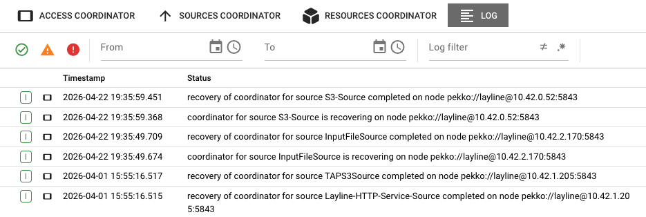

# Access Coordinator

> A control center for managing source access and resource allocation across the cluster.

## Purpose

The Access Coordinator provides visibility and control over two critical cluster coordination mechanisms: the Sources Coordinator, which manages access to external data sources, and the Resources Coordinator, which manages leased resources like database connections or API rate limits. Use this view to monitor recovery status, inspect individual objects and resources, and perform administrative actions when needed.

## Access Coordinator Tab

The overview tab displays the current state of the Access Coordinator controller and its two sub-coordinators.

### Controller Section

**State** — Current state of the Access Coordinator controller (e.g., `RECOVERED`, `RUNNING`).

**Running on cluster node** — The address of the Reactive Engine node hosting the Access Coordinator controller (e.g., `pekko://layline@127.0.0.1:5843`).

### Sources Coordinator Section

**State** — Current state of the Sources Coordinator (e.g., `RECOVERED`, `INITIALIZING`).

**Recovered sources** — Shows the count of recovered sources versus total sources (e.g., `11 / 21`). Sources represent external systems that the cluster connects to for reading data.

### Resources Coordinator Section

**State** — Current state of the Resources Coordinator (e.g., `RECOVERED`, `INITIALIZING`).

**Recovered resource groups** — Shows the count of recovered resource groups. Resource groups are logical collections of related resources (like connection pools) that can be leased by workflows.

## Sources Coordinator Tab

The Sources Coordinator tab provides detailed visibility into source access management. It shows a two-panel split view: sources on the left and their associated objects on the right.

### Sources Panel (Left)

A table listing all registered sources. Click a source to view its objects in the right panel.

**Filter Sources** — A search field to filter the sources list by name.

### Objects Panel (Right)

Shows objects associated with the selected source. Objects represent individual files, messages, or data items that are being accessed or have been accessed by the cluster.

**Selected Source** — Displays the name of the currently selected source.

The objects table includes these columns:

| Column | Description |
|--------|-------------|
| **Object Name** | The name or display name of the object |
| **Last Modification** | Timestamp of the last modification |
| **Owner** | The workflow or component that currently owns/leased this object |
| **Status** | Current state of the object (e.g., `DONE`, `ACQUIRED`, `PENDING`, `WAIT_FOR_CLEARANCE`, `FAILURE`) |

#### Object Status Meanings

| Status | Description |
|--------|-------------|
| **DONE** | The object has been successfully processed and is considered complete. |
| **ACQUIRED** | Processing for this object has started and is currently in progress. |
| **PENDING** | The object is waiting to be processed. |
| **WAIT_FOR_CLEARANCE** | The object is ready to be processed but requires explicit clearance before processing begins. This can occur when a source is configured with **Wait for processing clearance** enabled. |
| **FAILURE** | Processing of the object has failed. |

### Stream Processing and Duplicate Prevention

The Sources Coordinator maintains a record of every object (stream) that has been processed. **By default, once an object has been processed (reaches `DONE` status), the Sources Coordinator will prevent it from being processed again.** This duplicate-prevention mechanism ensures data integrity and prevents accidental reprocessing of the same files or messages.

If you attempt to process a stream with the same name again—for example, by placing a file with an identical name in the source directory—the Sources Coordinator will recognize it as already processed and prohibit reprocessing, unless the source asset has been explicitly configured to allow duplicates.

#### Reprocessing Objects

To reprocess an object that has already been processed (has `DONE` status), you must first remove its processed state from the Sources Coordinator:

1. Navigate to the **Sources Coordinator** tab
2. Select the source containing the object you want to reprocess
3. Find the object in the objects table (it will have `DONE` status)
4. Select the object(s) and click **Reset Selected Objects** in the toolbar

Alternatively, use **Reset All Objects** to clear the processed state for all objects in the selected source. After resetting, the objects will return to their initial state and can be processed again.

:::caution
Resetting objects should be done with caution in production environments. Ensure that reprocessing will not cause unintended side effects, such as duplicate records in downstream systems.
:::

### Toolbar Actions

The toolbar above the objects table provides these actions:

**Filter** — Opens a filter dialog to show/hide objects by status (Accessible, Locked, Wait for Clearance, etc.).

**Reset All Objects** — Resets all objects for the selected source to their initial state, allowing them to be reprocessed.

**Reset Selected Objects** — Resets only the selected objects to their initial state.

**Give Clearance** — Grants clearance to selected objects that are waiting for clearance (`WAIT_FOR_CLEARANCE` status). This action is only applicable when a source is configured with **Wait for processing clearance** enabled.

**Refresh** — Reloads the objects list from the cluster.

## Resources Coordinator Tab

The Resources Coordinator tab manages resource allocation across the cluster. Like the Sources Coordinator, it uses a two-panel split view: resource groups on the left and individual resources on the right.

### Resource Groups Panel (Left)

A table listing all resource groups. Click a group to view its resources in the right panel.

**Filter Resources** — A search field to filter the resource groups list by name.

### Resources Panel (Right)

Shows resources within the selected resource group. Resources represent leasable items like database connections, API tokens, or processing slots.

**Selected Resource** — Displays the name of the currently selected resource group.

The resources table includes these columns:

| Column | Description |
|--------|-------------|
| **Resource** | The name of the resource |
| **Reserved for** | The workflow or component that currently holds the lease |
| **Elapsed Time** | How long the resource has been leased |
| **Lease Duration** | The maximum lease duration configured for this resource |

### Understanding Resource Leases

Resource groups and leases are used for managing limited resources that require exclusive access. A common example is Kafka partitions, where a partition is reserved by one specific Workflow instance to ensure transactional security and prevent multiple workflows from processing the same partition simultaneously.

- **Elapsed Time** indicates how long the resource has been reserved by the current owner
- **Lease Duration** indicates how long the resource will remain reserved before the lease expires
- These values are optional and may not be populated for all resource types

When a lease expires or is revoked, the resource becomes available for other workflows to acquire.

### Toolbar Actions

**Filter** — Opens a filter dialog to refine which resources are displayed.

**Revoke All Resources** — Immediately revokes all leases for the selected resource group, making all resources available again.

**Revoke Selected Resources** — Revokes leases only for the selected resources.

**Refresh** — Reloads the resources list from the cluster.

## Log Tab

Shows the live log of the Access Coordinator. Log entries include timestamps and status messages related to coordinator initialization, recovery events, and resource management activities.

Log entries can be filtered by date range using the **From** and **To** fields, and by severity level using the **Severity** dropdown.

The log provides visibility into:
- Coordinator recovery processes (when nodes restart or fail over)
- Source coordinator state changes
- Resource allocation and revocation events
- Errors and warnings related to coordination activities

## See Also

- [**Cluster Monitor**](/docs/operations/cluster/cluster-monitor) — Monitor the overall cluster controller state
- [**Engine State**](/docs/operations/engine-state) — Drill into individual workflow and component states per engine
- [**Scheduler**](/docs/operations/cluster/scheduler) — Understand how workloads are distributed across nodes
