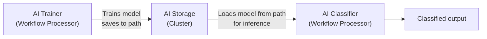

# AI Storage

> A cluster-wide repository for trained machine learning models — browse the model hierarchy, inspect model metadata and attributes, and import new model versions.

## Purpose

AI Storage is the central repository where trained machine learning models live on a layline.io cluster. Models are organized in a hierarchical folder structure and versioned, allowing workflows to reference specific model versions by path. The AI Storage view lets you inspect the storage controller state, browse the model tree, view detailed information about model versions, and import new trained models.

The AI Storage interface is divided into two tabs:
- **AI storage** — Controller status and model browser with a split-pane tree/details view
- **Log** — Real-time logs from the AI storage component

---

## AI Storage Tab

The main tab displays controller information at the top, with a split-pane view below containing the model tree on the left and details panel on the right.

### Controller Information

The Controller panel shows the current state of the AI Storage component:

**State** — Current operational state of the AI storage controller.

**Running on cluster node** — The address of the cluster node that currently hosts the active AI storage controller instance.

---

### AI Models Panel

The main content area is a split-pane view with the model tree on the left and details on the right.

#### Model Tree (Left Pane)

The tree view displays the hierarchical organization of AI models within the storage:

| Node Type | Icon | Description |
|-----------|------|-------------|
| **AI Storage** (root) | Database icon | The root of the model hierarchy. All folders and models exist under this node. |
| **Folder** | Folder icon | A logical grouping container for organizing models. Folders can be nested. |
| **Model** | Table icon | A named model entry. Each model can have multiple versions. |
| **Model Version** | AI model icon (primary color) | A specific version of a model, with timestamp and version number. |

**Tree Toolbar Actions:**

- **Filter models** — Text input to filter the tree by model or folder name. Shows a filter menu button and a clear button when active.
- **Expand tree** — Expands all folders to show the complete hierarchy.
- **Collapse tree** — Collapses all folders to show only top-level items.

**Context Menu (appears when selecting a node):**

Right-clicking a selected node or clicking the dropdown button reveals actions:

- **Create folder** (folders only) — Creates a new subfolder under the selected folder.
- **Import model** — Opens the import dialog to upload a trained model file.
- **Copy path** — Copies the fully qualified path of the selected node to the clipboard.
- **Rename path** — Renames the selected folder or model.
- **Delete path** — Permanently deletes the selected folder, model, or version.

#### Model Details (Right Pane)

The right side of the split pane shows context-sensitive information based on the selected tree node.

**Folder Selected**

Displays a **Folder info** panel showing:

- **Folder** — The fully qualified path of the selected folder (e.g., `/MyModels/Classification`).

**Model Selected**

Displays a **Model info** panel showing:

- **Model** — The fully qualified path of the selected model (e.g., `/MyModels/Classification/FraudDetector`).
- **Model type** — The type/description of the model, determined by the model's internal metadata (shown if versions exist).

**Model Version Selected**

Displays a **Model version info** panel with comprehensive details:

- **Model** — The fully qualified path including version (e.g., `/MyModels/Classification/FraudDetector:V3`).
- **Model type** — The model type description from the model's metadata.
- **Version** — The version number of this specific model instance.
- **Digest** — A cryptographic hash uniquely identifying this model version.
- **Created at** — Timestamp when this version was imported.
- **Created by** — The user who imported this model version.
- **Input attributes** — A table showing the expected input attributes for this model:
  - **Name** — Attribute name
  - **Data dictionary type** — The data type expected
- **Output attributes** — A table showing the model's output attributes:
  - **Name** — Attribute name
  - **Data dictionary type** — The data type produced

**Import Button**

At the top of the details panel is an **Import an AI model...** button. This opens the import dialog, pre-filled with the path of the currently selected node (if any).

---

## Importing AI Models

To add a new model or model version to the storage:

1. Select a folder or model in the tree (or the root "AI Storage" node)
2. Click **Import an AI model...** in the details panel, or select **Import model** from the context menu
3. In the import dialog:
   - **Target model path in the AI storage** — The fully qualified path where the model will be stored (e.g., `/MyModels/Classifier`). If importing to an existing model, this creates a new version.
   - **File containing the trained model** — Drag and drop or select a trained model file. The file format depends on the model type (e.g., PMML, H2O, Weka, etc.).
4. Click **OK** to upload. The model is validated, versioned automatically, and added to the tree.

---

## Managing the Model Hierarchy

### Creating Folders

Organize models using folders:

1. Select a folder (or the root "AI Storage")
2. Choose **Create folder** from the context menu
3. Enter the new folder path (the dialog pre-fills with the current path)
4. Valid paths must match the pattern: `/folderName` or `/folderName/subFolderName` (alphanumeric plus `_.()?!$%&-` characters)

### Renaming and Moving

Rename or move models and folders:

1. Select the node to rename
2. Choose **Rename path** from the context menu
3. Enter the new path

:::note
Renaming a model or folder changes its fully qualified path. Any workflow assets referencing the old path will need to be updated.
:::

### Copying

Copy models or folders between locations or clusters:

1. Select the node
2. Choose **Copy path** from the context menu — this copies to the internal clipboard
3. Navigate to the target location
4. Choose **Paste** (if available) to create a copy

### Deleting

Remove models, folders, or specific versions:

1. Select the node to delete
2. Choose **Delete path** from the context menu
3. Confirm the deletion

:::caution
Deleting a folder removes all models and versions within it. Deleting a model removes all its versions. This action cannot be undone.
:::

---

## Log Tab

The Log tab displays real-time logs from the AI storage component. This is useful for:

- Troubleshooting model import failures
- Monitoring model loading and validation
- Debugging version conflicts

The log view uses the same shared log component as other Operations pages. Events can be selected to inspect details.

---

## Behavior

- The model tree refreshes automatically after import, create, rename, copy, or delete operations.
- Model versions are immutable — once imported, a version cannot be modified. Importing to the same model path creates a new version.
- The version number increments automatically for each import to the same model path.
- The digest field provides a unique fingerprint of the model file content for verification.
- Input and output attributes are extracted from the model file metadata during import and displayed in the version details.
- The internal clipboard for copy/paste operations is scoped to the layline.io application session.

---

## Relationship to Other AI Components

AI Storage is the central hub in layline.io's machine learning pipeline. Understanding how it connects to other components is essential for designing effective AI-powered workflows.

### The AI Pipeline

### AI Trainer → AI Storage

The [**AI Trainer**](/docs/assets/workflow-assets/processors-flow/asset-flow-ai-trainer) processor trains machine learning models from message data within a Workflow. When training completes, the trained model is automatically stored in AI Storage at a configurable path (e.g., `/models/fraud-detector`). Each training run creates a new **version** of the model at that path — V1, V2, V3, and so on.

**Key point:** The path you configure in the AI Trainer's "Target model path in the AI storage" setting becomes the address where all versions of that model live.

### AI Storage → AI Classifier

The [**AI Classifier**](/docs/assets/workflow-assets/processors-flow/asset-flow-ai-classifier) processor uses trained models to classify messages in real time. It references models by their **path in AI Storage**:

- **`/models/fraud-detector`** — Uses the model at this path (defaults to latest version)
- **`/models/fraud-detector:latest`** — Explicitly uses the most recent version
- **`/models/fraud-detector:3`** — Uses a specific version (V3 in this example)

**Why the path matters:** The AI Classifier does not embed the model file — it loads it from AI Storage at runtime. This means:
- You can update a model (create a new version in AI Storage) without modifying the Workflow
- Multiple Workflows can share the same model by referencing the same path
- You can pin a Workflow to a specific model version for reproducibility, or use `:latest` to always get the newest trained version

### AI Model Resource

Both the AI Trainer and AI Classifier require an [**AI Model Resource**](/docs/assets/workflow-assets/resources/asset-resource-ai-model) asset. This Resource defines:
- The model type (e.g., J48 Decision Tree, Multilayer Perceptron)
- Input and output attribute schemas
- Training hyperparameters

The AI Model Resource is the **schema contract** — AI Storage holds the **trained model files** that conform to that schema.

### AI Service

The [**AI Service**](/docs/assets/workflow-assets/services/asset-service-ai) provides additional AI capabilities for workflows, such as accessing external AI models or services. Unlike the Classifier/Trainer which use models from AI Storage directly, the AI Service may interact with external AI endpoints.

---

## See Also

- [**Cluster Login**](cluster-login.md) — How to connect to a cluster
- [**AI Service**](/docs/assets/workflow-assets/services/asset-service-ai) — Service for executing AI models in workflows
- [**AI Classifier Processor**](/docs/assets/workflow-assets/processors-flow/asset-flow-ai-classifier) — Flow processor for real-time classification using AI models
- [**AI Trainer Processor**](/docs/assets/workflow-assets/processors-flow/asset-flow-ai-trainer) — Flow processor for training models from streaming data
- [**AI Model Resource**](/docs/assets/workflow-assets/resources/asset-resource-ai-model) — Resource asset for managing AI model configurations
