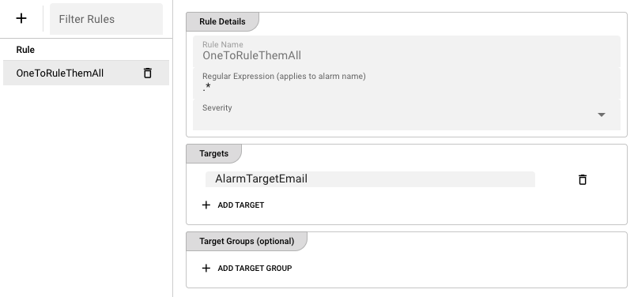

# Rules

**Rules** determine which alarm notifications are sent to which targets or target groups. Each rule defines a **regular expression** that is matched against the alarm name, plus an optional **severity filter**. When an alarm matches, the rule routes it to the configured targets.

## Layout

The tab is split vertically:

- **Left** — Table of all rules.
- **Right** — Details panel for the selected rule.

## Rules table

The table has two columns:

| Column | Description |
|--------|-------------|
| **Rule** | The name of the rule. |
| **Actions** | A remove button appears for the selected rule. |

### Toolbar actions

- **Add Rule** — Opens a prompt to name and create a new rule.
- **Filter Rules** — Quick text filter by rule name.
- **Refresh** — Reloads the rule list from the cluster.

### Adding a rule

Click **Add Rule**, enter a unique name, and confirm. The new rule is created with:

- An empty regular expression (`.*` behavior is not automatic; you must fill it in)
- No severity filter
- No targets
- No target groups

Select the rule to edit its details.

### Removing a rule

Select the rule and click the trash icon, then confirm. Deleting a rule stops all routing it performed; alarms that previously matched will no longer be forwarded to those targets.

## Rule details

The right panel contains three sections: **Rule Details**, **Targets**, and **Target Groups**.

### Rule Details

| Field | Description |
|-------|-------------|
| **Rule Name** | The rule name (read-only). |
| **Regular Expression** | A JavaScript-compatible regular expression applied to the alarm name. If the alarm name matches, the rule is triggered. An invalid regex is highlighted with a validation error. |
| **Severity** | Optional. If set, the rule only matches alarms of the selected severity. If left empty, the rule matches all severities. Valid values are `Error`, `Warning`, and `Info`. |

### Targets

A table listing the individual **alarm target names** that should receive notifications when this rule matches.

- **Add Target** — Appends a new target entry.
- **Remove Target** — Deletes the selected row.
- **Duplicate detection** — If the same target name appears twice, the row is marked with a red failure icon and a "Duplicate target" tooltip.

Enter the exact name of an existing target in each row.

### Target Groups (optional)

A table listing the **target group names** that should also receive notifications.

- **Add Target Group** — Appends a new group entry.
- **Remove Target Group** — Deletes the selected row.
- **Dropdown selector** — Each row has a dropdown arrow that lists all existing target groups, making it easy to pick one without typing.
- **Duplicate detection** — Duplicate entries are marked in red.

### Saving changes

After editing any field, an **Apply Changes** button appears in the bottom-right. The save is blocked until all validation passes (valid regex, no empty names, no duplicates).

## How rule matching works

When an alarm is raised, the Alarm Center evaluates all rules in the following way:

1. The alarm **name** is tested against each rule's **Regular Expression**.
2. If the rule has a **Severity** set, the alarm's severity must also match.
3. If both conditions pass, the alarm is routed to every target and every member of every target group listed in the rule.

:::tip
Rules are independent. An alarm can match multiple rules and therefore be sent to many different targets simultaneously. There is no "first match wins" logic.
:::

## Example rules

| Rule name | Regular Expression | Severity | Targets / Groups | Effect |
|-----------|-------------------|----------|------------------|--------|
| `all-errors` | `.*` | `Error` | `email-oncall` | Every error alarm goes to the on-call email target. |
| `connection-issues` | `Connection.*` | (any) | `teams-ops`, `email-ops` | Any alarm whose name starts with "Connection" goes to both targets. |
| `scheduler-warnings` | `Scheduler.*` | `Warning` | `ops-group` | Scheduler warnings go to the `ops-group` target group. |
