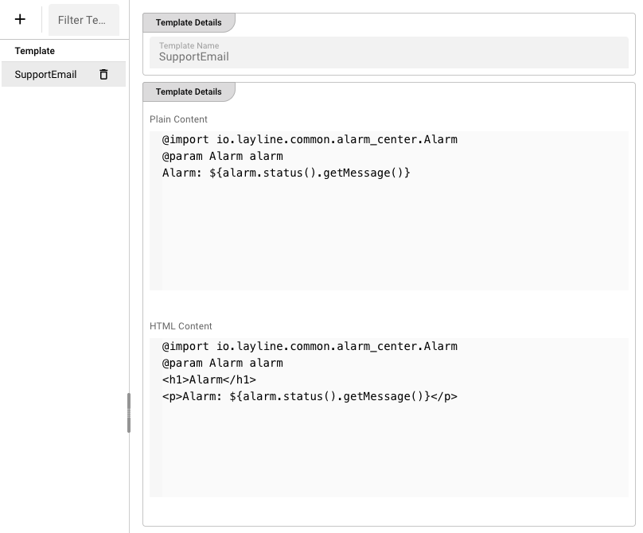

# Templates

**Templates** control the content of alarm notifications sent to Email and Microsoft Teams targets. Each template provides two versions of the message:

- **Plain Content** — Text-only format used by clients that do not support HTML.
- **HTML Content** — Rich formatting used when the target or mail configuration has **Use HTML** enabled.

## Layout

The tab is split vertically:

- **Left** — Table of all templates.
- **Right** — Details panel for the selected template.

## Templates table

The table has two columns:

| Column | Description |
|--------|-------------|
| **Template** | The name of the template. |
| **Actions** | A remove button appears for the selected template. |

### Toolbar actions

- **Add Template** — Opens a dialog to name and create a new template.
- **Filter Templates** — Quick text filter by template name.
- **Refresh** — Reloads the template list from the cluster.

### Adding a template

Click **Add Template**, enter a unique name, and confirm. The new template is created with default content that demonstrates the variable syntax. It is automatically selected for editing.

### Removing a template

Select the template and click the trash icon, then confirm. Deleting a template breaks any target or mail configuration that references it by name.

:::warning
Before deleting a template, check your [Alarm Targets](./targets) to make sure no mail, chat, or channel is still using it.
:::

## Template details

The right panel shows three sections when a template is selected.

### Template Name

The name is displayed read-only. To rename a template you must delete it and recreate it.

### Plain Content

A code editor for the text-only version of the notification. The language mode is plain text.

### HTML Content

A code editor for the HTML version of the notification. The language mode is HTML, so syntax highlighting is active.



## Template syntax

Both Plain and HTML content are evaluated as templates that can reference the alarm object. The default template created by layline.io uses the following preamble:

```
@import io.layline.common.alarm_center.Alarm
@param Alarm alarm
```

After the preamble, you can use `${...}` expressions to insert alarm data.

### Common variables

| Expression | Description |
|------------|-------------|
| `${alarm.status().getMessage()}` | The alarm status message (the same text shown in the Alarms detail panel). |
| `${alarm.name()}` | The alarm name. |
| `${alarm.severity()}` | The alarm severity (`Error`, `Warning`, or `Info`). |
| `${alarm.node()}` | The node that raised the alarm. |
| `${alarm.raised()}` | The epoch timestamp when the alarm was raised. |

### Example: Plain Content

```
@import io.layline.common.alarm_center.Alarm
@param Alarm alarm
Alarm: ${alarm.status().getMessage()}
Severity: ${alarm.severity()}
Node: ${alarm.node()}
```

### Example: HTML Content

```html
@import io.layline.common.alarm_center.Alarm
@param Alarm alarm
<h1>Alarm: ${alarm.name()}</h1>
<p><strong>Severity:</strong> ${alarm.severity()}</p>
<p><strong>Message:</strong> ${alarm.status().getMessage()}</p>
<p><strong>Node:</strong> ${alarm.node()}</p>
```

## How templates are used

Templates are referenced by name in the **Alarm Targets** configuration:

- **Email** — Each mail definition has a **Subject Template** and a **Body Template** field. Enter the template name there.
- **Teams** — Each chat or channel has a **Body Template** field. Enter the template name there.

When an alarm is routed to a target, the Alarm Center looks up the referenced template, evaluates it with the current alarm object, and sends the resulting plain and/or HTML content.

:::tip
If a target has **Use HTML** enabled but the HTML Content of the template is empty, the plain content is sent as a fallback.
:::

### Saving changes

When you edit either content area, an **Apply Changes** button appears in the bottom-right corner. Click it to save the template to the cluster.
