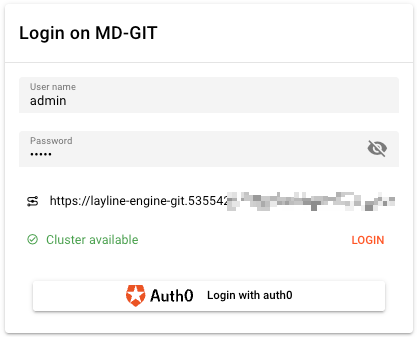
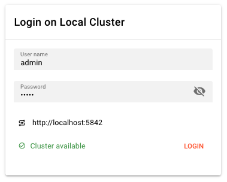
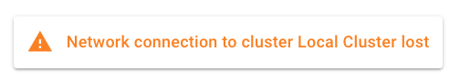
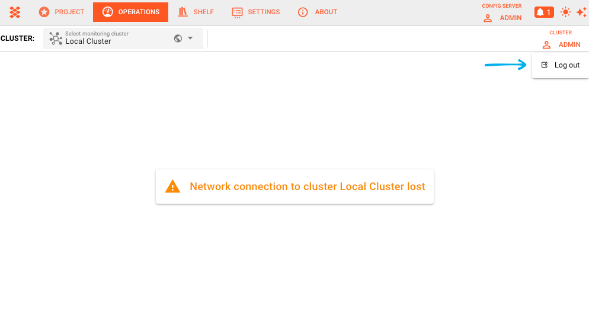

# Cluster Login

> The authentication gateway to your layline.io cluster, supporting both username/password and OpenID Connect / identity provider login.

## Purpose

Before you can monitor or manage a layline.io cluster through the Configuration Center, you must authenticate with it. The Cluster Login panel provides the interface for establishing this connection. It handles the authentication handshake, validates that the cluster is reachable, and manages the lifecycle of your session including token expiry and automatic logout.

## Prerequisites

- A running layline.io cluster with at least one reachable node
- Valid credentials (either local username/password or identity provider access)
- Network connectivity between your Configuration Center and the cluster

## Login Flow

### Username / Password Login

The standard login method uses credentials stored in the cluster's user database.

**User name** — Your login identifier for the cluster. This is typically assigned by your cluster administrator.

**Password** — Your authentication secret. Click the visibility toggle (eye icon) to show or hide the password while typing.

After entering credentials, click **Login** to authenticate. The system validates your credentials against the cluster's user store and establishes a session.

### OpenID Connect / Identity Provider Login

If your cluster is configured to use external identity providers (IdP), additional login buttons appear below the password field. These enable authentication through:

- Corporate SSO systems (Okta, Azure AD, Auth0, etc.)
- Social identity providers (Google, GitHub, etc.)
- Custom OIDC-compatible services

Click the provider button to initiate the OAuth/OIDC flow. You will be redirected to the provider's authentication page, then returned to the Configuration Center upon successful authentication.

## Connection Status

Before and during login, the panel displays the cluster's availability status:

### Connection Checking

While attempting to reach the cluster, a spinner displays with the message "Trying to contact cluster...". This indicates the Configuration Center is:

- Resolving the cluster node address
- Testing network connectivity
- Verifying the cluster API is responsive

### Cluster Available

When the cluster responds successfully:

- A green checkmark appears
- The message "Cluster available" displays
- The **Login** button becomes active

This indicates the cluster is ready to accept authentication requests.

### Cluster Not Available

If the cluster cannot be reached:

- A red error icon appears
- The message "Cluster not available" displays
- The **Login** button remains disabled

Common causes include:
- Network connectivity issues
- Cluster node is offline or restarting
- Firewall blocking the connection
- Incorrect cluster URL configuration

The system automatically retries the connection check every 3 seconds.

## Session Management

### Token Expiry and Auto-Logout

For security, sessions automatically expire after a period of inactivity. When this occurs:

- An orange banner appears: "You were logged out due to inactivity"
- Your current context (selected cluster, open panels) is preserved
- You must re-authenticate to resume operations

Login again to restore your session. You will return to the same operational context you were viewing before logout.

<!-- This state is described in text; no screenshot available in .cluster-login_images/ -->

### Connection Lost State

If the network connection to the cluster is lost while you are logged in:

- A warning modal appears: "Network connection to cluster [name] lost"
- Active monitoring and control operations are suspended
- The system periodically attempts to reconnect

Once connectivity is restored, you may need to re-authenticate depending on how long the interruption lasted and your cluster's session policies.

### Manual Logout

When logged in, your username appears in the top-right corner of the Operations interface:

1. Click your username to open the account menu
2. Select **Log out** to end your session

This immediately terminates your session and returns you to the login panel.

## Troubleshooting

### Cannot reach cluster

- Verify the cluster URL in your connection settings
- Check that at least one cluster node is running
- Confirm no firewall rules block the connection
- Try connecting from a different network

### Authentication failures

- Double-check username spelling and password caps lock
- Verify your account exists on the target cluster
- For IdP login, ensure your provider session hasn't expired
- Contact your cluster administrator if credentials are rejected

### Session expires too quickly

Session timeout is configured by your cluster administrator. If you need longer sessions for operational work, request a policy adjustment from your admin.

## See Also

- [**Cluster Overview**](./cluster-overview) — High-level cluster health and node status
- [**Access Coordinator**](./access-coordinator) — Managing access to cluster sources and resources
- [**Operations User Storage**]( ./operations-user-storage) — User-specific operational data and preferences
