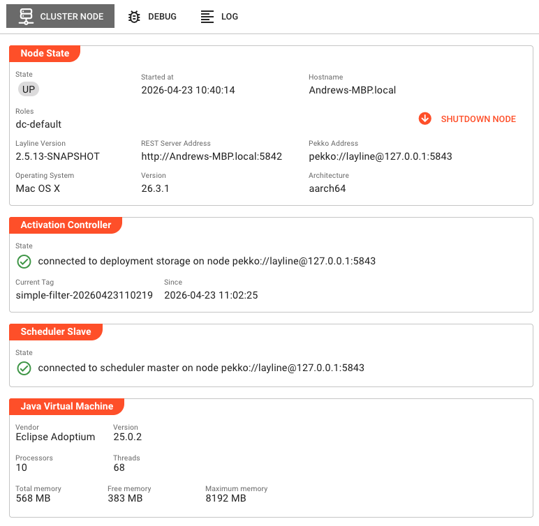
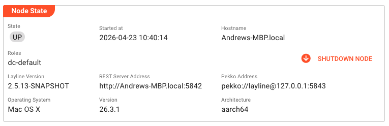
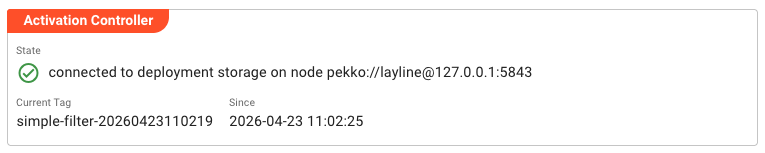
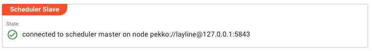
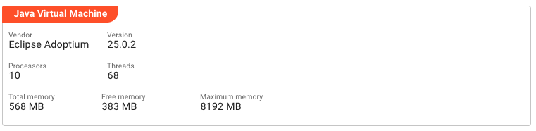
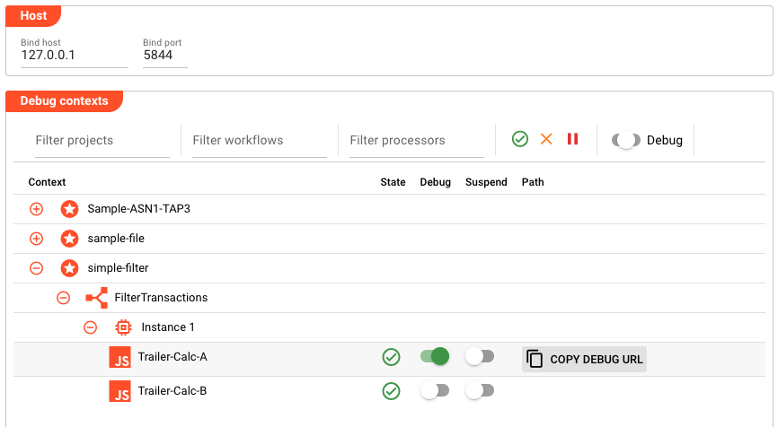
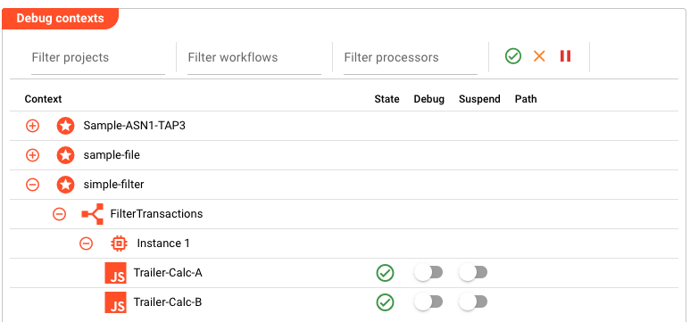
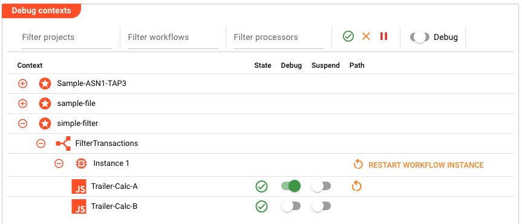
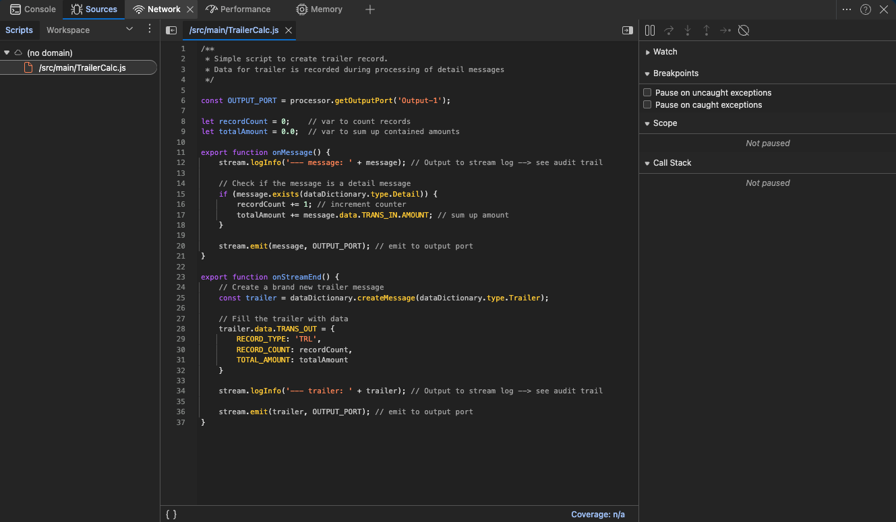
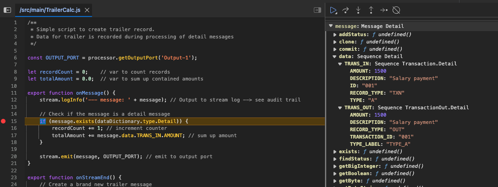

# Cluster Node Detail

> Inspect individual cluster nodes including runtime information, debug controls, and log access.

## Purpose

The Cluster Node Detail view provides deep visibility into a single Reactive Engine node's runtime state. When you select a node from the Cluster tree, this panel displays comprehensive information about the node's health, configuration, and operational status. It also provides tools for debugging workflows running on that node and accessing its logs.

The interface is organized into three tabs:
- **Cluster Node**: Overview of node status, activation state, and JVM metrics
- **Debug**: Attach a debugger and manage debug contexts for workflows
- **Log**: View node-specific log entries

## Cluster Node Tab

The main tab displays detailed runtime information about the selected cluster node, organized into several collapsible sections.



### Node State

This panel shows the fundamental identity and status information for the node:



**State** — Current operational state of the cluster node (e.g., "UP", "Shutting down").

**Started at** — Timestamp when the node was started, formatted according to the application's date/time settings.

**Hostname** — The network hostname of the machine running this node.

**Roles** — Comma-separated list of roles assigned to this node (e.g., "dc-default"). Roles determine deployment assignments and responsibilities within the cluster.

**Layline Version** — The version of layline.io running on this node.

**REST Server Address** — The network address where the node's REST API is accessible.

**Pekko Address** — The Actor System address used for cluster communication.

**Operating System / Version / Architecture** — Information about the host operating system (name, version string, and CPU architecture).

At the right side of this panel, a **Shutdown Node** button allows you to gracefully shut down this specific node. Clicking it opens a confirmation dialog before sending the shutdown command.

### Activation Controller

This section shows the status of the node's connection to the cluster's deployment storage and its current deployment assignment:



**State** — Indicates whether the node is successfully connected to the deployment storage controller. Shows either:
- ✅ **Connected** with the node address where deployment storage is running
- ❌ **Not connected** — no connection to the cluster's deployment storage
- ❌ **Activation failure** with an error message if deployment activation failed

When an activation failure occurs, hovering over the error message reveals a detailed status tooltip with diagnostic information.

**Current Tag** — The deployment tag currently active on this node.

**Since** — Timestamp when the current deployment tag was activated.

**Target Tag** — If a deployment switch is in progress, shows the deployment tag the node is transitioning to. Hidden when current and target tags match.

**Since** (target) — When target tag differs from current, shows when the target was requested.

### Scheduler Slave

Displays the node's connection status to the cluster's scheduler master:



**State** — Shows either:
- ✅ **Connected** with the node address where the scheduler master is running
- ❌ **Not connected** — no connection to the scheduler master

### Java Virtual Machine

This panel displays JVM metrics and system resources available to the node:



**Vendor** — The JVM vendor (e.g., "Eclipse Adoptium", "Oracle Corporation").

**Version** — The Java runtime version string.

**Processors** — Number of CPU cores available to the JVM.

**Threads** — Current number of active threads in the JVM.

**Total memory** — Amount of memory currently allocated to the JVM (in MB).

**Free memory** — Unused memory within the currently allocated heap (in MB).

**Maximum memory** — Upper limit of memory the JVM can allocate (in MB).

## Debug Tab

The Debug tab provides a debugging interface for workflows running on this cluster node. It allows you to attach a debugger, configure breakpoints, and inspect workflow execution contexts.

### Host Configuration

At the top of the Debug tab, the **Host** panel configures the network binding for debug connections:

**Bind host** — The hostname or IP address to bind the debugger to. Leave empty or set to "0.0.0.0" to accept connections on all interfaces.

**Bind port** — The TCP port number for debug connections. Default is typically 0 (auto-assign) or a specific port configured in your environment.

### Debug Contexts

The main area displays a hierarchical tree of debuggable contexts organized by project, workflow, and ordinal number (instance ID). This tree shows all workflows that have debuggable processors on this node.

The toolbar above the tree provides:

- **Collapse tree** / **Expand tree** — Controls for expanding or collapsing all tree nodes
- **Filter** — Text search to filter the context tree by project, workflow, or processor name
- **Show configured** — Toggle to show only contexts with debugging enabled
- **Show running** — Toggle to show only currently executing workflow instances
- **Show ended** — Toggle to show completed workflow instances
- **From** / **To** — Time range filters for when workflow instances were active

Each context in the tree displays:
- **Project** — The project containing the workflow
- **Workflow** — The workflow asset name
- **Ordinal** — The workflow instance number
- **Processor** — The specific processor within the workflow that can be debugged
- **Type** — The type of debugging available (e.g., breakpoint)
- **Status** — Whether debugging is enabled or disabled for this context

For each debug context, you can:
- Enable/disable debugging using the toggle
- Set suspend-on-hit behavior (whether the workflow pauses when the breakpoint triggers)
- Restart workflow instances (for applicable workflow types)

:::info Debug controller refreshes automatically
The debug context tree refreshes every 5 seconds to show current workflow instances and their debug states.
:::

## Log Tab

The Log tab displays real-time log entries specific to this cluster node. This is useful for troubleshooting node-specific issues, monitoring startup/shutdown sequences, and diagnosing deployment or activation problems.

The log view includes:

- **Toolbar with filters** — Filter by log level (Info, Warning, Error), time range, and free-text search
- **Live log table** — Timestamped log entries with severity indicators
- **Auto-refresh** — New log entries appear automatically as they are generated

Log entries show:
- Timestamp
- Log level (Info 💡, Warning ⚠️, Error ❌)
- Logger name (component that generated the log)
- Message text

:::tip Log level filters
Use the filter toggles to show only Warning and Error messages when troubleshooting issues, or include Info messages for detailed operational visibility.
:::

## Common Tasks

### Checking Node Health

1. Select a node from the Cluster tree
2. Review the **Node State** panel for basic connectivity
3. Check **Activation Controller** to verify deployment connectivity
4. Check **Scheduler Slave** to verify scheduler connectivity
5. Review **JVM** metrics to ensure adequate memory and CPU availability

### Debugging a Workflow

This section provides a detailed, step-by-step guide to debugging JavaScript and Python processors in your workflows using the browser's developer tools.

#### Step 1: Navigate to the Debug Tab

From the Cluster Node Detail view, click on the **Debug** tab. You'll see the Host configuration panel and the Debug contexts tree.



The **Host** panel shows the network binding for debug connections:
- **Bind host** — The IP address to bind the debugger to (typically `127.0.0.1` for local debugging)
- **Bind port** — The TCP port number for debug connections (shown in the example as `5844`)

:::tip Note the bind port
The bind port value is important — you'll need it to construct the debug URL later. If the port shows `0`, the system will auto-assign a port when you enable debugging.
:::

#### Step 2: Find Your Workflow and Processor

The Debug contexts tree shows all workflows with debuggable processors organized hierarchically by project, workflow, and instance. Expand the tree to locate:
1. Your **Project** (e.g., `Sample-ASN1-TAP3`)
2. Your **Workflow** (e.g., `FilterTransactions`)
3. The **Instance** (e.g., `Instance 1`)
4. The specific **Processor** you want to debug (e.g., `Trailer-Calc-A`)



Processors that can be debugged show:
- A **JS** icon for JavaScript processors or a **Python** icon for Python processors
- A **State** column showing whether the processor is active
- A **Debug** toggle to enable/disable debugging
- A **Suspend** toggle to control whether execution pauses on breakpoints

#### Step 3: Enable Debugging

Click the **Debug** toggle switch next to the processor you want to debug. The toggle will turn green when enabled.

When you enable debugging:
- A green checkmark appears in the State column
- The **RESTART WORKFLOW INSTANCE** button becomes available
- The system prepares the debug endpoint for that processor



#### Step 4: Restart the Workflow Instance

After enabling debugging, click the **RESTART WORKFLOW INSTANCE** button. This action:
- Restarts the workflow instance with debugging enabled
- Allocates the debug port (if auto-assigned)
- Makes the **COPY DEBUG URL** button available

:::warning Restart required
You must restart the workflow instance after enabling debugging. The debugger cannot attach to a running instance that wasn't started with debug support.
:::

#### Step 5: Copy the Debug URL

Once the workflow has restarted, click the **COPY DEBUG URL** button. This copies a WebSocket URL to your clipboard that looks like:

```
devtools://devtools/bundled/js_app.html?ws=127.0.0.1:5844/FilterTransactions.I1/Trailer-Calc-A/d785b428-d611-4f02-9082-e55f1890d6bb
```

The URL structure contains:
- **Host and port** (`127.0.0.1:5844`) — The debug server endpoint
- **Workflow instance** (`FilterTransactions.I1`) — The workflow name and ordinal
- **Processor name** (`Trailer-Calc-A`) — The specific processor being debugged
- **Session ID** — A unique identifier for this debug session

#### Step 6: Open the Debugger in Your Browser

Paste the copied URL into your browser's address bar and press Enter. This opens Chrome DevTools (or your browser's equivalent) connected to the running workflow processor.



The debugger interface shows:
- **Source code** — The JavaScript or Python script from your processor
- **Watch panel** — Add expressions to monitor variable values
- **Breakpoints panel** — Manage active breakpoints
- **Scope panel** — Inspect local and global variables when paused
- **Call Stack panel** — Navigate the execution stack

#### Step 7: Set Your Breakpoints

In the source code panel, click on a line number to set a breakpoint. The line will be highlighted to indicate the breakpoint is active.

Common places to set breakpoints:
- Inside the `onMessage()` function to inspect incoming messages
- Inside the `onStreamEnd()` function to debug stream completion logic
- Any conditional logic where you need to verify variable values

#### Step 8: Trigger the Workflow

With the debugger attached and breakpoints set, trigger your workflow by starting a stream. This could be:
- Sending test data through a Source connector
- Triggering a scheduled workflow execution
- Manually starting a test stream from the Engine State view

#### Step 9: Debug Your Code

When the workflow processes data and hits your breakpoint, execution will pause automatically.



While paused, you can:
- **Inspect variables** — View current values in the Scope panel
- **Step through code** — Use the step-over (↷), step-into (⏎), and step-out (⏏) buttons
- **Watch expressions** — Add variables to the Watch panel to monitor their values
- **Modify variables** — Double-click values in Scope to change them during execution
- **Resume execution** — Click the play button (▶️) to continue until the next breakpoint
- **View the call stack** — Navigate through the execution path

:::tip Inspecting message data
When debugging message processors, the `message` object in the Scope panel contains the full message structure. Expand it to see field values like `TRANS_IN`, `TRANS_OUT`, and other data dictionary entries.
:::

#### Step 10: Continue or Stop Debugging

After investigating:
- Click **Resume** (▶️) to continue execution until the next breakpoint
- Click **Restart** (🔄) to restart the debugging session from the beginning
- Disable the **Debug** toggle in the Cluster Node Detail view to stop debugging entirely

:::info Debugging performance impact
Debugging adds overhead to workflow execution. Always disable debugging when you're finished troubleshooting to restore normal performance.
:::

### Investigating Node Issues

1. Check **Activation Controller** for connection errors or activation failures
2. Hover over failure messages to see detailed error information
3. Switch to the **Log** tab and filter for Error and Warning messages
4. Look for patterns around the time of the issue
5. Check **JVM** metrics for memory pressure or thread exhaustion

### Shutting Down a Node

1. In the **Node State** panel, click **Shutdown Node**
2. Confirm the shutdown in the dialog
3. The node state will change to "Shutting down"
4. Monitor the **Log** tab for graceful shutdown progress

## See Also

- [**Cluster Login**](../cluster-login) — Connect to a cluster to access node details
- [**Cluster Tab Overview**](../index.md) — Overview of the Operations Cluster tab
- [**Engine State**](../engine-state) — Monitor workflows and resources across the cluster
