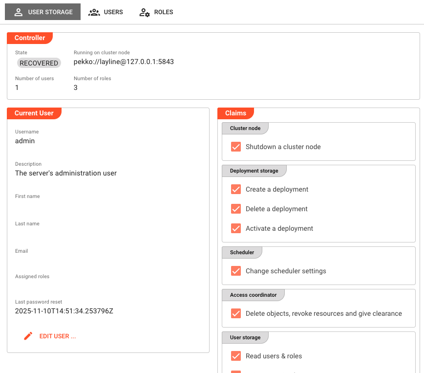
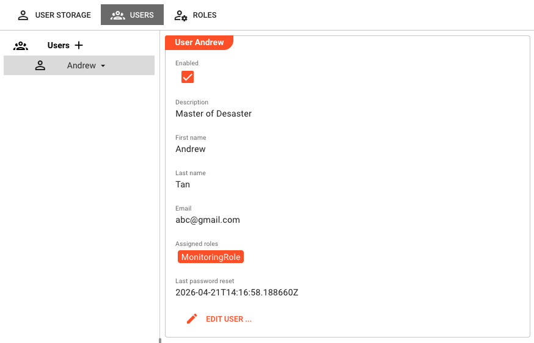
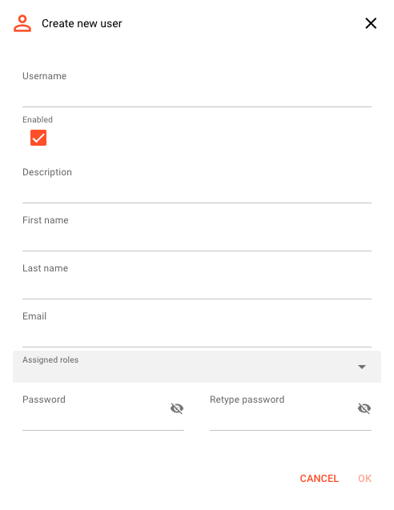
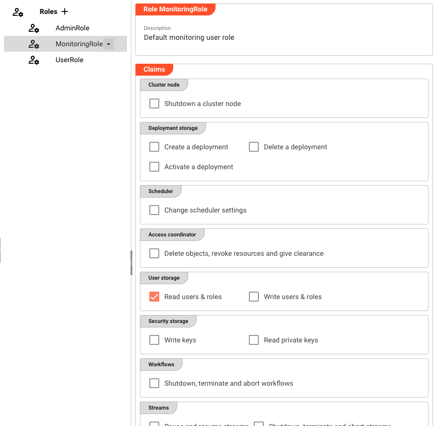

# User Storage

> Manage the users and roles that control access to a Reactive Engine Cluster.

## Purpose

layline.io separates user management between two systems: the **Configuration Server** and each **Reactive Engine Cluster**. Users and roles on these two systems are independent — being a user on one does not grant access to the other.

The Operations → User Storage page is where you manage cluster-level users and roles. If you need to manage users on the Configuration Server itself, see [Settings → User Storage](../../concept/settings/settings-user-storage.md).

Access control on the cluster follows a standard model:
- Each **user** can be assigned to one or more **roles**.
- Each **role** carries a set of **claims** (fine-grained privileges).
- A user's effective claims are the union of all claims from all their assigned roles.

:::info Visibility depends on your claims
The **Users** and **Roles** tabs are only visible to users who hold the `Read users & roles` or `Write users & roles` claim on the cluster. If you only see the **User Storage** tab, your account does not have user-management privileges.
:::

## User Storage Tab

The **User Storage** tab is always visible. It shows the current state of the cluster's user storage and the profile of the logged-in user.

### Controller

The Controller group shows the state of the user storage service running on the cluster:

**State** — Current state of the user storage controller (e.g. `Running`).

**Running on cluster node** — The cluster node address where the user storage controller is active.

**Number of users** — Total number of users registered on this cluster.

**Number of roles** — Total number of roles defined on this cluster.

### Current User

The Current User group displays the profile of the currently logged-in user:

**Username** — The login name. Cannot be changed.

**Description** — Optional description of the account.

**First name** — User's first name.

**Last name** — User's last name.

**Email** — Email address associated with the account.

**Assigned roles** — The roles this user is assigned to, shown as chips.

**Last password reset** — Timestamp of the most recent password change.

Click **Edit user …** to update your own profile, including your password. You will be prompted to confirm your current password when changing it.

### Claims

The Claims group shows the **effective claims** for the logged-in user — the combined set of privileges inherited from all assigned roles. These are read-only checkboxes showing what the current user is and is not permitted to do on this cluster.

See [Available Claims](#available-claims) for a description of each claim.

## Users Tab

The **Users** tab lists all users registered on the cluster (the `admin` user is excluded from the list). It is only visible if the logged-in user holds the `Read users & roles` or `Write users & roles` claim.

The tab uses a split-panel layout: the user list is on the left, and the details for the selected user are on the right.

### User Detail Panel

Selecting a user in the list shows their details on the right:

**Enabled** — Whether the user account is active.

**Description** — Optional description.

**First name / Last name** — User's name.

**Email** — Email address.

**Assigned roles** — The roles this user belongs to, shown as chips.

**Last password reset** — Timestamp of the most recent password change.

Click **Edit user …** to modify the user. This button is disabled if the logged-in user only has `Read users & roles` and not `Write users & roles`.

### Adding a User

Click the **+** button next to the _Users_ heading to create a new user.

:::warning
The username cannot be changed after creation. Choose it carefully.
:::

The create dialog lets you set:
- **Username** — Required. Immutable after creation.
- **Enabled** — Whether the account is active immediately.
- **Description, First name, Last name, Email** — Optional profile fields.
- **Assigned roles** — One or more roles to assign at creation time.
- **Password / Retype password** — Initial password for the account.

### Removing a User

Select the user in the list. A dropdown arrow appears next to the username — click it and select **Remove**. A confirmation dialog will appear before the user is deleted.

## Roles Tab

The **Roles** tab lists all roles defined on the cluster. It is only visible if the logged-in user holds the `Read users & roles` or `Write users & roles` claim.

The tab uses a split-panel layout: the role list is on the left, and the claims for the selected role are shown on the right.

### Role Detail Panel

Selecting a role shows its details:

**Description** — Optional description of the role's purpose.

**Claims** — Checkboxes showing which privileges are assigned to this role, grouped by category.

Click **Edit role …** to modify the role's description and claims. This button is disabled if the logged-in user only has `Read users & roles`.

### Adding a Role

Click the **+** button next to the _Roles_ heading to create a new role.

<!-- SCREENSHOT: Operations → User Storage → Roles tab, "Create role" dialog open, showing name, description, and claims fields -->

:::warning
The role name cannot be changed after creation.
:::

The create dialog lets you set:
- **Name** — Required. Immutable after creation.
- **Description** — Optional.
- **Claims** — Select the privileges this role should grant.

### Removing a Role

Select the role in the list. A dropdown arrow appears next to the role name — click it and select **Remove**. A confirmation dialog will appear before the role is deleted.

## Available Claims

Claims on the Reactive Engine Cluster are grouped by area:

| Group | Claim | Description |
|-------|-------|-------------|
| **Cluster node** | Shutdown a cluster node | Allows the user to initiate a cluster node shutdown. |
| **Deployment storage** | Create a deployment | Allows uploading and creating new deployments. |
| | Delete a deployment | Allows removing existing deployments. |
| | Activate a deployment | Allows activating a deployment on the engine. |
| **Scheduler** | Change scheduler settings | Allows modifying the scheduler configuration. |
| **Access coordinator** | Delete objects, revoke resources and give clearance | Allows administrative access coordinator operations. |
| **User storage** | Read users & roles | Allows viewing the Users and Roles tabs. |
| | Write users & roles | Allows creating, editing, and deleting users and roles. |
| **Security storage** | Write keys | Allows uploading and managing key pairs. |
| | Read private keys | Allows reading private key material. |
| **Workflows** | Shutdown, terminate and abort workflows | Allows stopping running workflows. |
| **Streams** | Pause and resume streams | Allows pausing and resuming active streams. |
| | Shutdown, terminate and abort streams | Allows stopping running streams. |
| **Services** | Test services | Allows using the service test functionality. |
| **Sniffing** | Sniff streams | Allows attaching a sniffer to running streams. |

## See Also

- [**Settings → User Storage**](../../concept/settings/settings-user-storage.md) — Managing users and roles on the Configuration Server
- [**Operations → Security Storage**](./security-storage.md) — Managing key pairs on the cluster
