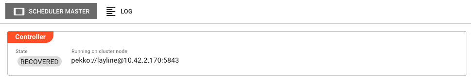
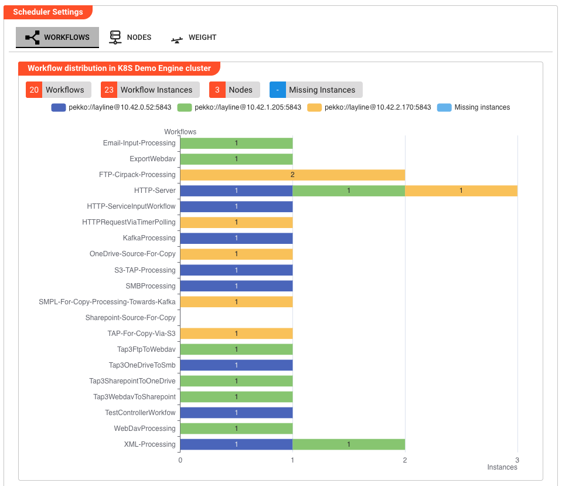
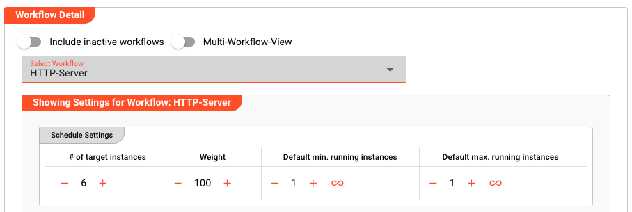
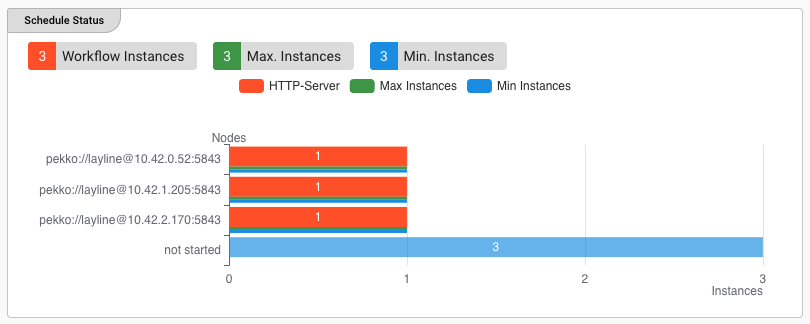
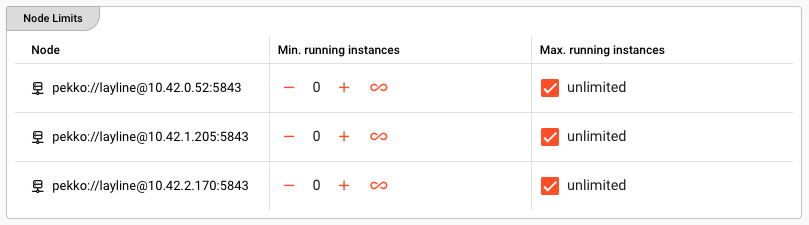
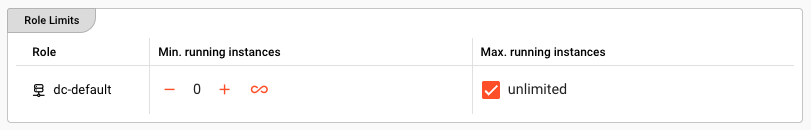
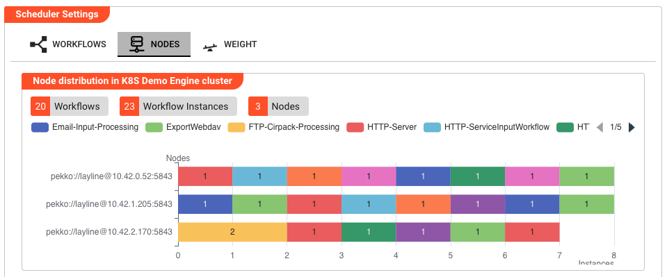
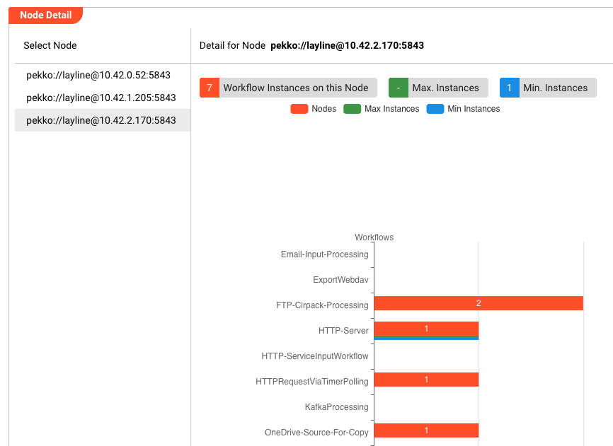
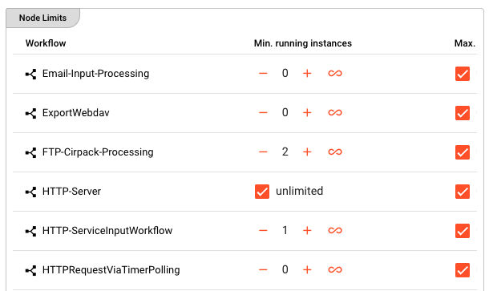
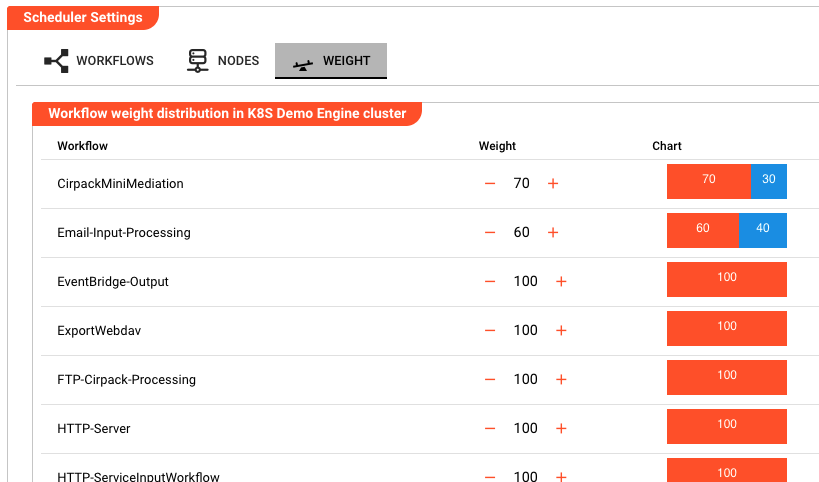

# Scheduler

> The Scheduler controls how workflow instances are distributed across cluster nodes, and lets you adjust targets, limits, and weights in real time.

## Purpose

In a layline.io cluster, workflows run as multiple instances spread across available nodes. The Scheduler is the controller that decides which node runs which workflow instances. It continuously balances the load, respects min/max limits you define, and considers workflow weights to keep the cluster evenly utilized.

The Scheduler Master view in Operations → Cluster gives you real-time insight into the scheduling state and lets you change settings without restarting the cluster.

## Scheduler Master

The Scheduler Master page has two tabs: **Scheduler Master** and **Log**.

### Scheduler Master

This tab shows the current controller state and the Scheduler Settings panel.

**State** — The operational state of the Scheduler Master controller (e.g. `active` or `unknown`).

**Running on cluster node** — The address of the node where the Scheduler Master controller is currently executing. If that node fails, the controller automatically fails over to another available node.

Below the controller info, the **Scheduler Settings** panel displays the full scheduling UI.

### Log

A read-only view of the Scheduler Master log file. Use this for troubleshooting if workflows are not distributing as expected.

## Scheduler Settings

The Scheduler Settings panel has three tabs that show the same underlying scheduling state from different angles: **Workflows**, **Nodes**, and **Weight**.

:::tip No active deployment
If no deployment is active on the cluster, the Scheduler Settings panel shows a banner: "No active deployment." Scheduler info will be visible and adjustments possible once you have activated a deployment.
:::

### Workflows

The Workflows tab is a workflow-centric view. It answers the question: *"For each workflow, how are its instances distributed across nodes?"*

At the top, summary chips show:
- **Workflows** — total number of distinct workflows
- **Workflow Instances** — total running instances across all workflows
- **Nodes** — number of cluster nodes
- **Missing Instances** — instances scheduled to start but not yet running

A stacked bar chart visualizes the distribution. Each bar represents one workflow, segmented by node. A translucent segment shows missing instances waiting to be started.

#### Workflow Detail

Below the chart, you can refine the view with two toggles:

**Include inactive workflows** — When enabled, workflows with zero running instances are shown in the selector and chart.

**Multi-Workflow-View** — When enabled, the detail area shows a compact table for all workflows at once instead of a single-workflow card.

When Multi-Workflow-View is off, a **Select Workflow** dropdown lets you pick one workflow. The detail card then shows:

##### Schedule Settings

A table with four adjustable values per workflow:

| Field | Description |
|-------|-------------|
| **# of target instances** | The total number of instances the cluster should run for this workflow. |
| **Weight** | A relative priority value (≥ 1). Higher weight means the scheduler considers the workflow heavier when balancing total weight across nodes. |
| **Default min. running instances** | The minimum instances per node unless overridden by a node-specific or role-specific limit. |
| **Default max. running instances** | The maximum instances per node unless overridden. `∞` means unlimited. |

##### Schedule Status

Chips summarize the selected workflow:
- **Workflow Instances** — currently running
- **Max. Instances** — total maximum allowed (`∞` if unlimited)
- **Min. Instances** — total minimum required

A bar chart shows the instance count per node for this workflow.

##### Node Limits

A table with one row per cluster node:

| Column | Description |
|--------|-------------|
| **Node** | The node's address |
| **Min. running instances** | Node-specific minimum |
| **Max. running instances** | Node-specific maximum |

##### Role Limits

A table with one row per cluster role:

| Column | Description |
|--------|-------------|
| **Role** | The role name |
| **Min. running instances** | Role-specific minimum |
| **Max. running instances** | Role-specific maximum |

### Nodes

The Nodes tab is a node-centric view. It answers the question: *"For each node, which workflows are running on it?"*

Summary chips show:
- **Workflows** — total distinct workflows
- **Workflow Instances** — total running instances
- **Nodes** — number of cluster nodes

A stacked bar chart shows nodes on the Y-axis and instance counts on the X-axis, with each workflow in a different color.

#### Node Detail

A splitter panel lists all nodes on the left under **Select Node**. Click a node (or click its bar in the chart) to open its detail card on the right. The toolbar shows **Detail for Node** followed by the node address.

The detail card shows:
- **Workflow Instances on this Node**
- **Max. Instances** — combined maximum for this node (`-` if any workflow is unlimited)
- **Min. Instances** — combined minimum for this node

A bar chart shows the instance count per workflow on the selected node, plus thin bars for max/min limits.

##### Node Limits

A table with one row per workflow running on this node:

| Column | Description |
|--------|-------------|
| **Workflow** | The workflow name |
| **Min. running instances** | Minimum instances of this workflow on this node |
| **Max. running instances** | Maximum instances of this workflow on this node |

### Weight

The Weight tab gives a quick overview of every workflow's weight in one table.

| Column | Description |
|--------|-------------|
| **Workflow** | The workflow name |
| **Weight** | The current weight value (editable inline) |
| **Chart** | A mini horizontal stacked bar showing the weighted vs. unweighted proportion |

## How the scheduling model works

The scheduler uses a greedy balancing algorithm driven by three concepts:

1. **Target instances** — Each workflow has a target number of instances to run across the cluster. You adjust this in the Schedule Settings table.
2. **Limits** — Min/max constraints can be set per workflow (defaults), per node, or per role. The scheduler will never violate a limit. If a node reaches its maximum, additional instances are placed elsewhere.
3. **Weights** — When choosing where to place the next instance, the scheduler picks the node that results in the smallest total-weight difference between all available nodes.

Example: In a two-node cluster, Workflow A has a weight of 50 and runs 5 instances, while Workflow B has a weight of 100 and runs 1 instance. Node 1 carries Workflow B (weight 100) plus two instances of A (weight 100) for a total weight of 200. Node 2 carries three instances of A (weight 150). If you add a seventh instance of A, the scheduler places it on Node 2 because that minimizes the total-weight difference between the nodes.

:::tip Weights and single-node clusters
Please note that differing weights have no impact in single-node clusters.
:::

## See Also

- [Cluster](./index.md) — Overview of all cluster controllers and the cluster concept
