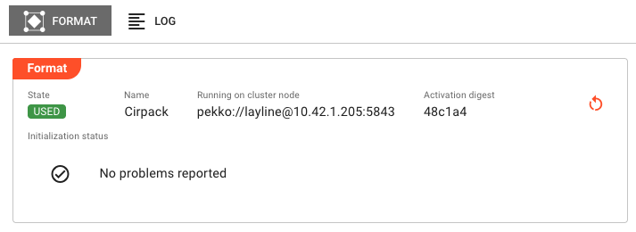
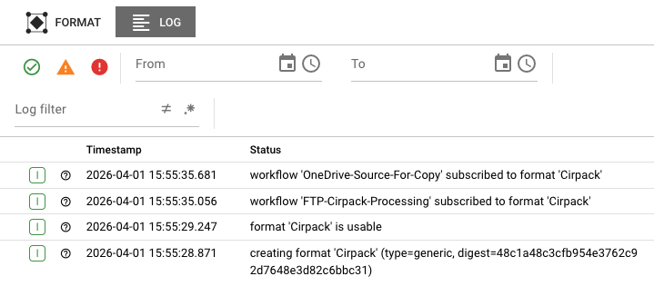

# Format State

> Real-time monitoring of format parsers and serializers — XML, ASN.1, Data Dictionary, HTTP, and more — including their runtime state and initialization health.

## Purpose

The Format State view provides visibility into format instances running on your cluster. Formats in layline.io define how messages are parsed (input) and serialized (output). They are used by processors to convert between wire formats and internal message structures. This page lets you monitor format health, inspect configuration, and diagnose initialization issues.

Use Format State to:

- Verify formats are initialized correctly on specific nodes
- Inspect format configuration and activation details
- Monitor format initialization status and failures
- View format logs for errors and diagnostics
- Restart format instances when needed

## Layout

The Format State interface uses a two-tab layout:

### Format Tab

The primary view showing runtime state and format details:

**Header Fields:**

| Field | Description |
|-------|-------------|
| **State** | Current execution state as a colored badge (green/red). See [Format States](#format-states) for all possible values. |
| **Name** | The format name as defined in the project |
| **Running on cluster node** | The specific cluster node address where this format instance is executing |
| **Activation digest** | Short hash of the deployment activation (first 6 characters; hover for full value). Only present when format is activated. |

**Initialization Status:**

Displays the result of format initialization:

- **No problems reported** — Shown with a green checkmark when initialization succeeded
- **Failure list** — If initialization encountered errors, they are listed here with details

Common initialization failures include:

- Invalid format configuration (malformed XML schema, invalid ASN.1 definitions)
- Missing referenced schemas or data dictionaries
- Data dictionary compilation errors
- Memory allocation failures for large format definitions

**Actions:**

- **Restart** — If an **Activation digest** is displayed, a Restart button appears in the header. Clicking this opens a confirmation dialog, then restarts the format instance on the current node. The restart affects **only the node where triggered** — other nodes running the same format are unaffected. The format transitions through shutdown, then startup states.

### Log Tab

The Log tab displays the runtime log for this specific format instance. This is the same log that would be written to disk on the cluster node, accessible here without needing SSH access to the server.

Log entries include:

- Timestamps for each event
- Severity levels (DEBUG, INFO, WARN, ERROR)
- Format initialization events
- Schema loading and validation messages
- Compilation errors for complex formats (Data Dictionary, ASN.1)
- Runtime parsing/serialization errors

Use the log to troubleshoot:

- Schema validation failures
- Data dictionary compilation errors
- Memory issues during format loading
- Runtime parsing errors

:::tip Real-Time Updates
The log view updates automatically as new entries are written. When troubleshooting an active issue, keep the Log tab open to see events as they happen.
:::

## Format States

Formats can be in one of several states, shown as colored badges in the header:

### Active States (Green)

| State | Description |
|-------|-------------|
| `USABLE` | Format is initialized and ready for use by processors |
| `UNUSED` | Format is initialized but not currently being used by any processor |
| `USED` | Format is initialized and actively being used by one or more processors |

### Error States (Red)

| State | Description |
|-------|-------------|
| `UNUSABLE` | Format failed to initialize and cannot be used |

When a format enters the `UNUSABLE` state, check the **Initialization Status** section and the **Log tab** for failure details. Common causes include:

- Schema validation errors
- Missing dependencies (referenced schemas, data dictionaries)
- Configuration syntax errors
- Resource exhaustion (memory, file handles)

## Common Tasks

### Checking Format Health

1. Select the **Formats** category in the Engine State left panel
2. Look for formats with error (red) icons
3. Click the format name to see cluster nodes running it
4. Click a specific node to view detailed state

### Investigating Initialization Failures

1. Navigate to the format in the Engine State view
2. Check the **Initialization Status** for specific error messages
3. Switch to the **Log tab** and look for ERROR-level entries
4. Common causes:
   - Schema file not found or inaccessible
   - XML schema validation errors
   - ASN.1 definition syntax errors
   - Data dictionary compilation failures

### Restarting a Format

1. Navigate to the format instance showing issues
2. Verify the **Activation digest** field is present
3. Click the **Restart** button
4. Confirm the restart in the dialog
5. Monitor the state badge — it should transition from `UNUSABLE` to `USABLE` if the issue is resolved

:::caution Restart Scope
Restarting a format only affects the single node where you trigger it. If the same format runs on multiple nodes, each must be restarted individually if needed.
:::

### Viewing Format Logs for Troubleshooting

1. Select the format instance
2. Click the **Log** tab
3. Use the severity filters to focus on WARN and ERROR entries
4. Look for patterns:
   - Schema loading failures (file not found, permission denied)
   - Validation errors (malformed XML, ASN.1)
   - Compilation errors (Data Dictionary)

## Format Types

Different format types have different initialization behaviors and log outputs:

### XML Format

- Validates XML schema definitions on initialization
- Logs schema parsing errors and validation failures
- Shows schema compilation status in logs

### ASN.1 Format

- Compiles ASN.1 definitions on initialization
- Logs compilation errors for invalid ASN.1 syntax
- May require significant memory for complex definitions

### Data Dictionary Format

- Compiles data dictionary definitions on initialization
- Logs compilation errors for invalid field definitions
- Shows mapping compilation status

### HTTP Format

- Validates HTTP message format configuration
- Logs header and body parsing configuration

### Generic Format

- Validates generic format configuration
- Logs parsing rule compilation status

## Auto-Refresh

Format State data refreshes automatically every 2 seconds while the tab is active. This ensures you see current state changes in real-time. The refresh pauses when you switch to another application tab to reduce server load.

When viewing the Log tab, new entries appear automatically as they are generated by the format.

## See Also

- [**Engine State Overview**](./index.mdx) — High-level monitoring of all asset types
- [**Source State**](./sources.md) — Monitoring input sources that use formats
- [**Sink State**](./sinks.md) — Monitoring output sinks that use formats
- [**Format Assets**](../../assets/formats/) — Designing and configuring formats
