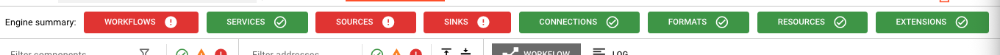
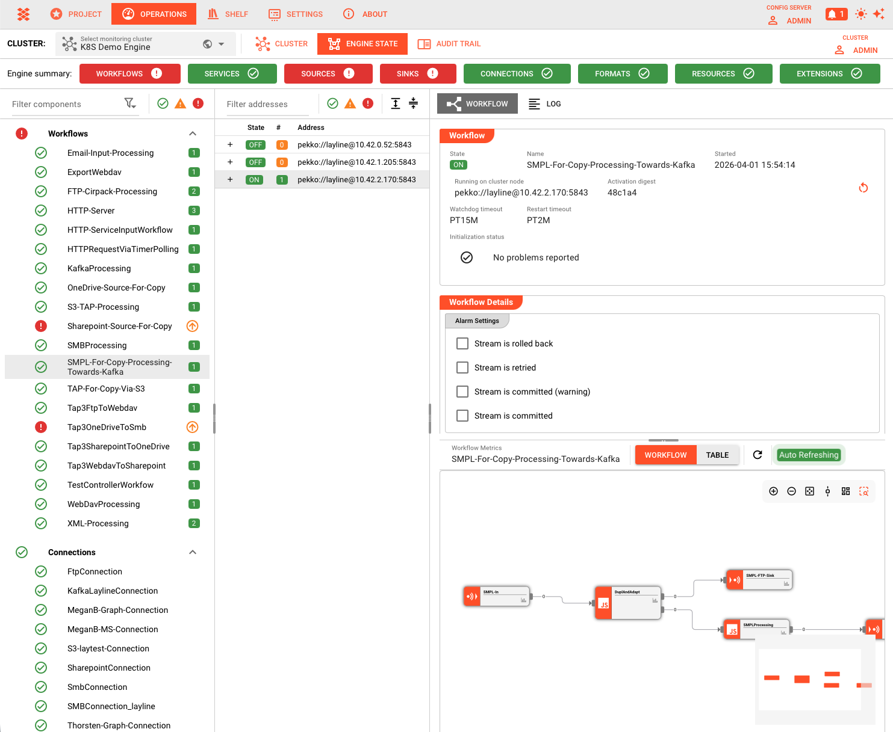
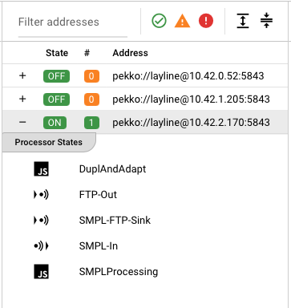
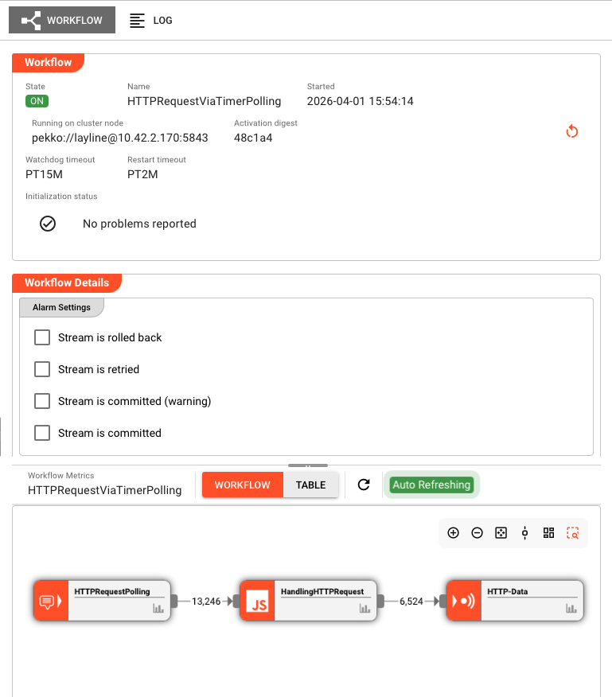

# Engine State

> Real-time visibility into what's running on your cluster — workflows, services, connections, and all other asset types.

## Purpose

The Engine State tab provides a live dashboard of everything currently deployed and running on your layline.io cluster. While the Cluster tab shows you infrastructure health, Engine State shows you the actual runtime behavior: which workflows are active, whether services are healthy, how connections are performing, and the status of every other asset type.

Use Engine State to:
- Verify that deployments are running as expected
- Debug issues by inspecting individual asset states
- Monitor startup and shutdown progress
- Check resource utilization across cluster nodes

## Engine Summary

At the top of the Engine State tab, the **Engine Summary** toolbar gives you an at-a-glance health check of every asset category across the cluster.

Each button represents one asset type and shows a quick visual status:

- **Green checkmark** — Everything in that category is healthy
- **Red exclamation mark** — One or more assets in that category have errors

The summary covers:

| Button | Meaning |
|--------|---------|
| [**Workflows**](./workflows.md) | Overall health of all running workflows |
| [**Services**](./services.md) | Health of all services (Timer, HTTP, JDBC, etc.) |
| [**Sources**](./sources.md) | Status of all input sources |
| [**Sinks**](./sinks.md) | Status of all output sinks |
| [**Connections**](./connections.md) | Health of all connection assets |
| [**Formats**](./formats.md) | State of format parsers and serializers |
| [**Resources**](./resources.md) | Availability of resources (Data Dictionaries, Directories, etc.) |
| [**Extensions**](./extensions.md) | Health of loaded extensions (Prometheus, AWS, etc.) |

Use the Engine Summary as your first stop when checking cluster health. If everything is green, you know the cluster is running smoothly. If you see red, click the category button or look at the asset list in the left panel to dig deeper and find the specific asset that needs attention.

You can also filter the left panel using the icons below the summary buttons — show only healthy assets, only assets with warnings or errors, or access settings.

## Layout

The Engine State interface is divided into three panels:

### Left Panel: Asset Categories

The leftmost panel lists all asset categories in collapsible sections:

| Category | Description |
|----------|-------------|
| [**Workflows**](./workflows.md) | Active workflows with instance counts across the cluster |
| [**Connections**](./connections.md) | Connection assets and their health status |
| [**Services**](./services.md) | Running services (Timer, HTTP, JDBC, etc.) |
| [**Sources**](./sources.md) | Input sources (File, Kafka, HTTP, etc.) |
| [**Sinks**](./sinks.md) | Output sinks (File, Kafka, S3, etc.) |
| [**Formats**](./formats.md) | Format parsers and their state |
| [**Resources**](./resources.md) | Resources (Data Dictionaries, Directories, etc.) |
| [**Extensions**](./extensions.md) | Extensions (Prometheus, AWS, etc.) |

Each category shows:
- A summary icon indicating overall health (green = healthy, red = error, yellow = warning)
- Expandable list of individual assets
- Status indicators for startup/shutdown states

For workflows, a badge shows the number of running instances across the cluster.

### Middle Panel: Cluster Nodes

When you select an asset from the left panel, the middle panel displays all cluster nodes where that asset is running:

- **Workflows**: Shows nodes with workflow instances, plus a list of processors within each instance
- **Other assets**: Shows nodes running that specific asset with health indicators

Click a node (or processor for workflows) to view detailed state in the right panel.

### Right Panel: Detail View

The right panel shows the detailed state of the selected asset on the selected node. The view varies by asset type:

| Asset Type | Detail View Shows |
|------------|-------------------|
| [**Workflow**](./workflows.md) | Instance state, processor list, throughput metrics, instance counts |
| **Processor** | Individual processor state, configuration, metrics |
| [**Service**](./services.md) | Service-specific state (service calls and failures, etc.) |
| [**Source**](./sources.md) / [**Sink**](./sinks.md) | Connection status, read/write positions, error logs |
| [**Connection**](./connections.md) | Connection health, pool status |
| [**Format**](./formats.md) | Format specific runtime information |
| [**Resource**](./resources.md) | Resource configuration and state |
| [**Extension**](./extensions.md) | Extension-specific runtime info |

## Asset Status Indicators

Each asset in the list displays an icon indicating its current state:

| Icon | Meaning |
|------|---------|
| Green check | Asset is healthy and running normally |
| Red error | Asset has errors or failed to start |
| Yellow warning | Asset has warnings or is in a transitional state |
| Spinning icon | Asset is currently starting up |
| Shutdown icon | Asset is shutting down |

## Common Tasks

### Checking Workflow Health

1. Expand the **Workflows** section in the left panel
2. Look for any workflows with error (red) or warning (yellow) icons
3. Click the workflow name to see cluster nodes running it
4. Click a specific node to view detailed instance state and metrics

### Investigating Connection Issues

1. Expand the **Connections** section
2. Identify connections with error states
3. Select the connection to see which nodes are affected
4. View the detail panel for error messages and connection pool status

### Monitoring Startup Progress

1. After deploying a new workflow, expand the **Workflows** section
2. Watch for the spinning startup icon next to the workflow name
3. Click through to individual nodes to see startup progress
4. The icon changes to green when startup completes successfully

### Viewing Workflow Processor Details

1. Select a workflow from the left panel
2. In the middle panel, expand the node to see its processors
3. Click a specific processor
4. The right panel shows processor configuration, metrics, and state

## Toolbar Controls

The toolbar above the left panel provides filtering options:

**Filter by name**: Type to filter the asset list to matching names

**Category toggles**: Show/hide specific asset categories

**Node filter** (middle panel): Filter cluster nodes by:
- Healthy nodes only
- Nodes with errors
- Specific node names

## Auto-Refresh

Engine State automatically refreshes every few seconds to keep the view current. The refresh interval pauses if you haven't interacted with the tab recently to reduce server load.

When viewing detailed state in the right panel, data continues to update in real-time.

## See Also

- [**Cluster Login**](./cluster/cluster-login) — How to connect to a cluster
- [**Workflow State**](./workflows.md) — Detailed workflow monitoring
- [**Service State**](./services.md) — Service-specific documentation
- [**Audit Trail**](../audit-trail) — Historical record of executions
