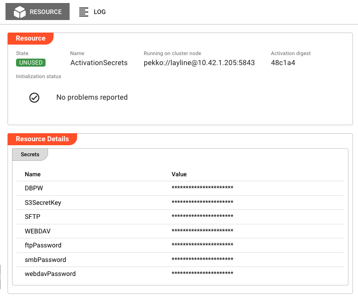
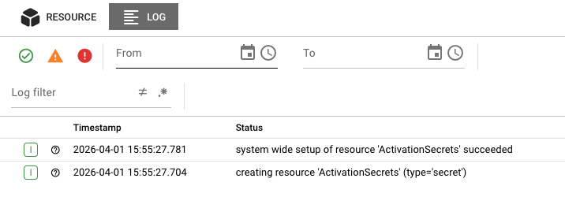

# Resource State

> Real-time monitoring of resource instances — Data Dictionaries, Directories, Environment variables, and Secrets — including their runtime state, initialization health, and configuration details.

## Purpose

The Resource State view provides visibility into resource instances running on your cluster. Resources in layline.io provide supporting functionality that other assets depend on:

- **Data Dictionaries** — Define structured data formats for message parsing
- **Directories** — Configure file system access for Sources and Sinks
- **Environment** — Store configuration values and variables
- **Secrets** — Securely manage sensitive credentials and API keys
- **OAuth** — Manage OAuth client credentials for external API authentication
- **AlarmRules** — Define conditions and thresholds for triggering alarms
- **AlarmTargets** — Configure notification destinations for alarm delivery
- **Status Settings** — Define custom status endpoints and health check configurations

This page lets you monitor resource health, inspect configuration, view initialization status, and diagnose issues.

Use Resource State to:

- Verify resources are initialized correctly on specific nodes
- Inspect activation details and configuration
- Monitor initialization status and failures
- View resource logs for errors and diagnostics
- Restart resource instances when needed (except system resources)

## Layout

The Resource State interface uses a two-tab layout:

### Resource Tab

The primary view showing runtime state and resource details:

**Header Fields:**

| Field | Description |
|-------|-------------|
| **State** | Current execution state as a colored badge (green/red). See [Resource States](#resource-states) for all possible values. |
| **Name** | The resource name as defined in the project |
| **Running on cluster node** | The specific cluster node address where this resource instance is executing |
| **Activation digest** | Short hash of the deployment activation (first 6 characters; hover for full value). Only present when resource is activated. |

**Initialization Status:**

Displays the result of resource initialization:

- **No problems reported** — Shown with a green checkmark when initialization succeeded
- **Failure list** — If initialization encountered errors, they are listed here with details

Common initialization failures include:

- Invalid directory paths or permissions
- Missing or invalid Data Dictionary definitions
- Secret decryption failures
- Network connectivity issues for external resources

**Actions:**

- **Restart** — If an **Activation digest** is displayed, a Restart button appears in the header. Clicking this opens a confirmation dialog, then restarts the resource instance on the current node. 

  :::caution System Resources Cannot Be Restarted
  The **ActivationEnvironment** and **ActivationSecrets** resources are system-managed and cannot be restarted manually. The Restart button is hidden for these resources.
  :::

  The restart affects **only the node where triggered** — other nodes running the same resource are unaffected. The resource transitions through shutdown, then startup states.

**Resource Details Section:**

Below the header, the Resource Details section displays type-specific information. The content varies by resource type:

#### Data Dictionary Resources

Displays the compiled data dictionary with complete field structure:

**Field Definitions:**
- **Field name** — The identifier for each field in the dictionary
- **Data type** — The type (string, integer, decimal, date, etc.)
- **Constraints** — Validation rules (required, min/max length, pattern, etc.)
- **Default values** — Default value if none provided

**Status Information:**
- **Compilation status** — Whether the dictionary compiled successfully
- **Validation errors** — Any syntax errors or type conflicts in field definitions
- **Dependencies** — References to other dictionaries if applicable

#### Directory Resources

Shows filesystem path configuration and access verification:

**Path Configuration:**
- **Base path** — The root directory path configured for this resource
- **Path type** — Local filesystem, NFS, SMB, or other remote protocol
- **Access mode** — Read, write, or read-write permissions

**Connection Status:**
- **Accessibility** — Whether the path is currently accessible (green checkmark or error)
- **Permission test** — Result of read/write permission validation
- **Mount status** — For remote directories: connection state and mount point availability

**Remote Directory Details (NFS/SMB):**
- **Server address** — Hostname or IP of the remote server
- **Share name** — The exported share or volume name
- **Connection state** — Connected, connecting, or connection failed

#### Environment Resources

Lists all defined environment variables in a key-value table:

**Variable Properties:**
- **Variable name** — The identifier used to reference this variable
- **Type** — Data type (string, integer, boolean, etc.)
- **Value** — The resolved value after variable substitution
- **Source** — Whether defined inline, inherited, or from external source

**Resolution Status:**
- **Resolved** — Whether all variable references were successfully resolved
- **Circular reference check** — Validation that no circular dependencies exist
- **Missing references** — Any undefined variables referenced in values

#### Secret Resources

Displays secret metadata and validation status (values are never shown):

**Secret Metadata:**
- **Secret name** — The identifier for this secret resource
- **Secret type** — API key, password, certificate, OAuth token, etc.
- **Created/Updated** — Timestamps for secret lifecycle

**Validation Status:**
- **Format validation** — Whether the secret value matches expected format (e.g., API key structure)
- **Decryption status** — Whether the secret can be successfully decrypted
- **Expiration** — For certificates and tokens: expiration date and validity status

:::tip Security Note
Secret values are never displayed in the UI. Only metadata (name, type, validation status) is shown. The actual values remain encrypted and are only accessible to authorized assets at runtime.
:::

#### OAuth Resources

Displays OAuth client configuration and token status:

- **Client ID** — The OAuth client identifier (masked for security)
- **Authorization URL** — The endpoint for authorization requests
- **Token URL** — The endpoint for token exchange
- **Scopes** — List of authorized scopes
- **Token Status** — Current token state (valid, expired, refresh pending)
- **Token Expiry** — When the current access token expires (if applicable)

#### AlarmRules Resources

Shows alarm condition definitions and their current evaluation state:

- **Rule Name** — Identifier for the alarm condition
- **Condition** — The threshold or expression being evaluated
- **Severity** — Default severity level when triggered (INFO, WARN, ERROR, CRITICAL)
- **Evaluation State** — Whether the rule is currently active or suppressed

#### AlarmTargets Resources

Displays notification destination configuration:

- **Target Type** — Channel type (Email, Slack, Webhook, PagerDuty, etc.)
- **Configuration** — Connection details (endpoint URLs, channel names)
- **Delivery Status** — Last successful/failed delivery timestamp
- **Health Check** — Whether the target is reachable

#### Status Settings Resources

Shows custom status endpoint configuration:

- **Endpoint Path** — The URL path for the status endpoint
- **Response Type** — Format of status response (JSON, plain text, etc.)
- **Monitored Components** — Which subsystems are included in the status
- **Last Check** — When the status endpoint was last queried

### Log Tab

The Log tab displays the runtime log for this specific resource instance. This is the same log that would be written to disk on the cluster node, accessible here without needing SSH access to the server.

Log entries include:

- Timestamps for each event
- Severity levels (DEBUG, INFO, WARN, ERROR)
- Resource initialization events
- Configuration loading messages
- Validation errors
- Runtime errors

Use the log to troubleshoot:

- Directory access failures (permission denied, path not found)
- Data dictionary compilation errors
- Secret decryption failures
- Network connectivity issues

:::tip Real-Time Updates
The log view updates automatically as new entries are written. When troubleshooting an active issue, keep the Log tab open to see events as they happen.
:::

## Resource States

Resources can be in one of several states, shown as colored badges in the header:

### Active States (Green)

| State | Description |
|-------|-------------|
| `UNUSED` | Resource is initialized but not currently being used by any asset |
| `USED` | Resource is initialized and actively being used by one or more assets |

### Error States (Red)

| State | Description |
|-------|-------------|
| `UNUSABLE` | Resource failed to initialize and cannot be used |

When a resource enters the `UNUSABLE` state, check the **Initialization Status** section and the **Log tab** for failure details. Common causes include:

- Invalid configuration (paths, credentials, definitions)
- Missing dependencies
- Permission issues
- Resource exhaustion

## Resource Types

Different resource types have different initialization behaviors and detail views:

### Data Dictionary

Data Dictionaries define structured message formats used by processors to parse and serialize data.

**Initialization behavior:**
- Compiles field definitions on initialization
- Validates type definitions and constraints
- Reports compilation errors in Initialization Status

**Common issues:**
- Syntax errors in field definitions
- Circular dependencies between dictionaries
- Invalid type references

### Directory

Directory resources define file system access for Sources and Sinks that read from or write to files.

**Initialization behavior:**
- Validates path existence and accessibility
- Tests read/write permissions
- For remote directories (NFS, SMB), establishes connection

**Common issues:**
- Path does not exist
- Permission denied (insufficient access rights)
- Network connectivity failures for remote directories
- Mount points not available

### Environment

Environment resources store configuration values as key-value pairs that can be referenced by other assets.

**Initialization behavior:**
- Loads all defined variables
- Resolves variable references
- Validates variable types

**Common issues:**
- Circular variable references
- Invalid type conversions
- Missing required values

### Secrets

Secret resources securely store sensitive information like API keys, passwords, and certificates.

**Initialization behavior:**
- Loads encrypted values
- Validates secret format (e.g., API key structure)
- Prepares for runtime access by authorized assets

**Common issues:**
- Decryption failures (wrong key, corrupted data)
- Invalid secret format
- Expired certificates

:::tip Security Note
Secret values are never displayed in the UI. Only metadata (name, type, validation status) is shown. The actual values remain encrypted and are only accessible to authorized assets at runtime.
:::

### OAuth

OAuth resources manage OAuth 2.0 client credentials for authenticating with external APIs and services.

**Initialization behavior:**
- Validates client ID and secret format
- Tests connectivity to authorization and token endpoints
- Performs initial token exchange (if using client credentials flow)

**Common issues:**
- Invalid client credentials
- Authorization server unreachable
- Incorrect token endpoint URL
- Scope not authorized for client

**In Resource State view:**
Monitor token status and expiry. When a token is near expiry or shows as expired, the system typically auto-refreshes it. Check the Log tab for refresh failures.

### AlarmRules

AlarmRules define conditions that trigger alerts when thresholds are breached or specific events occur.

**Initialization behavior:**
- Compiles rule expressions
- Validates threshold values and metric references
- Registers rules with the alarm evaluation engine

**Common issues:**
- Invalid metric references
- Syntax errors in rule expressions
- Circular rule dependencies
- Threshold values outside valid ranges

**In Resource State view:**
Rules show their evaluation state. A rule in error state indicates a problem with the condition expression or the metric it's monitoring.

### AlarmTargets

AlarmTargets configure where alarm notifications are sent when rules trigger.

**Initialization behavior:**
- Validates target configuration (email format, URL validity, etc.)
- Tests connectivity to notification endpoints
- Verifies authentication credentials for the target service

**Common issues:**
- Invalid email addresses or webhook URLs
- Network connectivity to notification services
- Authentication failures (expired API tokens, invalid credentials)
- Rate limiting from notification providers

**In Resource State view:**
Check the Delivery Status to see when notifications were last successfully sent. Persistent failures may indicate configuration issues or service outages.

### Status Settings

Status Settings define custom health check endpoints that expose system status to external monitoring tools.

**Initialization behavior:**
- Validates endpoint path syntax
- Checks for path conflicts with existing endpoints
- Initializes status aggregation for configured components

**Common issues:**
- Path conflicts with existing system endpoints
- Invalid response type configuration
- Missing component references

**In Resource State view:**
Shows the endpoint configuration and when it was last accessed. Use this to verify the endpoint is responding to health check queries.

## Common Tasks

### Checking Resource Health

1. Select the **Resources** category in the Engine State left panel
2. Look for resources with error (red) icons
3. Click the resource name to see cluster nodes running it
4. Click a specific node to view detailed state

### Investigating Initialization Failures

1. Navigate to the resource in the Engine State view
2. Check the **Initialization Status** for specific error messages
3. Switch to the **Log tab** and look for ERROR-level entries
4. Common causes by type:
   - **Directory**: Path not found, permission denied
   - **Data Dictionary**: Syntax error in definitions
   - **Secret**: Decryption failure, invalid format
   - **Environment**: Circular reference, type error
   - **OAuth**: Invalid client credentials, authorization server unreachable
   - **AlarmRules**: Invalid metric references, syntax errors in expressions
   - **AlarmTargets**: Invalid email/URL, authentication failure
   - **Status Settings**: Path conflicts, invalid response type

### Restarting a Resource

1. Navigate to the resource instance showing issues
2. Verify the **Activation digest** field is present
3. Confirm the resource is **not** named `ActivationEnvironment` or `ActivationSecrets` (these cannot be restarted)
4. Click the **Restart** button
5. Confirm the restart in the dialog
6. Monitor the state badge — it should transition from `UNUSABLE` to `USED` if the issue is resolved

:::caution Restart Scope
Restarting a resource only affects the single node where you trigger it. If the same resource runs on multiple nodes, each must be restarted individually if needed.
:::

### Viewing Resource Logs for Troubleshooting

1. Select the resource instance
2. Click the **Log** tab
3. Use the severity filters to focus on WARN and ERROR entries
4. Look for patterns:
   - Initialization errors (configuration loading, validation)
   - Runtime errors (access failures, timeouts)
   - Resource-specific errors (dictionary compilation, decryption)

## Auto-Refresh

Resource State data refreshes automatically every 2 seconds while the tab is active. This ensures you see current state changes in real-time. The refresh pauses when you switch to another application tab to reduce server load.

When viewing the Log tab, new entries appear automatically as they are generated by the resource.

## See Also

- [**Engine State Overview**](./index.mdx) — High-level monitoring of all asset types
- [**Data Dictionary Assets**](../../assets/workflow-assets/resources/asset-resource-data-dictionary-updates.md) — Designing and configuring data dictionaries
- [**Directory Assets**](../../assets/workflow-assets/resources/asset-resource-directories.md) — Configuring directory access
- [**Environment Assets**](../../assets/workflow-assets/resources/asset-resource-environment.md) — Managing environment variables
- [**Secret Assets**](../../assets/workflow-assets/resources/asset-resource-secret.md) — Managing sensitive credentials
- [**Deployment Assets**](../../assets/workflow-assets/deployments/) — Understanding how resources are deployed
