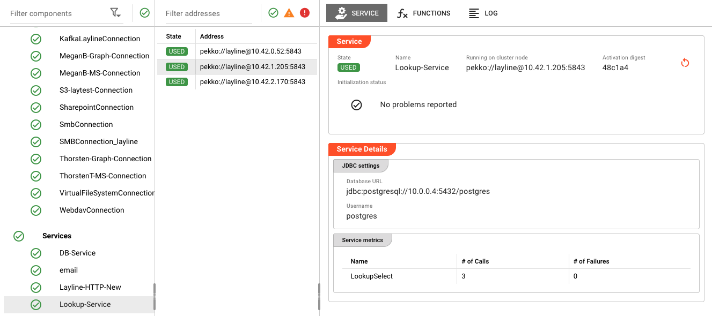
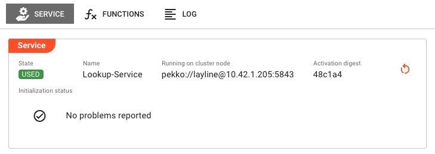
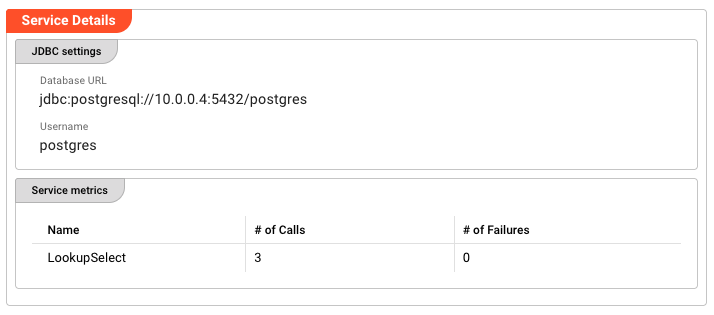
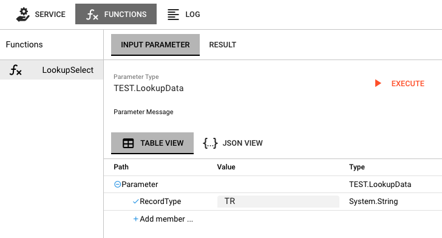
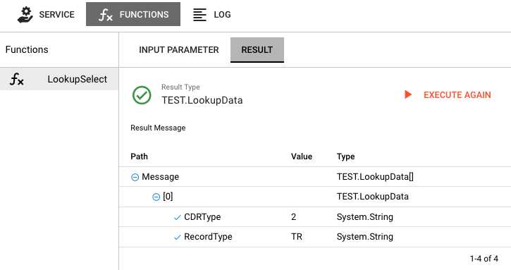
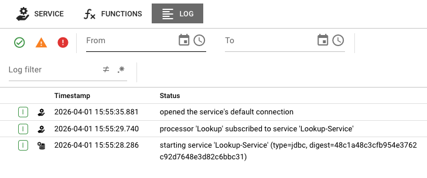

# Service State

> Real-time monitoring of services, function testing, and performance metrics across all cluster nodes.

## Purpose

The Service State view provides visibility into running service instances. Services in layline.io (like JDBC, HTTP, Timer, Message, etc.) expose functions that workflows can call during processing. This page lets you monitor service health, inspect configuration, test functions, and diagnose issues.

Use Service State to:
- Verify services are running correctly on specific nodes
- Inspect service configuration (JDBC settings, HTTP endpoints, etc.)
- View service metrics (function calls, failures)
- Test service functions with custom input parameters
- Monitor service logs for errors and diagnostics
- Restart service instances when needed

## Layout

The Service State interface follows the standard Engine State three-panel layout:

The screenshot above shows the complete three-panel view:
- **Left**: Filter components with Connections list (Kafka, Graph, MS, S3, Sharepoint, SMB, WebDAV, etc.)
- **Middle**: Filter addresses with cluster nodes running the selected service
- **Right**: Service detail panel showing Lookup-Service configuration and metrics

### Left Panel: Filter Components

The left panel lists all asset categories. When you select **Services**, the panel shows:

- **Category header** with health indicator (green checkmark = all healthy)
- **Expandable asset list** showing individual services and connections
- Each service shows a status icon indicating if it's active

Services appear alongside **Connections** in the left panel, as services often depend on connection assets.

### Middle Panel: Filter Addresses

The middle panel displays a table of cluster nodes where the selected service is running:

| Column | Description |
|--------|-------------|
| **State** | Current state of the service on this node (e.g., `USED`, `UNUSED`, `ERROR`) |
| **Address** | Cluster node address (e.g., `pekko://layline@10.42.1.205:5843`) |

When you select a service from the left panel, the middle and right panels update to show details for that service instance.

### Right Panel: Service Detail

The right panel provides comprehensive details about the selected service instance. It has three tabs:

#### Service Tab

The **Service** tab displays detailed information about the service instance:

**Service Info Panel**

| Field | Description |
|-------|-------------|
| **State** | Current lifecycle state of the service (e.g., `USED`, `UNUSED`) shown as a color-coded badge |
| **Name** | The service asset name |
| **Running on cluster node** | The cluster node address where this service instance is executing |
| **Activation digest** | Short hash of the deployment activation (first 6 characters shown; hover for full value) |

**Restart Button**

If an activation digest is present, a restart button appears in the top-right corner. Clicking it opens a confirmation dialog to restart the service instance. This is useful when:
- The service is stuck in an error state
- You need to reload configuration changes
- Connection issues require a fresh start

**Initialization Status**

Displays the result of service startup initialization:

- **No problems reported** — Shown with a green checkmark when initialization succeeded
- **Failure list** — If initialization encountered errors, they are listed here with details

#### Service Details Section

Below the service info panel, the **Service Details** section shows service-type-specific configuration:

**JDBC Settings** (for JDBC services)

| Field | Description |
|-------|-------------|
| **Database URL** | The JDBC connection string (e.g., `jdbc:postgresql://10.0.0.4:5432/postgres`) |
| **Username** | The database username used for connections |

**Service Metrics**

A table showing metrics for each exposed service function:

| Column | Description |
|--------|-------------|
| **Name** | Function name (e.g., `LookupSelect`) |
| **# of Calls** | Total number of times the function has been called |
| **# of Failures** | Number of failed function executions |

These metrics help identify:
- Which functions are being used most frequently
- Functions that may be failing (high failure count)
- Overall service utilization

#### Functions Tab

The **Functions** tab provides an interactive interface for testing service functions:

**Layout**

The Functions tab is divided into two sections:

1. **Function List** (left sidebar)
   - Lists all functions exposed by the service
   - Click a function name to select it
   - The selected function is highlighted

2. **Parameter/Result Area** (right panel)
   - **Input Parameter** tab — Build and edit input messages
   - **Result** tab — View function execution results

**Testing a Function**

1. Select a function from the left list
2. The **Parameter Type** field shows the expected input message type
3. Edit the parameter message in the message editor
4. Click **Execute** to run the function
5. The view switches to the **Result** tab showing the output

**Result Display**

The Result tab shows:
- **Result Type** — The message type returned by the function (with green checkmark for success)
- **Result Message** — The structured output data in a tree view
- **Failure indicator** — If execution failed, shows error details
- **Execute again** button — Re-run the function with the same or modified parameters

:::tip Function Testing Use Cases
- **Development** — Test service configuration without running a full workflow
- **Debugging** — Verify service connectivity and function behavior
- **Troubleshooting** — Reproduce errors with specific input data
:::

#### Log Tab

The **Log** tab displays the live log output from the service instance:

The log shows timestamped events from the service lifecycle:
- **Service startup** — `starting service 'Lookup-Service' (type=jdbc, digest=...)`
- **Processor subscriptions** — `processor 'Lookup' subscribed to service 'Lookup-Service'`
- **Connection events** — `opened the service's default connection`
- **Error conditions** — Connection failures, timeout errors, etc.

**Log Filter Controls**

At the top of the log view:
- **From/To date range** — Filter logs to a specific time period
- **Status icons** — Quick filters for errors (red), warnings (yellow), and successes (green)

## Service States

Service instances can be in various lifecycle states:

### Active States (Green)

| State | Description |
|-------|-------------|
| `USED` | Service is active and being used by one or more workflows |
| `UNUSED` | Service is running but not currently being used |

### Error States (Red)

| State | Description |
|-------|-------------|
| `ERROR` | Service encountered an error during startup or operation |
| `CONFIGURATION_ERROR` | Service configuration is invalid |
| `CONNECTION_ERROR` | Failed to establish required connection |

## Common Tasks

### Inspecting a Running Service

1. In the left panel, expand the **Services** section (or **Connections** for connection-related services)
2. Click on the service name you want to inspect
3. The middle panel shows cluster nodes running this service
4. Click on a specific node to view its details in the right panel
5. Review the state badge, initialization status, and service metrics

### Testing a Service Function

1. Select the service and node as described above
2. Click the **Functions** tab in the right panel
3. Select a function from the left sidebar list
4. Review the **Parameter Type** and edit the input message as needed
5. Click **Execute**
6. Review the result in the **Result** tab
7. Click **Execute again** to test with modifications

### Monitoring Service Metrics

1. Select the service and view the **Service** tab
2. Scroll to the **Service Metrics** table
3. Review **# of Calls** to see which functions are active
4. Check **# of Failures** for any errors
5. High failure counts indicate potential issues requiring investigation

### Restarting a Service

1. Select the service instance you want to restart
2. In the right panel's **Service** tab, locate the restart button (circular arrow icon)
3. Click the restart button
4. Confirm the restart in the dialog
5. The service will restart and re-initialize

## Service Types

Different service types expose different configuration and metrics:

### JDBC Service

- **JDBC Settings** — Database URL, username
- **Functions** — SQL query functions with parameter binding
- **Metrics** — Query execution counts and failures

### HTTP Service

- **Endpoint Configuration** — Base URL, authentication settings
- **Functions** — HTTP method calls (GET, POST, PUT, DELETE)
- **Metrics** — Request counts, response codes, failures

### Timer Service

- **Schedule Configuration** — Cron expressions, intervals
- **Functions** — Timer-triggered events
- **Metrics** — Trigger counts, missed triggers

### Message Service

- **Queue Configuration** — Queue names, routing keys
- **Functions** — Send/receive message functions
- **Metrics** — Message counts, delivery failures

## Auto-Refresh Behavior

The Service State view automatically refreshes:

- **Service info panel** — Refreshes every 2 seconds when active
- **Metrics** — Update in real-time with each refresh
- **Log** — Streams live updates

The auto-refresh ensures you always see current service health and metrics.

## See Also

- [**Engine State Overview**](./index.mdx) — Introduction to the Engine State monitoring interface
- [**Workflow State**](./workflows.md) — Monitoring workflows that use services
- [**Connections**](./connections.md) — Connection assets used by services
- [**Service Assets**](../../assets/services/) — Designing and configuring services
