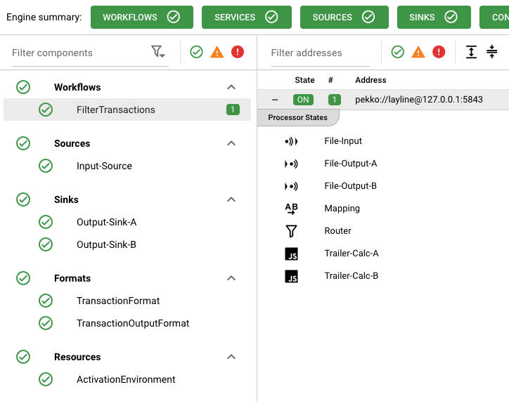
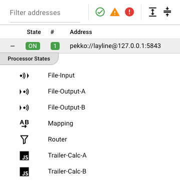
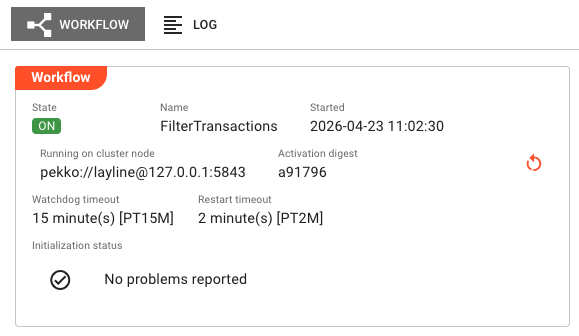
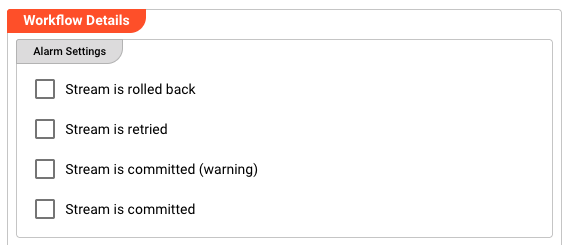
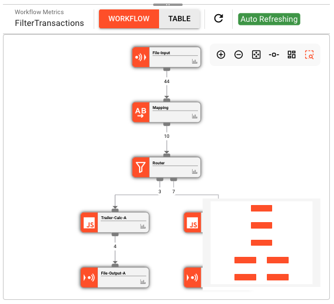
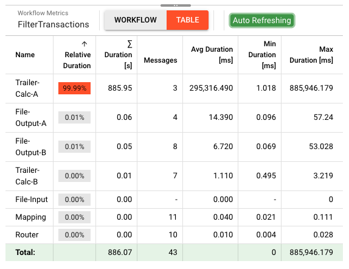
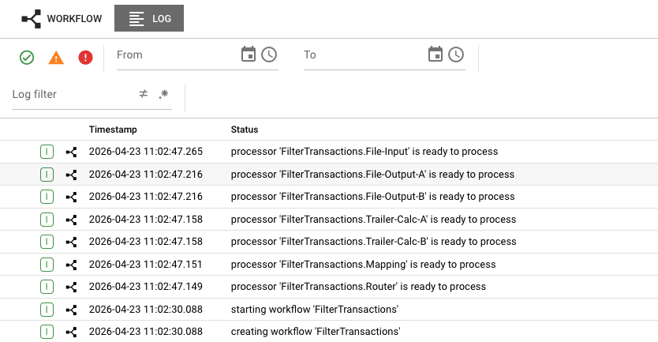

# Workflow State

> Real-time monitoring of workflow instances, processor states, and performance metrics across all cluster nodes.

## Purpose

The Workflow State view provides deep visibility into running workflow instances. While the Engine State overview shows which workflows are active, this page lets you drill down into individual instances to inspect their state, view processor-level metrics, diagnose issues, and understand performance characteristics.

Use Workflow State to:
- Verify workflow instances are running correctly on specific nodes
- Inspect individual processor states within a workflow
- View real-time throughput and performance metrics
- Analyze processing bottlenecks via the metrics table
- Monitor alarm configurations and initialization status
- Restart workflow instances when needed

## Layout

The Workflow State interface follows the standard Engine State three-panel layout:

### Left Panel: Filter Components

The left panel lists all asset categories with **Workflows** expanded by default when you navigate to this view. Each category shows:

- **Category header** with health indicator (green checkmark = all healthy)
- **Expandable asset list** showing individual workflows
- **Instance count badge** showing how many instances are running across the cluster

When you select a workflow from the list, the middle and right panels update to show details for that specific workflow.

### Middle Panel: Filter Addresses

The middle panel displays a table of cluster nodes where the selected workflow is running:

| Column | Description |
|--------|-------------|
| **State** | Current state of the workflow on this node (color-coded badge) |
| **#** | Number of workflow instances on this node |
| **Address** | Cluster node address (e.g., `pekko://layline@127.0.0.1:58443`) |

#### Expanding to View Processor States

Each row in the address table can be expanded to reveal the **Processor States** contained within that workflow instance:

1. Click the expand button (+) on the left side of the node row
2. The row expands to show a **Processor States** section listing all processors in the workflow
3. Each processor displays:
   - **Icon** indicating the processor type (Input, Output, Flow, Script/JS/Python)
   - **Name** of the processor (e.g., "File-Input", "Mapping", "Router", "Trailer-Calc-A")

#### Selecting a Processor for Inspection

Click on any processor in the expanded list to view its detailed state in the **right panel**. The selected processor is highlighted in the list.

:::tip JavaScript and Python Processors
For **JavaScript** and **Python** processors, selecting the processor in the middle panel displays the assigned script files in the right panel. You can view:
- The script file name and path
- Source code content
- Function definitions
- Configuration parameters
:::

The processor inspection view in the right panel shows:
- **Processor state** and health indicators
- **Configuration details** specific to the processor type
- **Runtime metrics** (message counts, processing times)
- **Script source** (for JavaScript/Python processors)

### Right Panel: Workflow Detail

The right panel provides comprehensive details about the selected workflow instance. It has two tabs:

#### Workflow Tab

The **Workflow** tab displays detailed information about the workflow instance:

**Workflow Info Panel**

| Field | Description |
|-------|-------------|
| **State** | Current lifecycle state of the workflow (e.g., `ON`, `PROCESSING`, `ACTIVATING`) shown as a color-coded badge |
| **Name** | The workflow asset name |
| **Started** | Timestamp when this instance started (format: `YYYY-MM-DD HH:MM:SS`) |
| **Running on cluster node** | The cluster node address where this instance is executing |
| **Activation digest** | Short hash of the deployment activation (first 6 characters shown; hover for full value) |

**Restart Button**

If an activation digest is present, a restart button appears in the top-right corner of the panel. Clicking it opens a confirmation dialog to restart the workflow instance. This is useful when:
- The workflow is stuck in an error state
- You need to reload configuration changes
- Troubleshooting requires a fresh start

**Timeout Settings**

| Field | Description |
|-------|-------------|
| **Watchdog timeout** | Maximum time allowed before the workflow is considered unresponsive (e.g., `15 minute(s) [PT15M]`) |
| **Restart timeout** | Time before the workflow will attempt to restart if it fails (e.g., `2 minute(s) [PT2M]`) |

**Initialization Status**

Displays the result of workflow startup initialization:

- **No problems reported** — Shown with a green checkmark when initialization succeeded
- **Failure list** — If initialization encountered errors, they are listed here with details

The initialization status area has a scrollable view (max height: 25vh) for workflows with extensive startup diagnostics.

#### Alarm Settings

Below the workflow info panel, the **Workflow Details** section contains **Alarm Settings** showing the configured alarm behavior:

| Alarm Type | Description |
|------------|-------------|
| **Stream is rolled back** | Triggered when a stream transaction is rolled back due to processing errors |
| **Stream is retried** | Triggered when a failed stream is being retried |
| **Stream is committed (warning)** | Triggered when a stream commits but with warnings |
| **Stream is committed** | Triggered when a stream successfully commits |

Each alarm setting shows whether it's enabled and configured for notification routing.

#### Workflow Diagram Viewer

The lower portion of the Workflow tab displays an interactive diagram of the workflow:

The diagram viewer shows:
- **Processors** as nodes (colored by state; orange when running)
- **Data flow** as edges connecting processors
- **Metrics badges** on nodes showing message counts
- **JavaScript/Python icons** on script processors

**Diagram Toolbar Controls**

| Control | Action |
|---------|--------|
| **Workflow / Table Toggle** | Switch between diagram view and metrics table view |
| **Refresh Button** | Manually refresh the workflow diagram |
| **Auto Refreshing Indicator** | Shows when live metrics updates are active |

**Diagram Navigation**

Right-click and drag to pan, use mouse wheel to zoom, or use the toolbar buttons:

| Button | Action |
|--------|--------|
| **Zoom In** | Increase diagram magnification |
| **Zoom Out** | Decrease diagram magnification |
| **Zoom to Fit** | Auto-scale diagram to fit the view |
| **Layout Toggle** | Switch between vertical and horizontal port layouts |
| **Arrange** | Auto-layout the diagram nodes |
| **Show Map** | Toggle the minimap overview |

#### Table Mode (Performance Metrics)

Click the **Table** toggle to switch from the diagram view to a performance metrics table:

The metrics table provides detailed performance data for each processor:

| Column | Description |
|--------|-------------|
| **Name** | Processor name |
| **Relative Duration** | Percentage of total workflow time spent in this processor (shown as progress bar) |
| **Σ Duration [s]** | Total time spent processing messages in this processor (seconds) |
| **Messages** | Number of messages processed by this processor |
| **Avg Duration [ms]** | Average processing time per message (milliseconds) |
| **Min Duration [ms]** | Fastest message processing time (milliseconds) |
| **Max Duration [ms]** | Slowest message processing time (milliseconds) |

**Total Row**

The bottom row (highlighted in green) shows aggregates:
- **Total Σ Duration** — Sum of all processor durations
- **Total Messages** — Sum of all messages processed by individual processors
- **Min/Max Duration** — Minimum and maximum across all processors

:::tip Interpreting the Metrics
- A high **Relative Duration** percentage indicates a bottleneck processor
- Compare **Avg Duration** across processors to find slow steps
- **Max Duration** outliers may indicate intermittent issues
- The metrics update in real-time when auto-refresh is enabled
:::

#### Log Tab

The **Log** tab displays the live log output from the workflow instance:

The log shows timestamped events from the workflow lifecycle:
- **Workflow creation** — `creating workflow 'FilterTransactions'`
- **Workflow startup** — `starting workflow 'FilterTransactions'`
- **Processor readiness** — `processor 'FilterTransactions.File-Input' is ready to process`
- **Status changes** — Individual processor state transitions

**Log Filter Controls**

At the top of the log view:
- **From/To date range** — Filter logs to a specific time period using the calendar selectors
- **Log filter dropdown** — Filter by log level or event type
- **Status icons** — Quick filters for errors (red), warnings (yellow), and successes (green)

The log view uses the shared log component and shows:
- Timestamped events (down to millisecond precision)
- Log levels (INFO, WARN, ERROR, DEBUG)
- Message details describing workflow and processor events
- Real-time updates as new log entries are generated

Use the log to:
- Diagnose runtime issues and error conditions
- Trace workflow startup and shutdown sequences
- Monitor processor initialization progress
- Investigate processing failures and exceptions

## Workflow States

Workflow instances can be in various lifecycle states. The state is displayed as a color-coded badge:

### Healthy States (Green)

| State | Description |
|-------|-------------|
| `ON` | Workflow is active and ready to process |
| `PROCESSING` | Workflow is currently processing data |
| `ACTIVATING` | Workflow is starting up (transitional) |
| `CLUSTER_ROLE_MISMATCH` | Workflow role doesn't match cluster (healthy but not scheduled) |

### Transitional/Warning States (Yellow)

| State | Description |
|-------|-------------|
| `VERIFYING_CONFIGURATION` | Validating workflow configuration during startup |
| `VERIFYING_DEPENDENCIES` | Checking that required assets are available |
| `STOP_PROCESSING` | Gracefully stopping message processing |
| `SHUTTING_DOWN` | Workflow is shutting down |

### Error States (Red)

| State | Description |
|-------|-------------|
| `TERMINATED` | Workflow has terminated unexpectedly |
| `INTERNAL_ERROR` | An internal error occurred |
| `CONFIGURATION_FAILURE` | Configuration validation failed |
| `DEPENDENCY_FAILURE` | Required dependency is missing or failed |
| `ACTIVATION_FAILURE` | Failed to activate the workflow |
| `PROCESSING_PREPARATION_FAILED` | Failed to prepare for processing |

## Common Tasks

### Inspecting a Running Workflow

1. In the left panel, expand the **Workflows** section
2. Click on the workflow name you want to inspect
3. The middle panel shows cluster nodes running this workflow
4. Click on a specific node to view its details in the right panel
5. Review the state badge, initialization status, and alarm settings

### Viewing Processor States

To inspect individual processors within a workflow:

1. In the left panel, select the **workflow** you want to inspect
2. In the middle panel, find the cluster node running the workflow
3. Click the **expand button** (+) on the left side of the node row
4. The **Processor States** section appears, listing all processors in the workflow with their icons:
5. **Click on any processor** in the list to view its details in the right panel

:::note Right Panel Updates
When you select a processor, the right panel changes from showing workflow-level details to showing processor-specific details. This includes configuration, runtime metrics, and (for script processors) the source code files.
:::

### Inspecting JavaScript/Python Processor Scripts

For script processors, the right panel displays:

1. **Script file tabs** — If multiple files are assigned, each appears as a tab
2. **Source code viewer** — Syntax-highlighted code with line numbers
3. **Function list** — Quick navigation to script functions
4. **Configuration panel** — Script arguments and parameters

This allows you to debug script issues without leaving the Operations view.

### Analyzing Performance Bottlenecks

1. Navigate to the workflow instance detail view
2. In the diagram viewer, click the **Table** toggle
3. Sort by **Relative Duration** to find the slowest processors
4. Look for processors with high **Avg Duration** or **Max Duration** values
5. Switch back to the **Workflow** diagram view to see the processor in context

### Restarting a Workflow Instance

1. Select the workflow instance you want to restart
2. In the right panel's **Workflow** tab, locate the restart button (circular arrow icon)
3. Click the restart button
4. Confirm the restart in the dialog
5. The workflow will restart, and the state will transition through startup phases

### Monitoring During Startup

1. Deploy a new workflow or restart an existing one
2. Watch the **State** badge in the right panel
3. The state will progress: `VERIFYING_CONFIGURATION` → `VERIFYING_DEPENDENCIES` → `ACTIVATING` → `ON`
4. Check the **Initialization Status** for any problems
5. Once `ON`, the workflow is ready to process data

## Processor Inspection

When you select an individual processor from the expanded processor list in the middle panel, the right panel switches to show processor-specific details.

### Processor Detail View

The processor detail view varies by processor type but typically includes:

| Section | Content |
|---------|---------|
| **Processor Info** | Name, type, state, and health status |
| **Configuration** | Processor-specific settings and parameters |
| **Runtime Metrics** | Message counts, processing times, error rates |
| **Connections** | Input/output port status and throughput |

### Script Processor Source Code

For **JavaScript** and **Python processors**, the right panel includes a **Script** section:

<!-- SCREENSHOT: Processor detail view showing script source code for a JavaScript processor -->

The script viewer provides:
- **File tabs** — Switch between multiple assigned script files
- **Syntax highlighting** — Color-coded source code for readability
- **Line numbers** — Reference specific lines when debugging
- **Function navigation** — Jump to specific functions within the script

This is particularly useful for:
- Debugging runtime errors
- Verifying deployed script versions
- Reviewing configuration parameters passed to scripts
- Understanding processor behavior without switching to the Project view

### Input/Output Processor Details

For **Input** and **Output** processors, the detail view shows:

- **Connection status** — Whether the source/sink is connected
- **Read/Write position** — Current offset in the data stream
- **Throughput metrics** — Messages per second, bytes transferred
- **Error counts** — Failed read/write operations
- **Source/Sink specific info** — File paths, Kafka offsets, HTTP endpoints, etc.

## Auto-Refresh Behavior

The Workflow State view automatically refreshes:

- **Workflow info panel** — Refreshes every 2 seconds when active
- **Metrics and diagram** — Refreshes every 1 second when the workflow is in `ON`, `WAITING_FOR_SOURCE`, or `PROCESSING` state
- **Auto-refresh indicator** — Shows "Auto Refreshing" badge when live updates are active

The auto-refresh pauses if the workflow is not in an active state to reduce server load.

## See Also

- [**Engine State Overview**](./index.mdx) — Introduction to the Engine State monitoring interface
- [**Cluster Monitor**](../cluster/cluster-monitor.md) — Aggregate cluster health and statistics
- [**Deployment Storage**](../cluster/deployment-storage.md) — Managing deployments and activations
- [**Workflow Assets**](../../assets/workflow-assets/workflows/index.mdx) — Designing and configuring workflows
- [**Audit Trail**](../audit-trail/index.md) — Historical record of workflow executions
