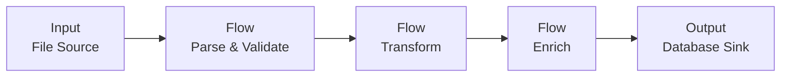
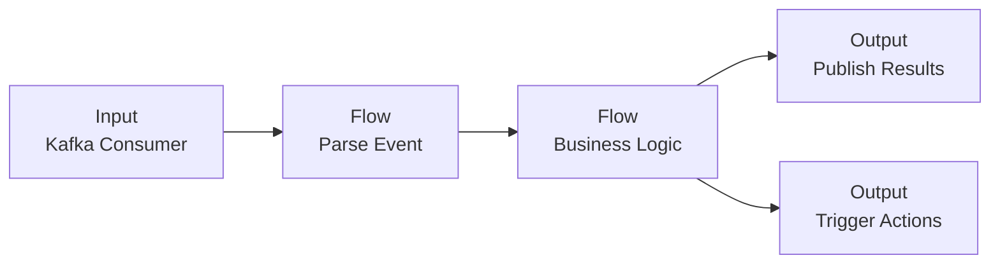
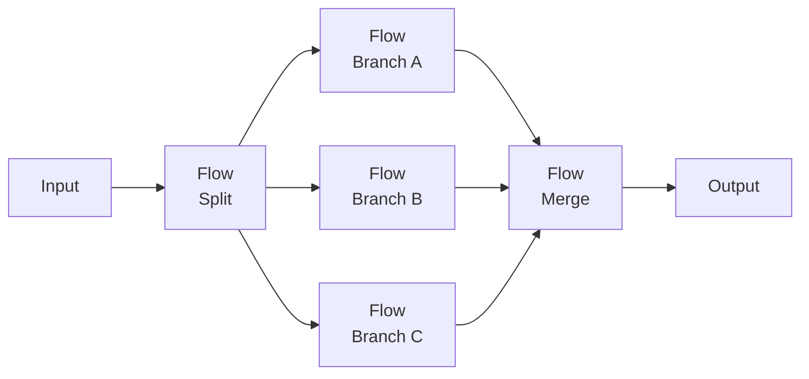
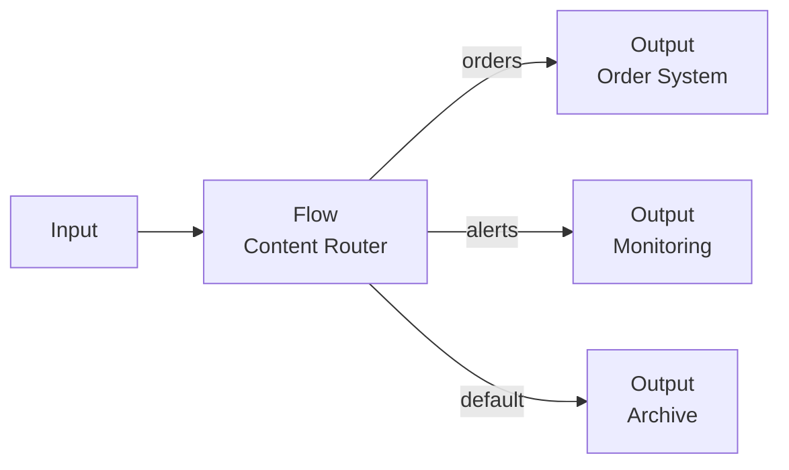

# Building Workflows

> A Workflow is the executable blueprint of your data pipeline. This page explains how to design and assemble Workflows within a Project — the concepts, the flow, and the practical steps.

## What Is a Workflow?

In layline.io, a **Workflow** is the core unit of data processing. It defines the complete path data takes from ingestion through transformation to delivery.

Think of a Workflow as a directed graph: nodes represent processing steps, and edges represent the flow of data between them. When you deploy a Workflow to a cluster, it becomes a running process that continuously ingests, transforms, and outputs data according to your design.

Workflows are created and configured inside a **Project** — the development environment where you design, test, and version your data pipelines before deployment.

## The Building Blocks

Every Workflow is assembled from three fundamental processor types:

| Processor Type | Purpose | Examples |
|----------------|---------|----------|
| **Input Processor** | Ingests data from external sources | File readers, message queue consumers, HTTP endpoints |
| **Flow Processor** | Transforms, routes, or enriches data in transit | Mappers, filters, aggregators, validators |
| **Output Processor** | Delivers processed data to destinations | File writers, message publishers, database loaders |

These processors are not hardcoded components — they are **Asset instances**. You define Sources, Sinks, Formats, and Services as reusable Assets in your Project, then reference them when configuring processors in your Workflow.

### Assets as Building Blocks

Assets are the reusable, independently versioned components that make up your Workflows. Think of them as **configured capabilities** that you define once and reference many times.

#### What Makes Assets Powerful

Unlike hardcoded configuration, Assets are:

- **Reusable** — Define a Source once (e.g., "Production Kafka Cluster"), use it in dozens of Workflows
- **Versioned** — Change an Asset and all referencing Workflows automatically use the new configuration
- **Environment-agnostic** — The same Workflow works in dev, staging, and production by swapping Assets
- **Inheritable** — Create specialized Assets that inherit and extend base configurations

#### Asset Types

| Asset Type | Defines | Example |
|------------|---------|---------|
| **Source** | *Where* data comes from | A path on an NFS share, a Kafka consumer group, an HTTP endpoint |
| **Sink** | *Where* data goes | An S3 bucket prefix, a database table, a message queue |
| **Format** | *How* data is structured | A JSON schema, an XML definition, a CSV parser configuration |
| **Service** | *Auxiliary capabilities* | A JDBC connection pool, an HTTP client, a cache |
| **Connection** | *How to connect* | AWS credentials, SMB authentication, OAuth tokens |

#### The Asset-Processor Relationship

When you configure a processor, you don't enter connection strings or parse settings directly. Instead, you **reference Assets**:

```
Input Processor → references → Source Asset + Format Asset
Output Processor → references → Sink Asset + Format Asset
Flow Processor → references → Service Asset (for enrichment)
```

This separation is crucial: the Workflow defines *what happens to the data*; Assets define *where it comes from and goes*.

#### Asset Inheritance

Assets support **inheritance**, allowing you to build specialized configurations from general ones:

**Base Asset**: `NFS-Production-Connection`
- Server: `nfs.prod.internal`
- Credentials: `prod-nfs-user`

**Inherited Asset**: `NFS-Customer-Data-Source`
- Inherits: `NFS-Production-Connection`
- Path: `/data/customers/incoming`
- Polling interval: `30s`

**Inherited Asset**: `NFS-Orders-Source`
- Inherits: `NFS-Production-Connection`
- Path: `/data/orders`
- Polling interval: `60s`

Both sources share the same server and credentials, but each has its own path and polling behavior. Change the base connection credentials, and both sources automatically update.

#### Overriding Asset Properties

When you reference an Asset in a processor, you can **override specific properties** without modifying the Asset itself. This is useful for:

- **One-off adjustments** — Use the same Source but with a different file pattern for this specific Workflow
- **Environment variations** — Override a timeout for testing without affecting production
- **Dynamic behavior** — Set properties at deployment time via environment variables

Example: A File Source Asset defines `/data/invoices/*.xml`. In your processor, you override the pattern to `/data/invoices/2024-*.xml` for a backfill job.

Overrides are **local to the processor reference** — they don't modify the underlying Asset, and other Workflows using the same Asset are unaffected.

#### Asset Reuse Patterns

**Pattern 1: Standardized Connections**
Define one `Kafka-Production` Connection Asset with cluster endpoints and TLS settings. Create separate Source Assets for each topic (`Kafka-Orders-Source`, `Kafka-Events-Source`), all referencing the same Connection. Change cluster endpoints in one place.

**Pattern 2: Format Libraries**
Define Format Assets for your organization's standard schemas (`Order-Format`, `Invoice-Format`, `Customer-Format`). Any Workflow processing orders uses `Order-Format` — ensuring consistent parsing everywhere.

**Pattern 3: Service Abstractions**
Create a `Customer-Lookup-Service` Asset that wraps your CRM API with caching and retry logic. Multiple Workflows reference it for enrichment without duplicating configuration.

**Pattern 4: Environment Promotion**
The same Workflow Asset deployed to dev, staging, and production uses different Source/Sink Assets in each environment. The Workflow logic stays identical; only the external connections change.

## The Workflow Editor

The visual editor is where you assemble your pipeline. The interface presents a canvas where you drag, connect, and configure processors.

### Canvas Layout

The editor displays processors as nodes and data flows as connecting lines:

- **Center canvas** — The Workflow diagram: add, move, and connect processors
- **Right panel** — Configuration inspector: edit the selected processor's settings
- **ADD PROCESSOR dropdown** — Access the palette of available processor types organized by category (Input Processors, Flow Processors, Output Processors)


### Adding Processors

To build a Workflow:

1. **Click "ADD PROCESSOR"** to open the processor dropdown
2. **Select an Input Processor** — this is your entry point
3. **Select Flow Processors** to transform the data — add as many as needed
4. **Select an Output Processor** to define where results go
5. **Connect the nodes** — click and drag from an output port to an input port


Data flows in one direction: Input → Flow → Output. The editor enforces this topology — you cannot create cycles or connect outputs to inputs.

### Configuring Processors

Each processor node has its own configuration panel. When you select a node, the right inspector panel displays its settings:


#### Referencing Assets

The primary configuration task is **referencing Assets** you've already defined:

**Input Processors** reference:
- A **Source** Asset (where to read from)
- A **Format** Asset (how to parse incoming data)

**Output Processors** reference:
- A **Sink** Asset (where to write to)
- A **Format** Asset (how to serialize outgoing data)

**Flow Processors** reference:
- **Service** Assets (for data enrichment, lookups, or external API calls)
- Transformation logic (JavaScript or Python code)
- Routing rules (which output path based on message content)

When you click the Source or Format dropdown in a processor's configuration, you see all compatible Assets of that type defined in your Project.

#### Overriding Asset Properties

Each Asset reference shows **inherited** properties from the Asset and allows **local overrides**:

```
Source: NFS-Customer-Data-Source
├── Server: nfs.prod.internal (inherited)
├── Path: /data/customers/incoming (inherited)
├── Pattern: *.json (OVERRIDE: changed from *.xml)
└── Polling Interval: 30s (inherited)
```

Overrides appear highlighted in the configuration panel. They apply **only to this processor reference** — the underlying Asset remains unchanged, and other Workflows using the same Asset see the original values.

Common override scenarios:
- **File pattern changes** for one-time backfills or specific processing jobs
- **Timeout adjustments** for large files or slow networks
- **Batch size tuning** for performance optimization
- **Environment-specific parameters** set via deployment variables

To remove an override and revert to the Asset's default value, click the reset icon next to the field.

## Data Flow Semantics

Understanding how data actually moves through a Workflow is critical to designing effective pipelines.

### Message-Based Processing

layline.io processes data as discrete **messages**. Each message consists of:
- **Payload** — the actual data content
- **Metadata** — system-generated properties (timestamp, source ID, routing history)
- **Headers** — optional user-defined key-value pairs

When an Input Processor reads data, it parses the raw bytes into a message using the configured Format. This message then flows through the Workflow, potentially being transformed by each Flow Processor, until it reaches an Output Processor where it is serialized and written to the destination.

### Routing and Branching

Flow Processors can have multiple output ports, enabling conditional routing:

- A **Filter** processor might have "Pass" and "Fail" outputs
- A **Router** might distribute messages to different paths based on content analysis
- A **Splitter** might break one message into many, sending them down parallel branches

Each output port connects to a subsequent processor. Messages flow down exactly one path unless explicitly duplicated by a Splitter processor.

### Error Handling

By default, if any processor encounters an error, the entire message is rejected. You can configure alternative behaviors:

- **Dead letter routing** — send failed messages to a designated error handling path
- **Retry with backoff** — automatically retry transient failures
- **Skip and continue** — log the error but process subsequent messages

Error handling is configured per-processor, allowing fine-grained control over fault tolerance.

## Testing Workflows

Before deploying a Workflow, you validate and test it within the Project environment.

### Validation

The editor continuously validates your Workflow as you build:

- **Structural validation** — Are all required connections present? Are there orphaned processors?
- **Configuration validation** — Are all referenced Assets defined? Are required fields populated?
- **Semantic validation** — Will this Workflow actually process data correctly?

Validation errors appear inline on the canvas and in the configuration panel. You cannot deploy a Workflow with validation errors.

### Test Runs

For interactive testing:

1. **Upload sample data** — Provide a test file or message that matches your expected input
2. **Run the Workflow** — Execute a single pass through the pipeline
3. **Inspect results** — View the output at each processor node
4. **Debug** — Step through transformations to understand how data changes

Test runs execute against the configured Assets, so if your Source points to a development filesystem, test runs read from that location.

## Workflow Assets

Once you've designed a Workflow in the editor, you encapsulate it in a **Workflow Asset** — the deployable unit that references your pipeline definition.

The Workflow Asset serves several purposes:
- **Versioning** — Track changes to your pipeline over time
- **Reusability** — Reference the same Workflow from multiple Deployment configurations
- **Configuration** — Override specific settings at deployment time (e.g., different Sources for different environments)

Workflow Assets appear in your Project's asset list alongside Sources, Sinks, Formats, and Services. They can be imported, exported, and shared between Projects.

## From Workflow to Production

A Workflow in the editor is a design. To make it operational:

1. **Create a Workflow Asset** — Save your canvas design as a versioned asset
2. **Create a Deployment Asset** — Define which Workflows to run, on which clusters, with which resource allocations
3. **Deploy** — Submit the Deployment to a Reactive Cluster
4. **Monitor** — Use the Operations interface to observe running Workflows, inspect message flow, and manage lifecycle

The same Workflow Asset can be deployed multiple times with different configurations — for example, the same data processing logic applied to different customer data streams.

## Design Patterns

Common Workflow patterns that emerge in practice:

### Extract-Transform-Load (ETL)
A single Input Processor reads files, Flow Processors clean and transform the data, and an Output Processor writes to a database or data warehouse.



### Event-Driven Processing
An Input Processor listens to a message bus (Kafka, SQS), Flow Processors apply business logic, and Output processors publish results or trigger downstream actions.



### Fan-Out / Fan-In
A single Input splits into multiple parallel processing branches (fan-out), each handling a different aspect of the data, then rejoins into a single Output (fan-in).



### Content-Based Router
A Flow Processor inspects message content and routes to different Outputs based on business rules — orders to the order system, alerts to the monitoring system, etc.



## Best Practices

**Design for failure.** Assume network partitions, corrupted data, and unavailable services. Configure appropriate retry, timeout, and dead-letter handling.

**Keep transformations focused.** Each Flow Processor should do one thing well. Complex business logic spread across many small processors is easier to maintain than monolithic transformations.

**Use Assets for environment differences.** Never hardcode connection strings in processor configuration. Use Source and Sink Assets so the same Workflow works in dev, staging, and production.

**Test with realistic data.** Sample files that match production volume and edge cases reveal issues before deployment.

**Version your Workflows.** Treat Workflow Assets like code — commit changes, tag releases, and document breaking changes.

## See Also

- [**Your First Workflow**](../quickstart/first-workflow) — Step-by-step tutorial for building your first pipeline
- [**Workflow Asset**](../assets/workflow-assets) — Reference documentation for Workflow assets
- [**Assets Overview**](../assets) — Complete guide to all asset types
- [**Deployment Assets**](../assets/deployment-assets) — How to deploy Workflows to production
- [**Reactive Clusters**](../operations/clusters) — Understanding the runtime environment
