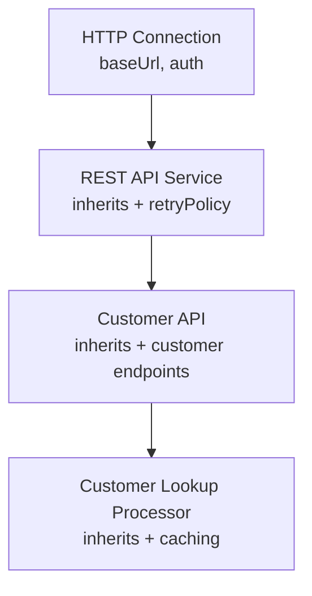
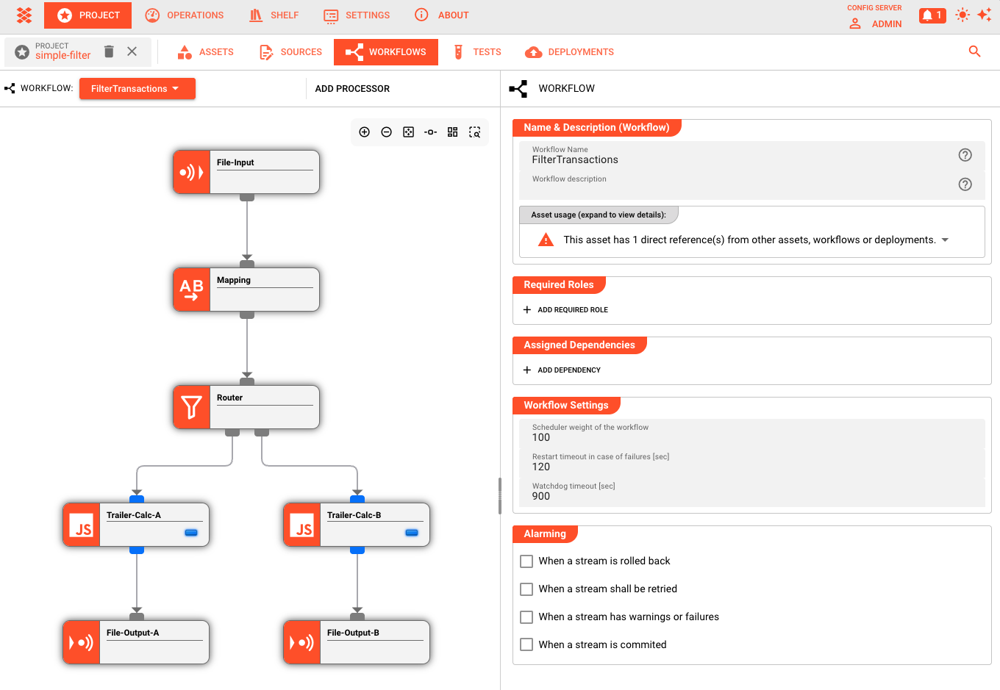
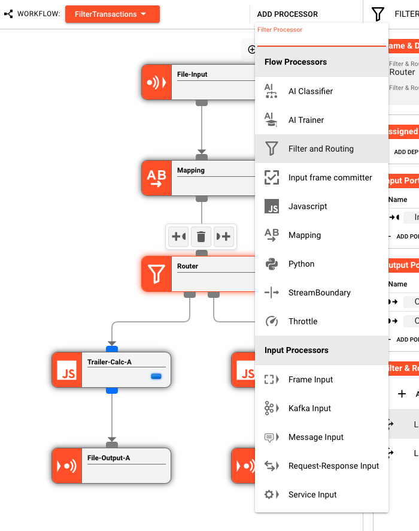
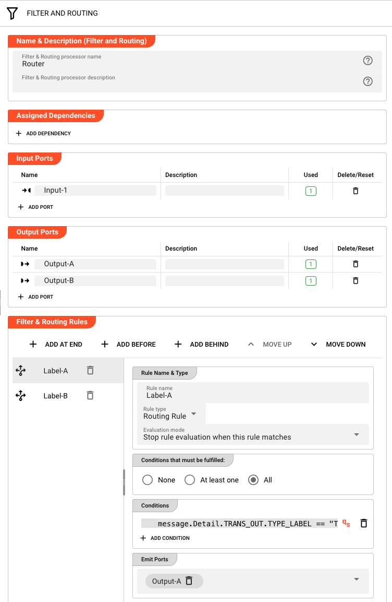
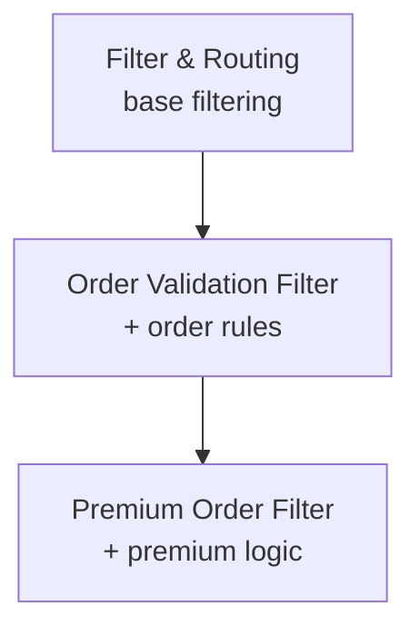
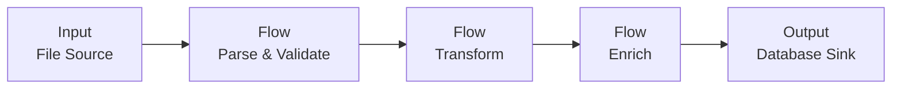
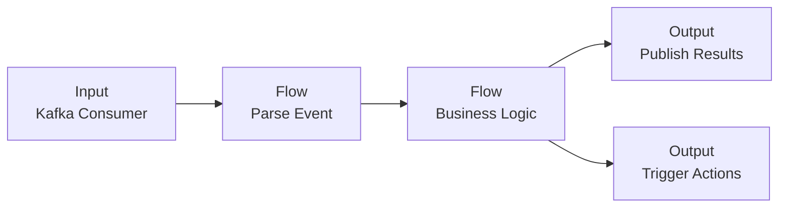
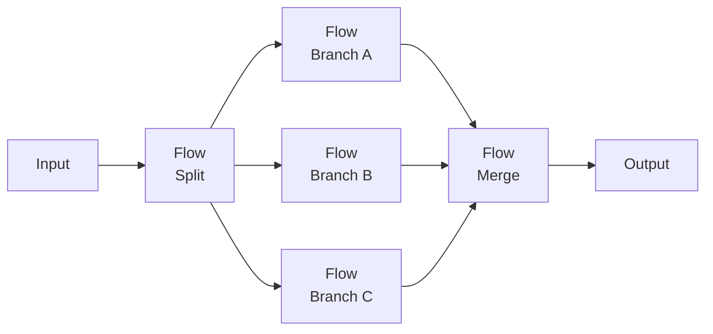
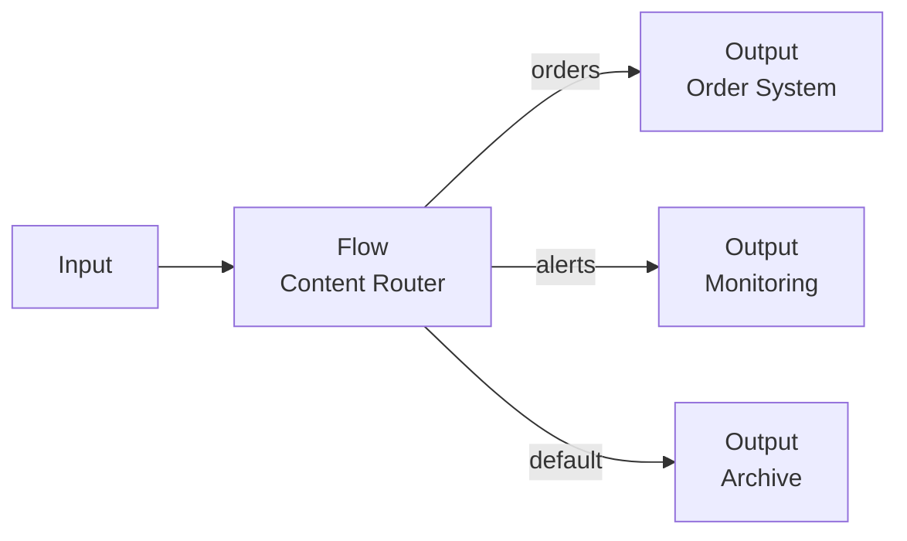

# Building Workflows

> A Workflow is the executable blueprint of your data pipeline. This page explains how to design and assemble Workflows within a Project — the concepts, the flow, and the practical steps.

## What Is a Workflow?

In layline.io, a **Workflow** is the core unit of data processing. It defines the complete path data takes from ingestion through transformation to delivery.

Think of a Workflow as a directed graph: nodes represent processing steps, and edges represent the flow of data between them. When you deploy a Workflow to a cluster, it becomes a running process that continuously ingests, transforms, and outputs data according to your design.

Workflows are created and configured inside a **Project** — the development environment where you design, test, and version your data pipelines before deployment.

## The Building Blocks

Every Workflow is assembled from three fundamental processor types:

| Processor Type | Purpose | Examples |
|----------------|---------|----------|
| **Input Processor** | Ingests data from external sources | File readers, message queue consumers, HTTP endpoints |
| **Flow Processor** | Transforms, routes, or enriches data in transit | Mappers, filters, aggregators, validators |
| **Output Processor** | Delivers processed data to destinations | File writers, message publishers, database loaders |

These processors are not hardcoded components — they are **Asset instances**. You define Sources, Sinks, Formats, and Services as reusable Assets in your Project, then reference them when configuring processors in your Workflow.

### Assets as Building Blocks

Assets are the reusable, independently versioned components that make up your Workflows. Think of them as **configured capabilities** that you define once and reference many times.

#### What Makes Assets Powerful

Unlike hardcoded configuration, Assets are:

- **Reusable** — Define a Source once (e.g., "Production Kafka Cluster"), use it in dozens of Workflows
- **Inheritable** — Create specialized Assets that inherit and extend base configurations
- **Environment-agnostic** — Use Environment Variables within Assets to change behavior based on deployment target (dev, staging, production)

For a complete list of available Asset types, see [**Assets Overview**](../assets).

#### The Asset-Processor Relationship

**Every processor is based on an Asset.** This is a fundamental concept in layline.io — there is no such thing as a processor without an underlying Asset.

When you add a processor to a Workflow, you have three options:

1. **Reference an existing Asset** — Select a pre-defined Asset from your Project. This Asset can be referenced by multiple Workflows.

2. **Create a new Asset** — Define a new Asset during processor creation. This Asset becomes part of your Project's asset library and can be reused.

3. **Create without a visible Asset** — The processor appears to have no Asset, but in reality it references a **hidden Asset** that exists only for this specific processor. The configuration is embedded and not reusable.

**Shared vs. Workflow-Specific Assets**

| Approach | Visibility | Reusability | Use Case |
|----------|------------|-------------|----------|
| Shared Asset | Listed in Project assets | Multiple Workflows can reference it | Standard connections, common formats |
| Hidden Asset | Only visible within this Workflow | Single use | One-off configurations, prototyping |

The key insight: **Assets define the configuration; Processors are instances of Assets within a Workflow.** A Workflow defines *what happens to the data* (the flow); Assets define *how to connect, parse, and transform* (the capabilities).

#### Asset Inheritance Chains

Assets can inherit from other Assets, creating chains of specialization:



**Example: Service Asset Inheritance**

**Base**: `HTTP-Base-Connection`
- Base URL: `${lay:API_BASE_URL}` (Environment Variable)
- Authentication: OAuth2 credentials

**Inherits**: `REST-Service-Base`
- Inherits connection from `HTTP-Base-Connection`
- Adds: Retry policy (3 attempts)
- Adds: Timeout (30s)

**Inherits**: `Customer-API-Service`
- Inherits from `REST-Service-Base`
- Adds: Customer lookup endpoint (`/customers/{id}`)
- Adds: Response caching (5 minutes)

**Processor**: Uses `Customer-API-Service`
- Inherits entire chain
- Can override specific properties locally

This chain means: change the OAuth credentials in `HTTP-Base-Connection`, and all services inheriting from it automatically use the new credentials.

#### Overriding Asset Properties

When you reference an Asset in a processor, you can **override specific properties** without modifying the Asset itself. This is useful for:

- **One-off adjustments** — Use the same Source but with a different file pattern for this specific Workflow
- **Environment variations** — Override a timeout for testing without affecting production
- **Dynamic behavior** — Set properties at deployment time via environment variables

Example: A File Source Asset defines `/data/invoices/*.xml`. In your processor, you override the pattern to `/data/invoices/2024-*.xml` for a backfill job.

Overrides are **local to the processor reference** — they don't modify the underlying Asset, and other Workflows using the same Asset are unaffected.

#### Asset Reuse Patterns

**Pattern 1: Standardized Connections**
Define one `Kafka-Production` Connection Asset with cluster endpoints and TLS settings. Create separate Source Assets for each topic (`Kafka-Orders-Source`, `Kafka-Events-Source`), all referencing the same Connection. Change cluster endpoints in one place.

**Pattern 2: Format Libraries**
Define Format Assets for your organization's standard schemas (`Order-Format`, `Invoice-Format`, `Customer-Format`). Any Workflow processing orders uses `Order-Format` — ensuring consistent parsing everywhere.

**Pattern 3: Service Abstractions**
Create a `Customer-Lookup-Service` Asset that wraps your CRM API with caching and retry logic. Multiple Workflows reference it for enrichment without duplicating configuration.

**Pattern 4: Environment Variables for Deployment Targets**
Use Environment Variable Assets to steer behavior across deployments. A single `Database-Service` Asset can use `${lay:DB_HOST}` and `${lay:DB_PORT}` variables. Deploy to dev, staging, or production — the same Workflow and Assets are used, but the Environment Variables resolve to different values based on the deployment target.

## The Workflow Editor

The visual editor is where you assemble your pipeline. The interface presents a canvas where you drag, connect, and configure processors.

### Canvas Layout

The editor displays processors as nodes and data flows as connecting lines:

- **Center canvas** — The Workflow diagram: add, move, and connect processors
- **Right panel** — Configuration inspector: edit the selected processor's settings
- **ADD PROCESSOR dropdown** — Access the palette of available processor types organized by category (Input Processors, Flow Processors, Output Processors)



### Adding Processors

To build a Workflow:

1. **Click "ADD PROCESSOR"** to open the processor dropdown
2. **Select an Input Processor** — this is your entry point
3. **Select Flow Processors** to transform the data — add as many as needed
4. **Select an Output Processor** to define where results go
5. **Connect the nodes** — click and drag from an output port to an input port



Data flows from Input → Flow → Output. You can connect output ports to input ports to build arbitrarily complex flows. While the editor generally enforces acyclic graphs for clarity, cycles are technically possible though not recommended for most use cases.

### Configuring Processors

Each processor node has its own configuration panel. When you select a node, the right inspector panel displays its settings:



#### Referencing Assets and Inheritance Chains

The primary configuration task is **referencing Assets** you've already defined. But Assets are more than just configuration containers — they can form **inheritance chains** where each level adds or modifies capabilities.

**Input Processors** reference:
- A **Source** Asset (where to read from)
- A **Format** Asset (how to parse incoming data)

**Output Processors** reference:
- A **Sink** Asset (where to write to)
- A **Format** Asset (how to serialize outgoing data)

**Flow Processors** are themselves Assets and can inherit from other Flow Processor Assets:
- Base `Filter-Routing` Asset defines common filtering infrastructure
- `Order-Validation-Filter` inherits from `Filter-Routing`, adds order-specific validation rules
- `Premium-Order-Filter` inherits from `Order-Validation-Filter`, adds premium customer logic



**Important:** For script-based Flow Processors (JavaScript, Python), inheritance applies to the processor configuration (timeouts, retry policies) but **not to the script code itself** — inherited script processors replace the entire script, they don't extend it.

When you create a processor, you're at the end of an inheritance chain. You see all the accumulated configuration from parent Assets, and can add your own or override specific values.

When you click the Source or Format dropdown in a processor's configuration, you see all compatible Assets of that type defined in your Project.

#### Overriding Asset Properties

Each Asset reference shows **inherited** properties from the Asset and allows **local overrides**:

```
Source: NFS-Customer-Data-Source
├── Server: nfs.prod.internal (inherited)
├── Path: /data/customers/incoming (inherited)
├── Pattern: *.json (OVERRIDE: changed from *.xml)
└── Polling Interval: 30s (inherited)
```

Overrides appear highlighted in the configuration panel. They apply **only to this processor reference** — the underlying Asset remains unchanged, and other Workflows using the same Asset see the original values.

Common override scenarios:
- **File pattern changes** for one-time backfills or specific processing jobs
- **Timeout adjustments** for large files or slow networks
- **Batch size tuning** for performance optimization
- **Environment-specific parameters** set via deployment variables

To remove an override and revert to the Asset's default value, click the reset icon next to the field.

## Data Flow Semantics

Understanding how data actually moves through a Workflow is critical to designing effective pipelines.

### Message-Based Processing

layline.io processes data as discrete **messages**. The structure of each message is defined by the **Data Dictionary** — a schema created from the Formats defined in your Project.

The Data Dictionary determines what fields a message contains:
- **Payload fields** — the core data content, defined by all of your used Formats (JSON, XML, CSV, etc.)
- **Custom fields** — any additional structure your use case requires added by way of defining your own data dictionary structures

Beyond the data dictionary fields, every message carries **system properties**:

| Property | Description |
|----------|-------------|
| `message.id` | Unique identifier for this message within the stream (e.g., "1", "1.1", "1.2" for clones) |
| `message.typeName` | The data dictionary type name (e.g., "Header", "Detail", "Trailer") |

**Stream Metadata**

Streams also carry metadata accessible via `stream.getMetadata()`. This returns a Message containing stream-type specific information:

- **File streams**: Path, Size, LastModified, FolderSetup
- **Kafka streams**: GroupId, Topic, Partition
- **HTTP streams**: BindAddress, BindPort
- **S3 streams**: Path, Size, StorageClass, LastModified

Additionally, the Stream object provides:

| Property | Description |
|----------|-------------|
| `stream.id` | UUID of the stream (v4) |
| `stream.name` | Stream name (filename for files, configured name for other sources) |
| `stream.inputProcessorName` | Name of the input processor that created this stream |

When an Input Processor reads data, it parses the raw bytes into a message using the configured Format. This message then flows through the Workflow, potentially being transformed by each Flow Processor, until it reaches an Output Processor where it is serialized and written to the destination.

### Routing and Branching

Flow Processors can have multiple output ports, enabling conditional routing:

- A **Filter** processor might have "Pass" and "Fail" outputs
- A **Router** might distribute messages to different paths based on content analysis
- A **Splitter** might break one message into many, sending them down parallel branches

Each output port connects to a subsequent processor. Messages flow down exactly one path unless explicitly duplicated by a Splitter processor.

### Error Handling

By default, if any processor encounters an error, the entire message is rejected. You can configure alternative behaviors:

- **Retry with backoff** — automatically retry transient failures
- **Skip and continue** — log the error but process subsequent messages
- **Dead letter routing** — configure a custom error handling path using Workflow tools (not enabled by default)

Error handling is configured per-processor, allowing fine-grained control over fault tolerance.

## Testing Workflows

Before deploying a Workflow, you validate and test it within the Project environment.

### Validation

The editor continuously validates your Workflow as you build:

- **Structural validation** — Are all required connections present? Are there orphaned processors?
- **Configuration validation** — Are all referenced Assets defined? Are required fields populated?
- **Semantic validation** — Will this Workflow actually process data correctly?

Validation errors appear inline on the canvas and in the configuration panel. **Final validation occurs upon deployment** — the system performs comprehensive checks and points out any errors, allowing you to jump directly to the areas that need fixing. Runtime errors that occur after deployment are flagged by the cluster.

### Test Runs

For interactive testing:

1. **Upload sample data** — Provide a test file or message that matches your expected input
2. **Run the Workflow** — Execute a single pass through the pipeline
3. **Inspect results** — View the output at each processor node
4. **Debug** — Step through transformations to understand how data changes

Test runs execute against the configured Assets, so if your Source points to a development filesystem, test runs read from that location.

## From Workflow to Production

A Workflow in the editor is a design. To make it operational:

1. **Create a Deployment Asset** — Define which Workflows to run, on which clusters, with which resource allocations
2. **Deploy** — Submit the Deployment to a Reactive Cluster
3. **Monitor** — Use the Operations interface to observe running Workflows, inspect message flow, and manage lifecycle

The same Workflow can be deployed multiple times with different configurations — for example, the same data processing logic applied to different customer data streams.

**Note on Versioning:** Workflows and Assets are not versioned internally by layline.io. Use your preferred version control system (Git, etc.) to version the underlying infrastructure configuration files, just as you would with any other code.

## Design Patterns

Common Workflow patterns that emerge in practice:

### Extract-Transform-Load (ETL)
A single Input Processor reads files, Flow Processors clean and transform the data, and an Output Processor writes to a database or data warehouse.



### Event-Driven Processing
An Input Processor listens to a message bus (Kafka, SQS), Flow Processors apply business logic, and Output processors publish results or trigger downstream actions.



### Fan-Out / Fan-In
A single Input splits into multiple parallel processing branches (fan-out), each handling a different aspect of the data, then rejoins into a single Output (fan-in).



### Content-Based Router
A Flow Processor inspects message content and routes to different Outputs based on business rules — orders to the order system, alerts to the monitoring system, etc.



## Best Practices

**Design for failure.** Assume network partitions, corrupted data, and unavailable services. Configure appropriate retry, timeout, and dead-letter handling.

**Keep transformations focused.** Each Flow Processor should do one thing well. Complex business logic spread across many small processors is easier to maintain than monolithic transformations.

**Use Assets for reusable configuration.** Never hardcode connection strings in processor configuration. Use Source, Sink, and Connection Assets with Environment Variables for environment-specific values.

**Test with realistic data.** Sample files that match production volume and edge cases reveal issues before deployment.

**Version your Project.** Use Git (or your preferred VCS) to track changes to your Project configuration, commit meaningful changes, and tag releases.

## See Also

- [**Your First Workflow**](../quickstart/first-workflow.md) — Step-by-step tutorial for building your first pipeline
- [**Assets Overview**](../assets/index.md) — Complete guide to all asset types
- [**Deployment Assets**](../assets/deployment-assets/index.md) — How to deploy Workflows to production
- [**Reactive Clusters**](../operations/cluster/index.md) — Understanding the runtime environment
