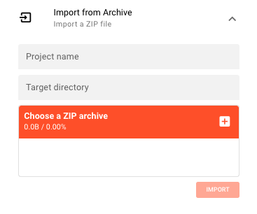

# Import from Archive

> Restore or copy a project from a ZIP archive exported from layline.io.

Use **Import from Archive** when you have a project packaged as a `.zip` file — for example, a project shared by a colleague, an exported backup, or a project template distributed as an archive.

## Steps

1. In the **Project** tab, expand the **Import from Archive** panel on the right side.
2. Enter a **Project name** — the name to assign to the imported project in layline.io.
3. Enter a **Target directory** — the full server-side path where the project files will be extracted.
4. Click the file picker and select a `.zip` archive (only ZIP files are accepted; one file at a time).
5. Click **Import**.

On success, a confirmation banner shows the project name and an **Open** button to load the project immediately.

Click **Import Another** to import a second archive without navigating away.

## What happens during import

layline.io extracts the ZIP archive into the target directory and registers the resulting project with the Configuration Center. The project name you enter is used as the internal identifier — it does not need to match the name stored inside the archive.

:::info File system paths
The target directory path must be accessible from the machine running the Configuration Center, not your local browser. If you are connecting to a remote Configuration Center, enter the path as it exists on the server's file system.
:::

## How to create an archive

You can export any open project as a ZIP archive from within the project editor. Open the project, navigate to the **Assets** tab, and use the **Export** option in the toolbar. The resulting file can later be imported using this workflow.

## Error handling

If the import fails, a failure banner appears. Common causes:

- The target directory does not exist or the server cannot write to it
- The uploaded file is not a valid ZIP archive
- The ZIP archive does not contain a valid layline.io project structure

Correct the issue and try again. Use **Dismiss** on the failure banner to clear it before retrying.

## See Also

- [**Create New Project**](create-project) — Start a fresh project from scratch
- [**Add Existing Project**](add-existing-project) — Register an existing project folder without importing
- [**Project Hub**](index.md) — Overview of the Project tab
