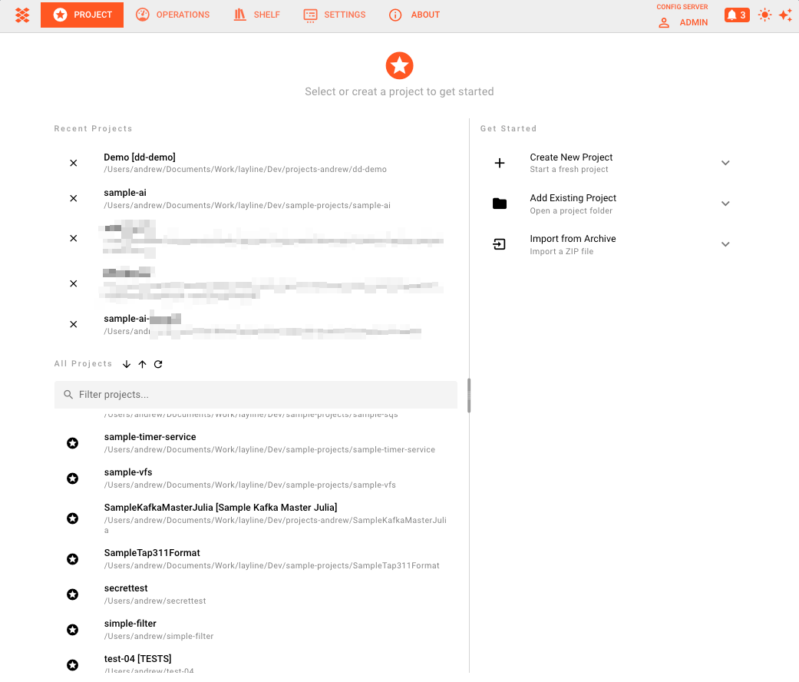
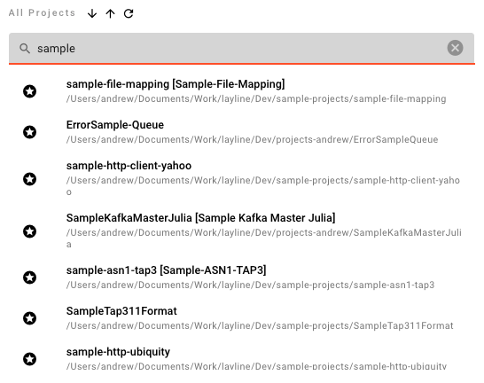
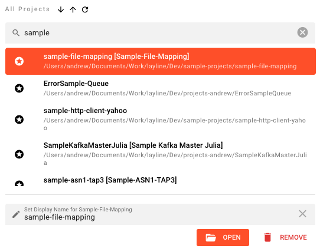

# Project

> The Project tab is your workspace. Every data pipeline in layline.io lives inside a Project.

A **Project** is the top-level container in layline.io. It holds all the Assets and Workflows that define how your data moves and transforms — where data comes from, how it is processed, and where results go. When you are ready to run, you deploy the Project's Workflows to a Reactive Cluster via Deployment Assets.

## The Project Hub

When you open the Project tab and no project is currently open, layline.io shows the **Project Hub** — the central starting point for working with projects.

The Project Hub is split into two panels:

**Left panel — your projects:**
- **Recent Projects** — a shortlist of projects you have opened recently. Click once to select, double-click to open. Use the × button to remove an entry from the recent list without deleting the project itself.
- **All Projects** — the full list of all projects known to the configuration server. You can sort the list A–Z or Z–A and filter by name using the search field. Hover over any project for a tooltip showing its name, description, path, and version. Click once to select a project and reveal the action panel below; double-click to open it immediately.

**Selected project actions** (appear below the list when a project is selected):

- **Open** — opens the project and loads it into the editor.
- **Remove** — removes the project from the configuration server. This prompts for confirmation.

#### Display Name {#display-name}

You can set a **display name** — a friendlier label that appears in the UI instead of the internal project name. This is useful when the project name is a technical identifier. Leave the field empty to revert to showing the project name.

**Right panel — Get Started:**

Three expandable actions for bringing a project into layline.io (only one panel is open at a time):

### Create New Project

Start a fresh, empty project. [→ Detailed steps](create-project)

| Field | Description |
|-------|-------------|
| **Project name** | The internal name for the project. Required. |
| **Description** | Optional free-text description. |
| **Path** | The server-side directory where the project files will be stored. Required. |

Click **Create** to create the project. If creation fails, an error banner appears with a **Try Again** option.

### Add Existing Project

Register a project that already exists on the server's file system (e.g. cloned from Git, restored from backup, or created outside the UI). [→ Detailed steps](add-existing-project)

| Field | Description |
|-------|-------------|
| **Project folder path** | The absolute path to the project directory on the server. |

Click **Add Project**. On success, a confirmation banner appears with an **Open** button to jump straight into the project. Click **Add Another** to register a second project without clearing the panel.

### Import from Archive

Import a project from a ZIP archive — useful for sharing projects or restoring from an export. [→ Detailed steps](import-project)

| Field | Description |
|-------|-------------|
| **Project name** | The name to assign to the imported project. |
| **Target directory** | The server-side directory where the project will be extracted. |
| **Archive file** | Upload a `.zip` file using the file picker. Only one file is accepted. |

Click **Import**. On success, a confirmation banner appears with an **Open** button. Click **Import Another** to import a second archive.

---

## Inside an Open Project

Once a project is open, the Project tab shows the project toolbar at the top and five sub-tabs below it.

<!-- SCREENSHOT: Open project view — toolbar showing project name, Save button, and the five sub-tabs (Assets, Sources, Workflows, Tests, Deployments) — screenshot pending -->

### Project Toolbar

The toolbar appears at the top of the Project tab when a project is open:

- **Project name** — shows the currently open project's name.
- **Save** — saves all unsaved changes to the project. Only visible when there are unsaved changes. Keyboard shortcut: `Ctrl+S` / `⌘S`.
- **Search** — opens the project-wide search dialog. Keyboard shortcut: `Ctrl+F` / `⌘F`.
- **Close** — prompts for confirmation and closes the project, returning to the Project Hub.
- **Remove** — removes the project from the configuration server (with confirmation).

### Sub-tabs Overview

| Tab | Purpose |
|-----|---------|
| **Assets** | Define and configure all Assets in the project — Services, Formats, Connections, Sinks, Sources, Resources, Extensions, and Deployment assets. |
| **Sources** | Manage project source files — scripts, configuration snippets, and other file-based resources referenced by Assets. |
| **Workflows** | Build Workflows visually by placing and connecting Processors on a canvas. |
| **Tests** | Create and run test cases for Services and Flow Processors. |
| **Deployments** | Define Engine Deployments, Schedulers, Cluster configurations, and Tags. Manage deployment of Workflows to the Reactive Cluster. |

## What a Project Contains

A Project is the home for everything needed to run a data pipeline:

- **Workflow Assets** — the pipeline definitions themselves
- **Input Processors** — receive data from a Source (file, queue, stream, API, etc.)
- **Flow Processors** — transform, route, enrich, or filter data in transit
- **Output Processors** — write processed data to a Sink
- **Services** — connections to external systems (databases, queues, APIs, etc.)
- **Formats** — definitions of the data structures you read and write
- **Resources** — shared configurations like Environments and Secrets
- **Connections** — configured connections to external systems
- **Sources** — data input origins
- **Sinks** — data output destinations
- **Extensions** — custom code that extends the system's capabilities
- **Deployment Assets** — Engine Deployments, Schedulers, Tags, and Cluster configurations

All Asset classes are part of a Project. When you deploy, you select which Workflows to deploy, along with the Environment and Secret Assets they need.

## See Also

- [**Create New Project**](create-project) — step-by-step guide for creating a project from scratch
- [**Add Existing Project**](add-existing-project) — register an existing project folder
- [**Import from Archive**](import-project) — restore a project from a ZIP archive
- [**Building Workflows**](building-workflows) — how to assemble a Workflow in the visual editor
- [**Assets Reference**](../assets) — reference documentation for all asset types
- [**Core Concepts**](../quickstart/core-concepts) — mental models for Projects, Workflows, and Deployments
- [**Quickstart**](../quickstart) — step-by-step guide to your first pipeline
